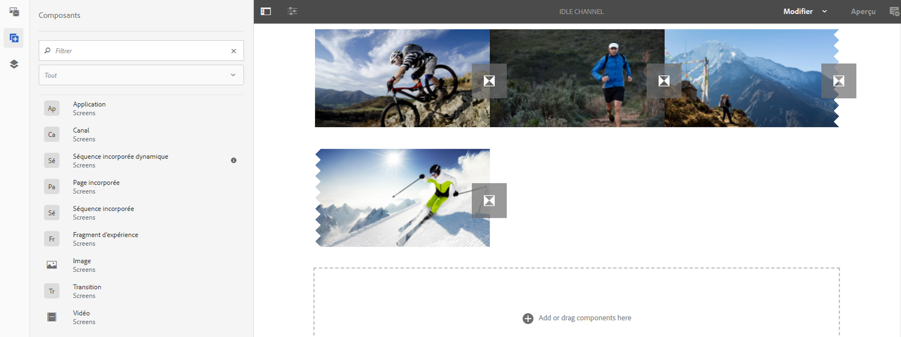
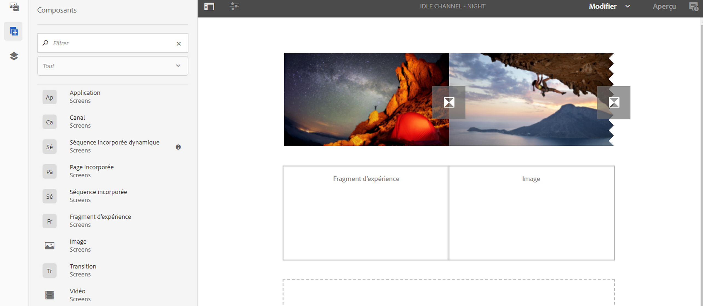

# Ajout de composants à un canal{#adding-components-to-a-channel}

Les composants sont des éléments fondamentaux de l’expérience AEM (Adobe Experience Manager). Vous pouvez utiliser un certain nombre de composants et les ajouter au canal d’un projet AEM Screens.

## Composants utilisés dans AEM Screens      {#components-in-aem-screens}

AEM Screens fournit différents composants AEM qui peuvent être utilisés dans un projet Screens.

### Affichage des composants AEM Screens      {#viewing-aem-screens-components}

Lorsque vous créez un projet AEM Screens, vous pouvez voir la liste des composants par défaut qui peuvent être ajoutés au projet.

Pour afficher les composants par défaut dans le projet Screens, procédez comme suit :

1. Sélectionnez le canal. Par exemple, **We.Retail en magasin** > **Canaux** > **Canal inactif**.

1. Cliquez sur **Modifier** dans la barre d’actions pour ouvrir l’éditeur AEM.
1. Cliquez sur l’icône **+** de la barre latérale pour ouvrir les composants.
1. Tous les composants fournis par défaut dans un projet AEM Screens s’affichent, comme illustré dans la figure ci-dessous.

### Ajout d’un nouveau composant {#adding-a-new-component}

AEM propose un certain nombre d’autres composants. Vous pouvez toujours ajouter d’autres composants (non fournis par défaut) au projet, à condition qu’ils soient compatibles avec AEM Screens.

L’exemple suivant illustre l’ajout d’un composant Livefyre à un projet AEM Screens :

1. Sélectionnez le canal dans lequel vous souhaitez ajouter un nouveau composant. Par exemple, **We.Retail en magasin** > **Canaux** > **Canal inactif**.

1. Cliquez sur **Modifier** dans la barre d’actions pour ouvrir l’éditeur.
1. Sélectionnez le mode **Conception**.
1. Sélectionnez l’éditeur de conception complet à droite et cliquez sur le symbole de paramètres pour ouvrir la boîte de dialogue **Conception ParSys**.
1. Vous pouvez sélectionner les composants que vous souhaitez importer dans le projet AEM Screens. The following example shows the addition of **Livefyre** component to an AEM Screens project.

>[!NOTE]
>
>De la même façon, vous pouvez ajouter au projet autant de nouveaux composants que vous le souhaitez, s’ils sont compatibles avec AEM Screens.

## Présentation des composants AEM Screens      {#understanding-aem-screen-components}

La section suivante décrit les composants AEM Screens que vous pouvez utiliser dans le projet.

>[!NOTE]
>
>Pour afficher les propriétés d’un composant, sélectionnez-le, puis cliquez sur l’icône en forme de marteau afin d’ouvrir/d’afficher les propriétés.

### Application {#application}

Le composant **Application** permet d’ajouter une application au canal.

Le composant Application présente les propriétés suivantes :

| **Propriété** | **Description** |
|---|---|
| ***Chemin de l’application*** | Sélectionnez le chemin absolu où se trouve l’application. |
| ***Durée (ms)*** | Sélectionnez la durée de l’application. Par défaut, la durée est définie sur -1, ce qui signifie que l’élément s’exécute indéfiniment (il s’agit par conséquent d’une application sur une seule page). Si vous définissez une valeur supérieure à 0 pour la durée, l’élément s’affiche pendant la durée spécifiée avant que l’élément suivant n’apparaisse. |

L’exemple suivant montre comment incorporer un composant d’application avec la prévisualisation de ses propriétés :

>[!NOTE]
>
>Reportez-vous à l’exemple ci-dessus pour afficher les propriétés de chacun des composants suivants.

### Canal      {#channel}

Le composant **Canal** permet d’ajouter un canal entier au projet.

Le composant Canal présente les propriétés suivantes :

<table>
 <tbody>
  <tr>
   <td><strong>Propriétés</strong></td>
   <td><strong>Description</strong></td>
  </tr>
  <tr>
   <td><strong><em>Chemin du canal</em></strong></td>
   <td>Sélectionnez le chemin absolu où se trouve l’application.  </td>
  </tr>
  <tr>
   <td><strong><em>Durée (ms)</em></strong></td>
   <td>Sélectionnez la durée complète du canal. Si vous définissez la durée sur -1, cela signifie que le canal incorporé s’exécute pendant toute sa durée dans un canal donné.</td>
  </tr>
 </tbody>
</table>

### Page incorporée {#embedded-page}

Une **page incorporée** permet d’ajouter une page incorporée à un projet. Par exemple, il peut s’agir d’une application Web ou d’un catalogue de produits.

La page incorporée présente les propriétés suivantes :

<table>
 <tbody>
  <tr>
   <td><strong>Propriétés</strong></td>
   <td><strong>Description</strong></td>
  </tr>
  <tr>
   <td><strong><em>Chemin d’accès à la page  </em></strong></td>
   <td>Sélectionnez le chemin absolu où se trouve le canal.  </td>
  </tr>
  <tr>
   <td><strong><em>Durée (ms)</em></strong></td>
   <td>Sélectionnez la durée complète du canal. Si vous définissez la durée sur -1, cela signifie que le canal incorporé s’exécute pendant toute sa durée dans un canal donné.</td>
  </tr>
 </tbody>
</table>

### Séquence incorporée {#embedded-sequence}

>[!NOTE]
>
>Reportez-vous à [Séquences incorporées](embedded-sequences.md) dans la section Création dans Screens pour en savoir plus sur les séquences incorporées.

Une séquence incorporée permet d’ajouter un canal de séquence incorporée dans le canal existant (avec d’autres ressources).

La séquence incorporée présente les propriétés suivantes :

<table>
 <tbody>
  <tr>
   <td><strong>Propriétés</strong></td>
   <td><strong>Description</strong></td>
  </tr>
  <tr>
   <td>Chemin du canal</td>
   <td>Sélectionnez le chemin absolu de la séquence que vous souhaitez inclure dans le canal.  </td>
  </tr>
  <tr>
   <td><strong><em>Durée (ms)</em></strong></td>
   <td>Sélectionnez la durée complète du canal. Si vous définissez la durée sur -1, cela signifie que le canal incorporé s’exécute pendant toute sa durée dans un canal donné.</td>
  </tr>
  <tr>
   <td><strong><em>Stratégie</em></strong></td>
   <td>Définissez-la sur <strong>original</strong> ou <strong>seul(e)</strong>. La définition de cette valeur sur <strong>Original</strong> implique que la séquence secondaire s’exécute entièrement à chaque cycle de la séquence parent. L’autre valeur possible est <strong>seul(e)</strong> ; elle permet d’afficher un seul élément de la séquence secondaire à chaque exécution (par exemple, le premier élément de la première boucle, le deuxième élément de la deuxième boucle, etc.).</td>
  </tr>
 </tbody>
</table>

### Séquence incorporée dynamique {#dynamic-embedded-sequence}

Une séquence incorporée dynamique permet d’ajouter une séquence semblable à la séquence incorporée susvisée, mais via le rôle de canal.

Reportez-vous à [Séquences incorporées](embedded-sequences.md) dans la section Création dans Screens pour en savoir plus sur les séquences incorporées.

La séquence incorporée dynamique présente les propriétés suivantes :

<table>
 <tbody>
  <tr>
   <td><strong>Propriétés</strong></td>
   <td><strong>Description</strong></td>
  </tr>
  <tr>
   <td><strong><em>Rôle d’attribution de canaux</em></strong>  </td>
   <td>Saisissez le rôle du canal.  </td>
  </tr>
  <tr>
   <td><strong><em>Durée (ms)</em></strong></td>
   <td>Sélectionnez la durée complète du canal. Si vous définissez la durée sur -1, cela signifie que le canal incorporé s’exécute pendant toute sa durée dans un canal donné.</td>
  </tr>
  <tr>
   <td><strong><em>Stratégie</em></strong></td>
   <td>Définissez-la sur <strong>original</strong> ou <strong>seul(e)</strong>. La définition de cette valeur sur <strong>Original</strong> implique que la séquence secondaire s’exécute entièrement à chaque cycle de la séquence parent. L’autre valeur possible est <strong>seul(e)</strong> ; elle permet d’afficher un seul élément de la séquence secondaire à chaque exécution (par exemple, le premier élément de la première boucle, le deuxième élément de la deuxième boucle, etc.).</td>
  </tr>
 </tbody>
</table>

### Fragment d’expérience {#experience-fragment}

Un fragment d’expérience permet d’ajouter un fragment d’expérience (groupe d’un ou de plusieurs composants, y compris le contenu et la disposition pouvant être référencés dans les pages) au canal AEM Screens. Glissez-déplacez le composant vers l’éditeur AEM, puis sélectionnez le fragment d’expérience.

Pour en savoir plus sur la création d’un fragment d’expérience et son utilisation dans un projet AEM Screens, reportez-vous à [Utilisation de fragments d’expérience](experience-fragments-in-screens.md).

| **Propriété** | **Description** |
|---|---|
| **Fragment d’expérience** |
| ***Fragment d’expérience*** | Sélectionnez le fragment d’expérience. |
| ***Durée*** | Sélectionnez la durée complète du fragment d’expérience lu dans le canal. |
| **Configuration hors ligne** |
| ***Bibliothèques côté client*** | Fichiers JavaScript et CSS. |
| ***Fichiers statiques*** | Fichiers statiques que vous pouvez ajouter en tant que configurations hors ligne au fragment d’expérience. |

>[!NOTE]
>
>The **Client-side Libraries** and the **Static Files** that you add from this component will be in addition to already configured **Client-side Libraries** and the Static Files that are added from the experience fragment&#39;s **Properties**.

### Image {#image}

Cette fonction permet d’ajouter une image au canal.

La ressource image présente trois onglets, à savoir **Image**, **Accessibilité** et **Séquence** :

| **Propriété** | **Description** |
|---|---|
| **Image** |
| ***Ressource image*** | Sélectionnez la ressource image. |
| ***Titre*** | Titre de l’image. |
| ***Lier à*** | Ajoutez un lien vers l’image. |
| ***Description*** | Brève description de l’image. |
| ***Taille*** | Taille de l’image. |
| **Accessibilité** |
| ***Texte de remplacement*** | Texte de remplacement de l’image. |
| **Séquence** |
| ***Durée*** | Par défaut, la Durée est définie sur *8000 ms*. Si vous souhaitez modifier la durée de lecture de l’image, mettez à jour le champ **Durée**. |

### Transition {#transition}

Le composant Transition permet d’ajouter une transition au projet Screens.

L’illustration suivante représente le composant de transition (ajouté par glisser-déplacer) dans l’éditeur.

Sélectionnez l’icône de transition et cliquez sur **Configurer** (icône en forme de clé à molette) pour ouvrir la boîte de dialogue **Transition** . Cette boîte de dialogue comprend trois onglets :

* **Transition**
* **Séquence**
* **Activation**

>[!NOTE]
>
>Par défaut, la séquence est définie sur 600 ms. Vous pouvez mettre à jour la séquence de transition vers une autre valeur via l’onglet **Séquence**.

Le composant Transition présente les propriétés suivantes :

<table>
 <tbody>
  <tr>
   <td><strong>Propriétés</strong></td>
   <td><strong>Description</strong></td>
  </tr>
  <tr>
   <td><strong>Transition</strong></td>
   <td></td>
  </tr>
  <tr>
   <td><strong><em>Type</em></strong></td>
   <td>
Type de la transition entre l’élément précédent et le suivant. Le <strong>type</strong> de transition comprend les options suivantes :

    <ul>
     <li><strong>Normal</strong></li>
     <li><strong>Fondu</strong></li>
     <li><strong>Glissement depuis la droite</strong></li>
     <li><strong>Glissement depuis la gauche</strong></li>
     <li><strong>Glissement depuis le haut</strong></li>
     <li><strong>Glissement depuis le bas</strong></li>
    </ul> </td>
  </tr>
  <tr>
   <td><strong>Séquence</strong></td>
   <td></td>
  </tr>
  <tr>
   <td><strong><em>Durée</em></strong></td>
   <td>Sélectionnez la durée complète de la transition. Par défaut, elle est définie sur 600 ms.</td>
  </tr>
  <tr>
   <td><strong>Activation</strong></td>
   <td></td>
  </tr>
  <tr>
   <td><strong><em>Actif à partir de</em></strong></td>
   <td>Horodatage indiquant le moment à partir duquel la transition peut être active.  </td>
  </tr>
  <tr>
   <td><strong><em>Actif jusqu’à</em></strong></td>
   <td>Horodatage indiquant le moment jusqu’auquel la transition peut être active.</td>
  </tr>
  <tr>
   <td><strong><em>Planification</em></strong></td>
   <td>Ajoutez une planification prédéfinie.</td>
  </tr>
 </tbody>
</table>

### Vidéo {#video}

Le composant Vidéo permet d’ajouter une vidéo au projet Screens.

Le composant Vidéo présente les propriétés suivantes :

<table>
 <tbody>
  <tr>
   <td><strong>Propriétés</strong></td>
   <td><strong>Description</strong></td>
  </tr>
  <tr>
   <td><em><strong>Contenu vidéo</strong></em></td>
   <td>Sélectionnez le lien vers la vidéo.</td>
  </tr>
  <tr>
   <td><em><strong>Durée</strong></em></td>
   <td>Sélectionnez la durée de la vidéo. Par défaut, la durée est définie sur -1, ce qui signifie que l’élément s’exécute indéfiniment. Si vous définissez une valeur supérieure à 0 pour la durée, l’élément s’affiche pendant la durée spécifiée avant que l’élément suivant n’apparaisse.  </td>
  </tr>
  <tr>
   <td><em><strong>Création de rendu</strong></em></td>
   <td>
Si le rapport d’aspect de la vidéo ne correspond pas à l’écran, vous pouvez modifier le rendu à l’aide des options <strong>Contenir</strong> ou <strong>Couverture</strong>.
 
<em>Contenir</em> signifie que l’intégralité de la vidéo est affichée et que les zones manquantes sont remplies d’une bordure noire.
 
<em>Couverture</em> signifie que la vidéo couvre toute la fenêtre, mais que certaines parties dépassant sur les côtés sont masquées.
 </td>
  </tr>
  <tr>
   <td><em><strong>Taille</strong></em></td>
   <td>Taille de la vidéo.</td>
  </tr>
 </tbody>
</table>

