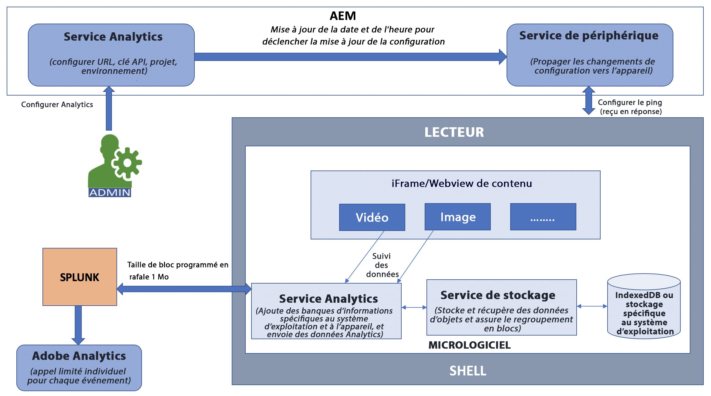

# Intégration d’Adobe Analytics avec AEM Screens {#adobe-analytics-integration-with-aem-screens}

>[!CAUTION]
>
>Cette fonctionnalité AEM Screens n&#39;est disponible que si vous avez installé la version minimale de AEM 6.4.2 Feature Pack 2 ou AEM 6.3.3 Feature Pack 4.

>[!NOTE]
>
>Pour accéder à l’un de ces Feature Packs, contactez l’assistance Adobe et déposez une requête dans ce sens. Vous pouvez télécharger le dernier Feature Pack pour AEM Screens à partir du [portail de distribution de logiciels](https://experience.adobe.com/#/downloads/content/software-distribution/en/aem.html) à l&#39;aide de votre Adobe ID.

Cette section couvre les sujets suivants :

* **Présentation**
* **Particularités architecturales**
* **Configuration des propriétés**

## Présentation {#overview}

***AEM Screens*** tire parti d’Adobe Analytics ; vous obtenez ainsi une solution unique sur le marché : des analyses multicanaux permettant de mettre le contenu affiché à l’emplacement concerné en corrélation avec d’autres sources de données.

AEM Screens permet une intégration immédiate avec Adobe Analytics et vous fournit une preuve de lecture.

Cette section décrit les fonctionnalités suivantes liées à la connexion d’un projet AEM Screens avec Adobe Analytics :

* Permet de créer des rapports de preuve de lecture par périphérique
* Permet de créer des rapports de preuve de lecture par ressource
* Veille à ce que tous les événements du lecteur soient capturés et horodatés
* Veille à ce que tous les événements du lecteur soient stockés localement s’il n’est pas connecté à un réseau
* Permet de créer des boucles de rétroaction pour suivre les événements de lecture à long terme
* Permet au système de modifier le contenu et les dispositions selon les critères de réussite définis par l’auteur du contenu

Ainsi, l’intégration d’Adobe Analytics avec AEM Screens permet de réaliser les *objectifs* suivants :

* Obtenir un retour sur investissement des implémentations d’affichage numérique
* Intégrer Analytics comme support employé pour collecter et analyser ultérieurement les informations d’utilisation

## Particularités architecturales {#architectural-details}

Un client AEM Screens souhaite connaître les données affichées, ainsi que leurs durée et date et/ou heure d’affichage (affichage global). Il s’agit d’une fonctionnalité courante de la solution d’affichage numérique. AEM Screens tire parti d’Adobe Analytics au lieu d’élaborer vos analyses ; vous obtenez ainsi une solution unique sur le marché : des analyses multicanaux permettant de mettre le contenu affiché à l’emplacement concerné en corrélation avec d’autres sources de données.

Le diagramme architectural suivant explique comment Adobe Analytics s’intègre avec AEM Screens :

## Activation d’Adobe Analytics dans AEM Screens {#enabling-adobe-analytics-in-aem-screens}

Les paramètres Adobe Analytics peuvent être configurés depuis la console OSGi.

Accédez à **Configuration de la console web Adobe Experience Manager** pour configurer Adobe Analytics pour AEM Screens, comme l’illustre la figure suivante :

## Screens Analytics : flux d’activation {#screens-analytics-enablement-flow}

>[!CAUTION]
>
>Avant de configurer les propriétés, contactez le responsable des relations Adobe pour créer un ticket et obtenir une **clé d’API Analytics**, ainsi qu’un **projet Analytics** afin de l’utiliser avec AEM Screens.

### Configuration des propriétés {#configuring-the-properties}

>[!CAUTION]
>
>Avant de configurer les propriétés, contactez le responsable des relations Adobe pour créer un ticket et obtenir une **clé d’API Analytics**, ainsi qu’un **projet Analytics** afin de l’utiliser avec AEM Screens.

Le tableau suivant répertorie et décrit les propriétés permettant de configurer Adobe Analytics pour AEM Screens :

<table>
 <tbody>
  <tr>
   <td><strong>Propriété</strong></td>
   <td><strong>Description</strong></td>
  </tr>
  <tr>
   <td><strong>URL Analytics</strong></td>
   <td>URL de publication des données d’analyse depuis le lecteur.  
   Développement/étape</em> : https://cc-api-data-stage.adobe.io/ingest/  Production<em></em> : https://cc-api-data.adobe.io/ingest/</em>   </td>
  </tr>
  <tr>
   <td><strong>Clé d’API Analytics</strong></td>
   <td>Clé d’API utilisée à des fins d’authentification auprès du serveur Adobe Analytics (fournie par le responsable de compte Adobe).</td>
  </tr>
  <tr>
   <td><strong>Projet Analytics</strong></td>
   <td>Projet AEM Screens configuré sur les analyses de manière à recevoir des données (fourni par le responsable de compte Adobe).</td>
  </tr>
  <tr>
   <td><strong>Environnement</strong></td>
   <td>
Environnement d’étape ou de production (sélectionnez Étape ou Production).
</td>
  </tr>
  <tr>
   <td><strong>Fréquence d’envoi des données d’analyse</strong></td>
   <td>Fréquence d’envoi des données d’analyse depuis les lecteurs, en minutes. Par défaut, elle est définie sur 15 mn.</td>
  </tr>
 </tbody>
</table>

>[!NOTE]
>
>Par défaut, la **fréquence d’envoi des données d’analyse** est de 15 minutes.

#### Utilisation d’Adobe Analytics Service dans AEM Screens {#using-adobe-analytics-service-in-aem-screens}

Ce scénario appelle l’API Analytics en lançant des appels REST depuis un service d’analyse des principaux composants Screens de microprogramme et d’instrument pour créer et envoyer explicitement des événements propres à un cas d’utilisation donné, tout en autorisant l’extensibilité si un message personnalisé peut être envoyé à Analytics depuis un canal développé et personnalisé.

Les événements Analytics sont stockés hors ligne dans indexedDB, puis segmentés et envoyés ultérieurement vers le cloud.

>[!NOTE]
>
>Pour en savoir plus sur le ***séquencement*** et le modèle de données standard d’événements ******, reportez-vous à **[Configuration d’Adobe Analytics pour AEM Screens](configuring-adobe-analytics-aem-screens.md)**.

