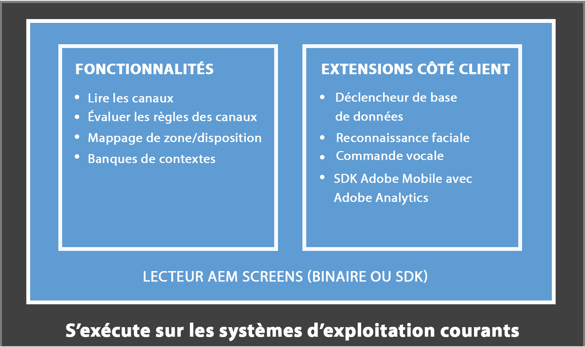
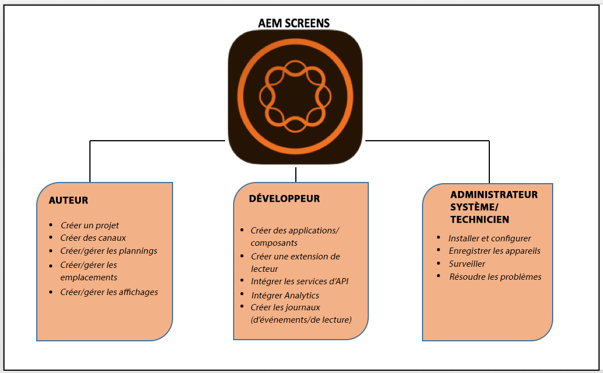

# Qu’est-ce qu’AEM Screens ?{#what-is-aem-screens}

**AEM (Adobe Experience Manager) Screens** : solution de signalisation numérique, qui permet de publier des expériences numériques dynamiques et interactives, ainsi que des interactions impliquant différents types d’écran, conjointement avec une plateforme de marketing numérique exhaustive.

Devenez opérationnel avec une expérience de signalisation numérique simple, grâce à [Démarrage rapide d’AEM Screens](kickstart-for-aem-screens.md).

## Présentation {#overview}

**AEM Screens** s’appuie sur les bases solides d’***AEM Sites**et permet aux spécialistes du marketing et aux informaticiens de créer et de gérer des expériences sur différents écrans numériques, qui ont un impact sur les objectifs en magasin/sur site pour établir la marque et susciter la demande.* L’intégration d’AEM Screens à AEM Sites permet de réutiliser des contenus existants et d’offrir efficacement une solution client cohérente et uniforme. Cette intégration fournit un workflow rationalisé permettant de créer des expériences numériques dédiées, qui sont très rentables et utilisables. Cela permet d’influencer la perception de la marque et les décisions conduisant à l’augmentation des achats et de l’engagement.

AEM Screens est une solution web puissante, qui permet de créer des tableaux de menus numériques dédiés, des recommandations de produits, des images de fond valorisant un style de vie, afin de renforcer l’interaction des clients et de proposer des expériences de marque uniformisées et utiles dans des endroits comme des magasins, des hôtels, des banques, des établissements de santé et de formation, et bien d’autres, à partir de la même plateforme AEM. Screens met à disposition de nombreuses applications uniques, comme des affichages interactifs, des composants de recherche ou de marque et l’ajout d’une ambiance à votre environnement pour des clients et des employés en fonction du domaine dans lequel elles sont déployées.

Avec AEM Screens, la création et la gestion d’une application sont simples et intuitives. Une *application* héberge des pages web créées pour AEM Screens par des clients ou des partenaires de mise en œuvre. Les *emplacements* gèrent une hiérarchie prédéfinie et contiennent des *affichages*. Chaque affichage comprend un tableau de bord, auquel sont associés différents périphériques et écrans. Le contenu d’AEM Screens est géré dans des *canaux*. Le lecteur AEM Screens effectue le rendu du contenu figurant dans les canaux sur des dispositifs d’affichage.

Pour comprendre les termes clés associés à AEM Screens, voir [Glossaire](screens-glossary.md).

### Architecture du lecteur AEM Screens {#architecture-of-screens-player}

Le schéma ci-dessous montre l’architecture générale d’un lecteur AEM Screens :

### Création d’une expérience de signalisation numérique en 5 minutes {#create-a-digital-signage-experience-in-minutes}

Pour créer une démonstration d’un projet Screens et publier votre contenu dans le lecteur AEM Screens, voir [Démarrage rapide d’AEM Screens](kickstart-for-aem-screens.md).

## Démarrage d’un nouveau projet AEM Screens {#starting-a-new-aem-screens-project}

Le démarrage d’une nouvelle expérience de signalisation numérique implique de coordonner différents rôles avant qu’elle ne puisse être utilisée. Les rôles ci-dessous servent de point de départ pour créer un nouveau projet Screens.

* **Créateur**
* **Développeur**
* **Administrateur système/Technicien**

Les illustrations ci-dessous définissent les intervenants et leur rôle dans le cadre d’AEM Screens.

>[!NOTE]
>
>*Pour afficher également d’autres responsabilités selon les rôles, cliquez sur les intervenants mentionnés ci-dessus.*

## Connaissances préalables {#pre-requisite-knowledge}

Avant de commencer à travailler sur un projet d’affichage numérique à l’aide d’AEM Screens, vous devez disposer des connaissances nécessaires sur Adobe Experience Manager (AEM).

Reportez-vous aux tutoriels et aux ressources ci-dessous pour vous familiariser avec Adobe Experience Manager 6.5 :

* **Prise en main d’Adobe Experience Manager** : découvrez les tutoriels vidéo et articles de prise en main consacrés à Adobe Experience Manager.
* **Tutoriels et vidéos AEM 6.5** : collection de tutoriels et de vidéos présentant les nouvelles fonctionnalités et les fonctionnalités mises à jour dans AEM Sites, Assets, Forms, Screens et Foundation avec la sortie d’AEM 6.5.
* **Concepts de base d’AEM** : présentation des concepts de base de la structure d’AEM et des méthodes de développement sur AEM, notamment le fonctionnement de JCR, de Sling, d’OSGi, du Dispatcher, des workflows et de MSM.

### Principes d’implémentation guidée {#guided-implementation-essentials}

Suivez le parcours d’apprentissage guidé **[Principes d’implémentation guidée AEM Screens](https://guided.adobe.com/?launch=AEM-7a#recommended/solutions/experience-manager)**, qui couvre les fonctionnalités fondamentales et avancées prises en charge dans AEM Screens.

Lors de la création d’un projet, différentes fonctions peuvent faire double emploi en fonction des exigences de votre organisation et de votre activité.
