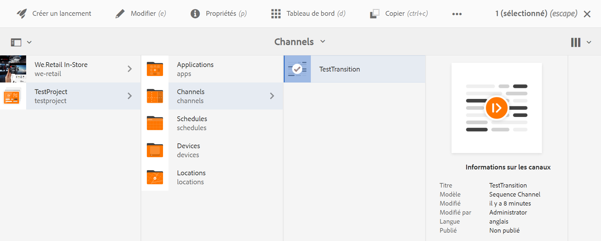
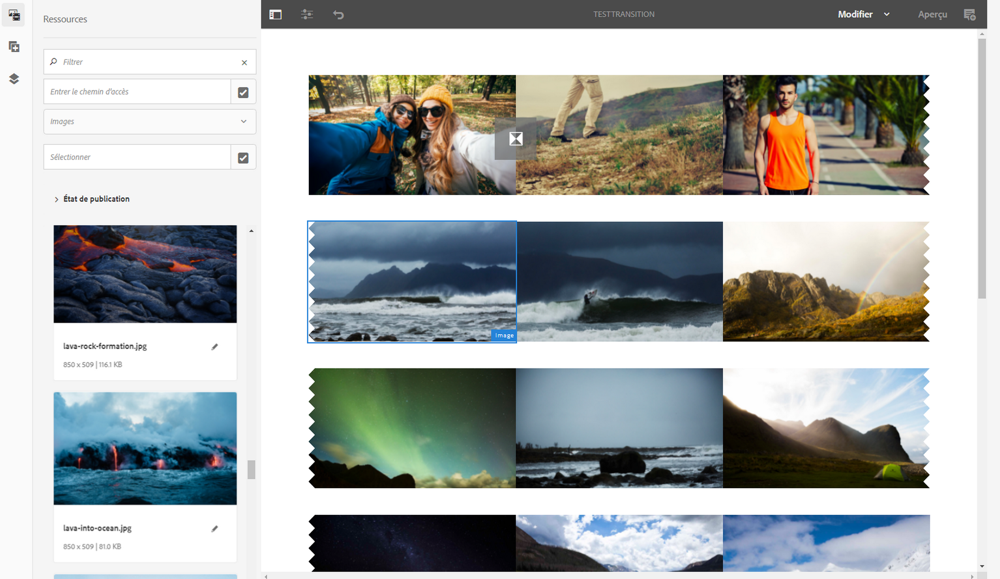
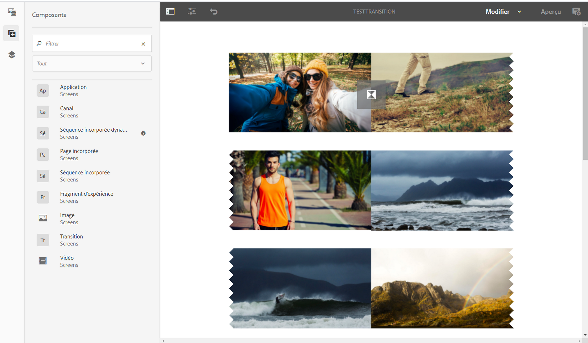

# Application de transitions {#applying-transitions}

Cette section décrit comment vous pouvez appliquer le composant **Transition** entre différentes ressources (images et vidéos) et des séquences incorporées dans un canal.

>[!CAUTION]
>
>Pour en savoir plus sur les propriétés du composant **Transition**, reportez-vous à [Transitions](adding-components-to-a-channel.md#transition).

## Ajout d’un composant Transition aux ressources dans un canal {#adding-transition}

Pour ajouter un composant de transition à votre projet AEM Screens, procédez comme suit :

>[!NOTE]
>
>**Conditions préalables**
>
> Créez un projet AEM Screens **TestProject**
avec un canal **TestTransition**. Configurez également un emplacement et un affichage pour visualiser la sortie.

1. Accédez au canal **TestTransition** et cliquez sur **Modifier** dans la barre d’actions.

   

   >[!NOTE]
   >
   >Le canal **TestTransition** comporte déjà quelques ressources (images et vidéos). Par exemple, le canal **TestTransition** comprend trois images et deux vidéos, comme illustré ci-dessous :

   

1. Faites glisser et déposez le composant **Transition** dans votre éditeur.
   >[!CAUTION]
   >
   >Avant d’ajouter la transition à vos ressources dans votre canal, assurez-vous que vous n’ajoutez pas de transition avant la première ressource dans le canal séquentiel. Le premier élément de votre canal doit être une ressource et non une transition.

   

   > [!NOTE]
   >
   >Par défaut, les propriétés du composant de transition, telles que **Type**, sont définies sur **Fondu** et la **Durée** sur *1 600 ms*.  En outre, il n’est pas conseillé de définir une durée de transition plus longue que la ressource à laquelle cette durée s’applique.

1. De plus, si vous ajoutez un composant **Séquence incorporée** (qui inclut un canal de séquence) à cet éditeur de canal, vous pouvez ajouter un composant de transition à la fin, de sorte que le contenu soit lu dans l’ordre, comme illustré dans la figure ci-dessous :

   

