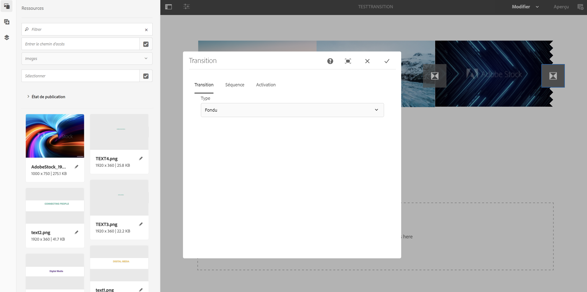

# Application de transitions {#applying-transitions}

Cette section décrit comment un composant **Transition** vous permet d’ajouter une transition à votre projet d’écrans.

>[!CAUTION]
>
>Pour en savoir plus sur les propriétés du composant Transition, voir [Transitions.](adding-components-to-a-channel.md#transition)

## Ajout d’un composant de transition aux ressources dans un canal {#adding-transition}

Suivez les étapes ci-dessous pour ajouter un composant de transition à votre projet AEM Screens :

>[!NOTE]
>
>**Conditions préalables**
> Créez un projet AEM Screens **TestProject** avec un canal **TestTransition**. Configurez également un emplacement et un affichage pour afficher la sortie.

1. Accédez à Channel **TestTransition** et cliquez sur **Modifier** dans la barre d’actions.

   

   >[!NOTE]
   >
   >Le canal **TestTransition** comporte déjà peu de ressources (images et vidéos). Par exemple, le canal **TestTransition** comprend trois images et deux vidéos, comme illustré ci-dessous :

   

1. Faites glisser et déposez le composant **Transition** dans votre éditeur.
   >[!CAUTION]
   >
   >Avant d’ajouter la transition à vos ressources dans votre canal, assurez-vous que :
Vous n’ajoutez pas de transition avant le premier fichier dans le canal séquentiel. Le premier élément de votre canal doit être une ressource et non une transition.

   

   > [!NOTE]
   >
   >Par défaut, le composant de transition est défini sur Type comme **Normal** avec **Durée** définie sur *600 ms*.  En outre, il n’est pas conseillé de définir une durée de transition plus longue que la ressource à laquelle il est appliqué.

## Ajout d’un composant de transition aux vidéos dans un canal {#adding-transition-videos}

Lors de l’application d’un composant de transition entre des vidéos, définissez toujours le **type** sur **Fondu** et la durée **de la** séquence sur **1 600 ms.**

