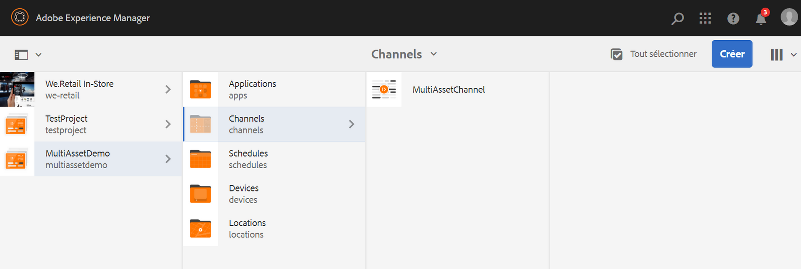
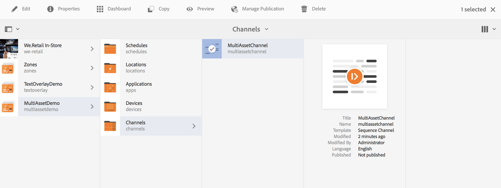
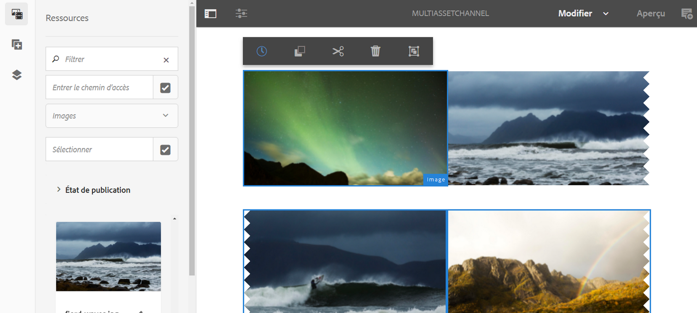
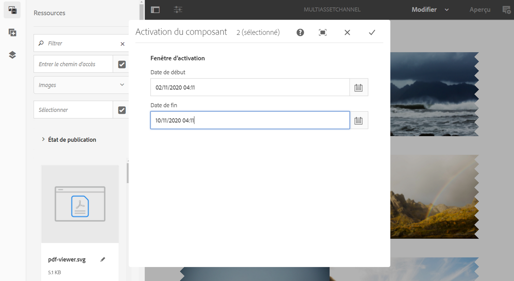
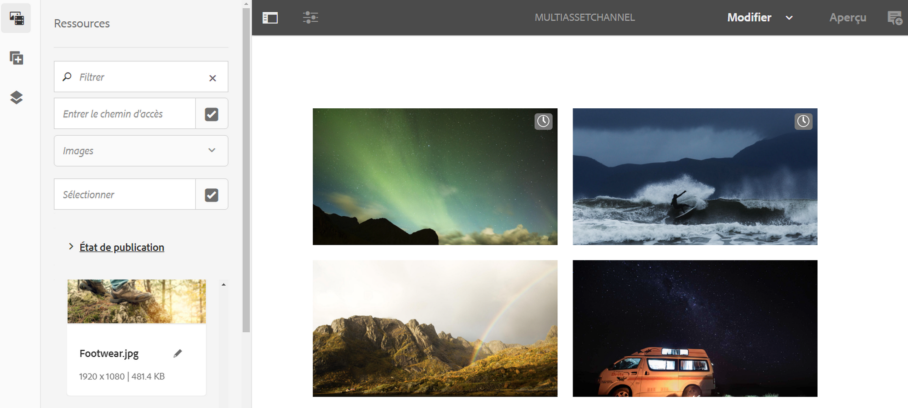

# Activation au niveau du fichier {#asset-level-scheduling}

Cette page décrit l’activation au niveau des ressources utilisées dans les canaux.

Cette section aborde les sujets suivants :

* Présentation
* Fenêtre d’activation
* Lecture d’événement unique
* Gestion de la périodicité pour les ressources
   * Tranches horaires
   * Partage de semaine
   * Division des mois
* Activation de plusieurs ressources

>[!CAUTION]
>
>Cette fonctionnalité d’AEM Screens est disponible uniquement si vous avez installé AEM 6.3 Feature Pack 3 ou AEM 6.4 Screens Feature Pack 1.
>
>Pour accéder à ce Feature Pack, vous devez contacter l’assistance d’Adobe et demander à y accéder. Une fois que vous disposez des autorisations nécessaires, vous pouvez le télécharger à partir de Package Share.

## Présentation {#overview}

***Activation*** au niveau de la ressource, vous permet d’activer une ressource spécifique dans un canal pour une période planifiée dans le fuseau horaire local du lecteur. Cette option est disponible pour les images, les vidéos, les transitions, les pages et les canaux incorporés (dynamiques ou statiques).

*Par exemple*, vous souhaitez qu’une promotion spéciale s’affiche uniquement pendant la Happy Hour (de 14h00 à 17h00) les lundis et les mercredis.

Avec cette fonctionnalité, vous pouvez non seulement spécifier la date et l’heure de début et de fin, mais également un modèle de périodicité.

## Fenêtre d’activation {#single-event-playback}

Asset Level Activation is done by configuring the **Activation** tab while accessing properties of an asset.

Suivez les étapes ci-dessous pour effectuer une planification au niveau des ressources :

1. Sélectionnez un canal et cliquez sur **Modifier** dans la barre d’actions pour ajouter ou modifier du contenu dans votre canal.

   

   >[!NOTE]
   >
   >Pour apprendre en détail comment
   >
   >* créer un projet, voir [Création d’un projet](creating-a-screens-project.md).
   >* créer et ajouter du contenu à un canal, voir [Gestion des canaux](managing-channels.md).

1. Cliquez sur **Modifier** pour ouvrir l&#39;éditeur de canaux et sélectionner une ressource à laquelle vous souhaitez appliquer la planification.

   

1. Select the asset and click on top left **Configure** (wrench icon) to open the properties of the image.

   Cliquez sur l’onglet **Activation**.

   

1. Vous pouvez spécifier la date à partir du sélecteur de date à l’aide de l’option **Actif depuis** et **Actif jusqu’aux** champs.

   Si vous sélectionnez la date et l’heure dans **Actif à partir de** et **Actif jusqu’à**, la ressource s’affichera et en boucle uniquement entre cette date/heure de début et cette date/heure de fin, respectivement.

   

## Gestion de la périodicité pour les ressources {#handling-recurrence-in-assets}

Vous pouvez planifier l’activation périodique des ressources à certains intervalles, tous les jours, toutes les semaines ou tous les mois, selon vos besoins.

Supposons que vous souhaitiez afficher une image uniquement le vendredi de 13h00 à 22h00. You can use the **Activation** tab to set the desired recurring interval for your asset.

### Tranches horaires {#day-parting}

1. Select the asset and click on **Configure** (wrench icon) to open the properties dialog box.

1. Après avoir saisi la date/l’heure de début et l’heure de fin/de date, vous pouvez utiliser une expression ou une version textuelle naturelle pour spécifier votre calendrier de répétition.

   > [!NOTE]
   > Vous pouvez ignorer ou inclure les champs **Actif depuis** et **Actif jusqu’à** et ajouter l’expression au champ Planifications, selon vos besoins.

1. Entrez l’expression dans le **calendrier** et votre fichier s’affichera pour l’intervalle de jour et d’heure.

#### Exemples d’expressions pour le partage de journée {#example-one}

Le tableau suivant récapitule quelques exemples d’expressions que vous pouvez ajouter à la planification lors de l’attribution d’un canal à un affichage.

| **Expression** | **Interprétation** |
|---|---|
| avant 08h00 | le fichier de la chaîne est lu avant 8h00 tous les jours |
| après 14h00 | le fichier de la chaîne est lu après 14h00 tous les jours |
| après 12h15 et avant 12h45 | le fichier de la chaîne est lu après 12h15 tous les jours pendant 30 minutes. |
| avant 12h15 et après 12h45 | le fichier de la chaîne est lu avant 12h15 tous les jours et après 12h45 |
| Lun,Tue,Wed ou Lun-Wed | la ressource est lue dans la ressource du canal du lundi au mercredi. |
| le 1er janvier après 14h00, et le 2 janvier et le 3 janvier avant 03h00 | le fichier dans la chaîne commence à jouer après 14h00 le 1er janvier, continue à jouer toute la journée le 2 janvier jusqu&#39;à 3h00 le 3 janvier |
| le 1er et 2 janvier après 14h00 et le 2-3 janvier avant 03h00 | le fichier dans la chaîne démarre le lecteur après 14h00 le 1er janvier, continue la lecture jusqu&#39;à 3h00 le 2 janvier, puis recommence le 2 janvier à 14h00 et continue la lecture jusqu&#39;à 3h00 le 3 janvier |

>[!NOTE]
>Vous pouvez également utiliser la notation _sur 24 heures_ (14h00) au lieu de la notation *am/pm* (2h00 pm).

### Partage de semaine {#week-parting}

1. Select the asset and click on **Configure** (wrench icon) to open the properties dialog box.

1. Après avoir saisi la date/l’heure de début et l’heure de fin/de date, vous pouvez utiliser une expression ou une version textuelle naturelle pour spécifier votre calendrier de répétition.

   > [!NOTE]
   > Vous pouvez ignorer ou inclure les champs **Actif depuis** et **Actif jusqu’à** et ajouter l’expression au champ Planifications, selon vos besoins.

1. Entrez l’expression dans le **calendrier** et votre fichier s’affichera pour l’intervalle de jour et d’heure.

#### Exemples d’expressions pour le partage de semaine {#example-two}

Le tableau suivant récapitule quelques exemples d’expressions que vous pouvez ajouter à la planification lors de l’attribution d’un canal à un affichage.

| **Expression** | **Interprétation** |
|---|---|
| Lun,Tue,Wed ou Lun-Wed | la ressource est lue dans la ressource du canal du lundi au mercredi. |
| avant 08h00 | le fichier de la chaîne est lu avant 8h00 tous les jours |
| après 14h00 | le fichier de la chaîne est lu après 14h00 tous les jours |
| après 12h15 et avant 12h45 | le fichier de la chaîne est lu après 12h15 tous les jours pendant 30 minutes. |
| avant 12h15 et après 12h45 | le canal est lu avant 12h15 et après 12h45 tous les jours |

>[!NOTE]
>Vous pouvez également utiliser la notation _sur 24 heures_ (14h00) au lieu de la notation *am/pm* (2h00 pm).

### Division des mois {#month-parting}

1. Select the asset and click on **Configure** (wrench icon) to open the properties dialog box.

1. Après avoir saisi la date/l’heure de début et l’heure de fin/de date, vous pouvez utiliser une expression ou une version textuelle naturelle pour spécifier votre calendrier de répétition.

   > [!NOTE]
   > Vous pouvez ignorer ou inclure les champs **Actif depuis** et **Actif jusqu’à** et ajouter l’expression au champ Planifications, selon vos besoins.

1. Entrez l’expression dans le **calendrier** et votre fichier s’affichera pour l’intervalle de jour et d’heure.

#### Exemples d’expressions pour le partage de mois {#example-three}

Le tableau suivant récapitule quelques exemples d’expressions que vous pouvez ajouter à la planification lors de l’attribution d’un canal à un affichage.

| **Expression** | **Interprétation** |
|---|---|
| de février,mai,août,novembre | la ressource est lue dans la chaîne en février, mai, août, novembre |

> [!NOTE]
> Lors de la définition des jours de la semaine et des mois, vous pouvez utiliser les annotations à main courte et de nom complet, telles que Lun/Lundi et Jan/Janvier.

>[!NOTE]
> Vous pouvez également utiliser la notation _sur 24 heures_ (14h00) au lieu de la notation *am/pm* (2h00 pm).

## Activation de plusieurs ressources {#multi-asset-scheduling}

>[!CAUTION]
>
>The **Multi-asset Activation** feature is only available, if you have installed AEM 6.3 Feature Pack 5 or AEM 6.4 Feature Pack 3.

***L’activation*** de fichiers multiples permet à l’utilisateur de sélectionner plusieurs fichiers et d’appliquer un calendrier de lecture à tous les fichiers sélectionnés.

### Conditions préalables {#prerequisites}

Pour utiliser l’activation au niveau de plusieurs ressources pour vos ressources, créez un projet AEM Screens avec un canal de séquence. Par exemple, le cas d’utilisation suivant montre l’implémentation de la fonctionnalité :

* Créez un projet AEM Screens intitulé **MultiAssetDemo**
* Créez un canal intitulé **MultiAssetChannel** et ajoutez du contenu au canal, comme illustré ci-dessous.

Pour sélectionner plusieurs ressources et planifier leur affichage dans un projet AEM Screens, procédez comme suit :

1. Sélectionnez **MultiAssetChannel** et cliquez sur **Modifier** dans la barre d’actions pour ouvrir l’éditeur.

   

1. Sélectionnez plusieurs ressources dans l’éditeur, puis cliquez sur **Modifier l’activation** (icône en haut à gauche).

   

1. Sélectionnez la date et l’heure dans **Actif à partir de** et **Actif jusqu’à** dans la boîte de dialogue Activation **du** composant. Cliquez sur l&#39;icône en forme de coche lorsque vous avez terminé de sélectionner les planifications.

   

1. Cliquez sur Actualiser pour vérifier les ressources auxquelles une planification multiressource est appliquée.

   >[!NOTE]
   >
   >L’icône de planification est visible dans le coin supérieur droit des ressources qui ont une activation multiressource.

   

