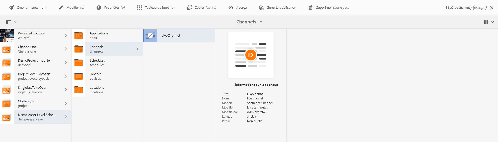
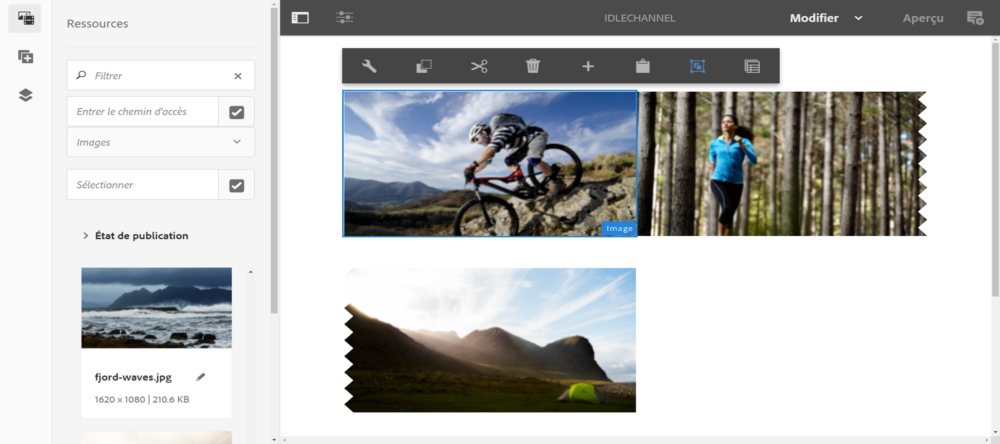
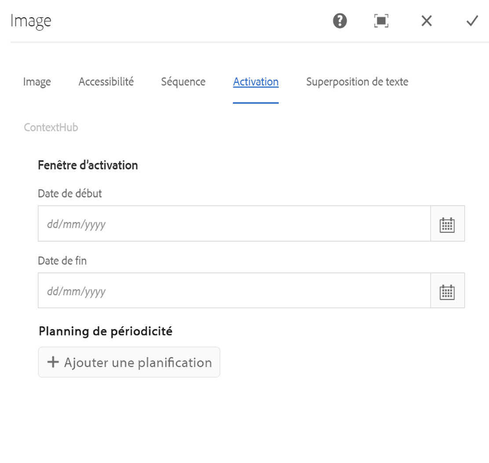
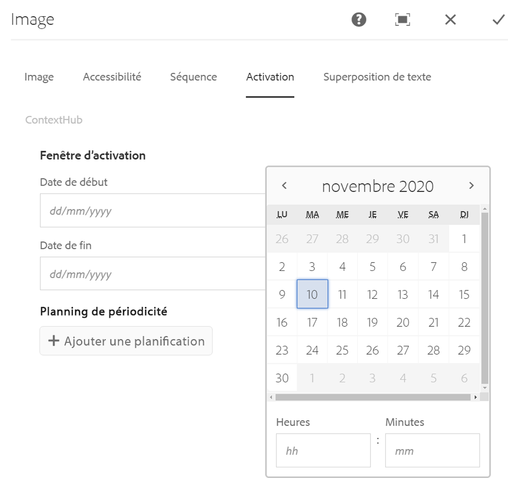

# Planification au niveau des ressources {#asset-level-scheduling}

Cette section décrit la planification au niveau des ressources utilisées dans les canaux.

Cette section aborde les sujets suivants :

* OverviewW
* Utilisation de la planification au niveau des ressources
* Gestion de la répétition dans les ressources
* Planification de ressources multiples

>[!CAUTION]
>
>Cette fonctionnalité d’AEM Screens est disponible uniquement si vous avez installé AEM 6.3 Feature Pack 3 ou AEM 6.4 Screens Feature Pack 1.
>
>Pour accéder à ce Feature Pack, vous devez contacter l’assistance d’Adobe et demander à y accéder. Une fois que vous disposez des autorisations, vous pouvez le télécharger à partir de Package Share.

## Présentation {#overview}

***Planification*** du niveau de ressource, vous permet d’activer une ressource spécifique dans un canal pour une période planifiée dans le fuseau horaire local du lecteur. Cette option est disponible pour les images, les vidéos, les transitions, les pages et les canaux incorporés (dynamiques ou statiques).

*Par exemple*, vous souhaitez qu’une promotion spéciale s’affiche uniquement pendant l’heure heureuse (14h00 à 17h00) les lundis et mercredis.

Avec cette fonctionnalité, vous pouvez non seulement spécifier la date et l’heure de début et de fin, mais également un modèle de répétition.

## Utilisation de la planification au niveau des ressources {#using-asset-level-scheduling}

La planification au niveau des ressources s’effectue en configurant l’onglet **Activation** lors de l’accès aux propriétés d’une ressource.

Suivez les étapes ci-dessous pour planifier au niveau des ressources :

1. Sélectionnez un canal et cliquez sur **Modifier** dans la barre d’actions pour ajouter ou modifier du contenu dans votre canal.

   

   >[!NOTE]
   >
   >Pour apprendre en détail comment
   >
   >* Créez un projet, voir [Création d’un projet](creating-a-screens-project.md).
   >* Créez et ajoutez du contenu à un canal, voir [Gestion des canaux](managing-channels.md).

1. Cliquez sur **Modifier** pour ouvrir l'éditeur de canaux et sélectionner un fichier auquel vous souhaitez appliquer la planification.

   

1. Sélectionnez le fichier et cliquez sur l’icône **Configurer** en haut à gauche pour ouvrir les propriétés de l’image.

   Click the **Activation** tab.

   

1. Vous pouvez spécifier la date à partir du sélecteur de date à partir des champs **Actif de** et **Actif jusqu’aux** champs.

   Si vous sélectionnez **Actif de** et **Actif jusqu’** à la date et à l’heure, la ressource s’affichera et s’exécutera uniquement entre cette date/heure de début et cette date/heure de fin, respectivement.

   

## Gestion de la répétition dans les ressources {#handling-recurrence-in-assets}

Vous pouvez planifier la récurrence des fichiers à certains intervalles, tous les jours, toutes les semaines ou tous les mois, selon vos besoins.

Supposons que vous souhaitiez afficher une image uniquement le vendredi de 13h00 à 22h00. Vous pouvez utiliser l’onglet Activation pour définir l’intervalle périodique souhaité pour votre fichier.

### Ajout d’un événement périodique pour votre ressource {#adding-a-recurring-event-for-your-asset}

1. Sélectionnez le fichier et cliquez sur l’icône **Configurer** pour ouvrir la boîte de dialogue des propriétés.
1. Après avoir saisi la date/l’heure de début et l’heure de fin/de date, vous pouvez utiliser une expression cron ou une version textuelle naturelle pour spécifier votre calendrier de répétition.

   Vous pouvez rechercher sur le Web un générateur d’expression cron gratuit, puis copier et coller l’expression cron dans le **calendrier** et votre fichier s’affichera pour l’intervalle de jour et d’heure particulier.

   *Vous pouvez également*, au lieu d’utiliser l’expression cron, utiliser la version textuelle naturelle, *après 6 h et avant 18 h00* le vendredi, pour accomplir votre tâche. Entrez le texte dans le **Calendrier** pour afficher votre fichier.

## Planification de ressources multiples {#multi-asset-scheduling}

>[!CAUTION]
>
>La fonction de planification **** multiressources n’est disponible que si vous avez installé AEM 6.3 Feature Pack 5 ou AEM 6.4 Feature Pack 3.

***La planification*** de ressources multiples permet à l’utilisateur de sélectionner plusieurs ressources et d’appliquer un calendrier de lecture à toutes les ressources sélectionnées.

### Conditions préalables {#prerequisites}

Pour utiliser la planification au niveau de plusieurs ressources pour vos ressources, créez un projet AEM Screens avec un canal de séquence. Par exemple, le cas d’utilisation suivant présente l’implémentation de la fonctionnalité :

* Création d’un projet AEM Screens intitulé **MultiAssetDemo**
* Créez un canal intitulé **MultiAssetChannel** et ajoutez du contenu au canal, comme illustré dans la figure ci-dessous.

Suivez les étapes ci-dessous pour sélectionner plusieurs ressources et programmer leur affichage dans un projet AEM Screens :

1. Select **MultiAssetChannel** and click **Edit** from the action bar to open the editor.

   

1. Sélectionnez plusieurs fichiers dans l’éditeur, puis cliquez sur **Modifier l’activation** (icône en haut à gauche).

   

1. Sélectionnez la date et l’heure dans **Actif depuis** et **Actif jusqu’à** dans la boîte de dialogue Activation **du** composant. Cliquez sur l'icône en forme de coche lorsque vous avez terminé de sélectionner les planifications.

   

1. Cliquez sur Actualiser pour vérifier les ressources auxquelles un calendrier de plusieurs ressources est appliqué.

   >[!NOTE]
   >
   >L’icône de planification est visible dans le coin supérieur droit pour les ressources dont la planification est multi-ressources.

   

