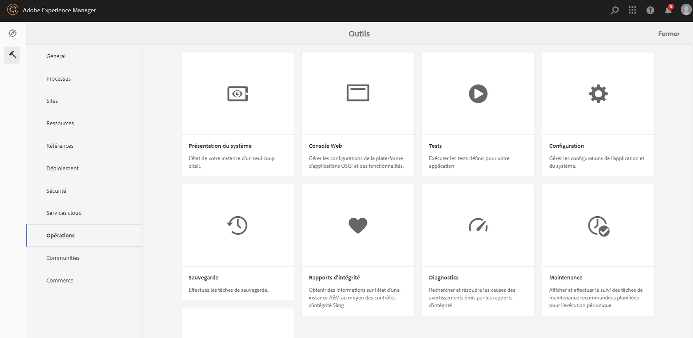
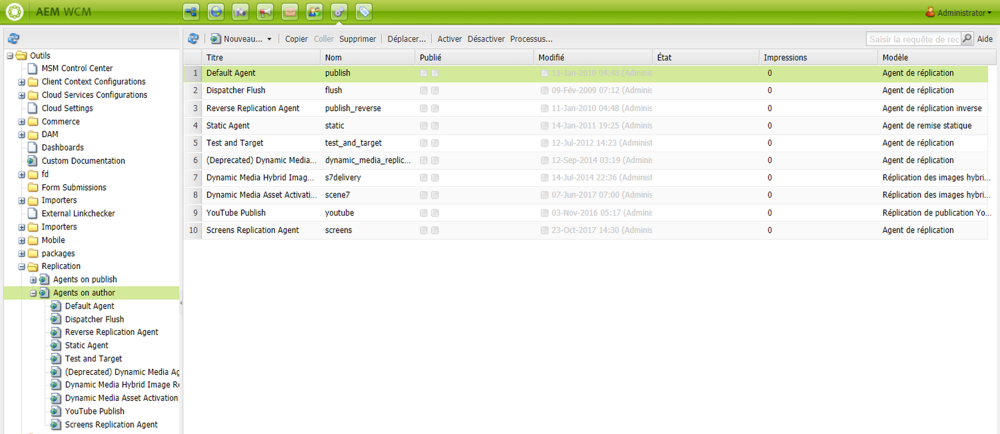
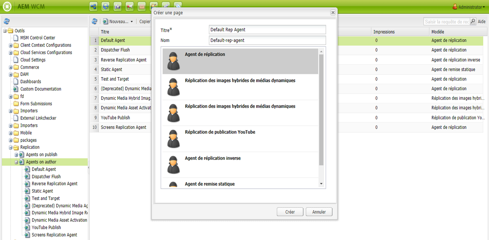
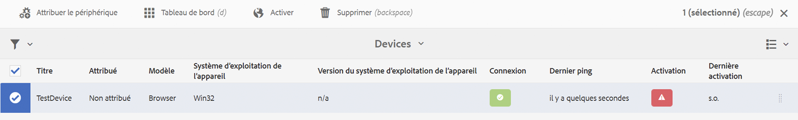
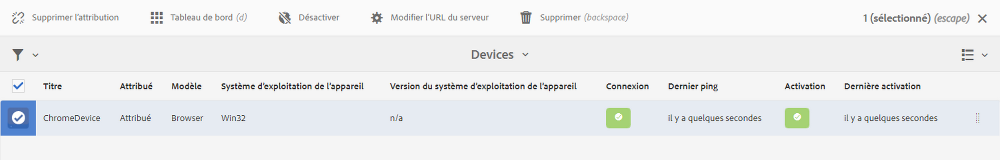

# Configuration de l’auteur et de la publication dans AEM Screens {#configuring-author-and-publish-in-aem-screens}

Cette page met l’accent sur les sujets suivants :

* **Configuration des instances de création et de publication**
* **Configuration de la topologie de publication**
* **Gestion de la publication : diffusion des mises à jour de contenu de l’auteur à la publication sur le périphérique**

## Prérequis {#prerequisites}

Avant de vous familiariser avec les serveurs de création et de publication, vous devez connaître au préalable :

* **Topologie AEM**
* **Création et gestion de projet AEM Screens**
* **Processus d’enregistrement de périphérique**

>[!NOTE]
>
>Cette fonctionnalité AEM Screens n’est disponible que si vous avez installé AEM 6.4 Screens Feature Pack 2. Pour accéder à ce Feature Pack, vous devez contacter l’assistance d’Adobe et demander à y accéder. Une fois que vous disposez des autorisations nécessaires, vous pouvez le télécharger à partir de Package Share.

>[!IMPORTANT]
>
>Si vous souhaitez utiliser plusieurs instances de publication avec le Dispatcher, vous devez y mettre à jour le fichier dispatcher.any. Pour plus d’informations, voir [Activation des sessions persistantes](dispatcher-configurations-aem-screens.md#enable-sticky-session).

## Configuration des instances de création et de publication {#configuring-author-and-publish-instances}

>[!NOTE]
>
>Pour en savoir plus sur la présentation de l’architecture de création et de publication et sur la manière dont le contenu est créé sur une instance de l’Auteur AEM avant d’être répliqué sur plusieurs instances de publication, reportez-vous à [Présentation de l’architecture de création et de publication](author-publish-architecture-overview.md).

La section suivante explique comment configurer les agents de réplication sur la topologie de création et de publication.

Vous pouvez configurer un exemple simple, où vous hébergez une instance de création et deux instances de publication :

* Auteur —> localhost:4502
* Publier 1 (pub1) —> localhost:4503
* Publier 2 (pub2) —> localhost:4504

## Configuration des agents de réplication en mode de création {#setting-replication-agents}

Pour créer des agents de réplication, vous devez apprendre à créer un agent de réplication standard.

Trois agents de réplication sont nécessaires pour Screens :

1. **Agent de réplication par défaut ***(spécifié comme*** Agent de réplication standard**)
1. **Agent de réplication Screens**
1. **Agent de réplication inverse**

### Étape 1 : création d’un agent de réplication par défaut {#step-creating-a-default-replication-agent}

Pour créer un agent de réplication par défaut, procédez comme suit :

1. Accédez à votre instance AEM —> icône marteau —> **Opérations** —> **Configuration**.

   

1. Sélectionnez la **Réplication** dans l’arborescence de navigation de gauche.

   

1. Sélectionnez les **Agents sur l’auteur** dans le dossier **Réplication** et cliquez sur **Nouveau** pour créer un agent de réplication standard.

   

1. Saisissez le **Titre** et le **Nom** pour créer l’agent de réplication, puis cliquez sur **Créer**.

   

1. Cliquez avec le bouton droit sur l’agent de réplication et cliquez sur **Ouvrir** pour modifier les paramètres.

   

1. Cliquez sur **Modifier** pour ouvrir la boîte de dialogue **Paramètres d’agent** afin de saisir les détails.

   >[!NOTE]
   >
   >L’utilisateur doit cocher **Activé** pour activer l’agent de réplication. Vous devez cocher cette option sur les agents de réplication par défaut, Screens et inverse.

   

1. Accédez à l’onglet **Transport** et saisissez l’**URI**, l’**Utilisateur** et le **Mot de passe**.

   

   >[!NOTE]
   >
   >Vous pouvez également copier et renommer un agent de réplication par défaut existant.

#### Création d’agents de réplication standard   {#creating-standard-replication-agents}

1. Créez un agent de réplication standard pour pub1 (l’agent par défaut prêt à l’emploi devrait déjà être configuré) (par exemple, *https://&lt;nom_hôte>:4503/bin/receive?sling:authRequestLogin=1*)
1. Créez un agent de réplication standard pour pub2. Vous pouvez copier l’agent de réplication pour pub1 et mettre à jour le transport à utiliser pour pub2 en modifiant le port dans la configuration du transport. (par exemple, *https://&lt;nom_hôte>:4504/bin/receive?sling:authRequestLogin=1*)

#### Création d’agents de réplication Screens {#creating-screens-replication-agents}

1. Créez l’agent de réplication AEM Screens pour pub1. Par défaut, il existe un agent de réplication Screens qui pointe vers le port 4503. Ce paramètre doit être activé.
1. Créez l’agent de réplication AEM Screens pour pub2. Copiez l’agent de réplication Screens pour pub1 et modifiez le port afin qu’il pointe sur 4504 pour pub2.

#### Création d’agents de réplication inverse Screens {#creating-screens-reverse-replication-agents}

1. Créez un agent de réplication inverse standard pour pub1.
1. Créez un agent de réplication inverse standard pour pub2. Vous pouvez copier l’agent de réplication inverse pour pub1 et mettre à jour le transport à utiliser pour pub2 en modifiant le port dans la configuration du transport.

## Configuration de la topologie de publication {#setting-up-publish-topology}

### Étape 1 : configuration de la détection Apache Sling basée sur Oak {#step-configure-apache-sling-oak-based-discovery}

Configurez la détection Apache Sling basée sur Oak pour toutes les instances de publication dans la topologie

Pour chaque instance de publication :

1. Accédez à `https://<host>:<port>/system/console/configMgr`.
1. Sélectionnez la Configuration du **Service de détection Apache Sling basé sur Oak**.
1. Mettez à jour les URL des connecteurs de topologie : ajoutez les URL de toutes les instances de publication participantes, à savoir :
   * `https://localhost:4503/libs/sling/topology/connector`
   * `https://localhost:4504/libs/sling/topology/connector`
1. **Liste blanche des connecteurs de topologie** : à adapter aux adresses IP ou aux sous-réseaux couvrant les instances de publication
1. Activez **Arrêt automatique des boucles locales**

La configuration doit être identique pour chaque instance de publication et l’arrêt automatique des boucles locales empêche la création d’une boucle infinie.

#### Étape 2 : vérification de la topologie de publication {#step-verify-publish-topology}

Pour toutes les instances de publication, accédez à `https://:/system/console/topology`. Vous devriez voir chaque instance de publication représentée dans la topologie sous **Connecteurs de topologie sortants**.

#### Étape 3 : configuration d’un cluster ActiveMQ Artemis {#step-setup-activemq-artemis-cluster}

Cette étape vous permet de créer un mot de passe chiffré pour le cluster ActiveMQ Artemis.
L’utilisateur de du cluster et le mot de passe de toutes les instances de publication de la topologie doivent être identiques. Le mot de passe de la configuration ActiveMQ Artemis doit être chiffré. Chaque instance ayant sa propre clé de chiffrement, il est nécessaire d’utiliser la prise en charge de Crypto pour créer une chaîne de mot de passe chiffrée. Le mot de passe chiffré sera ensuite utilisé dans la configuration OSGi pour ActiveMQ.

Sur chaque instance de publication :

1. Dans la console OSGi, accédez à **MAIN** —> **Prise en charge de Crypto** (`https://&lt;host&gt;:&lt;port&gt;/system/console/crypto`).
1. Saisissez le mot de passe en texte brut (identique pour toutes les instances) dans **Texte brut**
1. Cliquez sur **Protéger**.
1. Copiez la valeur **Texte protégé** dans le bloc-notes ou l’éditeur de texte. Cette valeur sera utilisée dans la configuration OSGi pour ActiveMQ.

Comme chaque instance de publication possède par défaut des clés de chiffrement uniques, vous devez effectuer cette étape sur chaque instance pub et enregistrer la clé unique pour la configuration suivante.

>[!NOTE]
>
>Le mot de passe doit commencer et se terminer par des accolades. Par exemple :
>`{1ec346330f1c26b5c48255084c3b7272a5e85260322edd59119828d1fa0a610e}`

#### Étape 4 : activation du cluster Artemis ActiveMQ {#step-activate-activemq-artemis-cluster}

Sur chaque instance de publication :

1. Accédez au gestionnaire de configuration OSGi `https://&lt;host&gt;:&lt;port&gt;/system/console/configMgr`
1. Sélectionnez la Configuration du **Fournisseur JMS Apache ActiveMQ Artemis**
1. Mettez à jour les éléments suivants :

   * ***Mot de passe du cluster*** : utilisez la valeur chiffrée de l’étape précédente pour chaque instance
   * ***Sujets*** : `{name: 'commands', address: 'com.adobe.cq.screens.commands', maxConsumers: 50}`

#### Vérifiez le cluster d’artéfacts ActiveMQ Artemis {#verify-activemq-artemis-cluster}

Suivez les étapes ci-dessous sur chaque instance de publication :

1. Accédez à la Console OSGi -> Principal > ActiveMQ Artemis `https://localhost:4505/system/console/mq`.
1. Vérifiez et contrôlez afin d’afficher les ports des autres instances sous Informations sur le cluster > Topologie > nœuds=2, membres=2.
1. Envoyez un message de test (en haut de l’écran sous Informations sur le courtier)
1. Entrez les modifications suivantes dans les champs :

   1. **Destination** : /com.adobe.cq.screens/devTestTopic
   1. **Texte** : Hello World
   1. Affichez le fichier error.log de chaque instance pour vérifier que le message a été envoyé et reçu par l’ensemble du cluster.

>[!NOTE]
>
>La navigation vers la console OSGi peut prendre quelques secondes après l’enregistrement de la configuration à l’étape précédente. Vous pouvez également consulter le fichier error.log pour plus de détails.

Par exemple, l’image suivante s’affiche lors d’une configuration réussie d’ActiveMQ Artemis Server.

Si vous ne voyez pas la configuration suivante de */system/console/mq*, accédez à */system/console/mq* et cliquez sur **Redémarrer** pour redémarrer le courtier.

#### Suppression des exigences d’en-tête de référent {#remove-referrer-header-requirement}

Suivez les étapes de chaque instance de publication :

1. Accédez à **Console OSGi** > **Configuration Manager**
1. Sélectionnez **Filtre de référent Apache Sling**
1. Mettez à jour la configuration et **cochez Autoriser valeur vide**

### Configuration des instances de création et de publication {#configuring-author-and-publish-instance}

Une fois que vous aurez configuré la stratégie de publication, vous devez configurer les instances de création et de publication afin d’afficher les résultats concrets de l’implémentation :

>[!NOTE]
>
>**Prérequis**
>
>Pour commencer avec cet exemple, créez un projet AEM Screens, puis créez un emplacement, un affichage et un canal dans votre projet. Ajoutez du contenu à votre canal et affectez-le à un affichage.

#### Étape 1 : démarrage d’un lecteur AEM Screens (périphérique) {#step-starting-an-aem-screens-player-device}

1. Lancez une fenêtre du navigateur distincte.
1. Accédez au lecteur Screens à l’aide du *navigateur web*, à savoir `https://localhost:4502/content/mobileapps/cq-screens-player/firmware.html`, ou lancez l’application AEM Screens. Lorsque vous ouvrez le périphérique, vous remarquez que son état est non enregistré.

>[!NOTE]
>
>Vous pouvez ouvrir un lecteur AEM Screens en utilisant l’application que vous avez téléchargée ou le navigateur web.

#### Étape 2 : enregistrement d’un périphérique sur l’Auteur {#step-registering-a-device-on-author}

1. Accédez à `https://localhost:4502/screens.html/content/screens/we-retail` ou sélectionnez votre projet et accédez à Périphériques > Gestionnaire de périphériques.
1. Sélectionnez **Enregistrer le périphérique**.
1. Cliquez sur **Enregistrement du périphérique** pour afficher le périphérique.
1. Sélectionnez le périphérique que vous voulez enregistrer et cliquez ensuite sur **Enregistrer le périphérique**.
1. Vérifiez le code d’enregistrement et cliquez sur **Valider**.
1. Saisissez un titre pour votre périphérique et cliquez sur **Enregistrer**.

#### Étape 3 : attribution du périphérique à un affichage {#step-assigning-the-device-to-display}

1. Cliquez sur **Attribuer l’affichage** dans la boîte de dialogue de l’étape précédente.
1. Sélectionnez le chemin d’affichage de votre canal dans le dossier **Emplacements**.
1. Cliquez sur **Attribuer**.
1. Cliquez sur **Terminer** pour achever le workflow. Le périphérique est désormais attribué.

Vérifiez votre lecteur et vous verrez le contenu que vous avez ajouté à votre canal.

#### Étape 4 : publication de la configuration du périphérique sur les instances de publication {#step-publishing-device-configuration-to-publish-instances}

**Vérification du périphérique**

Avant d’effectuer les étapes ci-dessous, veillez à vérifier l’ID du périphérique. Pour vérifier, recherchez l’identifiant de l’appareil dans CRXDE Lite, en utilisant comme chemin d’accès */home/users/screens/we-retail/devices*.

Pour répliquer l’utilisateur du périphérique, procédez comme suit :

1. Accédez à la page d’administration des utilisateurs (par ex. : `https://localhost:4502/useradmin`)
1. Recherchez le groupe **screens-devices-master**
1. Cliquez avec le bouton droit sur le groupe, puis cliquez sur **Activer**

>[!CAUTION]
>
>N’activez pas le service author-publish-screens-service, car il s’agit d’un utilisateur système utilisé par la tâche de création.

Vous pouvez également activer le périphérique à partir de la console de gestion des périphériques. Suivez les étapes ci-dessous :

1. Accédez à votre projet Screens —> **Périphériques**.
1. Cliquez sur **Gestionnaire de périphériques** dans la barre d’actions.
1. Sélectionnez le périphérique et cliquez sur **Activer** dans la barre d’actions, comme illustré dans la figure ci-dessous.

>[!NOTE]
>
>Une fois que vous aurez activé le périphérique, vous pourrez également modifier ou mettre à jour l’URL du serveur en cliquant sur **Modifier l’URL du serveur** dans la barre d’actions, comme illustré dans la figure ci-dessous, et vos modifications seront propagées au lecteur AEM Screens.

### Liste de contrôle de publication {#publishing-check-list}

Les points suivants récapitulent la Liste de contrôle de publication :

* *Utilisateur du périphérique Screens* : stocké en tant qu’utilisateur AEM, il est activé à partir de **Outils** > **Sécurité** > **Utilisateurs**. L’utilisateur comportera le préfixe &quot;screens&quot; avec une longue chaîne sérialisée.

* *Projet* : le projet AEM Screens.
* *Emplacement* : emplacement auquel le périphérique est connecté.
* *Canaux* : un ou plusieurs canaux affichés à l’emplacement
* *Planification* : si vous utilisez une planification, veillez à ce qu’elle soit publiée.
* *Dossier Emplacement, Planifications et Canal* : si les ressources correspondantes se trouvent dans un dossier.

Suivez les étapes ci-dessous pour vérifier le comportement de création/publication :

1. Mise à jour du contenu d’un canal sur l’instance de création
1. Exécutez **Gérer la publication** pour publier de nouvelles modifications sur toutes les instances de publication.
1. Appuyez sur **Activer** pour activer l’appareil à partir du **Gestionnaire de périphériques**.
1. **Modifiez l’URL** de l’instance de création en la remplaçant par l’URL de l’une des instances de publication.
1. Vérifiez que le contenu du canal mis à jour s’affiche dans le lecteur AEM Screens.
1. Répétez ces étapes en utilisant une autre instance de publication.

#### Étape 5 : pointage du périphérique vers l’instance de publication dans le panneau d’administration {#step-pointing-the-device-to-publish-instance-in-the-admin-panel}

1. Affichez l’interface utilisateur d’administration du lecteur Screens en appuyant longuement dans l’angle supérieur gauche afin d’ouvrir le menu Admin sur votre lecteur AEM Screens, avec fonction tactile activée, ou en utilisant la souris.
1. Cliquez sur l’option **Configuration** dans le panneau latéral.
1. Modifiez l’instance d’auteur en instance de publication dans **Serveur**.

Affichez les modifications dans votre lecteur AEM Screens.

Vous pouvez également mettre à jour/modifier l’URL du serveur à partir de la console de gestion des périphériques en procédant comme suit :

1. Accédez à votre projet AEM Screens et sélectionnez le dossier **Périphériques**.
1. Cliquez sur **Gestionnaire de périphériques** dans la barre d’actions.
1. Sélectionnez le périphérique et cliquez sur **Modifier l’URL du serveur** dans la barre d’actions, comme illustré dans la figure ci-dessous. Vos modifications seront propagées au lecteur AEM Screens.

La fonction **Gérer les publications** permet de diffuser des mises à jour de contenu de l’auteur à publier sur le périphérique. Vous pouvez publier/annuler la publication de contenu pour l’ensemble du projet AEM Screens ou uniquement pour l’un des canaux, un des emplacements, un des appareils, une des applications ou une des planifications. Pour en savoir plus sur cette fonction, voir [Mise à jour du contenu On-Demand](on-demand-content.md).
