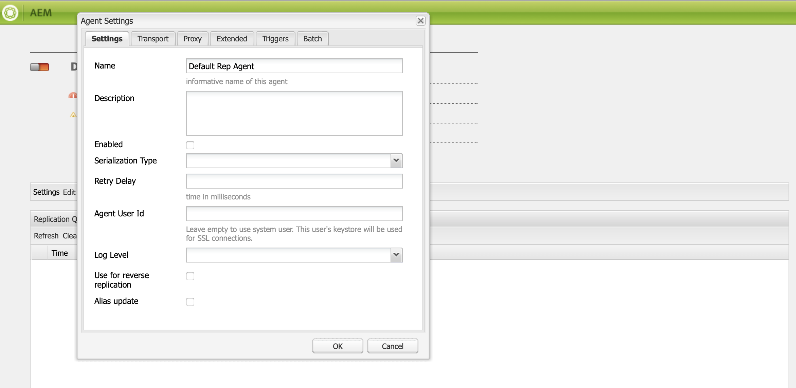

# Configurer les instances de création et de publication dans AEM Screens {#configuring-author-and-publish-in-aem-screens}

Cette page met l’accent sur les sujets suivants :

* **Configuration des instances de création et de publication**
* **Configuration de la topologie de publication**
* **Gestion de la publication : diffusion des mises à jour de contenu de l’auteur à la publication sur l’appareil**

## Conditions préalables {#prerequisites}

Avant de vous familiariser avec les serveurs de création et de publication, vous devez connaître au préalable :

* **Topologie AEM**
* **Création et gestion de projet AEM Screens**
* **Processus d’enregistrement d’appareil**

>[!NOTE]
>
>Cette fonctionnalité AEM Screens n’est disponible que si vous avez installé le pack de fonctionnalités 2 pour AEM 6.4 Screens. Pour accéder à ce Feature Pack, contactez l’assistance Adobe et demandez l’accès. Une fois que vous disposez des autorisations nécessaires, vous pouvez le télécharger à partir du partage de packages.

>[!IMPORTANT]
>
>Si vous souhaitez utiliser plusieurs instances de publication avec Dispatcher, mettez à jour Dispatcher. Voir [Activation des sessions persistantes](dispatcher-configurations-aem-screens.md#enable-sticky-session).

## Configuration des instances de création et de publication {#configuring-author-and-publish-instances}

>[!NOTE]
>
>Pour en savoir plus sur la vue d’ensemble de l’architecture de création et de publication et sur la manière dont le contenu est créé sur une instance de création AEM avant d’être répliqué sur plusieurs instances de publication, reportez-vous à [Vue d’ensemble de l’architecture de création et de publication](author-publish-architecture-overview.md).

La section suivante explique comment configurer des agents de réplication sur la topologie Auteur et Publication.

Vous pouvez configurer un exemple simple, où vous hébergez une instance de création et deux instances de publication :

* Création > localhost:4502.
* Publication 1 (pub1) > localhost:4503.
* Publication 2 (pub2) > localhost:4504.

## Configuration des agents de réplication en mode de création {#setting-replication-agents}

Pour créer des agents de réplication, apprenez à créer un agent de réplication standard.

Trois agents de réplication sont nécessaires pour Screens :

1. **Agent de réplication par défaut ***(spécifié comme*** Agent de réplication standard**)
1. **Agent de réplication Screens**
1. **Agent de réplication inverse**

### Étape 1 : création d’un agent de réplication par défaut {#step-creating-a-default-replication-agent}

Pour créer un agent de réplication par défaut, procédez comme suit :

1. Accédez à votre instance AEM > icône marteau > **Opérations** > **Configuration**.

   

1. Cliquez sur le bouton **Réplication** dans l’arborescence de navigation de gauche.

   

1. Cliquez sur le bouton **Agents sur l’auteur** de la **Réplication** et cliquez sur **Nouveau** pour créer un agent de réplication standard.

   

1. Saisissez le **Titre** et **Nom** pour créer l’agent de réplication, puis cliquez sur **Créer**.

   

1. Cliquez avec le bouton droit sur l’agent de réplication, puis cliquez sur **Ouvrir** pour modifier les paramètres.

   

1. Cliquez sur **Modifier**.

1. Dans la boîte de dialogue **Paramètres de l’agent**, saisissez les détails.

   >[!NOTE]
   >
   >L’utilisateur doit vérifier **Activé** pour activer l’agent de réplication. Vous devez cocher cette option sur les agents de réplication par défaut, Screens et inverse.

   

1. Accédez à l’onglet **Transport** et saisissez l’**URI**, l’**utilisateur ou l’utilisatrice** et le **mot de passe**.

   

   >[!NOTE]
   >
   >Vous pouvez également copier et renommer un agent de réplication par défaut existant.

#### Création d’agents de réplication standard {#creating-standard-replication-agents}

1. Créez un agent de réplication standard pour pub1 (un agent par défaut prêt à l’emploi doit déjà être configuré). Par exemple, *`https://<hostname>:4503/bin/receive?sling:authRequestLogin=1`*.
1. Créez un agent de réplication standard pour pub2. Vous pouvez copier l’agent de réplication pour pub1 et mettre à jour le transport à utiliser pour pub2 en modifiant le port dans la configuration du transport. Par exemple, *`https://<hostname>:4504/bin/receive?sling:authRequestLogin=1`*.

#### Création d’agents de réplication Screens {#creating-screens-replication-agents}

1. Créez l’agent de réplication AEM Screens pour pub1. Par défaut, il existe un agent de réplication Screens qui pointe vers le port 4503. Activez-le.
1. Créez l’agent de réplication AEM Screens pour pub2. Copiez l’agent de réplication Screens pour pub1 et modifiez le port afin qu’il pointe sur 4504 pour pub2.

   >[!NOTE]
   >Pour savoir comment configurer les agents de réplication Screens, voir [Configuration de l’agent de réplication Screens](https://experienceleague.adobe.com/fr/docs/experience-manager-screens/user-guide/administering/configure-screens-replication).

#### Création d’agents de réplication inverse Screens {#creating-screens-reverse-replication-agents}

1. Créez un agent de réplication inverse pour pub1.
1. Créez un agent de réplication inverse pour pub2. Vous pouvez copier l’agent de réplication inverse pour pub1 et mettre à jour le transport à utiliser pour pub2 en modifiant le port dans la configuration du transport.

## Configuration de la topologie de publication {#setting-up-publish-topology}

### Étape 1 : configuration de la détection Apache Sling basée sur Oak {#step-configure-apache-sling-oak-based-discovery}

Configurez la détection Apache Sling basée sur Oak pour toutes les instances de publication dans la topologie

Pour chaque instance de publication :

1. Accédez à `https://<host>:<port>/system/console/configMgr`.
1. Cliquez sur **Service de détection Apache Sling basé sur Oak** Configuration.
1. Mettez à jour les URL des connecteurs de topologie : ajoutez les URL de toutes les instances de publication participantes, à savoir :
   * `https://publish:4503/libs/sling/topology/connector`
   * `https://publish:4504/libs/sling/topology/connector`
1. **Liste `Whitelist` des connecteurs de topologie** : à adapter aux adresses IP ou aux sous-réseaux couvrant les instances de publication. Veillez à placer sur la liste `whitelist` l’adresse IP/le nom d’hôte de toutes les instances de publication sans le numéro de port.

1. Activez **Arrêt automatique des boucles locales**

La configuration doit être identique pour chaque instance de publication et l’arrêt automatique des boucles locales empêche la création d’une boucle infinie.

#### Étape 2 : vérification de la topologie de publication {#step-verify-publish-topology}

Pour toutes les instances de publication, accédez à `https://:/system/console/topology`. Vous devriez voir chaque instance de publication représentée dans la topologie sous **Connecteurs de topologie sortants**.

#### Étape 3 : configuration d’un cluster ActiveMQ Artemis {#step-setup-activemq-artemis-cluster}

Cette étape vous permet de créer un mot de passe chiffré pour la grappe ActiveMQ Artemis.
Le nom d’utilisateur ou d’utilisatrice et le mot de passe du cluster de toutes les instances de publication de la topologie doivent être identiques. Le mot de passe de la configuration ActiveMQ Artemis doit être chiffré. Chaque instance ayant sa propre clé de chiffrement, il est nécessaire d’utiliser la prise en charge du chiffrement pour créer une chaîne de mot de passe chiffrée. Le mot de passe chiffré sera ensuite utilisé dans la configuration OSGi pour ActiveMQ.

Sur chaque instance de publication :

1. Dans la console OSGi, accédez à **PRINCIPAL** > **Prise en charge du chiffrement** (`https://<host>:<port>/system/console/crypto`).
1. Saisissez le mot de passe en texte brut (identique pour toutes les instances) dans **Texte brut**
1. Cliquez sur **Protéger**.
1. Copier la valeur **Texte protégé** dans un bloc-notes ou un éditeur de texte. Cette valeur peut être utilisée dans la configuration OSGi pour ActiveMQ.

Comme chaque instance de publication possède par défaut des clés de chiffrement uniques, vous devez effectuer cette étape sur chaque instance de publication et enregistrer la clé unique pour la configuration suivante.

>[!NOTE]
>
>Le mot de passe doit commencer et se terminer par des accolades. Par exemple :
>`{1ec346330f1c26b5c48255084c3b7272a5e85260322edd59119828d1fa0a610e}`

#### Étape 4 : activation du cluster Artemis ActiveMQ {#step-activate-activemq-artemis-cluster}

Sur chaque instance de publication :

1. Accédez au gestionnaire de configuration OSGi `https://<host>:<port>/system/console/configMgr`
1. Cliquez sur **Fournisseur JMS Apache ActiveMQ Artemis** Configuration
1. Mettez à jour les éléments suivants :

   * ***Mot de passe du cluster***: utiliser la valeur chiffrée de l’étape précédente par instance respective
   * ***Sujets*** : `{name: 'commands', address: 'com.adobe.cq.screens.commands', maxConsumers: 50}`

#### Vérifiez le cluster d’artéfacts ActiveMQ Artemis {#verify-activemq-artemis-cluster}

Suivez les étapes ci-dessous sur chaque instance de publication :

1. Accédez à la Console OSGi > Principal > ActiveMQ Artemis `https://localhost:4505/system/console/mq`.
1. Vérifiez et contrôlez afin d’afficher les ports des autres instances sous Informations sur le cluster > Topologie > nœuds=2, membres=2.
1. Envoyez un message de test (en haut de l’écran sous Informations sur le courtier)
1. Entrez les modifications suivantes dans les champs :

   1. **Destination** : /com.adobe.cq.screens/devTestTopic
   1. **Texte** : Hello World
   1. Affichez le fichier `error.log` de chaque instance pour vérifier que le message a été envoyé et reçu par l’ensemble du cluster.

>[!NOTE]
>
>La navigation vers la console OSGi peut prendre quelques secondes après l’enregistrement de la configuration à l’étape précédente. Vous pouvez également consulter le fichier error.log pour plus de détails.

Par exemple, l’image suivante s’affiche lors d’une configuration réussie d’ActiveMQ Artemis Server.

Si vous ne voyez pas la configuration suivante de */system/console/mq*, accédez à */system/console/mq* et cliquez sur **Redémarrer** pour redémarrer le courtier.

#### Suppression des exigences d’en-tête de référent {#remove-referrer-header-requirement}

Suivez les étapes de chaque instance de publication :

1. Accédez à **Console OSGi** > **Configuration Manager**
1. Cliquez sur **Filtre de référent Apache Sling**
1. Mettez à jour la configuration et **cochez Autoriser valeur vide**

### Configuration des instances de création et de publication {#configuring-author-and-publish-instance}

Une fois que vous aurez configuré la topologie de publication, configurez les instances de création et de publication afin d’afficher les résultats concrets de l’implémentation :

>[!NOTE]
>
>**Conditions préalables**
>
>Pour commencer avec cet exemple, créez un projet AEM Screens, puis créez un emplacement, un affichage et un canal dans votre projet. Ajoutez du contenu à votre canal et affectez-le à un affichage.

#### Étape 1 : démarrage d’un lecteur AEM Screens (appareil)

1. Lancez une fenêtre du navigateur distincte.
1. Accédez au lecteur Screens à l’aide du *navigateur web*, à savoir `https://localhost:4502/content/mobileapps/cq-screens-player/firmware.html`, ou lancez l’application AEM Screens. Lorsque vous ouvrez l’appareil, vous remarquez que son état est non enregistré.

>[!NOTE]
>
>Vous pouvez ouvrir un lecteur AEM Screens à l’aide de l’application AEM Screens que vous avez téléchargée ou à l’aide du navigateur Web.

#### Étape 2 : enregistrement d’un appareil sur l’auteur {#step-registering-a-device-on-author}

1. Accédez à `https://localhost:4502/screens.html/content/screens/we-retail` ou cliquez sur votre projet et accédez à Périphériques > Gestionnaire de périphériques.
1. Cliquez sur **Enregistrer le périphérique**.
1. Cliquez sur **Enregistrement de périphérique**.
1. Cliquez sur le périphérique que vous souhaitez enregistrer, puis cliquez sur **Enregistrer le périphérique**.
1. Vérifiez le code d’enregistrement, puis cliquez sur **Valider**.
1. Saisissez un titre pour votre périphérique, puis cliquez sur **Enregistrer**.

#### Étape 3 : attribution de l’appareil à un affichage {#step-assigning-the-device-to-display}

1. Cliquez sur **Attribuer l’affichage** dans la boîte de dialogue de l’étape précédente.
1. Cliquez sur le chemin d’affichage de votre canal dans la **Emplacements** dossier.
1. Cliquez sur **Attribuer**.
1. Cliquez sur **Terminer** pour achever le workflow. L’appareil est désormais attribué.

Vérifiez votre lecteur et vous verrez le contenu que vous avez ajouté à votre canal.

#### Étape 4 : publication de la configuration de l’appareil sur les instances de publication {#step-publishing-device-configuration-to-publish-instances}

**Vérification de l’appareil**

Pour répliquer l’utilisateur ou l’utilisatrice de l’appareil, procédez comme suit :

1. Accédez à la page d’administration des utilisateurs et utilisatrices. Par exemple, `https://localhost:4502/useradmin`.
1. Recherchez le groupe **`screens-devices-master`**.
1. Cliquez avec le bouton droit sur le groupe, puis cliquez sur **Activer**.

>[!CAUTION]
>
>N’activez pas le service author-publish-screens-service, car il s’agit d’un utilisateur système utilisé par la tâche de création.

Vous pouvez également activer l’appareil à partir de la console de gestion des appareils. Suivez les étapes ci-dessous :

1. Accédez à votre projet Screens > **Appareils**.
1. Cliquez sur **Gestionnaire d’appareils** dans la barre d’actions.
1. Cliquez sur le périphérique, puis sur **Activer** dans la barre d’actions, comme illustré dans la figure ci-dessous.

>[!NOTE]
>
>Une fois l’appareil activé, vous pouvez également modifier ou mettre à jour l’URL du serveur. Dans la barre d’actions, cliquez sur **Modifier l’URL du serveur**, comme illustré dans la figure ci-dessous. Vos modifications sont propagées au lecteur AEM Screens.

### Liste de contrôle de publication {#publishing-check-list}

Les points suivants récapitulent la Liste de contrôle de publication :

* *Utilisateur du périphérique Screens* - Ces informations sont stockées en tant qu’utilisateur AEM et peuvent être activées à partir de **Outils** > **Sécurité** > **Utilisateurs**. L’utilisateur ou l’utilisatrice comporte le préfixe « screens » avec une longue chaîne sérialisée.

* *Projet* : le projet AEM Screens.
* *Emplacement* - Emplacement auquel l’appareil est connecté.
* *Canaux* - Un ou plusieurs canaux affichés à l’emplacement.
* *Planification* - Si vous utilisez un planning, assurez-vous que ce planning est publié.
* *Dossier Emplacement, Planifications et Canal* - Si les ressources correspondantes se trouvent dans un dossier.

Pour vérifier le comportement de création et de publication, procédez comme suit :

1. Mettez à jour du contenu d’un canal sur l’instance de création.
1. Exécutez **Gérer la publication** pour publier de nouvelles modifications sur toutes les instances de publication.
1. Appuyez sur **Activer** pour activer l’appareil à partir du **Gestionnaire d’appareils**.
1. Sélectionner **Modifier l’URL** de l’URL de l’instance d’auteur à l’une des URL des instances de publication.
1. Vérifiez que le contenu du canal mis à jour s’affiche sur le lecteur AEM Screens.
1. Répétez ces étapes en utilisant une autre instance de publication.

#### Étape 5 : pointage de l’appareil vers l’instance de publication dans le panneau d’administration {#step-pointing-the-device-to-publish-instance-in-the-admin-panel}

1. Affichez l’interface utilisateur d’administration du lecteur Screens en appuyant longuement dans le coin supérieur gauche afin d’ouvrir le menu Admin, sur votre lecteur AEM Screens tactile ou à l’aide de la souris.
1. Cliquez sur l’option **Configuration** dans le panneau latéral.
1. Changez l’instance de création en instance de publication dans **Serveur**.

Affichez les modifications dans votre lecteur AEM Screens.

Vous pouvez également mettre à jour/modifier l’URL du serveur à partir de la console de gestion des appareils en procédant comme suit :

1. Accédez à votre projet AEM Screens et cliquez sur le bouton **Périphériques** dossier.
1. Cliquez sur **Gestionnaire d’appareils** dans la barre d’actions.
1. Cliquez sur le périphérique, puis, dans la barre d’actions, cliquez sur **Modifier l’URL du serveur**, comme illustré dans la figure ci-dessous. Vos modifications sont propagées au lecteur AEM Screens.

La fonction **Gérer les publications** permet de diffuser des mises à jour de contenu de l’instance de création à celle de publication, puis à l’appareil. Vous pouvez publier/annuler la publication de contenu pour l’ensemble de votre projet AEM Screens ou uniquement pour l’un de vos canaux, emplacements, appareils, applications ou plannings. Pour en savoir plus sur cette fonction, voir la section [Mise à jour du contenu à la demande](on-demand-content.md).

## Conseils de dépannage {#troubleshoot-tips}

Consultez la section ci-dessous pour obtenir des réponses aux questions fréquentes sur la configuration de création/publication.

### Comment ajouter une redirection de https vers http après l’enregistrement et l’affectation initiaux ? {#add-redirect}

**Solution**
Définissez l’option `Proxy/Load Balancer Connection in the Jetty configuration` sur `true`.

### Comment mettre à jour le contenu hors ligne et les problèmes de téléchargement du lecteur avec des ressources en dehors de `/content/dam/projects/<project>` ? {#update-offline-content}

**Solution**
Donnez des droits de lecture au profil utilisateur bulk-offline-update-screens-service et au groupe `screens-devices-master` pour tout le `/content/dam` ou les ressources spécifiques que vous voulez utiliser, si vous souhaitez faire preuve de davantage de restriction.

### Comment résoudre les erreurs « Agent de réplication Screens » ? {#replication-agent}

**Solution**
Assurez-vous que vous n’avez pas coché l’option Utiliser pour la réplication inverse dans la configuration de l’agent. L’agent de réplication Screens ne peut pas être utilisé comme agent de réplication inverse et l’objectif de cette fonctionnalité est de transférer les commandes de l’appareil de l’auteur à la publication.