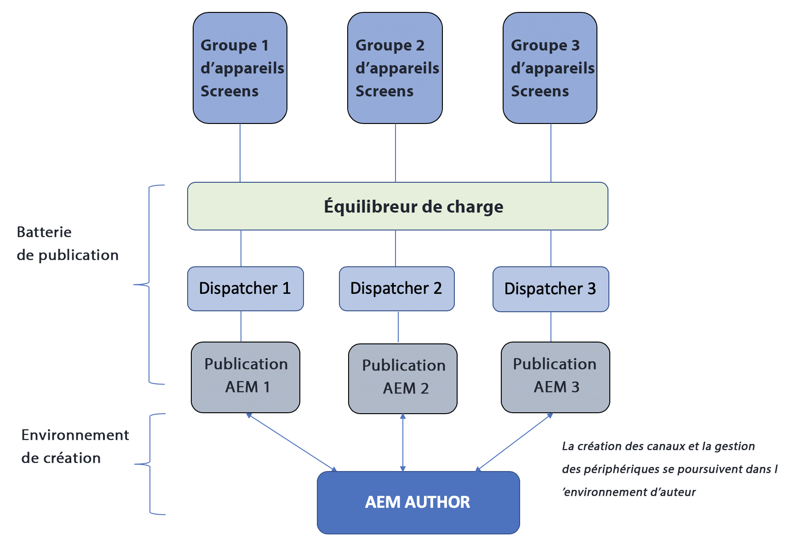
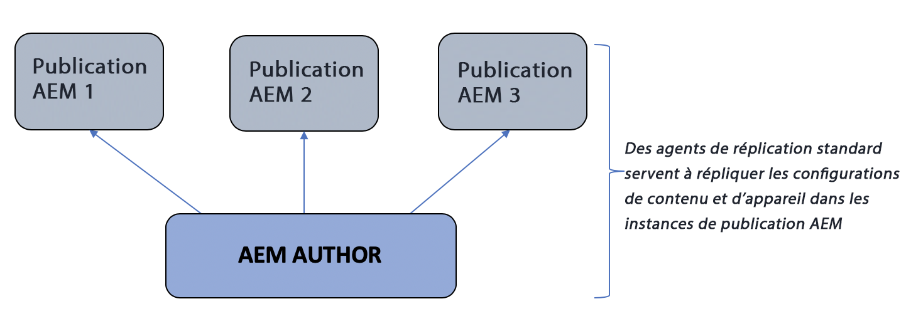
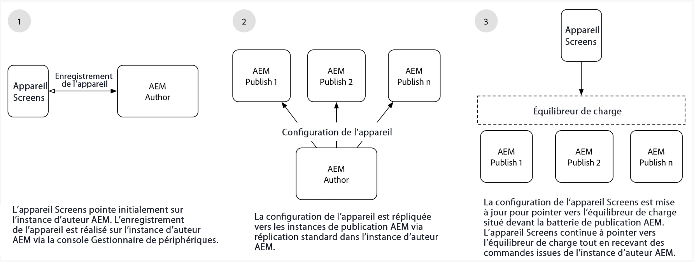

# Présentation de l’architecture de création et de publication {#author-and-publish-architectural-overview}

Cette page met l’accent sur les sujets suivants :

* **Présentation des serveurs de publication**
* **Présentation de l’architecture**
* **Processus d’enregistrement**

## Prérequis {#prerequisites}

Avant de vous familiariser avec les serveurs de création et de publication, vous devez connaître au préalable :

* **Topologie AEM**
* **Création et gestion de projet AEM Screens**
* **Processus d’enregistrement de périphérique**

>[!NOTE]
>
>Cette fonctionnalité AEM Screens n’est disponible que si vous avez installé AEM 6.4 Screens Feature Pack 2. Pour accéder à ce Feature Pack, vous devez contacter l’assistance d’Adobe et demander à y accéder. Une fois que vous disposez des autorisations nécessaires, vous pouvez le télécharger à partir de Package Share.

## Présentation {#introduction}

L’architecture d’AEM Screens ressemble à l’architecture classique d’AEM Sites. Le contenu est créé sur une instance de création AEM avant d’être répliqué sur plusieurs instances de publication. Les périphériques AEM Screens peuvent désormais se connecter à une batterie de publication AEM via l’équilibreur de charge. Plusieurs instances de publication AEM peuvent être ajoutées afin de continuer la mise à l’échelle la batterie de publication.

*Par exemple*, un auteur de contenu AEM Screens émet une commande sur le système de création d’un périphérique particulier qui est configuré pour interagir avec une batterie de publication ou un auteur de contenu AEM Screens qui obtient des informations sur les périphériques configurés pour interagir avec les fermes de publication.

Le diagramme suivant illustre les environnements de création et de publication.

## Design architectural {#architectural-design}

Il existe cinq composants architecturaux qui facilitent cette solution :

* ***Réplication du contenu*** de l’auteur à la publication pour l’affichage par les appareils

* ***Réplication inverse*** du contenu binaire, de la publication (reçu des appareils) vers l’auteur
* ***Envoi*** de commandes de l’auteur à la publication via des API REST spécifiques
* ***Messagerie*** entre les instances de publication pour synchroniser les commandes et les mises à jour des informations sur les appareils
* ***Interrogation*** par l’auteur des instances de publication pour obtenir des informations sur les appareils via des API REST spécifiques

### Réplication (transfert) du contenu et des configurations {#replication-forward-of-content-and-configurations}

Les agents de réplication standard servent à répliquer le contenu du canal, les configurations d’emplacement et les configurations de périphérique Screens. Cela permet aux auteurs de mettre à jour le contenu d’un canal et, éventuellement, de passer par un processus d’approbation avant de publier les mises à jour du canal. Un agent de réplication doit être créé pour chaque instance de publication de la batterie de publication.

Le diagramme suivant illustre le processus de réplication :

>[!NOTE]
>
>Un agent de réplication doit être créé pour chaque instance de publication de la batterie de publication.

### Agents et commandes de réplication Screens {#screens-replication-agents-and-commands}

Des agents de réplication spécifiques personnalisés Screens sont créés pour envoyer des commandes de l’instance Auteur au périphérique AEM Screens. Les instances de publication AEM servent d’intermédiaire pour transférer ces commandes au périphérique.

Cela permet aux auteurs de continuer à gérer le périphérique, par exemple d’envoyer des mises à jour au périphérique et de prendre des captures d’écran à partir de l’environnement de création. Les agents de réplication AEM Screens ont une configuration de transport personnalisée, comme les agents de réplication standard.

### Messagerie entre les instances de publication {#messaging-between-publish-instances}

Dans de nombreux cas, une commande n’est censée être envoyée à un périphérique qu’une seule fois. Toutefois, dans une architecture de publication équilibrée en charge, on ignore à quelle instance de publication le périphérique se connecte.

Par conséquent, l’instance de création envoie le message à toutes les instances de publication. Cependant, seul un message unique doit être relayé au périphérique. Pour garantir un message correct, une communication doit avoir lieu entre les instances de publication. Cela est réalisé en utilisant *Apache ActiveMQ Artemis*. Chaque instance de publication est placée dans une topologie à couplage faible à l’aide du service de découverte Sling basé sur Oak et ActiveMQ est configuré de sorte que chaque instance de publication puisse communiquer et créer une file de messages unique. Le périphérique Screens interroge la batterie de publication via l’équilibreur de charge et sélectionne la commande qui se trouve au sommet de la file.

### Réplication inverse {#reverse-replication}

Dans de nombreux cas, après une commande, on attend un certain type de réponse de la part du périphérique Screens, qui sera transmise à l’instance de création. Pour ce faire, on a recours à la ***réplication inverse*** AEM.

* Créez un agent de réplication inverse pour chaque instance de publication, semblable aux agents de réplication standard et aux agents de réplication Screens.
* Une configuration de lanceur de processus écoute les nœuds modifiés sur l’instance de publication et déclenche à son tour un processus pour placer la réponse de l’appareil dans la boîte d’envoi de l’instance de publication.
* Dans ce contexte, une réplication inverse n’est utilisée que pour les données binaires (fichiers journaux et captures d’écran, par exemple) fournies par les périphériques. Les données non binaires sont récupérées par interrogation.
* La réplication inverse interrogée à partir de l’instance de création AEM récupère la réponse et l’enregistre dans l’instance d’auteur.

### Interrogation des instances de publication {#polling-of-publish-instances}

L’instance de création doit pouvoir interroger les périphériques pour obtenir une pulsation et connaître l’état d’intégrité d’un périphérique connecté.

Les périphériques envoient un ping à l’équilibreur de charge et sont routés vers une instance de publication. L’état de l’appareil est ensuite révélé par l’instance de publication via une API de publication diffusée à l’adresse **api/screens-dcc/devices/static** pour tous les appareils actifs et **api/screens-dcc/devices/&lt;id_appareil>/status.json** pour un appareil unique.

L’instance de création interroge toutes les instances de publication et fusionne les réponses d’état du périphérique en un seul état. La tâche planifiée qui interroge l’auteur est `com.adobe.cq.screens.impl.jobs.DistributedDevicesStatiUpdateJob` et peut être configurée en se basant sur une expression cron.

## L’enregistrement {#registration}

L’enregistrement continue d’être généré sur l’instance de création AEM. Le périphérique d’AEM Screens pointe vers l’instance de création et l’enregistrement est terminé.

Une fois qu’un périphérique a été enregistré dans l’environnement de création, la configuration du périphérique et les affectations de canal/planification sont répliquées dans les instances de publication AEM. La configuration du périphérique AEM Screens est ensuite mise à jour afin de pointer vers l’équilibreur de charge situé en amont de la batterie de publication AEM. Il s’agit d’une configuration unique. Une fois que l’appareil Screens est connecté à l’environnement de publication, il peut continuer à recevoir des commandes provenant de l’environnement de création et il n’est pas nécessaire de connecter directement l’appareil Screens à l’environnement de création.

### Étapes suivantes {#the-next-steps}

Une fois que vous aurez compris la conception architecturale de la configuration de l’auteur et de la publication dans AEM Screens, reportez-vous à la section [Configuration de l’Auteur et de la Publication pour AEM Screens](author-and-publish.md) pour plus d’informations.
