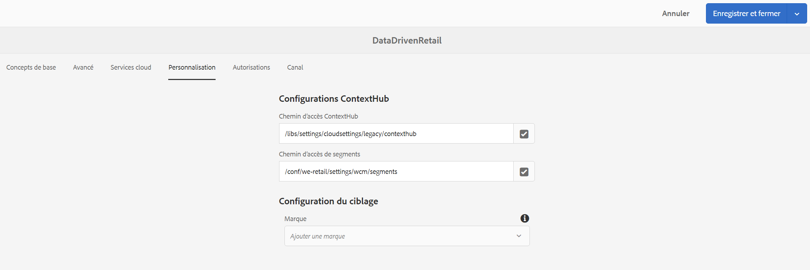
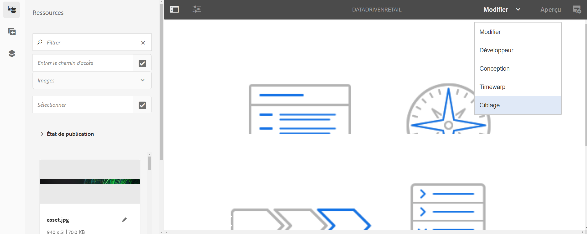

# Création avec des déclencheurs de données {#authoring-with-data-triggers}

>[!IMPORTANT]
>Ce contenu est valide pour AEM on-premise/AMS (AEM 6.5LTS et AEM 6.5). Pour le contenu AEM as a Cloud Service Screens, reportez-vous au guide [AEM as a Cloud Service](https://experienceleague.adobe.com/en/docs/experience-manager-cloud-service/content/screens-as-cloud-service/overview/introduction).

Cette section explique comment activer le ciblage dans vos canaux.

>[!IMPORTANT]
>
>La version minimale prenant en charge les triggers de données dans un canal AEM Screens est AEM 6.5.3 Feature Pack 3.

## Conditions préalables {#prereqs}

Avant de suivre les étapes ci-dessous afin d’activer le ciblage dans les canaux, apprenez les [termes clés de la configuration dans AEM Screens](configuring-context-hub.md) qui sont nécessaires pour comprendre ContextHub et le ciblage dans AEM Screens.

>[!IMPORTANT]
>
>Il est recommandé de comprendre et de définir les configurations ContextHub avant d’activer le ciblage dans un canal AEM Screens.

Suivez les liens ci-dessous pour en savoir plus :

1. **[Configuration du magasin de données](configuring-context-hub.md)**
1. **[Configuration de la segmentation de l’audience](configuring-context-hub.md)**

Après avoir suivi les étapes précédentes, vous pouvez activer le ciblage dans vos canaux.

## Présentation de la création avec des triggers de données {#author-targeting}

>[!VIDEO](https://video.tv.adobe.com/v/31921)

## Activation du ciblage dans un canal AEM Screens {#enabling-targeting}

Suivez les étapes ci-dessous pour activer le ciblage dans vos canaux.

1. Accédez à l’un des canaux AEM Screens. Les étapes suivantes montrent comment activer le ciblage à l’aide de **DataDrivenRetail** *(canal de séquence)* créé dans un canal AEM Screens.

1. Cliquez sur le canal **DataDrivenRetail**, puis sur **Propriétés** dans la barre d’actions.

   

1. Cliquez sur l’onglet **Personnalisation** pour définir les configurations ContextHub et cliquez sur le chemin ContextHub et Segments.

   1. Cliquez sur le **Chemin d’accès ContextHub** **libs** > **settings** > **cloudsettings** > **default** > **Configurations ContextHub**, puis sur **Sélectionner**.

   1. Cliquez sur le **Chemin d’accès aux segments** **conf** > **`We.Retail`**&#x200B;**settings** > **wcm** > **segments**, puis sur **Sélectionner**.

   1. Cliquez sur **Enregistrer et fermer**.

   >[!NOTE]
   >
   >Utilisez le chemin ContextHub et le chemin des segments où vous avez initialement enregistré vos segments et configurations ContextHub.

   

1. Accédez à **DataDrivenRetail** et cliquez dessus dans **DataDrivenAssets** > **Canaux**, puis cliquez sur **Modifier** dans la barre d’actions. Faites glisser les ressources et déposez-les dans votre éditeur de canal.

   >[!NOTE]
   >
   >Si vous avez tout correctement configuré, l’option **Ciblage** s’affiche dans la liste déroulante de l’éditeur, comme illustré ci-dessous.

   

1. Cliquez sur **Ciblage**.

1. Cliquez sur **Marque** et l’**Activité** dans le menu déroulant, puis sur **Commencer le ciblage**.

### En savoir plus : exemples de cas d’utilisation {#learn-more-example-use-cases}

Après avoir configuré ContextHub pour votre projet AEM Screens, vous pouvez suivre les différents cas d’utilisation pour comprendre comment les ressources déclenchées par des données jouent un rôle essentiel dans différents secteurs d’activité :

1. **[Activation ciblée du stock de vente au détail](retail-inventory-activation.md)**
1. **[Activation de la température de l’agence de voyages](local-temperature-activation.md)**
1. **[Activation de la réservation d’hébergements](hospitality-reservation-activation.md)**
