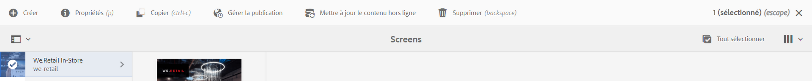

# Mise à jour hors ligne en bloc {#bulk-offline-update}

Cette section traite des sujets suivants sur la Mise à jour hors ligne en bloc :

* **Présentation**
* **Utilisation de la mise à jour hors ligne en bloc**

<!-- OBSOLETE VERSIONS
>[!CAUTION]
>
>This AEM Screens functionality is only available, if you have installed AEM 6.3 Feature Pack 3 or AEM 6.4 Screens Feature Pack 1.
>
>To get access to this Feature Pack, contact Adobe Support and request access. When you have permissions you can download it from Package Share. -->

## Vue d’ensemble {#overview}

La fonction Mise à jour hors ligne en bloc vous permet de mettre à jour tous les canaux en bloc. Cela évite d’avoir à naviguer vers un canal particulier pour en mettre à jour le contenu. Vous pouvez plutôt mettre à jour tout le contenu des canaux d’un projet spécifique en un seul instant.

Vous pouvez également planifier cette activité pour une période de trafic réseau plus faible.

>[!NOTE]
>
>La fonction Mise à jour hors ligne en bloc est optimisée de manière à ne mettre à jour que les canaux qui ont été modifiés.

## Utilisation de la mise à jour hors ligne en bloc {#using-bulk-offline-update}

Vous pouvez manuellement utiliser la mise à jour hors ligne en masse à partir de l’interface d’utilisation ou programmer la mise à jour en masse à partir des services OSGi.

### Utilisation de l’interface utilisateur d’AEM Screens {#using-aem-screens-user-interface}

Suivez les étapes ci-dessous pour utiliser la mise à jour hors ligne en bloc pour un projet AEM Screens :

1. Accédez à votre projet AEM Screens.
1. Cliquez sur le projet, puis sur **Mettre à jour le contenu hors ligne** dans la barre d’actions pour mettre manuellement à jour le contenu du canal.

   

### Configuration de la console Web d’Adobe Experience Manager {#adobe-experience-manager-web-console-configuration}

Suivez les étapes ci-dessous pour utiliser la mise à jour hors ligne en bloc pour un projet AEM Screens :

1. Configuration de la console Web d’Adobe Experience Manager.
1. Recherchez des services de mise à jour hors ligne en masse.

   

1. Ajoutez les propriétés suivantes :

   **Chemin du projet** Spécifiez le chemin d’accès de votre projet AEM Screens. Le chemin est habituellement `/content/screens/<Name of your project>`.

   *Par exemple*, `/content/screens/we-retail`. Vous pouvez trouver ce chemin dans l’URL en sélectionnant un projet sous AEM Screens (ne cliquez pas sur l’icône).

   >[!NOTE]
   >
   >Spécifiez le chemin du projet par rapport à votre canal.

   **Fréquence de planning** Indiquez une heure, par exemple, 17 h 00, à laquelle ce service doit mettre à jour le contenu hors ligne.

1. Cliquez sur **Enregistrer** pour enregistrer vos paramètres. Votre contenu est mis à jour à l’heure spécifiée.
