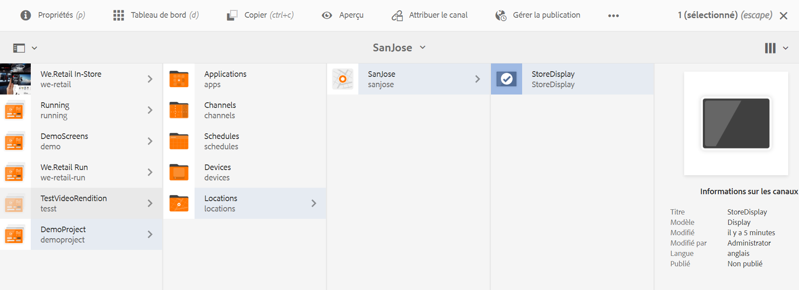

# Attribution de canaux {#channel-assignment}

Une fois que vous définissez un affichage, vous devez affecter un canal à un affichage.

Cette page montre l&#39;affectation d&#39;un canal à votre affichage.

>[!NOTE]
>Vous pouvez attribuer plusieurs canaux à un affichage.

## Attribution d’un canal {#assign-a-channel}

Suivez les étapes ci-dessous pour attribuer un canal à un affichage :

>[!IMPORTANT]
>
>La boîte de dialogue suivante pour l’affectation de canal est différente pour la version du Pack de fonctionnalités d’Adobe Experience 6.5.5 Screens et versions ultérieures. Pour plus d&#39;informations, reportez-vous à la section Affectation [de](/help/user-guide/channel-assignment.md#assign-a-channel-new-release) Canal.

1. Accédez à l’affichage requis, par exemple, **DemoProject** --> **Emplacements** --> **SanJose** --> **StoreDisplay**.

   

1. Appuyez/cliquez sur **Attribuer le canal** dans la barre d’actions

   Ou,

   Appuyez/cliquez sur **Tableau de bord** et cliquez sur **+Attribuer le canal** dans le panneau **CANAUX ATTRIBUÉS** pour ouvrir la boîte de dialogue **Attribution des canaux**.

   

   You can configure the properties from the **Channel Assignment** dialog box from the section below. Consultez la section Propriétés [du](#channel-properties) Canal pour en savoir plus sur les propriétés du canal.

## Attribution d&#39;un Canal pour AEM version 6.5.5 Feature Pack des écrans {#assign-a-channel-new-release}

Suivez les étapes ci-dessous pour attribuer un canal à un affichage :

1. Accédez à l’affichage requis, par exemple, **DemoProject** --> **Emplacements** --> **SanJose** --> **StoreDisplay**.

1. Tap/click **Assign Channel** from the action bar

   Ou,

   Tap/click **Dashboard** and click **+Assign Channel** from the **ASSIGNED CHANNNELS &amp; SCHEDULES** panel to open the **Channel Assignment** dialog box.

1. Dans l’option Paramètre, vous pouvez choisir le canal par chemin ou par nom, entrer le rôle de canal, la priorité, les Événements pris en charge.

   >[!NOTE]
   >Consultez la section Propriétés [du](#channel-properties) Canal pour en savoir plus sur les propriétés du canal.

1. Dans l&#39;option **Planifications** , sélectionnez le fuseau horaire de **référence, la fenêtre****d&#39;Activation et le calendrier de** **répétition.**

1. Cliquez sur **Enregistrer** une fois que vous avez configuré vos préférences.

### Présentation des propriétés des canaux à partir de l’attribution de canaux {#channel-properties}

#### Canal de référence {#ref-channel}

Le canal de référence vous permet de fournir une référence pour le canal souhaité, en utilisant soit le nom, soit le chemin du canal.

* **Par chemin** : vous fournissez une référence explicite à l’aide du chemin absolu du canal.

* **Par nom** : vous saisissez le nom du canal, qui désignera un canal réel en fonction du contexte. Cette fonction vous permet de créer la version locale d’un canal pour diffuser dynamiquement le contenu spécifique à un emplacement. Par exemple, un canal portant le nom *offres du jour*, dont le contenu serait différent dans deux villes, mais avec le même rôle de canal sur tous les affichages.

#### Rôle du canal {#role-channel}

Le rôle du canal définit le contexte de l’affichage. Le rôle est ciblé par diverses actions ; il est indépendant du canal qui remplit le rôle.

#### Priorité {#priority-channel}

La priorité est utilisée pour contrôler les attributions au cas où plusieurs d’entre elles correspondent aux critères de lecture. Celle présentant la valeur la plus élevée est toujours prioritaire par rapport aux valeurs plus faibles. Par exemple, s’il existe deux canaux A et B, A ayant une priorité de 1 et B une priorité de 2, alors le canal B est affiché, car il présente une priorité supérieure à celle de A.

>[!NOTE]
>La priorité d’un canal est définie sous forme numérique (1 au minimum) dans la boîte de dialogue **Attribution de canaux**, comme indiqué ci-dessus. En outre, les canaux attribués sont triés par ordre de priorité descendante.

#### Événements pris en charge {#supported-events-channel}

* **Chargement initial** : charge le canal lorsque le lecteur démarre. Il peut être attribué à plusieurs canaux en combinaison avec la planification.
* **Écran inactif** : se charge lorsque l’écran est inactif. Il peut être attribué à plusieurs canaux en combinaison avec la planification.
* **Minuteur** : il doit être défini lorsqu’une planification est fournie.
* **Interaction de l’utilisateur** : le lecteur passera au canal spécifié s’il existe une interaction de l’utilisateur sur l’écran (tactile) dans un canal inactif et se chargera en cas de pression sur l’écran.

#### Méthode d’interruption {#interruption-method-channel}

>[!IMPORTANT]
>
> Cette option est disponible uniquement avec AEM 6.4 Feature Pack 8 ou AEM 6.5 Feature Pack 4.

En tant qu’auteur de contenu, vous devez être en mesure de spécifier le moment où un canal est interrompu, de sorte que vous puissiez choisir de couper le contenu non essentiel, tout en ayant la possibilité de lire intégralement le contenu important avant de l’interrompre en raison de la planification.

Sélectionnez l’une des options suivantes disponibles pour définir la méthode d’interruption dans la boîte de dialogue **Attribution de canaux** :

* **Immédiatement** : chaque fois que la planification est activée ou qu’une mise à jour est reçue, vous pouvez interrompre la lecture et immédiatement actualiser ou lire le nouveau contenu.
* **À la fin de l’élément actuel** : lorsqu’une nouvelle planification est activée ou qu’une mise à jour est reçue, vous avez la possibilité d’attendre la fin de la lecture de l’élément en cours dans la séquence avant d’actualiser ou de lire le nouveau contenu.
   >[!NOTE]
   >Cette option est sélectionnée par défaut.
* **À la fin de la séquence** : lorsqu’une nouvelle planification est activée ou qu’une mise à jour est reçue, vous avez la possibilité d’attendre que la séquence entière se termine. Juste avant la séquence souhaitée, vous revenez sur le premier élément, actualisez ou lisez le nouveau contenu.

   >[!NOTE]
   >L’utilisation de la deuxième ou de la troisième option peut entraîner un léger report des heures de planification définies au niveau de l’attribution, car le lecteur attend la fin de l’élément ou de la séquence (après l’heure spécifiée) avant de procéder à l’actualisation. Le délai dépend de la durée de lecture de l’élément.

#### Planification {#schedule-channel}

La planification vous permet de décrire sous forme de texte le moment où le canal doit apparaître. Elle vous permet également de définir une date de début (**actif à partir de**) et une date de fin (**actif jusqu’à**) pour l’affichage du canal.

**Afficher l’info-bulle d’attraction** :

Afficher l’info-bulle d’attraction définit si l’info-bulle d’attraction (« *Appuyez n’importe où pour commencer* ») doit être affichée ou non lorsque le canal est en cours d’exécution.

### Partage de journée {#dayparting}

Schedules when combined with **Day-parting**, allows you to set a global schedule with multiple channels running at specific times of the day, and re-use that setup for all your displays at once.

Les tranches horaires consistent à fractionner une journée en tranches horaires et à indiquer quel contenu diffuser à l’heure désirée. aem screens vous permet de planifier des canaux en termes de partage de journée au cours d’une journée, d’une semaine ou d’un mois, selon vos besoins.

Les exemples suivants expliquent le partage de journée dans trois scénarios différents :

#### Diffusion du contenu au cours d’une même journée divisée en plusieurs tranches horaires   {#playing-content-on-a-single-day-divided-into-multiple-time-slots}

Cet exemple montre comment un restaurant utilise la journée pour présenter son menu de petit-déjeuner, déjeuner et dîner.

Nous diviserons chaque jour en trois tranches horaires, de sorte que le contenu du canal soit diffusé en fonction de l’heure spécifiée :

| **Canal** | **Rôle** | **Priorité** | **Planification** |
|---|---|---|---|
| Menu_A | Petit déjeuner |  | après 6h00 et avant 11h00 |
| Menu_B | Déjeuner |  | après 11h00 et avant 15h00 |
| Menu_C | Dîner |  | après 15h00 et avant 20h00 |

#### Diffusion du contenu pendant un jour donné de la semaine {#playing-content-on-a-particular-day-of-the-week}

Cet exemple présente les tranches horaires suivies dans un casino où un événement se produit en direct chaque week-end à partir de 20 h et jusqu’à 22 h, et les plats du jour sont disponibles pour le menu du dîner après 22 h et jusqu’à 1 h du matin.

<table>
 <tbody>
  <tr>
   <td><strong>Canal</strong></td>
   <td><strong>Rôle</strong></td>
   <td><strong>Priorité</strong></td>
   <td><strong>Planification</strong></td>
  </tr>
  <tr>
   <td>LiveConcert</td>
   <td>Weekend</td>
   <td> </td>
   <td>21 octobre 2017 - 22 octobre 2017   après 20:00 avant 22:00</td>
  </tr>
  <tr>
   <td>SpecialsDinner</td>
   <td>Weekend</td>
   <td> </td>
   <td>21 octobre 2017 - 22 octobre 2017   après 22:00 avant 01:00</td>
  </tr>
 </tbody>
</table>

#### Diffusion du contenu pendant un ou plusieurs mois particuliers {#playing-content-for-a-particular-month-months}

Cet exemple montre la répartition des heures d&#39;une boutique qui affiche sa collection d&#39;été des mois de juin à août et la collection d&#39;automne de septembre à fin octobre.

Ici, vous créez des heures de diffusion par mois, de sorte que le contenu du canal soit lu selon les mois de l’année spécifiés.

| **Canal** | **Rôle** | **Priorité** | **Planification** |
|---|---|---|---|
| SummerCollection | Été |  | 1er juin 2017 - 31 août 2017 |
| FallCollection | Automne |  | 1er septembre 2017 - 30 octobre 2017 |

>[!NOTE]
>
>En outre, vous pouvez définir la ***priorité*** de chacun des canaux. Par exemple, si deux canaux sont définis sur le même jour et la même heure, ou sur le même mois, alors le canal qui possède la priorité supérieure est diffusé en premier. La valeur de priorité minimale est de 0.

#### Diffusion de contenu pour les canaux ayant la même priorité   {#playing-content-for-channels-with-same-priority}

Cet exemple montre la répartition des heures d&#39;une boutique qui affiche sa collection d&#39;hiver selon le même calendrier pour le mois de décembre. Toutefois, puisque la priorité du canal B est définie sur 2 au cours de cette semaine, c&#39;est son contenu qui est diffusé plutôt que celui du canal A.

| **Canal** | **Rôle** | **Priorité** | **Planification** |
|---|---|---|---|
| A | Hiver | 1 | 1er décembre 2017 - 31 décembre 2017 |
| B | Noël | 2 | 24 décembre 2017 - 31 décembre 2017 |

>[!IMPORTANT]
>
> Pour en savoir plus sur les heures de diffusion, consultez les sections ci-dessous :
>
>* [Gestion de la périodicité pour les ressources](https://docs.adobe.com/content/help/fr-FR/experience-manager-screens/user-guide/authoring/product-features/asset-level-scheduling.html#handling-recurrence-in-assets)
>* [Gestion de la périodicité des ressources dans un canal](https://docs.adobe.com/content/help/fr-FR/experience-manager-screens/user-guide/authoring/product-features/channel-level-activation.html#handling-recurrence-in-assets)

