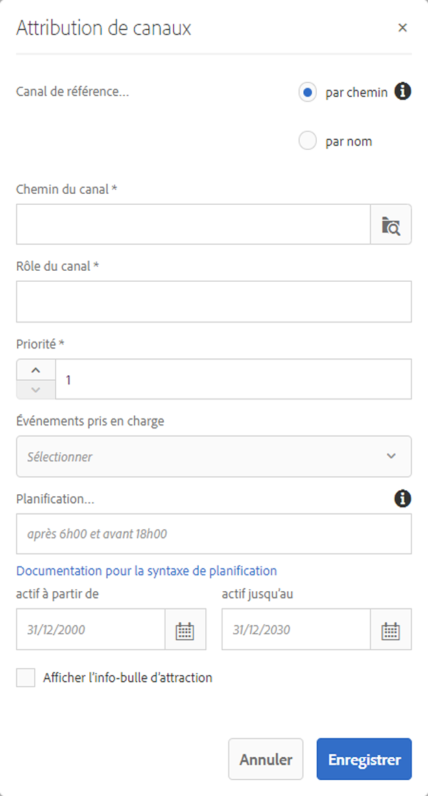

# Attribution de canaux {#channel-assignment}

Cette section couvre les sujets suivants :

* **Attribution d’un canal**
* **Présentation des propriétés de la boîte de dialogue Attribution de canaux**
* **Créneaux horaires**

Une fois que vous avez défini un affichage, vous devez lui attribuer un canal.

Cette page vous explique comment attribuer un canal à vos affichages.

**Conditions préalables** :

* [Configuration et déploiement de Screens](configuring-screens-introduction.md)
* [Création et gestion de projet Screens](creating-a-screens-project.md)
* [Création et gestion des canaux](managing-channels.md)
* [Création et gestion des emplacements](managing-locations.md)
* [Création et gestion des affichages](managing-displays.md)

## Attribution d’un canal {#assign-a-channel}

Suivez les étapes ci-dessous pour attribuer un canal à un affichage :

1. Accédez à l’affichage requis, par exemple, **DemoProject** --> **Emplacements** --> **SanJose** --> **StoreDisplay**.

   

1. Appuyez/cliquez sur **Attribuer le canal **dans la barre d’actions

   Ou,

   Appuyez/cliquez sur **Tableau de bord** et cliquez sur **+Attribuer le canal** dans le panneau **CANAUX ATTRIBUÉS** pour ouvrir la boîte de dialogue **Attribution des canaux**.

   

   Vous pouvez configurer les propriétés suivantes dans la boîte de dialogue **Attribution des canaux** :

   **Rôle du canal** :

   Le rôle du canal définit le contexte de l’affichage. Le rôle est ciblé par diverses actions ; il est indépendant du canal qui remplit le rôle.

   **Canal de référence** :

   Le canal de référence vous permet de fournir une référence pour le canal souhaité, en utilisant soit le nom, soit le chemin du canal.

   * **Par chemin** : vous fournissez une référence explicite à l’aide du chemin absolu du canal.
   * **Par nom** : vous saisissez le nom du canal, qui désignera un canal réel en fonction du contexte. Cette fonction vous permet de créer la version locale d’un canal pour diffuser dynamiquement le contenu spécifique à un emplacement. Par exemple, un canal portant le nom *offres du jour*, dont le contenu serait différent dans deux villes, mais avec le même rôle de canal sur tous les affichages.
   **Priorité :**

   La priorité est utilisée pour contrôler les attributions au cas où plusieurs d’entre elles correspondent aux critères de lecture. Celle présentant la valeur la plus élevée est toujours prioritaire par rapport aux valeurs plus faibles. Par exemple, s’il existe deux canaux A et B, A ayant une priorité de 1 et B une priorité de 2, alors le canal B est affiché, car il présente une priorité supérieure à celle de A.

   La priorité d’un canal est définie sous forme numérique (1 au minimum) dans la boîte de dialogue **Attribution de canaux**, comme indiqué ci-dessus. En outre, les canaux attribués sont triés par ordre de priorité décroissante.

   **Événements pris en charge** :

   * **Chargement initial** : charge le canal lorsque le lecteur démarre. Il peut être attribué à plusieurs canaux en combinaison avec la planification.
   * **Écran inactif** : se charge lorsque l’écran est inactif. Il peut être attribué à plusieurs canaux en combinaison avec la planification.
   * **Minuteur** : il doit être défini lorsqu’une planification est fournie.
   * **Interaction de l’utilisateur** : le lecteur passera au canal spécifié s’il existe une interaction de l’utilisateur sur l’écran (tactile) dans un canal inactif et se chargera en cas de pression sur l’écran.
   **Planification** :

   La planification vous permet de fournir une description textuelle lorsque le canal doit apparaître. Elle vous permet également de définir une date de début (**Actif à partir de**) et une date de fin (**Actif jusqu’à**) pour l’affichage du canal. La syntaxe de l’expression de planification est basée sur le texte de later.js et la syntaxe cron :

   * [https://bunkat.github.io/later/parsers.html#text](https://bunkat.github.io/later/parsers.html#text)
   * [https://bunkat.github.io/later/parsers.html#cron](https://bunkat.github.io/later/parsers.html#cron)
   **Afficher l’info-bulle d’attraction** :

   Afficher l’info-bulle d’attraction définit si l’info-bulle d’attraction (« *Appuyez n’importe où pour commencer* ») doit être affichée ou non lorsque le canal est en cours d’exécution.

1. Cliquez sur **Enregistrer** pour attribuer le canal créé à un affichage.

### Créneaux horaires      {#dayparting}

Lorsqu’elles sont combinées avec des **créneaux horaires**, les planifications vous permettent de définir une planification globale avec plusieurs canaux qui s’exécutent à des moments spécifiques de la journée, et de réutiliser cette configuration pour tous vos affichages simultanément.

Les créneaux horaires consistent à fractionner une journée en tranches horaires et à indiquer quel contenu diffuser à l’heure désirée. AEM Screens vous permet de planifier des canaux en termes de créneaux horaires au cours d’une journée, d’une semaine ou d’un mois en fonction des besoins.

Les exemples suivants présentent les créneaux horaires dans les canaux selon trois scénarios différents :

#### Diffusion du contenu au cours d’une même journée divisée en plusieurs créneaux horaires      {#playing-content-on-a-single-day-divided-into-multiple-time-slots}

Cet exemple illustre la façon dont un restaurant utilise les créneaux horaires pour afficher le menu du petit-déjeuner, du déjeuner et du dîner.

Nous diviserons chaque jour en trois créneaux horaires, de sorte que le contenu du canal soit diffusé en fonction de l’heure spécifiée :

| **Canal** | **Rôle** | **Priorité** | **Planification** |
|---|---|---|---|
| Menu_A | Petit déjeuner |  | après 6h00 et avant 11h00 |
| Menu_B | Déjeuner |  | après 11h00 et avant 15h00 |
| Menu_C | Dîner |  | après 15h00 et avant 20h00 |

#### Diffusion du contenu pendant un jour donné de la semaine {#playing-content-on-a-particular-day-of-the-week}

Cet exemple présente les créneaux horaires suivis dans un casino où un événement se produit en direct chaque week-end à partir de 20 h et jusqu’à 22 h, et les plats du jour sont disponibles pour le menu du dîner après 22 h et jusqu’à 1 h du matin.

<table>
 <tbody>
  <tr>
   <td><strong>Canal</strong></td>
   <td><strong>Rôle</strong></td>
   <td><strong>Priorité</strong></td>
   <td><strong>Planification</strong></td>
  </tr>
  <tr>
   <td>LiveConcert</td>
   <td>Weekend</td>
   <td> </td>
   <td>21 octobre 2017 - 22 octobre 2017   après 20:00 avant 22:00</td>
  </tr>
  <tr>
   <td>SpecialsDinner</td>
   <td>Weekend</td>
   <td> </td>
   <td>21 octobre 2017 - 22 octobre 2017   après 22:00 avant 01:00</td>
  </tr>
 </tbody>
</table>

#### Diffusion du contenu pendant un ou plusieurs mois particuliers {#playing-content-for-a-particular-month-months}

Cet exemple présente les créneaux horaires d’un magasin qui affiche sa collection d’été de juin à août, et sa collection d’automne de septembre à fin octobre.

Vous allez créer des créneaux horaires selon les mois, de sorte que le contenu du canal soit diffusé pendant les mois de l’année spécifiés.

| **Canal** | **Rôle** | **Priorité** | **Planification** |
|---|---|---|---|
| SummerCollection | Été |  | 1er juin 2017 - 31 août 2017 |
| FallCollection | Automne |  | 1er septembre 2017 - 30 octobre 2017 |

>[!NOTE]
>
>En outre, vous pouvez définir la ***priorité&#x200B;***de chacun des canaux. Par exemple, si deux canaux sont définis sur le même jour et la même heure, ou sur le même mois, alors le canal qui possède la priorité supérieure est diffusé en premier. La valeur de priorité minimale est de 0.

#### Diffusion de contenu pour les canaux ayant la même priorité      {#playing-content-for-channels-with-same-priority}

Cet exemple présente les créneaux horaires d’un magasin qui affiche sa collection d’hiver avec la même planification pendant le mois décembre. Toutefois, puisque la priorité du canal B est définie sur 2 au cours de cette semaine, c&#39;est son contenu qui est diffusé plutôt que celui du canal A.

| **Canal** | **Rôle** | **Priorité** | **Planification** |
|---|---|---|---|
| A | Hiver | 1 | 1er décembre 2017 - 31 décembre 2017 |
| B | Noël | 2 | 24 décembre 2017 - 31 décembre 2017 |

