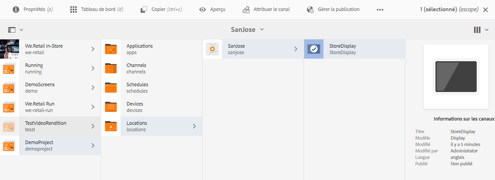

# Attribution de canaux {#channel-assignment}

>[!IMPORTANT]
>Cette section décrit l’attribution et la planification des canaux pour les packs de fonctionnalités antérieurs à la version AEM 6.5.5 Screens.

Lorsque que vous avez configuré un affichage, attribuez-lui un canal pour afficher votre contenu.

Cette page explique comment attribuer un canal à votre affichage.

>[!NOTE]
>Vous pouvez attribuer plusieurs canaux à un affichage.

## Attribution d’un canal {#assign-a-channel}

Pour attribuer un canal à un affichage, procédez comme suit :

1. Accédez à l’affichage requis, par exemple, **DemoProject** > **Emplacements** > **SanJose** > **StoreDisplay**.

   

1. Cliquez sur **Attribuer le canal** dans la barre d’actions.

   ou

   cliquez sur **Tableau de bord** et sur **+Attribuer le canal** dans le panneau **CANAUX ATTRIBUÉS** pour pouvoir ouvrir la boîte de dialogue **Attribution des canaux**.

   

   Vous pouvez configurer les propriétés à partir de la boîte de dialogue **Attribution de canaux** en suivant la section ci-dessous. Voir la section [Propriétés des canaux](#channel-properties) pour plus d’informations sur les propriétés des canaux.

## Présentation des propriétés des canaux à partir de l’attribution de canaux {#channel-properties}

### Canal de référence {#ref-channel}

Le canal de référence vous permet de fournir une référence pour le canal souhaité, en utilisant soit le nom, soit le chemin du canal.

* **Par chemin** : vous fournissez une référence explicite à l’aide du chemin absolu du canal.

* **Par nom** : vous saisissez le nom du canal, qui désigne un canal réel en fonction du contexte. Cette fonctionnalité vous permet de créer une version locale d’un canal pour diffuser dynamiquement le contenu spécifique à un emplacement. Par exemple, un canal portant le nom *offres du jour*, dont le contenu serait différent dans deux villes, mais avec le même rôle de canal sur tous les affichages.

### Rôle du canal {#role-channel}

Le rôle du canal définit le contexte de l’affichage. Le rôle cible diverses actions ; il est indépendant du canal qui remplit le rôle.

### Priorité {#priority-channel}

La priorité est utilisée pour contrôler les attributions au cas où plusieurs d’entre elles correspondent aux critères de lecture. Celle présentant la valeur la plus élevée est toujours prioritaire par rapport aux valeurs plus faibles. Par exemple, s’il y a deux canaux A et B. A a une priorité de 1 et B a une priorité de 2, puis le canal B est affiché, car il a une priorité plus élevée que A.

>[!NOTE]
>La priorité d’un canal est définie sous forme numérique (1 au minimum) dans la boîte de dialogue **Attribution de canaux**, comme indiqué ci-dessus. Les canaux attribués sont également triés par ordre de priorité décroissante.

### Événements pris en charge {#supported-events-channel}

* **Charge initiale** : charge le canal au démarrage du lecteur. Il peut être attribué à plusieurs canaux avec un planning.
* **Écran inactif** : se charge lorsque l’écran est inactif. Il peut être attribué à plusieurs canaux avec un planning.
* **Retardateur** : doit être défini lorsqu’un planning est fourni.
* **Interaction de l’utilisateur ou l’utilisatrice** : le lecteur bascule vers le canal spécifié s’il y a une interaction de l’utilisateur ou de l’utilisatrice avec l’écran (tactile) dans un canal inactif et se charge lorsque l’écran est touché.

### Méthode d’interruption {#interruption-method-channel}

>[!IMPORTANT]
>
> Cette option est disponible uniquement avec <!--AEM 6.4 Feature Pack 8 or -->le pack de fonctionnalités 4 d’AEM 6.5.

En tant que personne chargée de créer du contenu, vous pouvez spécifier le moment où un canal est interrompu. Cette action vous permet d’interrompre le contenu non essentiel si vous le souhaitez, mais aussi de lire le contenu important entièrement avant de l’interrompre en raison de la planification.

Cliquez sur l’une des options suivantes disponibles pour définir la méthode d’interruption dans la boîte de dialogue **Attribution de canaux** :

* **Immédiatement** : chaque fois que le planning est activé ou qu’une mise à jour est reçue, vous pouvez interrompre la lecture et immédiatement actualiser ou lire le nouveau contenu.
* **À la fin de l’élément actif** : lorsqu’un nouveau planning est activé ou qu’une mise à jour est reçue, vous pouvez éventuellement attendre la fin de la lecture de l’élément actuel dans la séquence. Ce n’est qu’après cela que vous pouvez actualiser ou lire le nouveau contenu.

  >[!NOTE]
  >Cette option est sélectionnée par défaut.
* **À la fin de la séquence** : lorsqu’un nouveau planning est activé ou qu’une mise à jour est reçue, vous pouvez éventuellement attendre que la séquence entière arrive à sa fin. Ensuite, juste avant la séquence souhaitée, vous pouvez revenir au premier élément, l’actualiser ou lire le nouveau contenu.

  >[!NOTE]
  >L’utilisation de la deuxième ou de la troisième option peut entraîner un léger report des heures de planning définies dans l’affectation. Cela est dû au fait que le lecteur attend la fin de l’élément ou de la séquence (après l’heure spécifiée) avant de procéder à l’actualisation. Le délai dépend de la durée de lecture de l’élément.

### Planning {#schedule-channel}

Le planning vous permet de décrire sous forme de texte le moment où le canal doit apparaître. Il vous permet également de définir une date de début (**Actif à partir de**) et une date de fin (**Actif jusqu’à**) pour l’affichage du canal.

**Afficher l’info-bulle d’attraction**

Afficher l’info-bulle d’attraction définit si l’info-bulle d’attraction (« *Appuyez n’importe où pour commencer.* ») doit s’afficher ou non pendant l’exécution du canal.

### Tranches horaires {#dayparting}

Lorsqu’ils sont combinés avec des **tranches horaires**, les plannings permettent de définir une planification globale avec plusieurs canaux qui s’exécutent à des moments spécifiques de la journée et de réutiliser cette configuration pour tous vos affichages simultanément.

On appelle Partage de jours le fractionnement d’une journée en intervalles de temps et la spécification du contenu lu à l’heure souhaitée. AEM Screens vous permet de planifier des canaux en termes de tranches horaires au cours d’une journée, d’une semaine ou d’un mois en fonction des besoins.

Les exemples suivants présentent les tranches horaires dans les canaux selon trois scénarios différents :

#### Diffusion du contenu au cours d’une même journée divisée en plusieurs tranches horaires {#playing-content-on-a-single-day-divided-into-multiple-time-slots}

Cet exemple illustre la façon dont un restaurant utilise les tranches horaires pour afficher le menu du petit déjeuner, du déjeuner et du dîner.

Vous divisez chaque jour en trois tranches horaires, de sorte que le contenu du canal soit diffusé en fonction de l’heure spécifiée :

| **Canal** | **Rôle** | **Priorité** | **Planification** |
|---|---|---|---|
| Menu_A | Petit déjeuner |  | Après 6:00 et avant 11:00 |
| Menu_B | Déjeuner |  | Après 11 :00 et avant 15 :00 |
| Menu_C | Dîner |  | Après 15 :00 et avant 20 :00 |

#### Diffusion du contenu pendant un jour donné de la semaine {#playing-content-on-a-particular-day-of-the-week}

Cet exemple montre le dayParting réalisé dans un casino où un événement en direct se produit chaque week-end de 20:00h à 22:00 et des plats spéciaux sont disponibles pour le menu du dîner après 22:00 jusqu’à 13:00.

<table>
 <tbody>
  <tr>
   <td><strong>Canal</strong></td>
   <td><strong>Rôle</strong></td>
   <td><strong>Priorité</strong></td>
   <td><strong>Planning</strong></td>
  </tr>
  <tr>
   <td>LiveConcert</td>
   <td>Week-end</td>
   <td> </td>
   <td>21 octobre 2017 - 22 octobre 2017   après 20 h 00 avant 22 h 00</td>
  </tr>
  <tr>
   <td>SpecialsDinner</td>
   <td>Week-end</td>
   <td> </td>
   <td>21 octobre 2017 - 22 octobre 2017   après 22 h 00 avant 1 h 00</td>
  </tr>
 </tbody>
</table>

#### Diffusion du contenu pendant un ou plusieurs mois particuliers {#playing-content-for-a-particular-month-months}

Cet exemple présente les tranches horaires d’un magasin qui affiche sa collection d’été de juin à août, et sa collection d’automne de septembre à fin octobre.

Vous créez des tranches horaires selon le mois, de sorte que le contenu du canal soit diffusé pendant les mois de l’année spécifiés.

| **Canal** | **Rôle** | **Priorité** | **Planification** |
|---|---|---|---|
| SummerCollection | Été |  | 1er juin 2017 - 31 août 2017 |
| FallCollection | Automne |  | 1er septembre 2017 - 30 octobre 2017 |

>[!NOTE]
>
>Vous pouvez également définir la ***priorité*** de chacun des canaux. Par exemple, si deux canaux sont définis sur le même jour et la même heure, ou sur le même mois, alors le canal qui possède la priorité supérieure est diffusé en premier. La valeur minimale de priorité peut être définie sur 0.

#### Diffusion de contenu pour les canaux ayant la même priorité {#playing-content-for-channels-with-same-priority}

Cet exemple présente les tranches horaires d’un magasin qui affiche sa collection d’hiver selon le même planning pendant le mois de décembre. Toutefois, puisque la priorité du canal B est définie sur 2 au cours de cette semaine, c’est son contenu qui est diffusé plutôt que celui du canal A.

| **Canal** | **Rôle** | **Priorité** | **Planification** |
|---|---|---|---|
| A | Hiver | 1 | 1er décembre 2017 - 31 décembre 2017 |
| B | Noël | 2 | 24 décembre 2017 - 31 décembre 2017 |

>[!NOTE]
>
> Pour en savoir plus sur les tranches horaires, consultez les sections suivantes :
>
>* [Gestion de la périodicité pour les ressources](https://experienceleague.adobe.com/fr/docs/experience-manager-screens/user-guide/authoring/product-features/asset-level-scheduling)
>* [Gestion de la périodicité des ressources dans un canal](https://experienceleague.adobe.com/fr/docs/experience-manager-screens/user-guide/authoring/product-features/channel-level-activation)
