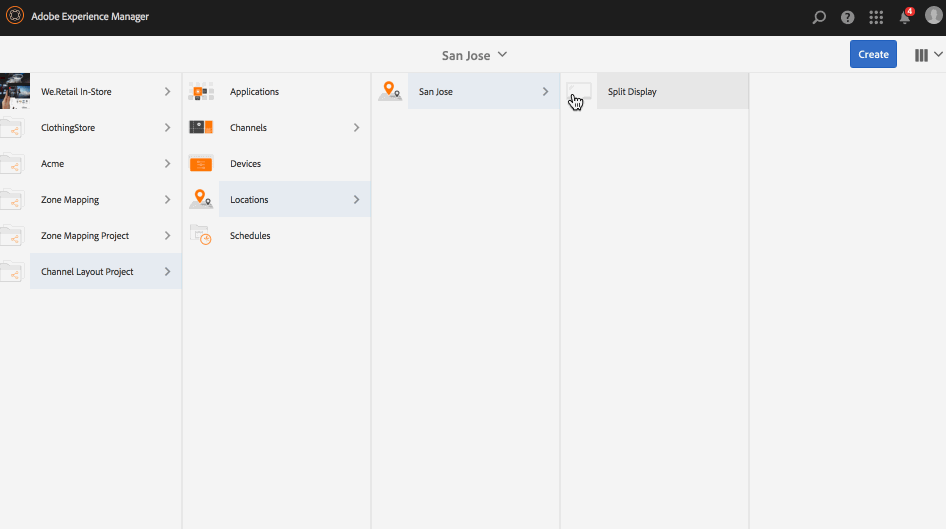

# Éditeur de mise en page de canal {#channel-layout-editor}

***L’éditeur de mise en page de canal*** permet de créer du contenu multizone et d’utiliser une variété de ressources telles que des vidéos, des images et du texte, qui peuvent être regroupées en un seul écran de manière contextuelle. Vous pouvez importer des images, des vidéos et du texte, et les mélanger de façon à créer une expérience numérique intuitive et interactive.

En fonction des exigences du projet, vous avez parfois besoin de plusieurs zones au sein d’un canal et de les modifier comme une unité entière. Par exemple, une séquence de produits avec un flux de réseaux sociaux associé qui s’exécute dans trois zones distinctes sur un seul canal.

## Présentation {#overview}

Lors de la création d’un canal, vous pouvez utiliser des modèles différents afin de créer des zones dans votre canal. Vous pouvez ajouter une image, une vidéo ou un canal incorporé de façon à exploiter le contenu en fonction des exigences du projet.

### Description du cas d’utilisation {#use-case-description}

Le cas d’utilisation suivant présente la création de zones multiples dans un canal.

1. ***Création d’un projet Screens***

   1. Sélectionnez le lien Adobe Experience Manager (en haut à gauche), puis **Screens**. Alternatively, you can go directly to: `http://localhost:4502/screens.html/content/screens`.
   1. Click **Create** to create a new Screens project.
   1. Sélectionnez **Screens** à partir de l’assistant **Créer un projet Screens**, puis cliquez sur **Suivant**.
   1. Enter the title as **Channel Layout Project** and click **Create**.
   

1. ***Création d’un canal***

   1. Navigate to **Channel Layout Project**.
   1. Cliquez sur **Créer** dans la barre d’actions. Un assistant s’ouvre.
   1. Choose the **1x2 Split Screen Channel** and click **Next**.
   1. Enter the **Title** as **Split horizontal** and click **Create**.
   

1. ***Ajout de contenu à votre canal***

   1. Navigate to the **Channel Layout Project** you created and select the channel (**Split Channel**).
   1. Click **Edit** from the action bar and the editor for the **Split Channel** opens.
   1. Cliquez sur l’icône qui fait passer le panneau latéral du côté gauche de la barre d’actions pour ouvrir les ressources et les composants. Faites glisser et déposez les composants que vous souhaitez ajouter à votre canal. 
   

   >[!NOTE]
   >
   >Par exemple, les deux images suivantes sont ajoutées au canal dans l’éditeur.

   

1. ***Création d’un emplacement***

   1. Navigate to the Locations folder where you want to create your display (**Channel Layout Project**--&gt; **Locations**).
   1. Cliquez sur **Créer** dans la barre d’actions.
   1. Select **Location** from the **Create** wizard and click **Next**.
   1. Enter **Title** for your location as **San Jose**.
   1. Cliquez sur **Créer**.
   

1. ***Création d’un affichage***

   1. Navigate to the location where you want to create your display (**Acme** --&gt; **Locations** --&gt; **San Jose**) and select **San Jose**.
   1. Cliquez sur **Créer** dans la barre d’actions. Select **Display** from the **Create** wizard and click **Next**.
   1. Enter **Title** for your display location (enter the title as **Split Display)**.
   1. Dans l’onglet **Affichage**, sélectionnez les détails de la mise en page. Choose the **Resolution** as **Full HD**. Choose the **Number of Devices Horizontally** as 1 and the **Number of Devices Vertically** as **1**.
   1. Cliquez sur **Créer**.
   

1. ***Attribution d’un canal***

   1. Navigate to the display from **Channel Layout Project** --&gt; **Locations** --&gt; **San Jose** --&gt; **Split Display**.
   1. Select **Split Display** and tap/click **Assign Channel** from the action bar, Or,
   1. Click **Dashboard** and select **+Assign Channel** at the top right from **ASSIGNED CHANNELS &amp; SCHEDULES** panel. La boîte de dialogue **Attribution de canaux** s’ouvre.
   1. Enter the **Channel Role** as **Split**.
   1. Sélectionnez **Canal de référence** en fonction du chemin d’accès. Select the channel folder path (**Channel Layout Project** --&gt; **Channels** --&gt; **Split horizontal**) in the Channel.
   1. Définissez la **priorité** de ce canal sur **1**.
   1. Choisissez les **événements pris en charge** **Chargement initial** et **Écran inactif**.
   1. Cliquez sur **Enregistrer**.
   

1. ***Enregistrement et attribution du périphérique***

   1. Lancez une fenêtre du navigateur distincte. Accédez au lecteur d’écrans à l’aide du navigateur Web ou lancez l’application AEM Screens.
   1. Lorsque vous ouvrez le périphérique, vous remarquez que son état est non enregistré. From the AEM dashboard, navigate to **Channel Layout Project** --&gt; **Devices**.
   1. Cliquez sur **Gestionnaire de périphériques** dans la barre d’actions.
   1. Click **Device Registration** and you will see the pending devices. Sélectionnez le périphérique que vous voulez enregistrer et cliquez ensuite sur **Enregistrer le périphérique**.
   1. Vous devez valider le code en le vérifiant à partir du navigateur web ou du lecteur AEM Screens. Click **Validate** to navigate to **Device Registration** screen.
   1. Enter Title as **NewD** and click **Register** and the device will be registered.
   1. Click **Assign Display** to move on to the next step where you assign the device to a display.
   1. Cliquez sur Attribuer le périphérique pour sélectionner le chemin d’affichage de votre canal () comme /content/screens/Test_Project/Locations/TestLocation/TestDisplay. Cliquez sur **Attribuer**.
   1. Click **Finish** to complete the process, and now the device is assigned.
   

#### Affichage du contenu dans le lecteur AEM Screens {#viewing-content-in-aem-screens-player}

Chargez le lecteur AEM Screens ou utilisez le navigateur web. Vous verrez le contenu du canal affiché dans votre lecteur Screens. Le contenu est affiché en tant que modèle de canal d’écran partagé 1x2.

### Inférence {#inference}

L’utilisation des modèles disponibles lors de la création d’un canal permet d’exploiter et d’afficher votre contenu dans différentes zones. L’exemple ci-dessus présente le cas d’utilisation du modèle 2x2.

Les illustrations suivantes montrent la mise en page pouvant être obtenue avec différents modèles.
