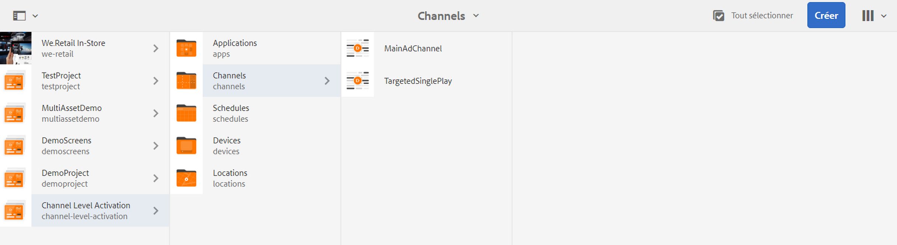
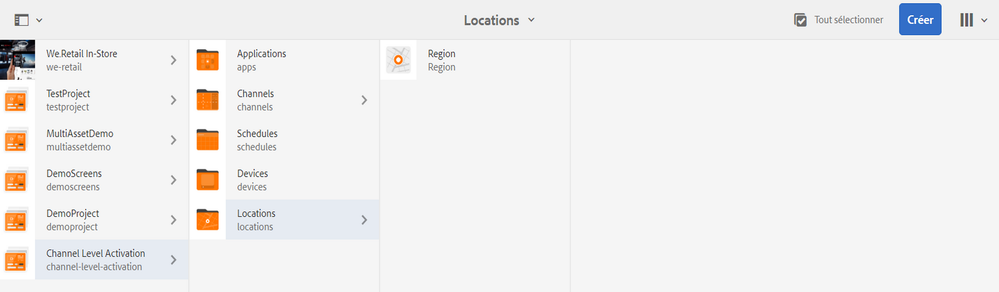
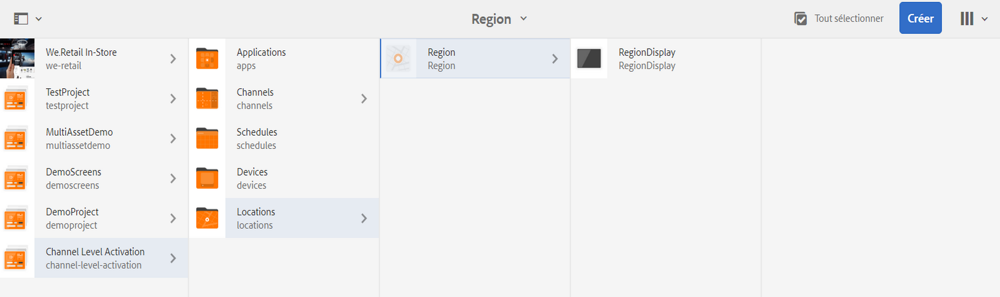
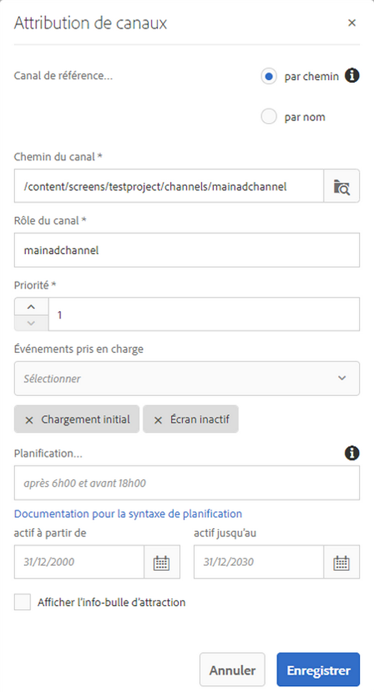

# Channel Level Activation {#channel-level-activation-single-event-playback}

Cette page décrit l’activation au niveau du canal pour les ressources utilisées dans les canaux.

Cette section aborde les sujets suivants :

* Présentation
* Fenêtre d’activation
* Utilisation de l’activation au niveau du canal comme lecture d’événement unique
* Gestion de la répétition des ressources dans un canal
   * Tranches horaires
   * Partage de semaine
   * Division des mois
   * Combinaison de pièces
* Utilisation de l’activation au niveau du canal comme lecture d’événement unique

## Présentation {#overview}

***L’activation*** au niveau du canal permet aux canaux de basculer après une planification définie. Le canal d’événement unique remplace le canal principal après une planification définie et il est lu pendant une période donnée, jusqu’à ce que le canal principal exécute à nouveau son contenu.

L’exemple suivant fournit une solution en se concentrant sur les termes clés suivants :

* un ***canal de séquence principal*** pour la séquence globale
* un ***canal d’événement unique*** qui s’exécute une seule fois à un moment défini
* une ***planification et une priorité définies*** de l’événement de lecture unique qui se produit dans le canal de séquence principal

## Fenêtre d’activation {#using-channel-level-activation}

La section suivante explique la création d’une lecture d’événement unique dans un canal pour un projet AEM Screens.

### Conditions préalables {#prerequisites}

Avant de commencer à implémenter cette fonctionnalité, veillez à ce que les conditions préalables suivantes sont satisfaites avant de commencer à implémenter l’activation au niveau du canal :

* Créez un projet AEM Screens, dans cet exemple, **Channel Level Activation**

* Créez un canal dénommé **MainAdChannel** principal sous le dossier **Canaux**

* Créez un autre canal dénommé **TargetedSinglePlay** sous le dossier **Canaux**

* Ajoutez les ressources appropriées aux deux canaux

L’image suivante montre le projet **Channel Level Activation** avec les canaux **MainAdChannel** et **TargetedSinglePlay** ciblés dans le dossier **Canaux**.

>[!NOTE]
>
>Pour plus d’informations sur la création d’un projet et la création d’un canal de séquence, reportez-vous aux ressources ci-dessous :
>
>* [Créer et gérer des projets](creating-a-screens-project.md)
   >
   >
* [Gestion d’un canal](managing-channels.md)
>

### Mise en œuvre {#implementation}

L’implémentation de l’activation au niveau du canal dans un projet AEM Screens implique trois tâches principales :

1. **Configuration de la taxonomie du projet, y compris les canaux, emplacements et écrans**
1. **Affectation de canaux à un affichage**
1. **Configuration d’un calendrier et d’une priorité**

Suivez les étapes ci-dessous pour mettre en œuvre la fonctionnalité :

1. **Créez un emplacement**

   Accédez au dossier **Emplacements** dans votre projet AEM Screens et créez un emplacement en tant que **Région**.

   

   >[!NOTE]
   >
   >Pour savoir comment créer un emplacement, reportez-vous à **[Création et gestion des emplacements](managing-locations.md)**.

1. **Créer un affichage sous Emplacement**

   1. Accédez à **Channel Level Activation** > **Emplacements** > **Région**.
   1. Sélectionnez **Région**, puis cliquez sur **+Créer** dans la barre d’actions.
   1. Sélectionnez **Afficher** dans l’assistant et créez un affichage intitulé **RegionDisplay.**
   

1. **Affectation de canaux à un affichage**

   Pour **MainAdChannel :**

   1. Accédez à **Channel Level Activation** > **Emplacements** > **Région** > **RegionDisplay** puis cliquez sur **Affecter un canal** dans la barre d’actions.
   1. La boîte de dialogue **Attribution de canaux** s’ouvre.
   1. Sélectionnez **Canal de référence**.. en fonction du chemin d’accès.
   1. Select the **Channel Path** as **Channel Level Activation** --> ***Channels*** --> ***MainAdChannel***.
   1. Le **Rôle du canal** est défini comme **mainadchannel**.
   1. Sélectionnez la **Priorité** **1**.
   1. Choisissez les **Événements pris en charge** **Chargement initial** et **Écran inactif**.
   1. Cliquez sur **Enregistrer**.
   

   >[!NOTE]
   >
   >Vous pouvez également affecter un canal à partir du tableau de bord d’affichage en accédant à **Channel Level Activation** —> **Emplacements** —> **Région** —> **RegionDisplay** et en cliquant sur **Tableau de bord** dans la barre d’actions. Cliquez sur **+ Attribuer un canal** dans le panneau **CANAUX ET PLANIFICATIONS AFFECTÉS**.

   De même, affectez le canal **TargetedSinglePlay** afin qu’il soit affiché** :

   1. Accédez à **Channel Level Activation** > **Emplacements** > **Région** > **RegionDisplay** puis cliquez sur **Affecter un canal** dans la barre d’actions.
   1. La boîte de dialogue **Attribution de canaux** s’ouvre.
   1. Sélectionnez **Canal de référence**.. en fonction du chemin d’accès.
   1. Select the **Channel Path** as **Channel Level Activation*** --> ***Channels*** --> ***TargetedSinglePlay***.
   1. Le **Rôle de canal** est renseigné avec le contenu **targetedsingleplay**.
   1. Définissez la **Priorité** sur **2**.
   1. Sélectionnez les **Événements pris en charge** **Charge initiale**, **Écran inactif** et **Minuteur**, *comme illustré dans la figure ci-dessous.
   1. Choisissez la date **active à partir** du 27 novembre 2018 à 23h59 et **active jusqu’au** 28 novembre 2018 à 12h05.
   1. Cliquez sur **Enregistrer**.
   >[!CAUTION]
   Vous devez définir pour le canal **TargetSinglePlay** une priorité plus élevée que le canal **MainAdSegment** .

   

   >[!NOTE]
   Pour choisir le même jour, vous devez sélectionner le jour suivant et modifier manuellement la date en choisissant le même jour, mais à une heure ultérieure. L’utilisateur ne peut donc pas sélectionner une date antérieure. Reportez-vous à l’exemple ci-dessous :

   

## Affichage des résultats {#viewing-the-results}

Une fois que vous aurez configuré les canaux et l’affichage, veuillez lancer le lecteur AEM Screens pour afficher le contenu.

Le lecteur affiche le contenu de **MainAdChannel** et exactement à 23h59 (comme défini dans la planification), le canal **TargetedSinglePlay** affiche son contenu jusqu’à 12h05, puis le canal **MainAdChannel** reprend la lecture de son contenu.

>[!NOTE]
Pour en savoir plus sur le lecteur d’écran AEM, consultez les ressources suivantes :
* [Téléchargements du lecteur AEM Screens](https://download.macromedia.com/screens/)
* [Utilisation du lecteur AEM Screens](working-with-screens-player.md)

## Gestion de la répétition des ressources dans un canal{#handling-recurrence-in-assets}

Vous pouvez programmer des ressources dans un canal pour qu’elles se régénèrent à certains intervalles, tous les jours, toutes les semaines ou tous les mois, selon vos besoins.

Supposons que vous souhaitiez afficher le contenu d’une chaîne uniquement le vendredi de 13h00 à 22h00. You can use the **Activation** tab to set the desired recurring interval for your asset.

### Tranches horaires {#day-parting}

1. Sélectionnez le canal et cliquez sur **Tableau de bord** dans la barre d&#39;action pour ouvrir le tableau de bord du canal.

1. Après avoir saisi la date/l&#39;heure de début et l&#39;heure de fin/date dans la boîte de dialogue Affectation **de** canal, vous pouvez utiliser une expression ou une version de texte naturel pour spécifier votre calendrier de répétition.

   >[!NOTE]
Vous pouvez ignorer ou inclure les champs **Actif depuis** et **Actif jusqu’à** et ajouter l’expression au champ Planifications, selon vos besoins.

1. Entrez l’expression dans le **calendrier** et votre fichier s’affichera pour l’intervalle de jour et d’heure.

#### Exemples d’expressions pour le partage de journée {#example-one}

Le tableau suivant récapitule quelques exemples d’expressions que vous pouvez ajouter à la planification lors de l’attribution d’un canal à un affichage.

| **Expression** | **Interprétation** |
|---|---|
| avant 08h00 | le fichier de la chaîne est lu avant 8h00 tous les jours |
| après 14h00 | le fichier de la chaîne est lu après 14h00 tous les jours |
| après 12h15 et avant 12h45 | le fichier de la chaîne est lu après 12h15 tous les jours pendant 30 minutes. |
| avant 12h15 et après 12h45 | le fichier de la chaîne est lu avant 12h15 tous les jours et après 12h45 |
| Lun,Tue,Wed ou Lun-Wed | la ressource est lue dans la ressource du canal du lundi au mercredi. |
| le 1er janvier après 14h00, et le 2 janvier et le 3 janvier avant 03h00 | le fichier dans la chaîne commence à jouer après 14h00 le 1er janvier, continue à jouer toute la journée le 2 janvier jusqu&#39;à 3h00 le 3 janvier |
| le 1er et 2 janvier après 14h00 et le 2-3 janvier avant 03h00 | le fichier dans la chaîne démarre le lecteur après 14h00 le 1er janvier, continue la lecture jusqu&#39;à 3h00 le 2 janvier, puis recommence le 2 janvier à 14h00 et continue la lecture jusqu&#39;à 3h00 le 3 janvier |

>[!NOTE]
Vous pouvez également utiliser la notation _sur 24 heures_ (14h00) au lieu de la notation *am/pm* (2h00 pm).

### Partage de semaine {#week-parting}

1. Sélectionnez le canal et cliquez sur **Tableau de bord** dans la barre d&#39;action pour ouvrir le tableau de bord du canal.

1. Après avoir saisi la date/l&#39;heure de début et l&#39;heure de fin/date dans la boîte de dialogue Affectation **de** canal, vous pouvez utiliser une expression ou une version de texte naturel pour spécifier votre calendrier de répétition.

   >[!NOTE]
Vous pouvez ignorer ou inclure les champs **Actif depuis** et **Actif jusqu’à** et ajouter l’expression au champ Planifications, selon vos besoins.

1. Entrez l’expression dans le **calendrier** et votre fichier s’affichera pour l’intervalle de jour et d’heure.

#### Exemples d’expressions pour le partage de semaine {#example-two}

Le tableau suivant récapitule quelques exemples d’expressions que vous pouvez ajouter à la planification lors de l’attribution d’un canal à un affichage.

| **Expression** | **Interprétation** |
|---|---|
| Lun,Tue,Wed ou Lun-Wed | la ressource est lue dans la ressource du canal du lundi au mercredi. |
| avant 08h00 | le fichier de la chaîne est lu avant 8h00 tous les jours |
| après 14h00 | le fichier de la chaîne est lu après 14h00 tous les jours |
| après 12h15 et avant 12h45 | le fichier de la chaîne est lu après 12h15 tous les jours pendant 30 minutes. |
| avant 12h15 et après 12h45 | le canal est lu avant 12h15 et après 12h45 tous les jours |

>[!NOTE]
Vous pouvez également utiliser la notation _sur 24 heures_ (14h00) au lieu de la notation *am/pm* (2h00 pm).

### Division des mois {#month-parting}

1. Sélectionnez le canal et cliquez sur **Tableau de bord** dans la barre d&#39;action pour ouvrir le tableau de bord du canal.

1. Après avoir saisi la date/l&#39;heure de début et l&#39;heure de fin/date dans la boîte de dialogue Affectation **de** canal, vous pouvez utiliser une expression ou une version de texte naturel pour spécifier votre calendrier de répétition.

   >[!NOTE]
Vous pouvez ignorer ou inclure les champs **Actif depuis** et **Actif jusqu’à** et ajouter l’expression au champ Planifications, selon vos besoins.

1. Entrez l’expression dans le **calendrier** et votre fichier s’affichera pour l’intervalle de jour et d’heure.

#### Exemples d’expressions pour le partage de mois {#example-three}

Le tableau suivant récapitule quelques exemples d’expressions que vous pouvez ajouter à la planification lors de l’attribution d’un canal à un affichage.

| **Expression** | **Interprétation** |
|---|---|
| de février,mai,août,novembre | la ressource est lue dans la chaîne en février, mai, août, novembre. |

>[!NOTE]
Lors de la définition des jours de la semaine et des mois, vous pouvez utiliser les annotations à main courte et de nom complet, telles que Lun/Lundi et Jan/Janvier.

>[!NOTE]
Vous pouvez également utiliser la notation _sur 24 heures_ (14h00) au lieu de la notation *am/pm* (2h00 pm).

### Combinaison de pièces {#combined-parting}

1. Sélectionnez le canal et cliquez sur **Tableau de bord** dans la barre d&#39;action pour ouvrir le tableau de bord du canal.

1. Après avoir saisi la date/l&#39;heure de début et l&#39;heure de fin/date dans la boîte de dialogue Affectation **de** canal, vous pouvez utiliser une expression ou une version de texte naturel pour spécifier votre calendrier de répétition.

   >[!NOTE]
Vous pouvez ignorer ou inclure les champs **Actif depuis** et **Actif jusqu’à** et ajouter l’expression au champ Planifications, selon vos besoins.

1. Entrez l’expression dans le **calendrier** et votre fichier s’affichera pour l’intervalle de jour et d’heure.

#### Exemples d’expressions pour la combinaison de paramètres {#example-four}

Le tableau suivant récapitule quelques exemples d’expressions que vous pouvez ajouter à la planification lors de l’attribution d’un canal à un affichage.

| **Expression** | **Interprétation** |
|---|---|
| après 6h00 et avant 18h00 le lundi,Wed de Jan-Mar | le fichier est lu sur la chaîne entre 6h et 18h les lundis et mercredis de janvier à fin mars. |
| le 1er janvier après 14h00, et le 2 janvier et le 3 janvier avant 03h00 | le fichier dans la chaîne commence à jouer après 14h00 le 1er janvier, continue à jouer toute la journée le 2 janvier jusqu&#39;à 3h00 le 3 janvier |
| le 1er et 2 janvier après 14h00 et le 2-3 janvier avant 03h00 | le fichier dans la chaîne démarre le lecteur après 14h00 le 1er janvier, continue la lecture jusqu&#39;à 3h00 le 2 janvier, puis recommence le 2 janvier à 14h00 et continue la lecture jusqu&#39;à 3h00 le 3 janvier |

>[!NOTE]
Lors de la définition des jours de la semaine et des mois, vous pouvez utiliser les annotations à main courte et de nom complet, telles que Lun/Lundi et Jan/Janvier.  Additionally, you can also use _military time_ notation (that is, 14:00) instead of *am/pm* notation (that is, 2:00 pm).

