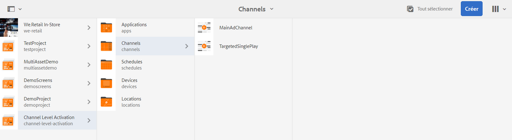
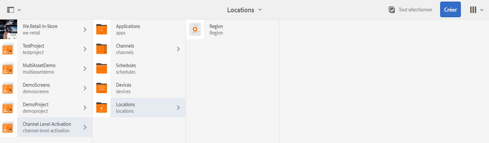
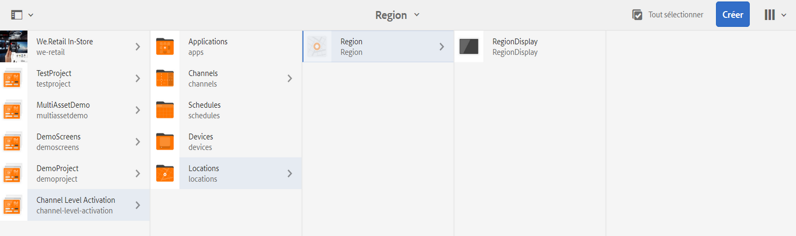
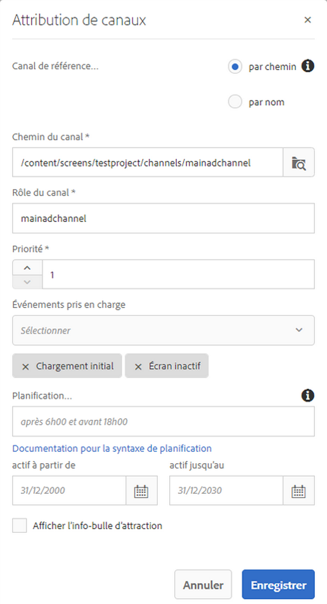

# Activation au niveau des canaux {#channel-level-activation-single-event-playback}

>[!IMPORTANT]
>Ce contenu est valide pour AEM on-premise/AMS (AEM 6.5LTS et AEM 6.5). Pour le contenu AEM as a Cloud Service Screens, reportez-vous au guide [AEM as a Cloud Service](https://experienceleague.adobe.com/en/docs/experience-manager-cloud-service/content/screens-as-cloud-service/overview/introduction).

Cette page décrit l’activation au niveau des canaux des ressources utilisées dans les canaux.

Cette section aborde les sujets suivants :

* Vue d’ensemble
* Fenêtre d’activation
* Utilisation de l’activation au niveau des canaux comme lecture d’événement unique
* Gérer la périodicité des ressources dans un canal
   * Tranches horaires
   * Tranches hebdomadaires
   * Tranches mensuelles
   * Combinaison de tranches
* Utilisation de l’activation au niveau des canaux comme lecture d’événement unique

## Vue d’ensemble {#overview}

L ***’activation au niveau des canaux*** permet aux canaux de permuter selon une planification définie. Le canal d’événement unique remplace le canal principal après une planification définie et il est lu pendant une période donnée, jusqu’à ce que le canal principal exécute à nouveau son contenu.

L’exemple suivant fournit une solution en se concentrant sur les termes clés suivants :

* un ***canal de séquence principal*** pour la séquence globale
* un ***canal d’événement unique*** qui s’exécute une seule fois à un moment défini
* une ***planification et une priorité définies*** de l’événement de lecture unique qui se produit dans le canal de séquence principal

## Fenêtre d’activation {#using-channel-level-activation}

La section suivante explique la création d’une lecture d’événement unique dans un canal pour un projet AEM Screens.

### Conditions préalables {#prerequisites}

Avant de commencer à implémenter cette fonctionnalité, veillez à ce que les conditions préalables suivantes soient satisfaites avant de commencer à implémenter l’activation au niveau du canal :

* Créez un projet AEM Screens, dans cet exemple, **Channel Level Activation**.

* Créez un canal appelé **MainAdChannel** dans le dossier **Canaux**.

* Créez un autre canal appelé **TargetedSinglePlay** dans le dossier **Canaux**.

* Ajoutez les ressources appropriées aux deux canaux.

L’image ci-après montre le projet **Channel Level Activation** avec les canaux **MainAdChannel** et **TargetedSinglePlay** dans le dossier **Canaux**.

>[!NOTE]
>
>Pour plus d’informations sur la création d’un projet et la création d’un canal de séquence, reportez-vous aux ressources ci-dessous :
>
>* [Création et gestion des projets](creating-a-screens-project.md)
>
>* [Gestion d’un canal](managing-channels.md)
>

### Mise en œuvre {#implementation}

L’implémentation de l’activation au niveau du canal dans un projet AEM Screens implique trois tâches principales :

1. **Configuration de la taxonomie du projet, y compris les canaux, emplacements et écrans**
1. **Affectation de canaux à un affichage**
1. **Configuration d’un calendrier et d’une priorité**

Suivez les étapes ci-dessous pour mettre en œuvre la fonctionnalité :

1. **Créez un emplacement**

   Accédez au dossier **Emplacements** dans votre projet AEM Screens et créez un emplacement en tant que **Région**.

   

   >[!NOTE]
   >
   >Pour savoir comment créer un emplacement, reportez-vous à **[Création et gestion des emplacements](managing-locations.md)**.

1. **Créer un affichage sous Emplacement**

   1. Accédez à **Channel Level Activation** > **Emplacements** > **Région**.
   1. Cliquez sur **Zone géographique** et sur **+ Créer** dans la barre d’actions.
   1. Cliquez sur **Affichage** dans l’assistant et créez un affichage intitulé **RegionDisplay**.

   

1. **Affecter des canaux à un affichage**

   Pour **MainAdChannel :**

   1. Accédez à **Channel Level Activation** > **Emplacements** > **Région** > **RegionDisplay** puis cliquez sur **Affecter un canal** dans la barre d’actions.
   1. Dans la boîte de dialogue **Attribution de canaux**, cliquez sur **Canal de référence** en fonction du chemin.
   1. Cliquez sur **Chemin du canal**, puis sur **Channel Level Activation** > ***Canaux*** > ***MainAdChannel***.
   1. Le **Rôle du canal** est défini comme **mainadchannel**.
   1. Cliquez sur **Priorité** et définissez la valeur sur **1**.
   1. Cliquez sur les **Événements pris en charge** tels que **Charge initiale** et **Écran inactif**.
   1. Cliquez sur **Enregistrer**.

   

   >[!NOTE]
   >
   >Vous pouvez également attribuer le canal à partir du tableau de bord de l’affichage. Accédez à **Channel Level Activation** > **Emplacements** > **Zone géographique** > **RegionDisplay**. Dans la barre d’actions, sélectionnez **Tableau de bord**. Dans le panneau **CANAUX ET PLANIFICATIONS AFFECTÉS**, cliquez sur **+ Attribuer le canal**.

   De même, affectez le canal **TargetedSinglePlay** afin qu’il soit affiché** :

   1. Accédez à **Channel Level Activation** > **Emplacements** > **Zone géographique** > **RegionDisplay** puis cliquez sur **Affecter un canal** dans la barre d’actions.
   1. Dans la boîte de dialogue **Attribution de canaux**, cliquez sur **Canal de référence** en fonction du chemin.
   1. Cliquez sur **Chemin du canal**, puis sur **Channel Level Activation** > ***Canaux*** > ***TargetedSinglePlay***.
   1. Le **Rôle de canal** est renseigné avec le contenu **targetedsingleplay**.
   1. Définissez la **Priorité** sur **2**.
   1. Cliquez sur **Événements pris en charge** et définissez **Chargement initial**, **Écran inactif** et **Retardateur**, comme illustré dans la figure ci-dessous.
   1. En **actif à partir du**, fixé au 27 novembre 2018, à 23 :59, et en **actif jusqu’au**, fixé au 28 novembre 2018, à 12 :05.
   1. Cliquez sur **Enregistrer**.

   >[!CAUTION]
   >
   >Vous devez définir pour le canal **TargetSinglePlay** une priorité plus élevée que le canal **MainAdSegment**.

   

   >[!NOTE]
   >
   >Pour choisir le jour-même, cliquez sur le jour suivant et modifiez manuellement la date en choisissant le jour-même, mais à une heure ultérieure. La personne ne peut donc pas sélectionner une date antérieure. Considérez l’exemple suivant :

   

## Affichage des résultats {#viewing-the-results}

Une fois que vous aurez configuré les canaux et l’affichage, lancez le lecteur AEM Screens pour afficher le contenu.

Le lecteur affiche le contenu de **MainAdChannel** et exactement à 23 :59 (comme défini dans le planning), le canal **TargetedSinglePlay** affiche son contenu jusqu’à 12 :05, puis le **MainAdChannel** reprend la lecture de son contenu.

>[!NOTE]
>
>Pour en savoir plus sur le lecteur AEM Screen, consultez les ressources suivantes :>[Téléchargements du lecteur AEM Screens](https://download.macromedia.com/screens/)
>[Utilisation d’AEM Screens Player](working-with-screens-player.md)

## Gérer la périodicité des ressources dans un canal {#handling-recurrence-in-assets}

Vous pouvez planifier l’activation périodique des ressources d’un canal à certains intervalles, tous les jours, toutes les semaines ou tous les mois, selon vos besoins.

Supposons que vous souhaitiez afficher le contenu d’un canal uniquement le vendredi de 13:00 à 22:00. Vous pouvez utiliser l’onglet **Activation** pour définir l’intervalle de périodicité souhaité pour votre ressource.

### Tranches horaires {#day-parting}

1. Cliquez sur le canal et sur **Tableau de bord** dans la barre d’actions.

1. Après avoir renseigné la date et l’heure de début et la date et l’heure de fin dans la boîte de dialogue **Attribution de canaux**, vous pouvez utiliser une expression ou une version en langage naturel pour définir la planification de récurrence.

   >[!NOTE]
   >
   >Vous pouvez ignorer ou inclure les champs **Actif à partir de** et **Actif jusqu’à** et ajouter l’expression au champ Plannings, selon vos besoins.

1. Saisissez l’expression dans le **Planning**. Votre ressource s’affiche pour l’intervalle spécifique de jour et d’heure.

#### Exemples d’expressions pour les tranches horaires {#example-one}

Le tableau suivant récapitule quelques exemples d’expressions que vous pouvez ajouter au planning lors de l’attribution d’un canal à un affichage.

| **Expression** | **Interprétation** |
|---|---|
| avant 8:00 | la ressource dans le canal est lue avant 8 heures :00 tous les jours |
| après 14:00 | la ressource dans la chaîne est lue après 14 :00 tous les jours |
| après 12 :15 et avant 12 :45 | la ressource dans la chaîne est lue après 12 :15 tous les jours pendant 30 minutes |
| avant 12:15 également après 12:45 | la ressource dans la chaîne est lue avant 12 :15 tous les jours, puis également après 12 :45. |
| Lun,Mar,Mer ou Lun-Mer | La ressource du canal est lue du lundi au mercredi. |
| le premier jour de janvier après 14 :00, le deuxième jour de janvier et le troisième jour de janvier avant 3 :00. | la ressource du canal commence à être lue après 14 :00 le 1er janvier, et continue à être lue toute la journée du 2 janvier jusqu’à 3 :00 le 3 janvier |
| les 1 à 2 jours de janvier après 14 heures:00 ainsi que les 2 à 3 jours de janvier avant 3 :00 heures. | la ressource dans le canal démarre le lecteur après 14 :00 le 1er janvier, continue la lecture jusqu’à 3 :00 le 2 janvier, puis recommence le 2 janvier à 14 :00 et continue jusqu’à 3 :00 le 3 janvier |

>[!NOTE]
>
>Vous pouvez également utiliser la notation _heure militaire_ (14:00) au lieu de *A.M./P.M.* (14:00).

### Tranches hebdomadaires {#week-parting}

1. Cliquez sur le canal et sur **Tableau de bord** dans la barre d’actions.

1. Après avoir renseigné la date et l’heure de début et la date et l’heure de fin dans la boîte de dialogue **Attribution de canaux**, vous pouvez utiliser une expression ou une version en langage naturel pour définir la planification de récurrence.

   >[!NOTE]
   >
   >Vous pouvez ignorer ou inclure les champs **Actif à partir de** et **Actif jusqu’à** et ajouter l’expression au champ Plannings, selon vos besoins.

1. Saisissez l’expression dans le **Planning**. Votre ressource s’affiche pour l’intervalle spécifique de jour et d’heure.

#### Exemples d’expressions pour les tranches hebdomadaires {#example-two}

Le tableau suivant récapitule quelques exemples d’expressions que vous pouvez ajouter au planning lors de l’attribution d’un canal à un affichage.

| **Expression** | **Interprétation** |
|---|---|
| Lun,Mar,Mer ou Lun-Mer | La ressource du canal est lue du lundi au mercredi. |
| avant 8:00 | la ressource dans le canal est lue avant 8 heures :00 tous les jours |
| après 14:00 | la ressource dans la chaîne est lue après 14 :00 tous les jours |
| après 12 :15 et avant 12 :45 | la ressource dans la chaîne est lue après 12 :15 tous les jours pendant 30 minutes |
| avant 12:15 également après 12:45 | la chaîne joue avant 12 :15 tous les jours, puis également après 12 :45. |

>[!NOTE]
>
>Vous pouvez également utiliser la notation _heure militaire_ (14:00) au lieu de *A.M./P.M.* (14:00).

### Tranches mensuelles {#month-parting}

1. Cliquez sur le canal et sur **Tableau de bord** dans la barre d’actions.

1. Après avoir renseigné la date et l’heure de début et la date et l’heure de fin dans la boîte de dialogue **Attribution de canaux**, vous pouvez utiliser une expression ou une version en langage naturel pour définir la planification de récurrence.

   >[!NOTE]
   >
   >Vous pouvez ignorer ou inclure les champs **Actif à partir de** et **Actif jusqu’à** et ajouter l’expression au champ Plannings, selon vos besoins.

1. Saisissez l’expression dans le **Planning**. Votre ressource s’affiche pour l’intervalle spécifique de jour et d’heure.

#### Exemples d’expressions pour les tranches mensuelles {#example-three}

Le tableau suivant récapitule quelques exemples d’expressions que vous pouvez ajouter au planning lors de l’attribution d’un canal à un affichage.

| **Expression** | **Interprétation** |
|---|---|
| de `February,May,August,November` | La ressource est lue dans le canal en février, mai, août et novembre. |

>[!NOTE]
>
>Lors de la définition des jours de la semaine et des mois, vous pouvez utiliser les notations abrégées ou complètes comme Lun/Lundi et Jan/Janvier.

>[!NOTE]
>
>Vous pouvez également utiliser la notation _heure militaire_ (14:00) au lieu de *A.M./P.M.* (14:00).

### Combinaison de tranches {#combined-parting}

1. Cliquez sur le canal et sur **Tableau de bord** dans la barre d’actions.

1. Après avoir renseigné la date et l’heure de début et la date et l’heure de fin dans la boîte de dialogue **Attribution de canaux**, vous pouvez utiliser une expression ou une version en langage naturel pour définir la planification de récurrence.

   >[!NOTE]
   >
   >Vous pouvez ignorer ou inclure les champs **Actif à partir de** et **Actif jusqu’à** et ajouter l’expression au champ Plannings, selon vos besoins.

1. Saisissez l’expression dans le **Planning**. Votre ressource s’affiche pour l’intervalle spécifique de jour et d’heure.

#### Exemples d’expressions de combinaison de tranches {#example-four}

Le tableau suivant récapitule quelques exemples d’expressions que vous pouvez ajouter au planning lors de l’attribution d’un canal à un affichage.

| **Expression** | **Interprétation** |
|---|---|
| après le 6:00 et avant le 18:00 le lundi, mer de Jan-Mar | La ressource est lue dans le canal entre 6 h et 18 h les lundis et mercredis, du mois de janvier à la fin du mois de mars. |
| le premier jour de janvier après 14 :00, le deuxième jour de janvier et le troisième jour de janvier avant 3 :00. | la ressource du canal commence à être lue après 14 :00 le 1er janvier, et continue à être lue toute la journée du 2 janvier jusqu’à 3 :00 le 3 janvier |
| les 1 à 2 jours de janvier après 14 heures:00 ainsi que les 2 à 3 jours de janvier avant 3 :00 heures. | la ressource dans le canal démarre le lecteur après 14 :00 le 1er janvier, continue la lecture jusqu’à 3 :00 le 2 janvier, puis recommence le 2 janvier à 14 :00 et continue jusqu’à 3 :00 le 3 janvier |

>[!NOTE]
>
>Lors de la définition des jours de la semaine et des mois, vous pouvez utiliser les notations abrégées ou complètes comme Lun/Lundi et Jan/Janvier. Vous pouvez également utiliser la notation _heure militaire_ (14:00) au lieu de *A.M./P.M.* (14:00).
