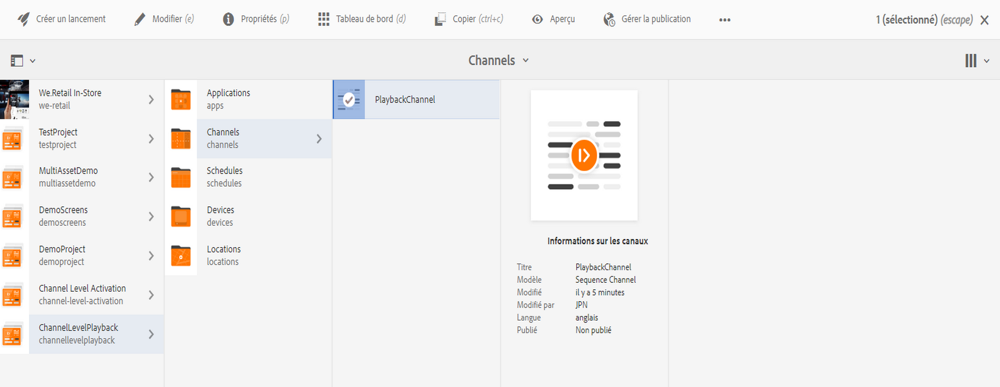
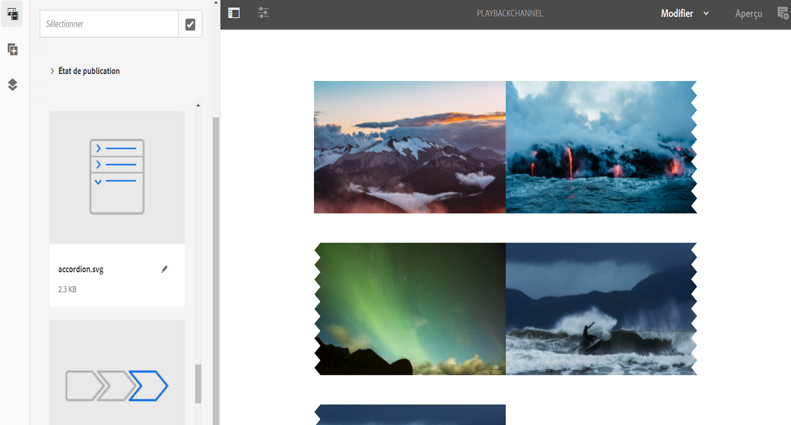
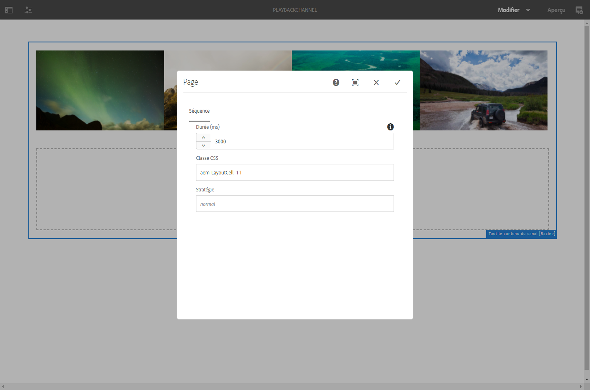

# Durée de lecture d’images en bloc d’un canal {#channel-level-bulk-image-playback-duration}

## Présentation {#overview}

Une fois que vous avez créé un canal de séquence et que vous y avez ajouté des images, toutes les images supposent par défaut la durée de lecture définie dans la configuration du canal. Chaque image peut toujours remplacer la valeur par défaut et présenter une autre durée de lecture. Pour ce faire, modifiez la durée de lecture du composant d’image concerné.

### Conditions préalables {#prerequisites}

Avant de commencer à implémenter cette fonctionnalité, veillez à configurer un projet comme condition préalable du lancement de sa mise en œuvre. Par exemple :

1. Create an AEM Screens project example, **ChannelLevelPlayback**.

1. Créer un canal de séquence **PlaybackChannel** sous le dossier **Canaux.**

1. Ajouter un contenu à **PlaybackChannel**.

## Modification de l’attribution d’une durée de lecture des images d’un canal {#editing-channel-level-image-playback-duration-assignment}

La section suivante explique comment modifier la durée de lecture d’un contenu d’un canal AEM Screens.

### Mise à jour de la durée de lecture des images d’un canal {#updating-the-playback-duration-for-images-in-a-channel}

Suivez les étapes ci-dessous pour savoir comment mettre à jour l’attribution d’une durée de lecture des images d’un canal :

1. Accédez au canal de séquence **PlaybackChannel**.

   

1. Cliquez sur **Modifier** dans la barre d’actions pour ouvrir l’éditeur.

   

1. Ajoutez plusieurs images à l’éditeur de canal, comme l’illustre la figure ci-dessous.

   

1. Sélectionnez toutes les images du canal, puis cliquez sur l’icône en forme de clé à molette en haut à gauche (comme l’illustre la figure ci-dessous) pour ouvrir la boîte de dialogue de configuration de canal.

   

1. **La boîte de dialogue Page** s’ouvre.

   >[!NOTE]
   >Par défaut, les images d’un canal sont définies sur une durée de lecture de 8 secondes.

   

   Remplacez la **durée** 8 000 (ms) par 3 000 (ms), c’est-à-dire 3 secondes. Cochez la case en haut à droite de la boîte de dialogue **Page** pour enregistrer les modifications que vous avez apportées.

   

### Affichage du résultat {#viewing-the-result}

Une fois que vous avez mis à jour la durée de lecture du canal (en l’occurrence, les trois images), vous constaterez que la durée de lecture de ces images n’est pas de 8 secondes (valeur par défaut), mais de 3 secondes.

