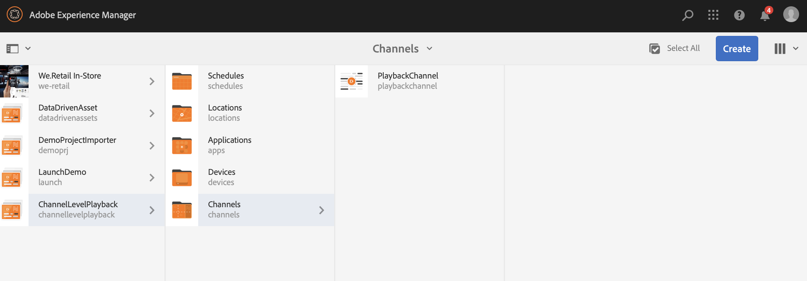
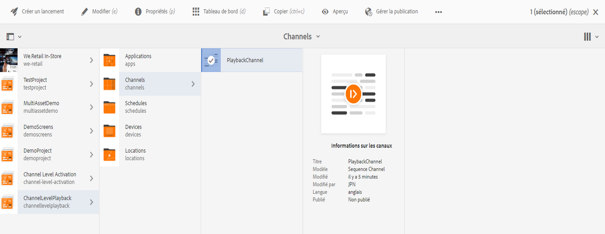
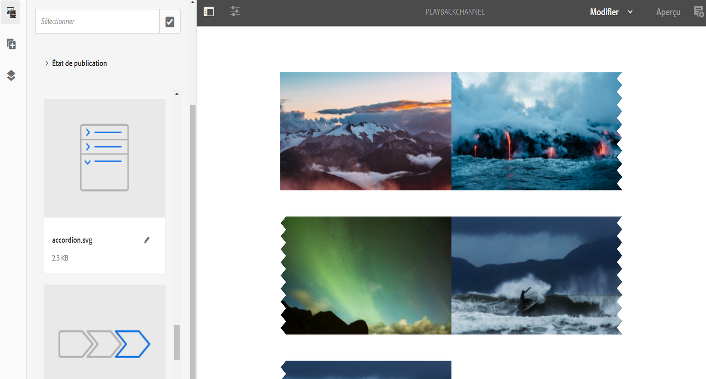
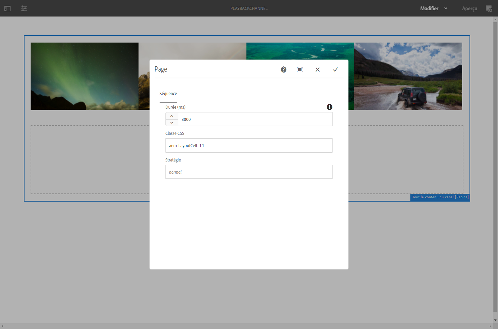

# Durée de lecture d’images en bloc au niveau du canal {#channel-level-bulk-image-playback-duration}

## Vue d’ensemble {#overview}

>[!IMPORTANT]
>Ce contenu est valide pour AEM on-premise/AMS (AEM 6.5LTS et AEM 6.5). Pour le contenu AEM as a Cloud Service Screens, reportez-vous au guide [AEM as a Cloud Service](https://experienceleague.adobe.com/en/docs/experience-manager-cloud-service/content/screens-as-cloud-service/overview/introduction).

Lorsque vous avez créé un canal de séquence et que vous y avez ajouté des images, toutes les images supposent par défaut la durée de lecture définie dans la configuration au niveau du canal. Toute image individuelle peut toujours remplacer la valeur par défaut et avoir une durée de lecture différente. Pour ce faire, modifiez la durée de lecture du composant d’image spécifique.

### Conditions préalables {#prerequisites}

Avant de commencer à implémenter cette fonctionnalité, veillez à configurer un projet comme condition préalable du lancement de sa mise en œuvre. Par exemple :

1. Créer un projet AEM Screens, **ChannelLevelPlayback**.

1. Créez un canal de séquence **PlaybackChannel** dans le dossier **Canaux**.

1. Ajouter un contenu à **PlaybackChannel**.

## Modification de l’attribution d’une durée de lecture des images d’un canal {#editing-channel-level-image-playback-duration-assignment}

La section suivante explique comment vous pouvez modifier la durée de lecture d’un contenu d’un canal AEM Screens.

### Mise à jour de la durée de lecture des images d’un canal {#updating-the-playback-duration-for-images-in-a-channel}

Suivez les étapes ci-dessous pour savoir comment mettre à jour l’attribution d’une durée de lecture des images d’un canal :

1. Accédez au canal de séquence **PlaybackChannel**.

   

1. Cliquez sur **Modifier** dans la barre d’actions.

   

1. Ajoutez plusieurs images à l’éditeur de canal, comme l’illustre la figure ci-dessous.

   

1. Cliquez sur toutes les images du canal, puis sur l’icône en forme de clé à molette en haut à gauche (comme l’illustre la figure ci-dessous) pour pouvoir ouvrir la boîte de dialogue de configuration de canal.

   

1. La boîte de dialogue **Page** s’ouvre.

   >[!NOTE]
   >Par défaut, les images d’un canal sont définies sur une durée de lecture de 8 secondes.

   

   Remplacez la **durée** 8 000 (millisecondes) par 3 000 (millisecondes), c’est-à-dire 3 secondes. Cochez la case en haut à droite de la boîte de dialogue **Page** pour enregistrer vos modifications.

   

### Afficher le résultat {#viewing-the-result}

Après avoir mis à jour la durée de lecture du canal (en l’occurrence, les trois images), vous constatez que la durée de lecture de ces images n’est pas de 8 secondes (valeur par défaut), mais de 3 secondes.

