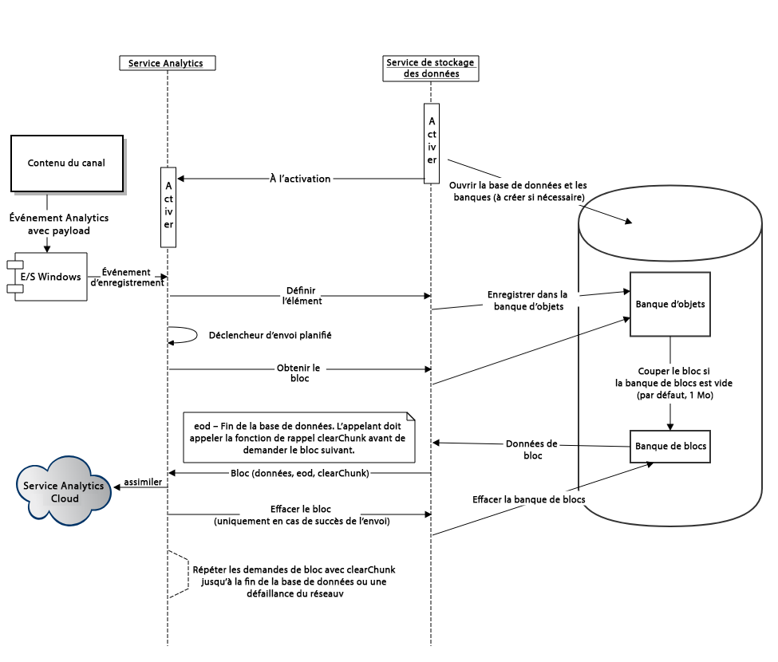

# Configuration d’Adobe Analytics avec AEM Screens {#configuring-adobe-analytics-with-aem-screens}

>[!CAUTION]
>
>Cette fonctionnalité d’AEM Screens est disponible uniquement si vous avez installé AEM 6.4.2 Feature Pack 2 et AEM 6.3.3 Feature Pack 4.

>Pour accéder à l’un ou l’autre de ces Feature Packs, vous devez contacter l’assistance technique d’Adobe et demander l’accès. Une fois que vous disposez des autorisations, vous pouvez le télécharger à partir de Package Share.
>
Cette section traite des sujets suivants :

* **Séquencement dans Adobe Analytics avec AEM Screens**
* **Envoi d’événements personnalisés à l’aide d’Adobe Analytics hors ligne**

## Séquencement dans Adobe Analytics avec AEM Screens {#sequencing-in-adobe-analytics-with-aem-screens}

Le processus ***de*** séquencement commence avec le service de stockage de données qui active le service Adobe Analytics. Le contenu du canal envoie les événements Adobe Analytics avec la paie, c’est-à-dire que la capture des tests de données vers les E/S Windows et les événements de séjour sont déclenchés. Les événements sont enregistrés dans la base de données d’index et sont ensuite placés dans le magasin d’objets. Selon le calendrier défini, l’administrateur coupe les données du magasin d’objets et les transfère ensuite dans le magasin de blocs. Il tente d’envoyer le maximum de données lorsqu’il est connecté.

### Diagramme de séquence {#sequencing-diagram}

Le diagramme de séquencement suivant explique l’intégration d’Adobe Analytics avec les écrans AEM :

## Envoi d’événements personnalisés à l’aide d’Adobe Analytics hors ligne {#sending-custom-events-using-offline-adobe-analytics}

Le tableau suivant résume le modèle de données standard pour les événements. Il répertorie tous les champs envoyés à Adobe Analytics :

<table>
 <tbody>
  <tr>
   <td><strong>Section</strong></td> 
   <td><strong>Libellé de propriété</strong></td> 
   <td><strong>Nom/clé de propriété</strong></td> 
   <td><strong>Obligatoire</strong></td> 
   <td><strong>Type de données</strong></td> 
   <td><strong>Type de propriété</strong>  </td> 
   <td><strong>Description</strong></td> 
  </tr>
  <tr>
   <td><strong><em>Core/Event</em></strong></td> 
   <td>GUID d’événement</td> 
   <td>event.guid</td> 
   <td>recommandé</td> 
   <td>chaîne</td> 
   <td>UUID</td> 
   <td>ID unique qui identifie l’instance d’un événement</td> 
  </tr>
  <tr>
   <td> </td> 
   <td>Date et heure de la collecte de l'événement</td> 
   <td>event.coll_dts</td> 
   <td>facultatif</td> 
   <td>chaîne</td> 
   <td>timestamp - UTC</td> 
   <td>Heure de la date de collecte</td> 
  </tr>
  <tr>
   <td> </td> 
   <td>Date et heure de l'événement (début)</td> 
   <td>event.dts_start</td> 
   <td>recommandé</td> 
   <td>chaîne</td> 
   <td>timestamp - UTC</td> 
   <td>Date de début de l’événement, si vous ne le spécifiez PAS, l’heure de début de l’événement sera considérée comme l’heure de réception par le serveur.</td> 
  </tr>
  <tr>
   <td> </td> 
   <td>Date et heure de l’événement (fin)</td> 
   <td>event.dts_end</td> 
   <td>facultatif</td> 
   <td>chaîne</td> 
   <td>timestamp - UTC</td> 
   <td>Date de fin d’événement</td> 
  </tr>
  <tr>
   <td> </td> 
   <td>Workflow</td> 
   <td>event.workflow</td> 
   <td>recommandé</td> 
   <td>chaîne</td> 
   <td> </td> 
   <td>Nom du processus (écrans)</td> 
  </tr>
  <tr>
   <td> </td> 
   <td>Principale catégorie de DM</td> 
   <td>event.category</td> 
   <td>required</td> 
   <td>chaîne</td> 
   <td> </td> 
   <td>Principale catégorie (BUREAU, MOBILE, WEB, PROCESSUS, SDK, SERVICE, ECOSYSTEM) - Regroupement des types d'événements - <strong>Nous envoyons le Lecteur</strong></td> 
  </tr>
  <tr>
   <td> </td> 
   <td>Sous-catégorie</td> 
   <td>event.subcategory</td> 
   <td>recommandé</td> 
   <td>chaîne</td> 
   <td> </td> 
   <td>Sous-catégorie - Section d'un processus ou d'une zone d'un écran, etc. (Fichiers récents, fichiers CC, créations mobiles, etc.)</td> 
  </tr>
  <tr>
   <td> </td> 
   <td>Type d’événement/d’action</td> 
   <td>event.type</td> 
   <td>required</td> 
   <td>chaîne</td> 
   <td> </td> 
   <td>Type d’événement (rendu, clic, pincement, zoom) - Action de l’utilisateur principal</td> 
  </tr>
  <tr>
   <td> </td> 
   <td>Subtype</td> 
   <td>event.subtype</td> 
   <td>recommandé</td> 
   <td>chaîne</td> 
   <td> </td> 
   <td>Sous-type d’événement (création, mise à jour, suppression, publication, etc.) - Informations supplémentaires sur l'action de l'utilisateur</td> 
  </tr>
  <tr>
   <td> </td> 
   <td>Hors ligne</td> 
   <td>event.offline</td> 
   <td>facultatif</td> 
   <td>booléen</td> 
   <td> </td> 
   <td>L’événement a été généré lorsque l’action était hors ligne/en ligne (true/false).</td> 
  </tr>
  <tr>
   <td> </td> 
   <td>Agent utilisateur</td> 
   <td>event.user_agent</td> 
   <td>recommandé (propriétés Web)</td> 
   <td>chaîne</td> 
   <td> </td> 
   <td>Agent utilisateur</td> 
  </tr>
  <tr>
   <td> </td> 
   <td>Langue/Langue</td> 
   <td>event.language</td> 
   <td>recommandé</td> 
   <td>chaîne</td> 
   <td> </td> 
   <td>Le paramètre régional utilisateur est une chaîne basée sur les conventions de balisage de langue de la RFC 3066 (par exemple, en-US, fr-FR ou es-ES).</td> 
  </tr>
  <tr>
   <td> </td> 
   <td>GUID du périphérique</td> 
   <td>event.device_guid</td> 
   <td>facultatif</td> 
   <td>string  </td> 
   <td>UUID</td> 
   <td>Identifie le GUID de périphérique (par exemple, ID d'ordinateur ou hachage de l'adresse IP + masque de sous-réseau + ID réseau + agent utilisateur) - Nous enverrons ici le nom d'utilisateur du lecteur généré au moment de l'inscription.</td> 
  </tr>
  <tr>
   <td> </td> 
   <td>Count</td> 
   <td>event.count</td> 
   <td>facultatif</td> 
   <td>number</td> 
   <td> </td> 
   <td>Nombre de fois où l'événement s'est produit : ici, nous envoyons la durée de la vidéo</td> 
  </tr>
  <tr>
   <td> </td> 
   <td>Valeur</td> 
   <td>event.value</td> 
   <td>facultatif</td> 
   <td>chaîne</td> 
   <td> </td> 
   <td>Valeur de l’événement (paramètres activés/désactivés, par exemple)</td> 
  </tr>
  <tr>
   <td> </td> 
   <td>Nom de page</td> 
   <td>event.pagename</td> 
   <td>requis pour AA</td> 
   <td>chaîne</td> 
   <td> </td> 
   <td>Prise en charge d’Adobe Analytics pour le nom de page personnalisé</td> 
  </tr>
  <tr>
   <td> </td> 
   <td>URL</td> 
   <td>event.url</td> 
   <td>facultatif</td> 
   <td>chaîne</td> 
   <td> </td> 
   <td>URL de la propriété web ou du schéma mobile - doit inclure une URL complète</td> 
  </tr>
  <tr>
   <td> </td> 
   <td>Error Code</td> 
   <td>event.error_code</td> 
   <td> </td> 
   <td>chaîne</td> 
   <td> </td> 
   <td>Code d’échec</td> 
  </tr>
  <tr>
   <td> </td> 
   <td>Type d’erreur</td> 
   <td>event.error_type</td> 
   <td> </td> 
   <td>chaîne</td> 
   <td> </td> 
   <td>Type d’échec</td> 
  </tr>
  <tr>
   <td> </td> 
   <td>Description de l’erreur</td> 
   <td>event.error_description</td> 
   <td> </td> 
   <td>chaîne</td> 
   <td> </td> 
   <td>Description de l’échec  </td> 
  </tr>
  <tr>
   <td><strong><em>Produit source/d’origine</em></strong></td> 
   <td>Nom</td> 
   <td>source.name</td> 
   <td>required</td> 
   <td>chaîne</td> 
   <td> </td> 
   <td>Nom de l’application (AEM Screens)</td> 
  </tr>
  <tr>
   <td> </td> 
   <td>Version</td> 
   <td>source.version</td> 
   <td>required</td> 
   <td>chaîne</td> 
   <td> </td> 
   <td>Version du microprogramme</td> 
  </tr>
  <tr>
   <td> </td> 
   <td>Plate-forme</td> 
   <td>source.platform</td> 
   <td>required</td> 
   <td>chaîne</td> 
   <td> </td> 
   <td>navigator.platform</td> 
  </tr>
  <tr>
   <td> </td> 
   <td>Périphérique</td> 
   <td>source.device</td> 
   <td>sans exceptions requises</td> 
   <td>chaîne</td> 
   <td> </td> 
   <td>Nom du lecteur</td> 
  </tr>
  <tr>
   <td> </td> 
   <td>Version OS</td> 
   <td>source.os_version</td> 
   <td>sans exceptions requises</td> 
   <td>chaîne</td> 
   <td> </td> 
   <td>Version O/S</td> 
  </tr>
  <tr>
   <td><strong><em>Contenu</em></strong></td> 
   <td>Action</td> 
   <td>content.action</td> 
   <td>required</td> 
   <td>chaîne</td> 
   <td> </td> 
   <td>URL de la ressource, y compris le rendu réellement lu</td> 
  </tr>
  <tr>
   <td> </td> 
   <td>Mime Type</td> 
   <td>content.mimetype</td> 
   <td>facultatif</td> 
   <td>chaîne</td> 
   <td> </td> 
   <td>Type MIME du contenu</td> 
  </tr>
  <tr>
   <td><strong><em>Transaction</em></strong></td> 
   <td>Numéro de transaction</td> 
   <td>trn.number</td> 
   <td>required</td> 
   <td>chaîne</td> 
   <td>UUID</td> 
   <td>Identifiant unique qui adhère de préférence à UUID v4</td> 
  </tr>
  <tr>
   <td> </td> 
   <td>Description du produit</td> 
   <td>trn.product</td> 
   <td>required</td> 
   <td>chaîne</td> 
   <td> </td> 
   <td>URL du fichier (à l’exclusion du rendu)</td> 
  </tr>
  <tr>
   <td> </td> 
   <td>Quantité</td> 
   <td>trn.quantity</td> 
   <td>required</td> 
   <td>chaîne</td> 
   <td> </td> 
   <td>Durée de lecture</td> 
  </tr>
 </tbody>
</table>

