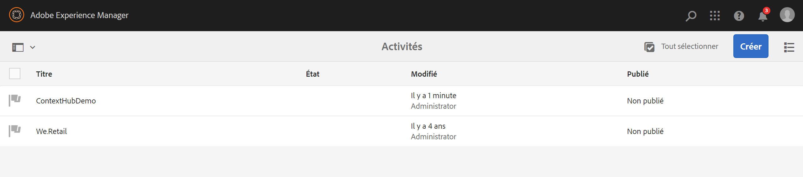
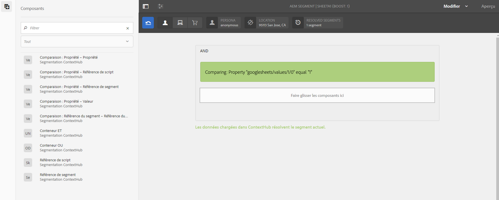
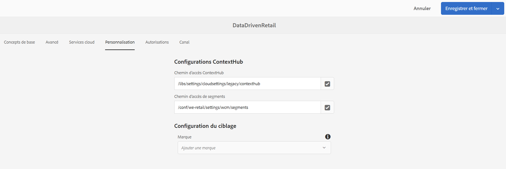
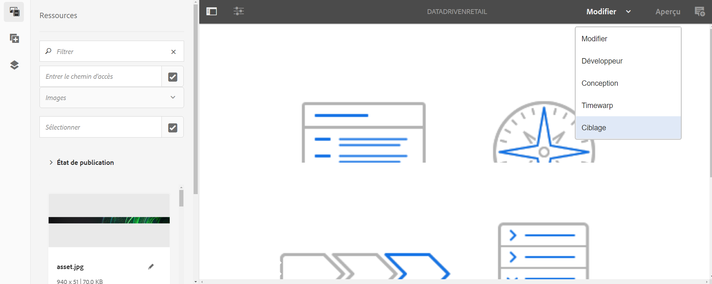

# Configuration de ContextHub dans AEM Screens {#configuring-contexthub-in-aem-screens}

Cette section met l’accent sur la création et la gestion des modifications de ressources liées aux données à l’aide d’un magasin de données.

## Termes clés {#key-terms}

Avant de vous attaquer aux détails de la création et de la gestion des canaux pilotés par l’inventaire dans votre projet AEM Screens, vous devez connaître quelques-uns des termes clés importants et pertinents pour les différents scénarios.

**Marque** Fait référence la description générale de votre projet.

**Zone** Fait référence au nom de votre projet AEM Screens, comme par exemple signalétique numérique publicitaire

**Activité** Définit la catégorie de règles, comme Basé sur l’inventaire, Basé sur la météo, Basé sur la disponibilité du service, etc.

**Audience** Définit la règle.

**Segment** Fait référence à la version de la ressource à lire pour la règle donnée, par exemple : si la température est inférieure à 10 degrés Celsius, l’écran affiche une image d’un café chaud. Sinon, il affiche une image d’une boisson froide.

Le diagramme ci-dessous illustre visuellement comment les configurations ContextHub coïncident avec l’activité, l’audience et les canaux.


## Conditions préalables {#preconditions}

Avant de commencer à définir les configurations ContextHub d’un projet AEM Screens, vous devez configurer Google Sheets (à des fins de démonstration).

>[!CAUTION]
>
>Google Sheets est utilisé dans l’exemple suivant à titre d’exemple de système de base de données à partir duquel les valeurs sont récupérées et uniquement à des fins pédagogiques. Adobe n’approuve pas l’utilisation de Google Sheets dans des environnements de production.
>
>Pour plus d’informations, reportez-vous à la section [Obtenir la clé d’API](https://developers.google.com/maps/documentation/javascript/get-api-key) dans la documentation Google.


## Étape 1 : configuration d’un magasin de données {#step-setting-up-a-data-store}

Vous pouvez configurer l’entrepôt de données en tant qu’événement d’E/S local ou d’événement de base de données local.

L’exemple de déclencheurs de données au niveau des ressources suivant montre un de base de données local qui configure un magasin de données, tel qu’une feuille Excel qui vous permet d’utiliser les configurations ContextHub et le chemin d’accès aux segments vers le AEM Screens .

Une fois la feuille google configurée correctement, par exemple, comme illustré ci-dessous :


La validation suivante est ce que vous  lorsque vous vérifiez votre connexion en saisissant l’ID de feuille de Google et la clé d’API au format ci-dessous :

`https://sheets.googleapis.com/v4/spreadsheets/<your sheet id>/values/Sheet1?key=<your API key>`


>[!NOTE]
>**Utilisation des valeurs de feuille Google dans AEM **>Les feuilles Google exposent ses valeurs dans le magasin ContextHub et sont disponibles sous`<store-name>/values/<i>/<j>`, où`<i>`et`<j>`sont les index de lignes et de colonnes dans la feuille de calcul (à partir de 0).
>
> * /values/0/0 points vers A1
> * /values/5/0 points vers A5
> * /values/0/5 points vers E1


L’exemple spécifique ci-dessous illustre la feuille Excel comme un magasin de données qui déclenchera un changement de fichier si la valeur est supérieure à 100 ou inférieure à 50.


1. **Accès à ContextHub**

   Accédez à votre instance AEM et cliquez sur l’icône Outils dans la barre latérale gauche. Cliquez sur **Sites** —> **ContextHub**, comme illustré dans la figure ci-dessous.

   

1. **Création d’une configuration de magasin ContextHub**

   1. Accédez à **global** > **default** > **Configuration de ContextHub**.

   1. Cliquez sur **Créer** > **Conteneur de configuration** et saisissez le titre **ContextHubDemo**.

   1. **Accédez** à **ContextHubDemo** > **Configuration de magasin ContentHub...** pour ouvrir l’**Assistant de configuration**.

   1. Saisissez le **Titre** **Google Sheets**, le **Nom du magasin** **googlesheets** et le **Type de magasin** **contexthub.generic-jsonp**

   1. Cliquez sur **Suivant**
   1. Entrez votre configuration json spécifique. Vous pouvez par exemple utiliser le code json ci-dessous à des fins de démonstration.
   1. Cliquez sur **Enregistrer**.

   ```
   {
     "service": {
       "host": "sheets.googleapis.com",
       "port": 80,
       "path": "/v4/spreadsheets/<your google sheet id>/values/Sheet1",
       "jsonp": false,
       "secure": true,
       "params": {
         "key": "<your Google API key>"
       }
     },
     "pollInterval": 10000
   }
   ```

   >[!NOTE]
   >
   >Dans l’exemple de code ci-dessus, **pollInterval** définit la fréquence d’actualisation des valeurs (en ms).
   >
   >
   >Remplacez le code par l’*&lt;ID de feuille>* et la *&lt;clé API>*, que vous avez récupérés lors de la configuration des Google Sheets.

   >[!CAUTION]
   Si vous créez vos configurations de stockage Google Sheets en dehors du dossier global (par exemple dans votre propre dossier de projet), le ciblage ne fonctionnera pas de manière prête.
   In case, you want to configure the Google Sheets store configurations outside the global folder, then you should must set the **Store Name** as **segmentation** and **Store Type** as **aem.segmentation**. Vous devez par ailleurs ignorer le processus de définition du code json défini ci-dessus.

1. **Création d’une marque dans les activités**

   1. Dans votre instance AEM, accédez à **Personnalisation** > **Activités**

   1. Cliquez sur **Créer** > **Créer une marque**

   1. Dans l’assistant **Créer une page**, sélectionnez **Marque** et cliquez sur **Suivant**

   1. Saisissez le **Titre** **ContextHubDemo** et cliquez sur **Créer**. Votre marque a été créée, comme illustré ci-dessous.
   


   >[!CAUTION]
   Problème connu :
   Pour ajouter une zone, supprimez le gabarit de l’URL, par exemple
   `https://localhost:4502/libs/cq/personalization/touch-ui/content/v2/activities.html/content/campaigns/contexthubdemo/master`

1. **Création d’une zone dans votre marque**

   Pour créer une zone dans la marque, procédez comme suit :

   1. Cliquez sur **Créer**, puis sur **Créer une zone**

   1. Sélectionnez **Zone** à partir de l’assistant de **Création de pager** et cliquez sur Suivant

   1. Saisissez le **Titre** **Google Sheets** et cliquez sur **Créer**.
Votre zone sera créée dans votre activité.

## Étape 2 : configuration de la segmentation de l’audience {#step-setting-up-audience-segmentation}

Une fois que vous aurez configuré un magasin de données et défini votre marque, suivez les étapes ci-dessous pour configurer les segments d’audience.

1. **Création de segments dans les audiences**

   1. Navigate from your AEM instance to **Personalization** > **Audiences** > **screens**.

   1. Cliquez sur **Créer** > **Créer un segment ContextHub.** La boîte de dialogue **Nouveau segment ContextHub** s’ouvre.

   1. Saisissez le **Titre** **SheetA1 1** et cliquez sur **Créer**. De la même manière, créez un autre segment intitulé **SheetA2 2**.

1. **Modification des segments**

   1. Select the segment **Sheets A1 1**, and click **Edit** from the action bar.

   1. Faites glisser le composant **Comparaison : Propriété - Valeur** et déposez-le dans l’éditeur.
   1. Cliquez sur l’icône en forme de clé pour ouvrir la boîte de dialogue **Comparer une propriété une valeur**.
   1. Sélectionnez **googlesheets/value/1/0** dans la liste déroulante de **Nom de la propriété**.

   1. Sélectionnez l’**Opérateur** **égal** dans le menu déroulant.

   1. Saisissez la **valeur** **1**.
   >[!NOTE]
   AEM valide alors vos données de la feuille de calcul Google en affichant votre segment en vert.

   

   De la même manière, définissez les valeurs des propriétés sur **Sheets A1 2**.

   1. Faites glisser le composant **Comparaison : Propriété - Valeur** et déposez-le dans l’éditeur.
   1. Cliquez sur l’icône en forme de clé pour ouvrir la boîte de dialogue **Comparer une propriété une valeur**.
   1. Sélectionnez **googlesheets/value/1/0** dans la liste déroulante de **Nom de la propriété**.

   1. Sélectionnez l’**Opérateur** **égal** dans le menu déroulant.

   1. Saisissez la **valeur** **2**.


## Étape 3 : activation du ciblage dans les canaux {#step-enabling-targeting-in-channels}

Suivez les étapes ci-dessous pour activer le ciblage dans vos canaux.

1. Accédez à l’un des canaux AEM Screens. Les étapes suivantes montrent comment activer le ciblage à l’aide de **DataDrivenRetail** créé dans un canal AEM Screens.

1. Sélectionnez le canal **DataDrivenRetail** et cliquez sur **Propriétés** dans la barre d’actions.

   

1. Sélectionnez l’onglet **Personnalisation** pour définir les configurations ContextHub.

   1. Sélectionnez le **Chemin d’accès ContextHub** **libs** > **settings** > **cloudsettings** > **default** > **Configurations ContextHub** et cliquez sur **Sélectionner**.

   1. Sélectionnez le **chemin d’accès aux segments** **conf** > **We.Retail** > **settings** > **wcm** > **segments** et cliquez sur **Sélectionner**.

   1. Cliquez sur **Enregistrer et fermer**.
   >[!NOTE]
   Utilisez le chemin ContextHub et le chemin des segments où vous avez initialement enregistré vos segments et configurations ContextHub.

   

1. Accédez à **DataDrivenRetail** et sélectionnez-le dans **DataDrivenAssets** > **Canaux**, puis cliquez sur **Modifier** dans la barre d’actions.

   >[!NOTE]
   Si vous avez tout correctement configuré, l’option **Ciblage** s’affiche dans la liste déroulante de l’éditeur, comme illustré dans la figure ci-dessous.

   

   >[!NOTE]
   Une fois que vous avez défini les configurations ContextHub pour votre canal, veillez à respecter les étapes 1 à 4 précédentes pour les trois autres canaux de séquence si vous souhaitez suivre tous les cas d’utilisation ci-dessous.

## En savoir plus : exemples de cas d’utilisation {#learn-more-example-use-cases}

Après avoir configuré ContextHub pour votre projet AEM Screens, vous pouvez suivre les différents cas d’utilisation pour comprendre comment les ressources déclenchées par des données jouent un rôle essentiel dans différents secteurs d’activité :

1. **[Activation ciblée du stock de vente au détail](retail-inventory-activation.md)**
1. **[Activation de la température de l’agence de voyages](local-temperature-activation.md)**
1. **[Activation de la réservation d’hébergements](hospitality-reservation-activation.md)**
