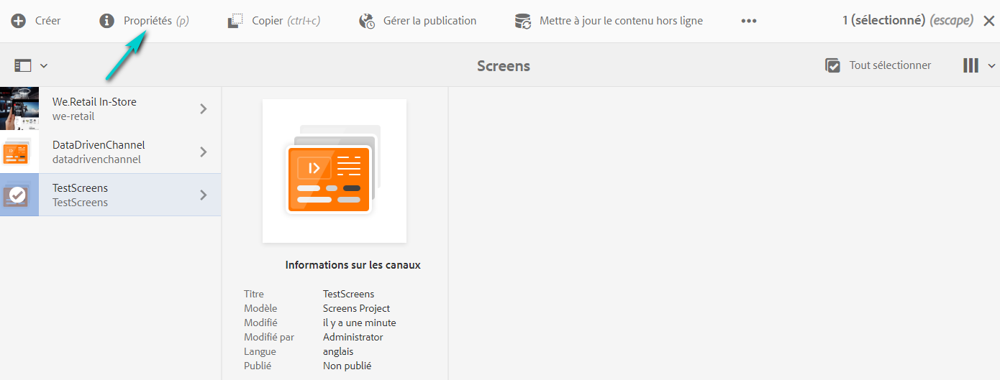

# Créer et gérer des projets {#creating-and-managing-projects}

>[!IMPORTANT]
>Ce contenu est valide pour AEM on-premise/AMS (AEM 6.5LTS et AEM 6.5). Pour le contenu AEM as a Cloud Service Screens, reportez-vous au guide [AEM as a Cloud Service](https://experienceleague.adobe.com/en/docs/experience-manager-cloud-service/content/screens-as-cloud-service/overview/introduction).

Vous pouvez accéder à AEM Screens en sélectionnant le lien Adobe Experience Manager (en haut à gauche), puis Screens.

Vous pouvez également accéder directement à : `http://localhost:4502/screens.html/content/screens`

>[!NOTE]
>**Conseil de navigation :Vous pouvez également utiliser les touches fléchées de votre clavier pour naviguer entre les différents dossiers d’AEM. En outre, après avoir cliqué sur une entité, appuyez sur la barre d’espace pour afficher ou modifier les propriétés de ce dossier.

## Créer un projet Screens

1. Cliquez sur **Screens** dans votre instance AEM.
1. Cliquez sur **Créer un projet Screens**.
1. Saisissez le titre **TestScreens** et cliquez sur **Créer**.

Le projet est à présent créé et vous êtes redirigé vers la console du projet Screens. Vous pouvez désormais cliquer sur votre projet.

Un projet comprend cinq types de dossiers, comme illustré ci-dessous :

* **Planifications**
* **Emplacements**
* **Applications**
* **Appareils**
* **Canaux**

>[!NOTE]
>
>Par défaut, la structure initiale contient les pages principales **Plannings**, **Emplacements**, **Applications**, **Canaux** et **Appareils**, mais vous pouvez les modifier manuellement si besoin. Vous pouvez supprimer les options, si les options disponibles ne sont pas pertinentes pour votre projet.

## Afficher des propriétés {#viewing-properties}

Après avoir créé le projet Screens, cliquez dessus et cliquez sur **Propriétés** dans la barre d’action pour modifier ses propriétés.

Les options suivantes vous permettent de modifier les propriétés de votre projet **TestScreens**.

## Création d’un dossier personnalisé {#creating-a-custom-folder}

Vous pouvez également créer votre propre dossier personnalisé sous les pages principales **Plannings**, **Emplacements**, **Applications**, **Canaux** et **Appareils** disponibles dans votre projet.

Pour créer un dossier personnalisé, procédez comme suit :

1. Cliquez sur votre projet, puis sur **Créer** en regard de l’icône « + » dans la barre d’actions.
1. L’assistant **Créer** s’ouvre, cliquez alors sur l’option appropriée.
1. Cliquez sur **Suivant**.
1. Saisissez les propriétés, puis cliquez sur **Créer**.

Les étapes suivantes montrent comment créer un dossier d’applications dans la page principale **Applications** de **TestScreens**.

### Étapes suivantes {#the-next-steps}

Lorsque vous aurez créé votre propre projet, reportez-vous à la section [Gestion des canaux](managing-channels.md) pour créer et gérer le contenu de votre canal.

