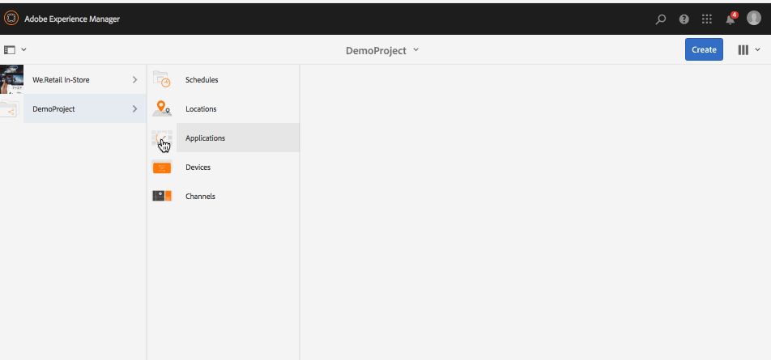

# Création et gestion des projets {#creating-and-managing-projects}

Vous pouvez accéder à AEM Screens en sélectionnant le lien Adobe Experience Manager (en haut à gauche), puis Screens.

Vous pouvez également accéder directement à : `http://localhost:4502/screens.html/content/screens`

Différents projets peuvent être des marques, des déploiements, des clients, etc. différents.

>[!NOTE]
>
>**Conseil de navigation :**
>
>Vous pouvez également utiliser les touches fléchées de votre clavier pour naviguer entre les différents dossiers d’AEM. De plus, une fois que vous avez sélectionné une entité particulière, cliquez sur la barre d’espace pour modifier ou vue les propriétés de ce dossier spécifique.

## Création d’un projet Screens    {#creating-a-new-screens-project}

Suivez les étapes ci-dessous pour créer un projet Screens :

1. Sélectionnez **Screens** dans le tableau de bord AEM.
1. Click **Create** --> **Create Project** and **Create Screens Project** wizard will open.

1. Sélectionnez le modèle **Screens**, puis cliquez sur **Suivant**.

1. Entrez les propriétés (**Titre** et **Nom**) comme indiqué, puis cliquez sur **Créer**.

>[!NOTE]
>
>Par défaut, la structure initiale contient les gabarits **Planifications**, **Emplacements**, **Applications**, **Canaux** et **Périphériques**, mais vous pouvez les modifier manuellement si besoin. Vous pouvez supprimer les options, si les options disponibles ne sont pas pertinentes pour votre projet.

Le projet est à présent créé et vous êtes redirigé vers la console du projet Screens. Vous pouvez sélectionner votre projet.

Un projet comprend quatre types de dossiers, comme illustré dans la figure ci-dessous :

* **Planifications**
* **Emplacements**
* **Applications**
* **Canaux**
* **Périphériques**

### Affichage des propriétés {#viewing-properties}

Une fois que vous aurez créé le projet AEM Screens, cliquez sur **Propriétés** dans la barre d’actions pour modifier ses propriétés.

Les options suivantes vous permettent de modifier les propriétés de votre projet *DemoProject*.

### Création d’un dossier personnalisé {#creating-a-custom-folder}

Vous pouvez également créer votre propre dossier personnalisé sous les gabarits **Planifications**, **Emplacements**, **Applications**, **Canaux** et **Périphériques** disponibles dans votre projet.

Pour créer un dossier personnalisé :

1. Sélectionnez votre projet, puis cliquez sur **Créer** en regard de l’icône « + » dans la barre d’actions.
1. L’assistant **Créer** s’ouvre, vous permettant de sélectionner les options souhaitées.
1. Cliquez sur **Suivant**.
1. Entrez les propriétés, puis cliquez sur **Créer**.

Les étapes suivantes montrent la création d’un dossier d’applications dans le gabarit **Applications** de *DemoProject*.

### Étapes suivantes {#the-next-steps}

Une fois que vous aurez créé votre propre projet, reportez-vous à la section [Gestion des canaux](managing-channels.md) pour créer et gérer le contenu de votre canal.

Vous pouvez également créer votre propre Planification, application, emplacement ou périphérique.
