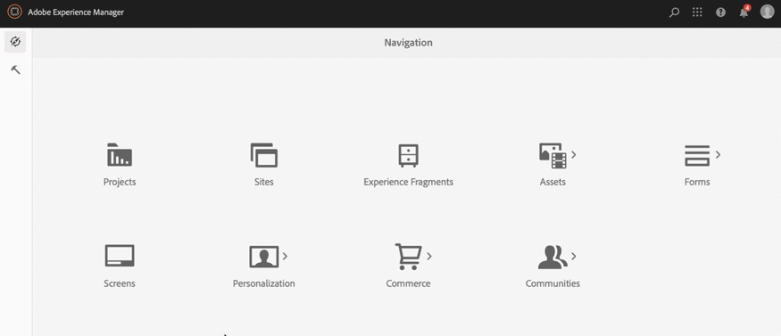

# Création et gestion des projets {#creating-and-managing-projects}

Vous pouvez accéder à AEM Screens en sélectionnant le lien Adobe Experience Manager (en haut à gauche), puis Screens.

Vous pouvez également accéder directement à : `http://localhost:4502/screens.html/content/screens`

>[!NOTE]
>**Conseil de navigation :**
>Vous pouvez également utiliser les touches fléchées de votre clavier pour naviguer entre les différents dossiers d’AEM. En outre, lorsque vous avez sélectionné une entité, vous pouvez appuyer sur la barre d’espace pour afficher ou modifier les propriétés de ce dossier.

## Création d’un projet Screens {#creating-a-new-screens-project}

Suivez les étapes ci-dessous pour créer un projet Screens :

1. Sélectionnez **Screens** dans votre instance AEM.

1. Cliquez sur **Créer un projet Screens**.

1. Saisissez le titre **TestScreens** et cliquez sur **Créer**.

Le projet est à présent créé et vous êtes redirigé vers la console du projet Screens. Vous pouvez sélectionner votre projet.

Un projet comprend cinq types de dossiers, comme illustré dans la figure ci-dessous :

* **Planifications**
* **Emplacements**
* **Applications**
* **Appareils**
* **Canaux**

>[!NOTE]
>
>Par défaut, la structure initiale contient les gabarits **Planifications**, **Emplacements**, **Applications**, **Canaux** et **Périphériques**, mais vous pouvez les modifier manuellement si besoin. Vous pouvez supprimer les options, si les options disponibles ne sont pas pertinentes pour votre projet.

## Affichage des propriétés {#viewing-properties}

Après avoir créé le projet Screens, sélectionnez-le et cliquez sur **Propriétés** dans la barre d’action pour modifier ses propriétés.

Les options suivantes vous permettent de modifier les propriétés de votre projet **TestScreens**.

## Création d’un dossier personnalisé {#creating-a-custom-folder}

Vous pouvez également créer votre propre dossier personnalisé sous les gabarits **Planifications**, **Emplacements**, **Applications**, **Canaux** et **Périphériques** disponibles dans votre projet.

Pour créer un dossier personnalisé :

1. Sélectionnez votre projet, puis cliquez sur **Créer** en regard de l’icône « + » dans la barre d’actions.
1. L’assistant **Créer** s’ouvre, vous permettant de sélectionner les options souhaitées.
1. Cliquez sur **Suivant**.
1. Entrez les propriétés, puis cliquez sur **Créer**.

Les étapes suivantes montrent comment créer un dossier d’applications dans le gabarit de page **Applications** de **TestScreens**.

### Étapes suivantes {#the-next-steps}

Une fois que vous aurez créé votre propre projet, reportez-vous à la section [Gestion des canaux](managing-channels.md) pour créer et gérer le contenu de votre canal.
