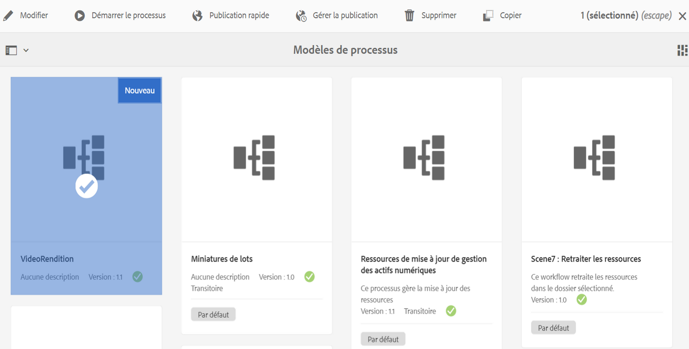
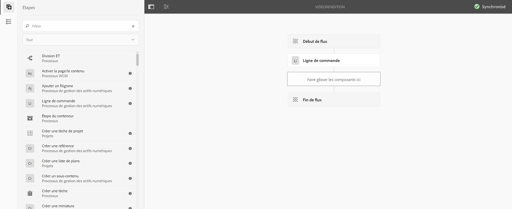
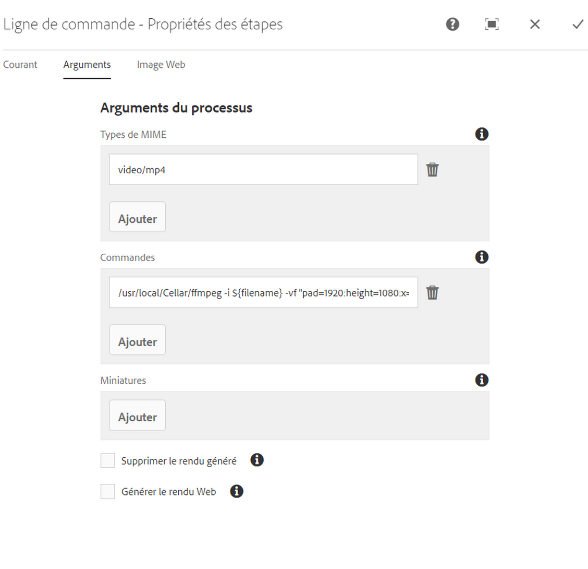
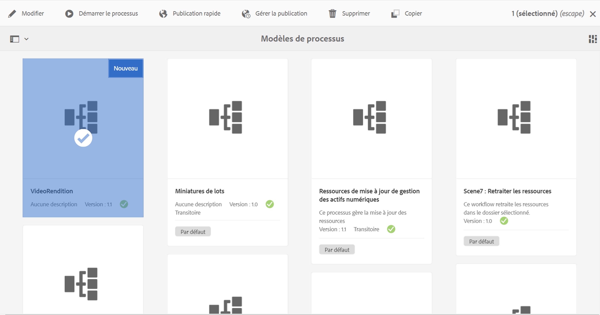
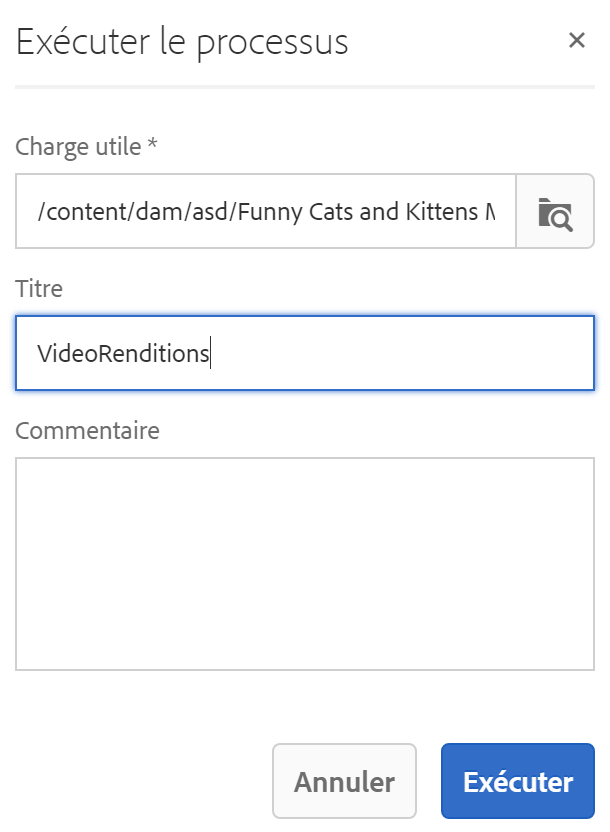
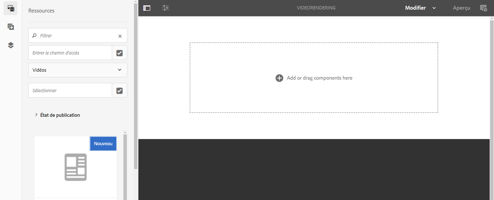
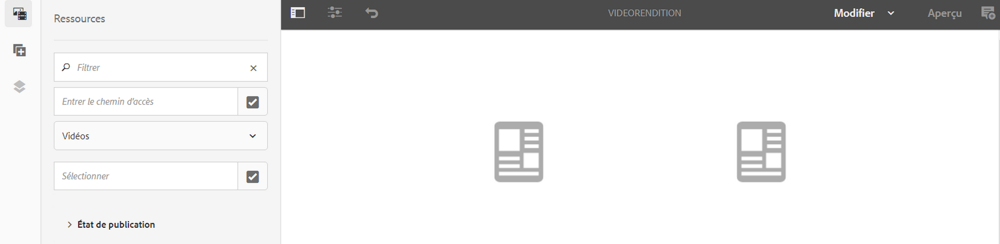
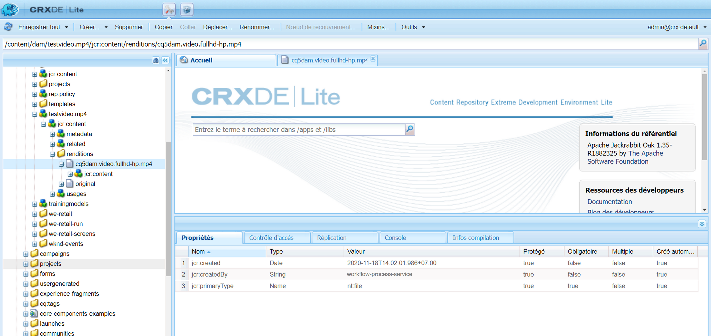

# Création d’un processus de remplissage vidéo {#creating-a-video-padding-workflow}

Cette section couvre les sujets suivants :

* **Présentation**
* **Prérequis**
* **Création d’un processus de remplissage vidéo**
   * **Création d’un processus**
   * **Utilisation du workflow dans le projet AEM Screens**

* **Validation de la sortie pour le processus**

## Présentation {#overview}

Le cas d’utilisation suivant implique de placer une vidéo (par exemple : 1280 x 720) dans un canal où l’affichage est de 1920 x 1080 et où la vidéo doit être placée à 0x0 (en haut à gauche). La vidéo ne doit pas être étirée ni modifiée d’aucune manière et n’utilisez pas **la couverture** dans le composant vidéo.

La vidéo s’affichera sous la forme d’un objet de pixel 1 à pixel 1280 sur et de pixel 1 à pixel 720 vers le bas et le reste du canal sera la couleur par défaut.

## Prérequis {#prerequisites}

Avant de créer un processus pour la vidéo, veuillez remplir les conditions préalables suivantes :

1. Téléchargez une vidéo dans le dossier **Ressources** de votre instance AEM
1. Créez un projet AEM Screens (par exemple, **TestVideoRendition**) et un canal nommé (**VideoRendering**), comme illustré dans la figure ci-dessous :

## Création d’un processus de remplissage vidéo {#creating-a-video-padding-workflow-1}

Pour créer un processus de remplissage vidéo, vous devez créer un processus pour votre vidéo, puis l’utiliser dans le canal de votre projet AEM Screens.

Suivez les étapes ci-dessous pour créer et utiliser le processus :

1. Création d’un processus
1. Utilisation du processus dans un projet AEM Screens

### Création d’un processus {#creating-a-workflow}

Suivez les étapes ci-dessous pour créer un processus pour votre vidéo :

1. Accédez à votre instance AEM et cliquez sur Outils à partir du rail latéral. Sélectionnez **Processus** —> **Modèles** pour créer un nouveau modèle.

   

1. Cliquez sur **Modèles** —> **Créer** —> **Créer un modèle**. Saisissez le **Titre** **VideoRendition** et le **Nom** dans le champ **Ajouter un modèle de processus**. Cliquez sur **Terminé** pour ajouter le modèle de processus.

   

1. Une fois le modèle de processus créé, sélectionnez le modèle (**VideoRendition**), puis cliquez sur **Modifier** dans la barre d’actions.

   

1. Faites glisser et déposez le composant **Ligne de commande** dans votre processus.

   

1. Sélectionnez le composant **Ligne de commande** et ouvrez la boîte de dialogue Propriétés.

   

1. Sélectionnez l’onglet **Arguments** pour renseigner les champs dans la boîte de dialogue **Ligne de commande - Propriétés des étapes**.

   Saisissez le format dans les **Types Mime** (***vidéo/mp4***) et la commande (**/usr/local/Cellar/ffmpeg -i ${filename} -vf &quot;pad=1920:height=1080:x=0:y=0:color=black&quot; cq5dam.video.fullhd-hd.mp4***) pour démarrer le processus dans le champ **Commandes**.

   Veuillez consulter les détails sur les **types Mime** et les **Commandes** dans la note ci-dessous.

   

1. Sélectionnez le processus (**VideoRenditions**) et cliquez sur **Démarrer le processus** dans la barre d’actions pour ouvrir la boîte de dialogue **Exécuter le processus**.

   

1. Sélectionnez le chemin d’accès de votre fichier dans la **charge utile** (***/content/dam/huseinpeyda-crossroads01_512kb 2.mp4***), saisissez le **Titre** ***RunVideo*** et cliquez sur **Exécuter**.

   

### Utilisation du processus dans un projet AEM Screens {#using-the-workflow-in-an-aem-screens-project}

Suivez les étapes ci-dessous pour utiliser le processus dans votre projet AEM Screens :

1. Accédez à un projet AEM Screens (**TestVideoRendition** —> **Canaux** —> **VideoRendition**).

   

1. Cliquez sur **Modifier** dans la barre d’actions. Faites glisser la vidéo que vous avez initialement téléchargée vers **Ressources**.

   

1. Une fois la vidéo téléchargée, cliquez sur **Prévisualiser** pour afficher la sortie.

   

## Validation de la sortie pour le processus {#validating-the-output-for-the-workflow}

Vous pouvez valider votre sortie en procédant comme suit :

* Vérifier l’aperçu de la vidéo dans la chaîne
* Accédez au répertoire ***/content/dam/testvideo.mp4/jcr:content/renditions/cq5dam.video.fullhd-hp.mp4*** dans CRXDE Lite, comme illustré dans la figure ci-dessous :

