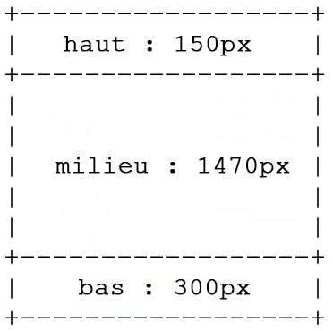

# Création de modèles personnalisés dans des mises en page MultiZone {#creating-custom-templates-multizone}

Cette page explique comment créer un modèle personnalisé dans une mise en page multi-zone.

## Convention de dénomination {#name-terms}

Avant de comprendre comment créer des modèles multi-zone personnalisés à utiliser dans un projet AEM Screens, il est obligatoire de comprendre le verbe des modèles que vous souhaitez créer.

| **Nom de la mise en page** | **Description** |
|---|---|
| Left20-LandscapeHD3Zone | Fait référence à une disposition paysage de 3 zones qui permet de créer 3 zones avec zone 1 comme 20 % de l’écran horizontal et vertical de gauche, zone 2 comme 80 % de l’écran horizontal et 20 % de l’écran vertical de droite justifiés, zone 3 comme 100 % de l’écran horizontal et 80 % de l’écran vertical avec un format de 16:9 |
| Upper20-PortraitHD2Zone | Fait référence à un modèle portrait à 2 zones qui couvre 20 % de l’écran depuis le haut, avec un rapport L/H de 16:9 |
| Right20-LandscapeSD3Zone | Fait référence à un modèle à 3 zones qui couvre 20 % de l’écran depuis la droite, avec un rapport L/H de 4:3 |

## Exemples de cas d’utilisation {#example-use-cases}

## Création d’une mise en page Left20-LandscapeHD3Zone {#landscape-layout-one}

Suivez la section ci-dessous pour créer un modèle personnalisé avec la configuration suivante :

* **Left20** fait référence à la zone supérieure sur la gauche couvrant 20 % de la taille de l’écran horizontal et vertical.
* **Paysage** fait référence à l’orientation de l’écran.
* **HD** fait référence au format 16:9
* **3Zone** fait référence à trois zones de l’affichage

## Représentation visuelle de la mise en page multi-zone {#multi-layout-visual-one}

La disposition Left20-LandscapeHD3Zone vous permet de créer la disposition multi-zone suivante dans votre projet :


## Création d’une mise en page Upper20-PortraitHD2Zone {#landscape-layout-two}

Suivez la section ci-dessous pour créer un modèle personnalisé avec la configuration suivante :





## Création d’un modèle personnalisé avec une configuration spécifique {#basic-flow-setting}

Suivez les étapes ci-dessous pour créer un modèle personnalisé.

1. Créez le modèle dans `/apps/<project>/templates/my-custom-layout`

   ```shell
    <?xml version="1.0" encoding="UTF-8"?>
    <jcr:root xmlns:sling="http://sling.apache.org/jcr/sling/1.0" xmlns:cq="http://www.day.com/jcr/cq/1.0" xmlns:jcr="http://www.jcp.org/jcr/1.0" xmlns:nt="http://www.jcp.org/jcr/nt/1.0"
    jcr:description="My Custom 3-zones layout "
    jcr:primaryType="cq:Template"
    jcr:title="3-zones layout"
    allowedParents="[/libs/screens/core/templates/channelfolder]"
    allowedPaths="[/content/screens(/.*)?]"
    ranking="{Long}20000">
    <jcr:content
        cq:cssClass="aem-Layout aem-Layout--3x1 my-CustomLayout"
        cq:designPath="/apps/settings/wcm/designs/<project>"
        cq:deviceGroups="[mobile/groups/responsive]"
        jcr:primaryType="cq:PageContent"
        sling:resourceSuperType="screens/core/components/channel"
        sling:resourceType="screens/core/components/multiscreenchannel">
        <r1c1
            cq:cssClass="aem-LayoutCell--1-1 my-CustomLayout-top"
            jcr:primaryType="nt:unstructured"
            sling:resourceType="wcm/foundation/components/responsivegrid"/>
        <r2c1
            cq:cssClass="aem-LayoutCell--1-1 my-CustomLayout-middle"
            jcr:primaryType="nt:unstructured"
            sling:resourceType="wcm/foundation/components/responsivegrid"/>
        <r3c1
            cq:cssClass="aem-LayoutCell--1-1 my-CustomLayout-bottom"
            jcr:primaryType="nt:unstructured"
            sling:resourceType="wcm/foundation/components/responsivegrid"/>
        <cq:responsive jcr:primaryType="nt:unstructured">
            <breakpoints jcr:primaryType="nt:unstructured"/>
        </cq:responsive>
        <offline-config/>
    </jcr:content>
   </jcr:root>
   ```

1. Créez une conception de page dans `/apps/settings/wcm/designs/<project>`.

   >[!NOTE]
   >
   >Assurez-vous que le `cq:designPath` code ci-dessus correspond au chemin.

1. Mettez à jour le nœud **Configuration hors ligne** pour que la conception pointe également vers le nouveau chemin.

1. Ajoutez un fichier **static.css** dans le dossier `/apps/settings/wcm/designs/<project>` et définissez son contenu sur

   ```shell
   .cq-Screens-channel--multizone.my-CustomLayout {}
   .cq-Screens-channel--multizone.my-CustomLayout .my-CustomLayout-top { height: 150px; }
   .cq-Screens-channel--multizone.my-CustomLayout .my-CustomLayout-middle { height: 1470px; }
   .cq-Screens-channel--multizone.my-CustomLayout .my-CustomLayout-bottom { height: 300px; }
   ```

## Insertion d’une image en tant que calque d’arrière-plan {#inserting-image}

Vous pouvez définir une image comme calque d’arrière-plan sur la disposition :

Vous pouvez ajuster la règle CSS pour utiliser un « data-uri » et intégrer directement dans l’image (codée en base 64) du fichier CSS.

Cela se fait comme suit :
`.cq-Screens-channel--multizone.my-CustomLayout { background: url('data:image/…;base64,…') no-repeat center center; }`

Vous pouvez également suivre les étapes ci-dessous :

1. Vérifiez que l’image est incluse d’une manière ou d’une autre dans la configuration hors ligne du canal.
1. Utilisez un lien direct vers l’image dans le fichier CSS ci-dessus, au lieu de la variante « data-uri ».


## Mise à jour de la couleur d’arrière-plan {#updating-color}

Pour modifier la couleur d’arrière-plan, ajoutez le code suivant au fichier xml :

`.cq-Screens-channel--multizone.my-CustomLayout { background-color: …; }`


