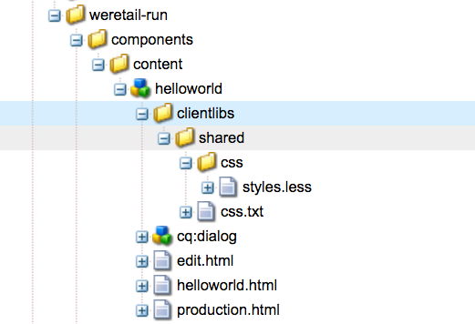

# Développement d’un composant personnalisé pour AEM Screens {#developing-a-custom-component-for-aem-screens}

Le tutoriel suivant décrit les étapes à suivre pour créer un composant personnalisé pour AEM Screens. AEM Screens réutilise de nombreux modèles de conception et technologies existants d’autres produits AEM. Ce tutoriel met en évidence les différences et les considérations spéciales lors du développement pour AEM Screens.

## Présentation {#overview}

Ce tutoriel est destiné aux développeurs qui découvrent AEM Screens. Dans ce tutoriel, un simple composant « Hello World » est créé pour un canal de séquence dans AEM Screens. Une boîte de dialogue permet aux auteurs de mettre à jour le texte affiché.


## Conditions préalables {#prerequisites}

Pour terminer ce tutoriel, vous devez :

1. [AEM 6.5](https://helpx.adobe.com/fr/experience-manager/6-4/release-notes.html ) ou [AEM 6.3](https://helpx.adobe.com/fr/experience-manager/6-3/release-notes.html) + dernier Feature Pack Screens

1. [Lecteur AEM Screens](https://helpx.adobe.com/experience-manager/6-4/sites/deploying/using/configuring-screens-introduction.html)
1. Environnement de développement local

Les étapes du tutoriel et les captures d’écran sont effectuées à l’aide de **CRXDE-Lite**. Vous pouvez également utiliser des IDE pour compléter le tutoriel. Vous trouverez plus d’informations sur l’utilisation d’un IDE pour le développement [avec AEM ici.](https://helpx.adobe.com/experience-manager/kt/sites/using/getting-started-wknd-tutorial-develop/part1.html#eclipse-ide)


## Configuration du projet {#project-setup}

Le code source d’un projet Screens est généralement géré sous la forme d’un projet Maven multimodule. Pour accélérer le tutoriel, un projet a été prégénéré à l’aide de l’[Archétype de projet AEM 13](https://github.com/Adobe-Marketing-Cloud/aem-project-archetype). Vous trouverez plus de détails sur la [création d’un projet avec l’archétype de projet Maven AEM ici](https://helpx.adobe.com/experience-manager/kt/sites/using/getting-started-wknd-tutorial-develop/part1.html#maven-multimodule).

1. Téléchargez et installez les packages suivants à l’aide du [gestionnaire de packages CRX](http://localhost:4502/crx/packmgr/index.jsp) :

   [Obtenir le fichier](assets/base-screens-weretail-runuiapps-001-snapshot.zip)

   [Obtenir le fichier](assets/base-screens-weretail-runuicontent-001-snapshot.zip)
   **Facultatif** Si vous travaillez avec Eclipse ou un autre IDE, vous pouvez télécharger le package source ci-dessous. Déployez le projet sur une instance AEM locale à l’aide de la commande Maven :

   **`mvn -PautoInstallPackage clean install`**

   Démarrage du projet HelloWorld SRC Screens We.Retail Run

   [Obtenir le fichier](assets/src-screens-weretail-run.zip)

1. Dans [CRX Package Manager](http://localhost:4502/crx/packmgr/index.jsp), vérifiez que les deux packages suivants sont installés :

   1. **screens-weretail-run.ui.content-0.0.1-SNAPSHOT.zip**
   1. **screens-weretail-run.ui.apps-0.0.1-SNAPSHOT.zip**

   

   Packages Ui.Apps et Ui.Content Screens We.Retail Run installés via CRX Package Manager

1. Le package **screens-weretail-run.ui.apps** installe le code sous `/apps/weretail-run`.

   Ce package contient le code responsable du rendu des composants personnalisés du projet. Ce package comprend le code de composant et tout code JavaScript ou CSS nécessaire. Ce paquet incorpore également **screens-weretail-run.core-0.0.1-SNAPSHOT.jar** qui contient tout code Java requis par le projet.

   >[!NOTE]
   >
   >Dans ce tutoriel, aucun code Java n’est écrit. Si une logique commerciale plus complexe est nécessaire, le Java d’appui peut être créé et déployé à l’aide du lot Java principal.

   

   Représentation du code ui.apps dans CRXDE Lite

   Le composant **helloworld** n’est actuellement qu’un espace réservé. Au cours du tutoriel, une fonctionnalité sera ajoutée pour permettre à un auteur de mettre à jour le message affiché par le composant.

1. Le package **screens-weretail-run.ui.content** installe le code sous :

   * `/conf/we-retail-run`
   * `/content/dam/we-retail-run`
   * `/content/screens/we-retail-run`

   Ce paquet contient le contenu de départ et la structure de configuration nécessaires pour le projet. **`/conf/we-retail-run`** contient toutes les configurations pour le projet We.Retail Run. **`/content/dam/we-retail-run`** inclut les ressources numériques de départ pour le projet. **`/content/screens/we-retail-run`** contient la structure de contenu Screens. Le contenu sous tous ces chemins est principalement mis à jour dans AEM. Pour assurer la cohérence entre les environnements (local, Dev, Stage, Prod), une structure de contenu de base est souvent enregistrée dans le contrôle des sources.

1. **Accédez au projet AEM Screens > We.Retail Run :**

   Dans le menu Démarrer d’AEM > Cliquez sur l’icône Screens. Vérifiez que le projet d’exécution We.Retail est visible.

   

## Création du composant Hello World {#hello-world-cmp}

Le composant Hello World est un composant simple qui permet à un utilisateur de saisir un message à afficher à l’écran. Le composant est basé sur le [Modèle de composant AEM Screens : https://github.com/Adobe-Marketing-Cloud/aem-screens-component-template](https://github.com/Adobe-Marketing-Cloud/aem-screens-component-template).

AEM Screens présente des contraintes intéressantes qui ne sont pas nécessairement vraies pour les composants des sites WCM traditionnels.

* La plupart des composants Screens doivent s’exécuter en plein écran sur les périphériques de signalisation numérique de la cible.
* La plupart des composants Screens doivent être incorporables dans les canaux de séquence pour générer des diaporamas.
* La création doit permettre de modifier individuellement les composants d’un canal de séquence, de sorte que le rendu en mode plein écran est hors de question.

1. Dans **CRXDE-Lite** `http://localhost:4502/crx/de/index.jsp` (ou l’IDE choisi), accédez à `/apps/weretail-run/components/content/helloworld.`

   Ajoutez les propriétés suivantes au composant `helloworld` :

   ```
       jcr:title="Hello World"
       sling:resourceSuperType="foundation/components/parbase"
       componentGroup="We.Retail Run - Content"
   ```

   

   Propriétés de /apps/weretail-run/components/content/helloworld

   Le composant **helloworld** étend le composant **fondation/composants/parbase** afin qu’il puisse être correctement utilisé dans un canal de séquence.

1. Sous `/apps/weretail-run/components/content/helloworld`, créez un fichier appelé `helloworld.html.`

   Remplissez le fichier avec les éléments suivants :

   ```xml
   <!--/*
   
    /apps/weretail-run/components/content/helloworld/helloworld.html
   
   */-->
   
   <!--/* production: preview authoring mode + unspecified mode (i.e. on publish) */-->
   <sly data-sly-test.production="${wcmmode.preview || wcmmode.disabled}" data-sly-include="production.html" />
   
   <!--/* edit: any other authoring mode, i.e. edit, design, scaffolding, etc. */-->
   <sly data-sly-test="${!production}" data-sly-include="edit.html" />
   ```

   Les composants Screens nécessitent deux rendus différents selon le [mode de création](https://helpx.adobe.com/experience-manager/6-4/sites/authoring/using/author-environment-tools.html#PageModes) utilisé :

   1. **Production**: Mode Aperçu ou Publication (wcmmode=disabled)
   1. **Modifier** : utilisé pour tous les autres modes de création, c’est-à-dire éditer, concevoir, échafauder, développeur...

   `helloworld.html`fonctionne comme un commutateur, en vérifiant quel mode de création est actuellement actif et en redirigeant vers un autre script HTML. Une convention commune utilisée par les composants Screens consiste à utiliser un script `edit.html` pour le mode d’édition et un script `production.html` pour le mode de production.

1. Sous `/apps/weretail-run/components/content/helloworld`, créez un fichier appelé `production.html.`

   Remplissez le fichier avec les éléments suivants :

   ```xml
   <!--/*
    /apps/weretail-run/components/content/helloworld/production.html
   
   */-->
   
   <div data-duration="${properties.duration}" class="cmp-hello-world">
    <h1 class="cmp-hello-world__message">${properties.message}</h1>
   </div>
   ```

   Ci-dessus se trouve les balises de production du composant Hello World. Un attribut `data-duration` est inclus, car le composant est utilisé sur un canal de séquence. L’attribut `data-duration` est utilisé par le canal de séquence pour savoir pendant combien de temps un élément de séquence doit être affiché.

   Le composant effectue le rendu d’un `div` et d’une balise `h1` avec du texte. `${properties.message}` est une partie de script HTL qui génère le contenu d’une propriété JCR nommée `message`. Une boîte de dialogue est créée ultérieurement pour permettre à l’utilisateur de saisir une valeur pour le texte de la propriété `message`.

   Notez également que la notation BEM (Block Element Modifier) est utilisée avec le composant. BEM est une convention de codage CSS qui facilite la création de composants réutilisables. Il s’agit de la notation utilisée par les [composants de base d’AEM](https://github.com/Adobe-Marketing-Cloud/aem-core-wcm-components/wiki/CSS-coding-conventions). Vous trouverez plus d’informations à l’adresse : [https://getbem.com/](https://getbem.com/)

1. Sous `/apps/weretail-run/components/content/helloworld`, créez un fichier appelé `edit.html.`

   Remplissez le fichier avec les éléments suivants :

   ```xml
   <!--/*
   
    /apps/weretail-run/components/content/helloworld/edit.html
   
   */-->
   
   <!--/* if message populated */-->
   <div
    data-sly-test.message="${properties.message}"
    class="aem-Screens-editWrapper cmp-hello-world">
    <p class="cmp-hello-world__message">${message}</p>
   </div>
   
   <!--/* empty place holder */-->
   <div data-sly-test="${!message}"
        class="aem-Screens-editWrapper cq-placeholder cmp-hello-world"
        data-emptytext="${'Hello World' @ i18n, locale=request.locale}">
   </div>
   ```

   Ci-dessus se trouve l’annotation de modification du composant Hello World. Le premier bloc affiche une version de modification du composant si le message de boîte de dialogue a été renseigné.

   Le second bloc est rendu si aucun message de boîte de dialogue n’a été saisi. Dans ce cas, `cq-placeholder` et `data-emptytext` peuvent afficher le libellé ***Hello World*** en guise d’espace réservé. La chaîne du libellé peut être internationalisée en utilisant i18n afin de prendre en charge la création pour plusieurs paramètres régionaux.

1. **Boîte de dialogue Copier l’image Screens à utiliser pour le composant Hello World.**

   Il est plus facile de commencer à partir d’une boîte de dialogue existante, puis d’effectuer des modifications.

   1. Copiez la boîte de dialogue depuis : `/libs/screens/core/components/content/image/cq:dialog`
   1. Collez la boîte de dialogue sous `/apps/weretail-run/components/content/helloworld`

   

1. **Mettre à jour la boîte de dialogue Hello World afin d’inclure un onglet pour le message.**

   Mettez à jour la boîte de dialogue afin qu’elle corresponde à ce qui suit. La structure de nœud JCR de la boîte de dialogue finale est présentée ci-dessous en XML :

   ```xml
   <?xml version="1.0" encoding="UTF-8"?>
   <jcr:root xmlns:sling="https://sling.apache.org/jcr/sling/1.0" xmlns:cq="https://www.day.com/jcr/cq/1.0" xmlns:jcr="https://www.jcp.org/jcr/1.0" xmlns:nt="https://www.jcp.org/jcr/nt/1.0"
       jcr:primaryType="nt:unstructured"
       jcr:title="Hello World"
       sling:resourceType="cq/gui/components/authoring/dialog">
       <content
           jcr:primaryType="nt:unstructured"
           sling:resourceType="granite/ui/components/coral/foundation/tabs"
           size="L">
           <items jcr:primaryType="nt:unstructured">
               <message
                   jcr:primaryType="nt:unstructured"
                   jcr:title="Message"
                   sling:resourceType="granite/ui/components/coral/foundation/fixedcolumns">
                   <items jcr:primaryType="nt:unstructured">
                       <column
                           jcr:primaryType="nt:unstructured"
                           sling:resourceType="granite/ui/components/coral/foundation/container">
                           <items jcr:primaryType="nt:unstructured">
                               <message
                                   jcr:primaryType="nt:unstructured"
                                   sling:resourceType="granite/ui/components/coral/foundation/form/textfield"
                                   fieldDescription="Message for component to display"
                                   fieldLabel="Message"
                                   name="./message"/>
                           </items>
                       </column>
                   </items>
               </message>
               <sequence
                   jcr:primaryType="nt:unstructured"
                   jcr:title="Sequence"
                   sling:resourceType="granite/ui/components/coral/foundation/fixedcolumns">
                   <items jcr:primaryType="nt:unstructured">
                       <column
                           jcr:primaryType="nt:unstructured"
                           sling:resourceType="granite/ui/components/coral/foundation/container">
                           <items jcr:primaryType="nt:unstructured">
                               <duration
                                   jcr:primaryType="nt:unstructured"
                                   sling:resourceType="granite/ui/components/coral/foundation/form/numberfield"
                                   defaultValue=""
                                   fieldDescription="Amount of time the image will be shown in the sequence, in milliseconds"
                                   fieldLabel="Duration (ms)"
                                   min="0"
                                   name="./duration"/>
                           </items>
                       </column>
                   </items>
               </sequence>
           </items>
       </content>
   </jcr:root>
   ```

   Le champ de texte du message est enregistré dans une propriété nommée `message` et que le champ de nombre de la durée sera enregistré dans une propriété nommée `duration`. Ces deux propriétés sont toutes deux référencées dans `/apps/weretail-run/components/content/helloworld/production.html` par HTL en tant que `${properties.message}` et `${properties.duration}`.

   

   Hello World - Boîte de dialogue terminée

## Création de bibliothèques côté client {#clientlibs}

Les bibliothèques côté client offrent un mécanisme d’organisation et de gestion des fichiers CSS et JavaScript nécessaires à une mise en œuvre d’AEM.

Les composants d’AEM Screens s’affichent différemment en mode d’édition et en mode d’aperçu/de production. Deux bibliothèques clientes seront créées, une pour le mode d’édition et une autre pour l’aperçu/production.

1. Création de dossier pour les bibliothèques côté client pour le composant Hello World.

   Sous `/apps/weretail-run/components/content/helloworld`, créez un dossier appelé `clientlibs`.

   

1. Sous le dossier `clientlibs`, créez un nœud appelé `shared` de type `cq:ClientLibraryFolder.`

   

1. Ajoutez les propriétés suivantes à la bibliothèque cliente partagée :

   * `allowProxy` | Booléen | `true`

   * `categories`| Chaîne[] | `cq.screens.components`

   

   Propriétés de /apps/weretail-run/components/content/helloworld/clientlibs/shared

   La propriété catégories est une chaîne qui identifie la bibliothèque cliente. La catégorie cq.screens.components est utilisé en mode Edition et Aperçu/Production. Par conséquent, tout fichier CSS/JS défini dans la bibliothèque sharedclientlib est chargé dans tous les modes.

   Il est recommandé de ne jamais exposer directement les chemins d’accès à /apps dans un environnement de production. La propriété allowProxy garantit que la bibliothèque cliente CSS et JS est référencée par le biais d’un préfixe of/etc.clientlibs.

1. Créez un fichier appelé `css.txt` sous le dossier partagé.

   Remplissez le fichier avec les éléments suivants :

   ```
   #base=css
   
   styles.less
   ```

1. Créez un dossier appelé `css` sous le dossier `shared`. Ajoutez un fichier appelé `style.less` sous le dossier `css`. La structure des bibliothèques clientes doit maintenant ressembler à celle-ci :

   

   Dans ce tutoriel, au lieu d’écrire des CSS directement, on utilise LESS. [LESS](https://lesscss.org/) est un précompilateur CSS répandu prenant en charge les mixins, fonctions et variables CSS. Les bibliothèques clientes AEM prennent en charge la compilation LESS de manière native. Il est possible d’utiliser Sass ou d’autres précompilateurs, mais la compilation doit être réalisée en dehors d’AEM.

1. Remplissez `/apps/weretail-run/components/content/helloworld/clientlibs/shared/css/styles.less` avec les éléments suivants :

   ```css
   /**
       Shared Styles
      /apps/weretail-run/components/content/helloworld/clientlibs/shared/css/styles.less
   
   **/
   
   .cmp-hello-world {
       background-color: #fff;
   
    &__message {
     color: #000;
     font-family: Helvetica;
     text-align:center;
    }
   }
   ```

1. Copiez et collez le dossier de bibliothèque client `shared` pour créer une nouvelle bibliothèque cliente nommée `production`.

   

   Copiez la bibliothèque cliente partagée pour créer une nouvelle bibliothèque cliente de production

1. Mettez à jour la propriété `categories` de la bibliothèque cliente de production pour la définir comme `cq.screens.components.production.`

   Cela permet de s’assurer que les styles sont chargés uniquement en mode Aperçu/Production.

   

   Propriétés de /apps/weretail-run/components/content/helloworld/clientlibs/production

1. Remplissez `/apps/weretail-run/components/content/helloworld/clientlibs/production/css/styles.less` avec les éléments suivants :

   ```css
   /**
       Production Styles
      /apps/weretail-run/components/content/helloworld/clientlibs/production/css/styles.less
   
   **/
   .cmp-hello-world {
   
       height: 100%;
       width: 100%;
       position: fixed;
   
    &__message {
   
     position: relative;
     font-size: 5rem;
     top:25%;
    }
   }
   ```

   Les styles ci-dessus affichent le message centré au milieu de l’écran, mais uniquement en mode de production.

Une troisième catégorie de bibliothèque cliente : `cq.screens.components.edit` peut être utilisée pour ajouter des styles de modification spécifiques au composant.

| Catégorie de bibliothèque cliente | Utilisation |
|---|---|
| `cq.screens.components` | Styles et scripts partagés entre les modes d’édition et de production |
| `cq.screens.components.edit` | Styles et scripts utilisés uniquement en mode d’édition |
| `cq.screens.components.production` | Styles et scripts utilisés uniquement en mode de production |

## Création d’une page de conception {#design-page}

AEM Screens utilise des [Modèles de page statiques](https://helpx.adobe.com/experience-manager/6-5/sites/developing/using/page-templates-static.html) et des [Configurations de conception](https://helpx.adobe.com/experience-manager/6-4/sites/authoring/using/default-components-designmode.html) pour les modifications globales. Les configurations de conception sont fréquemment utilisées pour configurer les composants autorisés pour le Parsys sur un canal. Il est recommandé de stocker ces configurations d’une manière spécifique à l’application.

Une page de conception d’exécution We.Retail est créée ci-dessous pour stocker toutes les configurations spécifiques au projet d’exécution We.Retail.

1. Dans **CRXDE-Lite** `http://localhost:4502/crx/de/index.jsp#/apps/settings/wcm/designs`, accédez à `/apps/settings/wcm/designs`
1. Créez un nœud sous le dossier designs, nommé `we-retail-run` avec un type de `cq:Page`.
1. Sous la page `we-retail-run`, ajoutez un autre nœud nommé `jcr:content` de type `nt:unstructured`. Ajoutez les propriétés suivantes au nœud `jcr:content` :

   | Nom | Type | Valeur |
   |---|---|---|
   | jcr:title | Chaîne | Exécution We.Retail |
   | sling:resourceType | Chaîne | wcm/core/components/designer |
   | cq:doctype | Chaîne | html_5 |

   

   Page de conception à /apps/settings/wcm/designs/we-retail-run

## Création d’un canal de séquence {#create-sequence-channel}

Le composant Hello World est destiné à être utilisé dans un canal de séquence. Pour tester le composant, un nouveau canal de séquence est créé.

1. Dans le menu Démarrer d’AEM, accédez à **Screens** > **We.Retail.Ru** n > et sélectionnez **Canaux**.

1. Cliquez sur le bouton **Créer**

   1. Choisir **Créer une entité**

   

1. Dans l’assistant de création :

1. Étape du modèle - choisissez **Canal de séquence**

   1. Étape des propriétés
   * Onglet de base > Titre = **Canal inactif**
   * Onglet Canal > Cochez **Passer le canal en ligne**

   

1. Ouvrez les propriétés de la page pour le canal inactif. Mettez à jour le champ Conception pour qu’il pointe vers `/apps/settings/wcm/designs/we-retail-run,`la page de conception créée dans la section précédente.

   

   Configuration de conception pointant vers /apps/settings/wcm/designs/we-retail-run

1. Modifiez le canal inactif nouvellement créé pour l’ouvrir.

1. Basculez le mode Page vers le mode **Conception**

   1. Cliquez sur l’icône en forme de **clé à molette** dans les paramètres pour configurer les composants autorisés.

   1. Sélectionnez le groupe **Screens** et le groupe **We Retail Run - Contenu**.

   

1. Passez la page en mode **Modifier**. Le composant Hello World peut désormais être ajouté à la page et combiné avec d’autres composants de canal de séquence.

   

1. Dans **CRXDE-Lite** `http://localhost:4502/crx/de/index.jsp#/apps/settings/wcm/designs/we-retail-run/jcr%3Acontent/sequencechannel/par`, accédez à `/apps/settings/wcm/designs/we-retail-run/jcr:content/sequencechannel/par`. Notez que la `components` propriété inclut désormais `group:Screens`, `group:We.Retail Run - Content`.

   

   Configuration de la conception sous /apps/settings/wcm/designs/we-retail-run

## Modèle pour les gestionnaires personnalisés {#custom-handlers}

Si votre composant personnalisé utilise des actifs externes, notamment des ressources (images, vidéos, polices, icônes, etc.), des rendus de ressources spécifiques ou des bibliothèques côté client (css, js, etc.), ils ne sont pas automatiquement ajoutés à la configuration hors ligne, car nous n’assemblons que le balisage HTML par défaut.

Pour vous permettre de personnaliser et d’optimiser les ressources exactes téléchargées dans le lecteur, nous mettons à votre disposition un mécanisme d’extension pour les composants personnalisés afin qu’ils indiquent leurs dépendances à la logique de mise en cache hors ligne de Screens.

La section ci-dessous présente le modèle des gestionnaires personnalisés de ressources hors ligne et les exigences minimales du fichier `pom.xml` pour ce projet spécifique.

```java
package …;

import javax.annotation.Nonnull;

import org.apache.felix.scr.annotations.Component;
import org.apache.felix.scr.annotations.Reference;
import org.apache.felix.scr.annotations.Service;
import org.apache.sling.api.resource.Resource;
import org.apache.sling.api.resource.ResourceUtil;
import org.apache.sling.api.resource.ValueMap;

import com.adobe.cq.screens.visitor.OfflineResourceHandler;

@Service(value = OfflineResourceHandler.class)
@Component(immediate = true)
public class MyCustomHandler extends AbstractResourceHandler {

 @Reference
 private …; // OSGi services injection

 /**
  * The resource types that are handled by the handler.
  * @return the handled resource types
  */
 @Nonnull
 @Override
 public String[] getSupportedResourceTypes() {
     return new String[] { … };
 }

 /**
  * Accept the provided resource, visit and traverse it as needed.
  * @param resource The resource to accept
  */
 @Override
 public void accept(@Nonnull Resource resource) {
     ValueMap properties = ResourceUtil.getValueMap(resource);
     
     /* You can directly add explicit paths for offline caching using the `visit`
        method of the visitor. */
     
     // retrieve a custom property from the component
     String myCustomRenditionUrl = properties.get("myCustomRenditionUrl", String.class);
     // adding that exact asset/rendition/path to the offline manifest
     this.visitor.visit(myCustomRenditionUrl);
     
     
     /* You can delegate handling for dependent resources so they are also added to
        the offline cache using the `accept` method of the visitor. */
     
     // retrieve a referenced dependent resource
     String referencedResourcePath = properties.get("myOtherResource", String.class);
     ResourceResolver resolver = resource.getResourceResolver();
     Resource referencedResource = resolver.getResource(referencedResourcePath);
     // let the handler for that resource handle it
     if (referencedResource != null) {
         this.visitor.accept(referencedResource);
     }
   }
}
```

Le code ci-dessous indique les exigences minimales du fichier `pom.xml` pour ce projet spécifique :

```css
   <dependencies>
        …
        <!-- Felix annotations -->
        <dependency>
            <groupId>org.apache.felix</groupId>
            <artifactId>org.apache.felix.scr.annotations</artifactId>
            <version>1.9.0</version>
            <scope>provided</scope>
        </dependency>

        <!-- Screens core bundle with OfflineResourceHandler/AbstractResourceHandler -->
        <dependency>
            <groupId>com.adobe.cq.screens</groupId>
            <artifactId>com.adobe.cq.screens</artifactId>
            <version>1.5.90</version>
            <scope>provided</scope>
        </dependency>
        …
      </dependencies>
```

## Assemblage {#putting-it-all-together}

La vidéo ci-dessous montre le composant terminé et comment l’ajouter à un canal de séquence. Le canal est ensuite ajouté à un emplacement, puis affecté à un lecteur Screens.

>[!VIDEO](https://video.tv.adobe.com/v/22385?quaity=9)

## Code terminé {#finished-code}

Vous trouverez ci-dessous le code final du tutoriel. **screens-weretail-run.ui.apps-0.0.1-SNAPSHOT.zip** et **screens-weretail-run.ui.content-0.0.1-SNAPSHOT.zip** sont les packages AEM compilés. **SRC-screens-weretail-run-0.0.1.zip **est le code source non compilé qui peut être déployé à l’aide de Maven.

[Obtenir le fichier](assets/screens-weretail-runuiapps-001-snapshot.zip)

[Obtenir le fichier](assets/screens-weretail-runuicontent-001-snapshot.zip)

[Obtenir le fichier](assets/screens-weretail-run.zip)
