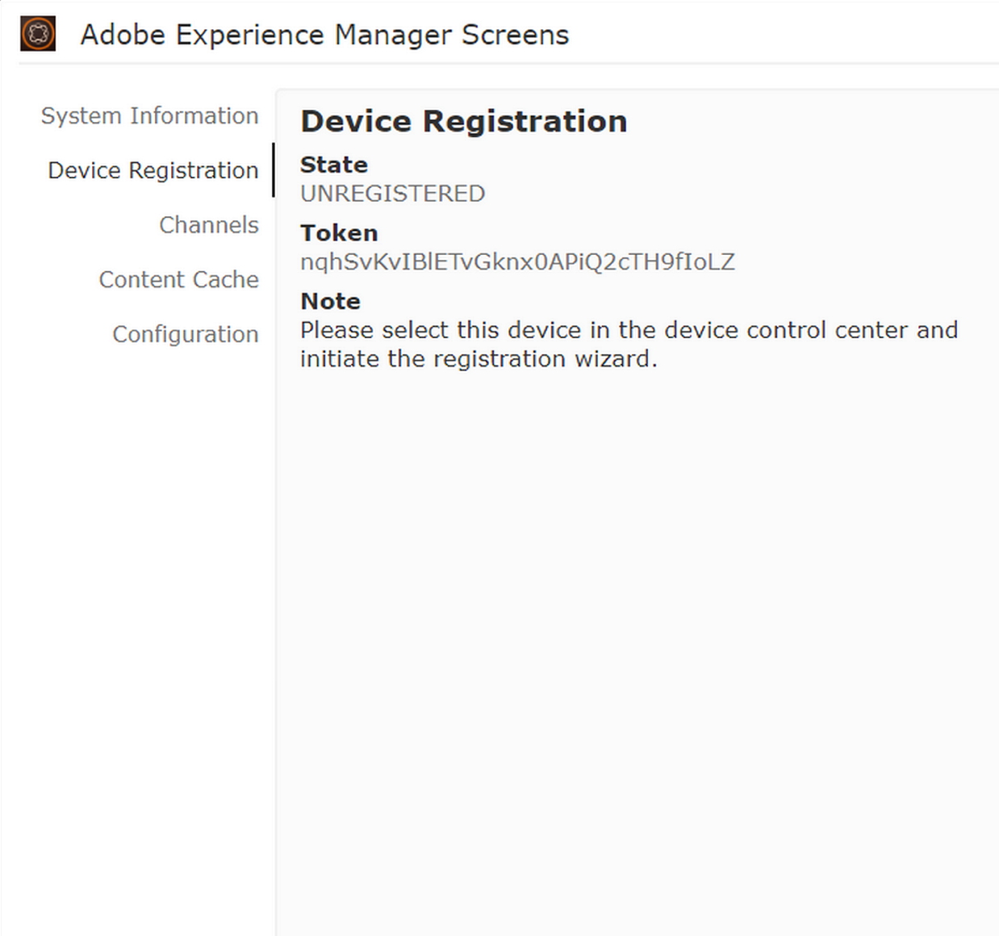

# Enregistrement de périphériques {#device-registration}

La page suivante décrit le processus d’enregistrement des périphériques dans un projet AEM Screens.

## Enregistrement d’un périphérique {#registering-a-device}

Le processus d’enregistrement des périphériques est effectué sur 2 machines distinctes :

* Périphérique actuel à enregistrer, par exemple Affichage de signalétique.
* Serveur AEM utilisé pour enregistrer votre périphérique.

>[!NOTE]
>
>Une fois que vous avez téléchargé le dernier lecteur Windows (*.exe*), à partir de la page de téléchargement [du lecteur AEM 6.4](https://download.macromedia.com/screens/), suivez les étapes du lecteur pour terminer l’installation ad hoc :
>
>1. Appuyez longuement dans l’angle supérieur gauche pour ouvrir le panneau d’administration.
>1. Accédez à **Configuration** à partir du menu d’actions de gauche, saisissez l’adresse de l’emplacement de l’instance AEM dans **Serveur** et cliquez sur **Enregistrer**.
>1. Cliquez sur le lien **Enregistrement** dans le menu d’actions de gauche et suivez les étapes ci-dessous pour terminer le processus d’enregistrement du périphérique.

>


1. Sur votre périphérique, démarrez le lecteur AEM Screens. L’interface utilisateur d’enregistrement s’affiche.

   

1. Dans AEM, accédez au dossier **Périphériques** de votre projet.

   >[!NOTE]
   >
   >Pour en savoir plus sur la création d’un nouveau projet pour Screens dans le tableau de bord AEM, voir [Création et gestion d’un projet Screens](creating-a-screens-project.md).

1. Appuyez/cliquez sur le bouton **Gestionnaire de périphériques** dans la barre d’actions.

   

1. Appuyez/cliquez sur le bouton **Enregistrement de périphérique** en haut à droite.

   

1. Sélectionnez le périphérique requis (comme pour l’étape 1) et appuyez/cliquez sur **Enregistrer le périphérique**.

   

1. Dans AEM, attendez que le périphérique envoie son code d’enregistrement.

   

1. Sur votre périphérique, vérifiez le **code d’enregistrement**.

   

1. Si le **Code d’enregistrement** est le même sur les deux machines, appuyez/cliquez sur le bouton **Valider** dans AEM, comme indiqué à l’étape (6).
1. Saisissez le nom souhaité pour le périphérique, puis cliquez sur **Enregistrer**.

   

1. Appuyez/cliquez sur **Terminer** pour terminer le processus d’enregistrement.

   

   >[!NOTE]
   >
   >L’option **Enregistrer nouveau** vous permet d’enregistrer un nouveau périphérique.
   >
   >Le bouton **Attribuer l’affichage** permet d’ajouter directement le périphérique à un affichage.

   Si vous cliquez sur **Terminer**, vous devez attribuer le périphérique à un affichage.

   

   >[!NOTE]
   >
   >Pour en savoir plus sur la création et la gestion d’un affichage pour votre projet Screens, consultez [Création et gestion des affichages](managing-displays.md).

### Attribution d’un périphérique à un affichage {#assigning-device-to-a-display}

Si vous n’avez pas attribué le périphérique à un affichage, procédez comme suit pour attribuer le périphérique à un affichage dans votre projet AEM Screens :

1. Sélectionnez le périphérique et cliquez sur **Attribuer le périphérique** dans la barre d’actions.

   

1. Sélectionnez le chemin d’accès de l’affichage dans **Chemin de configuration de l’écran/appareil**.

   

1. Cliquez sur **Attribuer** lorsque vous sélectionnez le chemin.

   

1. Cliquez sur **Terminer** une fois que le périphérique a été attribué, comme illustré dans la figure ci-dessous.

   

   De plus, vous pouvez afficher le tableau de bord de l’affichage en cliquant sur **Terminer**.

   

## Restrictions relatives à l’enregistrement de périphériques {#limitations-on-device-registration}

Les restrictions de mot de passe utilisateur à l’échelle du système peuvent entraîner l’échec de l’enregistrement du périphérique. L’enregistrement du périphérique utilise un mot de passe généré de manière aléatoire pour créer l’utilisateur du périphérique.

Si le mot de passe est limité par la configuration *AuthorizableActionProvider*, il se peut que la création de l’utilisateur de périphérique échoue.

>[!NOTE]
>
>Le mot de passe aléatoire actuel se compose de 36 caractères ASCII ; la plage s’étend de 33 à 122 (presque exclusivement des caractères spéciaux).

```java
25.09.2016 16:54:03.140 *ERROR* [59.100.121.82 [1474844043109] POST /content/screens/svc/registration HTTP/1.1] com.adobe.cq.screens.device.registration.impl.RegistrationServlet Error during device registration
javax.jcr.nodetype.ConstraintViolationException: Password violates password constraint (^(?=.*\d).{7,9}$).
        at org.apache.jackrabbit.oak.spi.security.user.action.PasswordValidationAction.validatePassword(PasswordValidationAction.java:105)
        at org.apache.jackrabbit.oak.spi.security.user.action.PasswordValidationAction.onPasswordChange(PasswordValidationAction.java:76)
        at org.apache.jackrabbit.oak.security.user.UserManagerImpl.onPasswordChange(UserManagerImpl.java:308)
```

### Ressources supplémentaires {#additional-resources}

Pour en savoir plus sur le lecteur AEM Screens, voir [Lecteur AEM Screens](working-with-screens-player.md).
