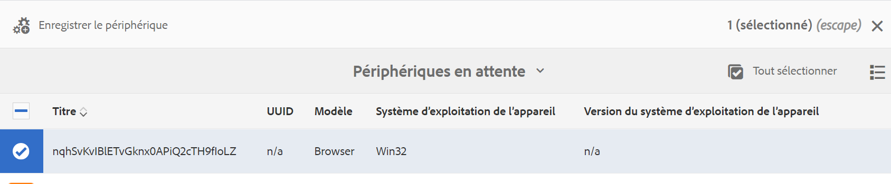

# Enregistrement d’appareils {#device-registration}

La page suivante décrit le processus d’enregistrement des appareils dans un projet AEM Screens.

## Enregistrement d’un appareil {#registering-a-device}

Le processus d’enregistrement des appareils est effectué sur deux machines distinctes :

* L’appareil à enregistrer, par exemple votre affichage de signalétique.
* Le serveur AEM utilisé pour enregistrer votre appareil.

>[!NOTE]
>
>Après avoir téléchargé le dernier lecteur Windows (*.exe*), à partir de la page [Téléchargements du lecteur AEM 6.4](https://download.macromedia.com/screens/), suivez les étapes du lecteur pour terminer l’installation ad hoc :
>
>1. Appuyez longuement dans l’angle supérieur gauche pour ouvrir le panneau d’administration.
>1. Accédez à **Configuration** à partir du menu d’actions de gauche, saisissez l’adresse de l’emplacement de l’instance AEM dans **Serveur** et cliquez sur **Enregistrer**.
>1. Cliquez sur le lien **Enregistrement** dans le menu d’actions de gauche et suivez les étapes ci-dessous pour terminer le processus d’enregistrement de l’appareil.
>


1. Sur votre appareil, démarrez le lecteur AEM Screens. L’interface utilisateur d’enregistrement s’affiche.

   

1. Dans AEM, accédez au dossier **Appareils** de votre projet.

   >[!NOTE]
   >
   >Pour en savoir plus sur la création d’un projet pour Screens dans le tableau de bord AEM, voir [Création et gestion d’un projet Screens](creating-a-screens-project.md).

1. Cliquez sur le bouton **Gestionnaire de périphériques** dans la barre d’actions.

   

1. Cliquez sur le bouton **Enregistrement de périphérique** en haut à droite.

   

1. Cliquez sur l’appareil requis (comme pour l’étape 1) et cliquez sur **Enregistrer le périphérique**.

   

1. Dans AEM, attendez que l’appareil envoie son code d’enregistrement.

   

1. Sur votre appareil, vérifiez le **code d’enregistrement**.

   

1. Si le **Code d’enregistrement** est le même sur les deux machines, cliquez sur le bouton **Valider** dans AEM, comme indiqué à l’étape (6).
1. Saisissez le nom souhaité pour l’appareil, puis cliquez sur **Enregistrer**.

   

1. Cliquez sur **Terminer** pour terminer le processus d’enregistrement.

   

   >[!NOTE]
   >
   >L’option **Enregistrer nouveau** vous permet d’enregistrer un nouvel appareil.
   >
   >Le bouton **Attribuer l’affichage** permet d’ajouter directement l’appareil à un affichage.

   Si vous cliquez sur **Terminer**, attribuez l’appareil à un affichage.

   

   >[!NOTE]
   >
   >Pour en savoir plus sur la création et la gestion d’un affichage pour votre projet Screens, voir [Création et gestion des affichages](managing-displays.md).

### Attribution d’un appareil à un affichage {#assigning-device-to-a-display}

Si vous n’avez pas attribué l’appareil à un affichage, procédez comme suit pour attribuer l’appareil à un affichage dans votre projet AEM Screens :

1. Cliquez sur l’appareil, puis sur **Attribuer le périphérique** dans la barre d’actions.

   

1. Cliquez sur le chemin d’accès de l’affichage dans **Chemin de configuration de l’écran/appareil**.

   

1. Cliquez sur **Attribuer** lorsque vous cliquez sur le chemin.

   

1. Cliquez sur **Terminer** une fois que l’appareil a été attribué, comme illustré dans la figure ci-dessous.

   

   Vous pouvez également afficher le tableau de bord de l’affichage en sélectionnant **Terminer**.

   

## Recherche d’un appareil à partir du gestionnaire d’appareils {#search-device}

Lorsque vous avez enregistré des appareils sur votre lecteur, vous pouvez les afficher depuis l’interface d’utilisation du Gestionnaire de périphériques.

1. Accédez à l’interface utilisateur du Gestionnaire de périphériques à partir de votre projet AEM Screens, par exemple **DemoScreens** > **Appareils**.

1. Cliquez sur le dossier **Appareils**, puis sur **Gestionnaire de périphériques** dans la barre d’actions.

   

1. La liste des appareils enregistrés s’affiche.

1. Si vous disposez d’une longue liste d’appareils enregistrés, vous pouvez désormais effectuer une recherche à l’aide de l’icône de recherche de la barre d’actions.

   

   Ou,

   Sélectionnez `/` (barre oblique) pour appeler la fonctionnalité de recherche.

   


### Limites de la fonctionnalité de recherche {#limitations}

* L’utilisateur ou l’utilisatrice peut rechercher n’importe quel mot existant dans l’*ID d’appareil* ou le *Nom de l’appareil*.

  >[!NOTE]
  >Il est recommandé de créer les noms d’appareils à l’aide de plusieurs mots, comme *`Boston Store Lobby`*, plutôt qu’en un seul, comme *`BostonStoreLobby`*.

* Si vous avez créé des noms d’appareils tels que *`Boston Store Lobby`*, n’importe quel mot est recherché : *`boston`*, *`store`*, ou *`lobby`*. Cependant, si le nom de l’appareil est *`BostonStoreLobby`*, une recherche portant sur *`boston`* ne renvoie aucun résultat.

* Le caractère générique `*` est pris en charge pour la recherche. Si vous souhaitez rechercher tous les appareils dont le nom commence par *`boston`*, vous pouvez utiliser *`boston`**.

* Si le nom de l’appareil est *`BostonStoreLobby`*, la recherche de *`boston`* ne renvoie pas de résultat. Par contre, l’utilisation de *`boston`** dans vos critères de recherche renvoie un résultat.

## Restrictions relatives à l’enregistrement d’appareils {#limitations-on-device-registration}

Les restrictions de mot de passe utilisateur à l’échelle du système peuvent entraîner l’échec de l’enregistrement de l’appareil. L’enregistrement de l’appareil utilise un mot de passe généré de manière aléatoire pour créer l’utilisateur ou l’utilisatrice de l’appareil.

Si la configuration *AuthorizableActionProvider* limite le mot de passe, la création de l’utilisateur ou de l’utilisatrice de l’appareil peut échouer.

>[!NOTE]
>
>Le mot de passe aléatoire généré actuel est composé de 36 caractères ASCII, entre 33 et 122 (inclut quasiment tous les caractères spéciaux).

```java
25.09.2016 16:54:03.140 *ERROR* [59.100.121.82 [1474844043109] POST /content/screens/svc/registration HTTP/1.1] com.adobe.cq.screens.device.registration.impl.RegistrationServlet Error during device registration
javax.jcr.nodetype.ConstraintViolationException: Password violates password constraint (^(?=.*\d).{7,9}$).
        at org.apache.jackrabbit.oak.spi.security.user.action.PasswordValidationAction.validatePassword(PasswordValidationAction.java:105)
        at org.apache.jackrabbit.oak.spi.security.user.action.PasswordValidationAction.onPasswordChange(PasswordValidationAction.java:76)
        at org.apache.jackrabbit.oak.security.user.UserManagerImpl.onPasswordChange(UserManagerImpl.java:308)
```

### Autres ressources {#additional-resources}

Pour en savoir plus sur le lecteur AEM Screens, voir [Lecteur AEM Screens](working-with-screens-player.md).
