# Utilisation d’une séquence incorporée dynamique {#using-dynamic-embedded-sequence}

L’utilisation de séquences incorporées dynamiques couvre les rubriques suivantes :

* **Présentation**
* **Utilisation de l’expérience incorporée dynamique dans AEM Screens**
* **Affichage des résultats**
* **Restriction des utilisateurs et modification des listes de contrôle d’accès**

## Présentation {#overview}

***Les séquences incorporées dynamiques*** sont créées pour les projets de grande envergure qui respectent la hiérarchie enfant-parent, où l’enfant est référencé dans un dossier d’emplacement et non dans un dossier de canal. Cela permet à l’utilisateur d’incorporer une séquence à l’intérieur d’un canal par ***Rôle de canal***. Cela permet à l’utilisateur de définir des espaces réservés spécifiques à un emplacement pour différents bureaux à l’aide d’une séquence incorporée dans un canal principal.

Lorsque vous attribuez un canal à un affichage, vous avez la possibilité de spécifier le chemin de l’affichage ou le Rôle du canal dont la résolution pointe vers un canal réel en fonction du contexte.

Pour utiliser la séquence incorporée dynamique, il faut affecter un canal par ***rôle de canal***. Le rôle du canal définit le contexte de l’affichage. Le rôle est ciblé par diverses actions ; il est indépendant du canal qui remplit le rôle. Cette section décrit un cas d’utilisation qui définit les canaux par rôle et comment vous pouvez exploiter ce contenu dans un canal global. Vous pouvez également considérer le rôle comme un identifiant pour l’attribution ou comme un alias pour le canal dans le contexte.

### Avantages de l’utilisation de séquences incorporées dynamiques {#benefits-of-using-dynamic-embedded-sequences}

L’avantage principal du placement d’un canal de séquence à l’intérieur d’un emplacement au lieu du dossier de canaux est de permettre aux auteurs locaux ou régionaux de modifier le contenu qui les intéresse sans pour autant pouvoir modifier des canaux situés à un niveau supérieur de la hiérarchie.

La définition du *Canal par rôle* permet de créer une version locale d’un canal pour résoudre dynamiquement un contenu spécifique à un emplacement et créer également un canal global qui tire parti du contenu pour les canaux spécifiques à un emplacement.

>[!NOTE]
>
>**Séquences incorporées ou Séquences incorporées dynamiques**
>
>Une séquence incorporée dynamique est semblable à une séquence incorporée, mais permet à l’utilisateur de suivre une hiérarchie où les modifications/mises à jour effectuées sur un canal sont propagées aux autres canaux liés. Elle respecte une hiérarchie parent-enfant et comprend également des ressources telles que des images ou des vidéos.
>
>Les ***séquences incorporées dynamiques*** permettent d’afficher du contenu spécifique à l’emplacement, tandis que les ***séquences incorporées*** affichent uniquement un diaporama général du contenu. De plus, lors de la configuration des séquences incorporées dynamiques, vous devez configurer le canal à l’aide du rôle et du nom du canal. Veuillez consulter les étapes ci-dessous pour un exemple d’implémentation concrète.
>
>Pour en savoir plus sur l’implémentation de séquences incorporées, reportez-vous à la section Séquences [incorporées](embedded-sequences.md) dans AEM Screens.

L’exemple suivant fournit une solution en se concentrant sur les termes clés suivants :

* un ***canal de séquence principal*** pour la séquence globale
* composants de ***séquence incorporée dynamique*** pour chaque partie localement personnalisable de la séquence
* ***canaux de séquence individuels*** dans les emplacements respectifs avec un *rôle* dans l’affichage correspondant au **rôle *du composant de séquence incorporée dynamique*.**

>[!NOTE]
>
>Pour en savoir plus sur l’attribution des canaux, voir **[Attribution des canaux](channel-assignment.md)** dans la section Création de la documentation relative à AEM Screens.

## Utilisation d’une séquence incorporée dynamique {#using-dynamic-embedded-sequence-2}

La section suivante explique la création d’une séquence incorporée dynamique dans un canal AEM Screens.

### Prérequis {#prerequisites}

Avant de commencer à implémenter cette fonctionnalité, veillez à ce que les conditions préalables suivantes sont satisfaites avant de commencer à implémenter des séquences incorporées dynamiques :

* Création d’un projet AEM Screens (dans cet exemple, **Demo**)

* Créer un canal dénommé **global** sous le dossier **Canaux**

* Ajouter du contenu à votre canal **Global** (*Veuillez vérifier **Resources.zip**pour connaître les ressources appropriées*)

L’image suivante montre le projet **Demo** avec le canal **Global** dans le dossier **Canaux**.
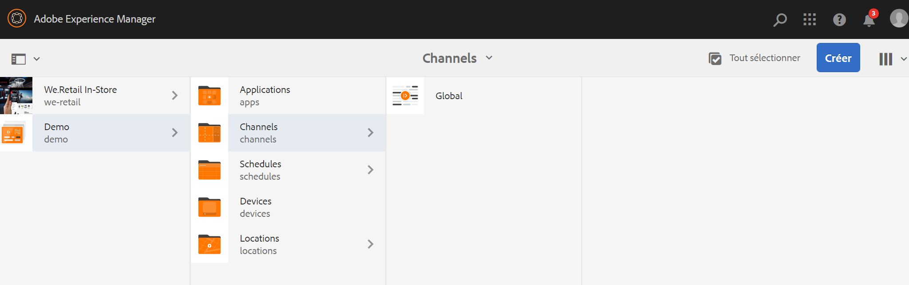

### Ressources {#resources}

Vous pouvez télécharger les ressources suivantes (images et les ajouter aux ressources) et les utiliser comme contenu de canal à des fins de démonstration.

[Obtenir le fichier](assets/resources.zip)

>[!NOTE]
>
>Pour plus d’informations sur la création d’un projet et la création d’un canal de séquence, reportez-vous aux ressources ci-dessous :
>
>* **[Création et gestion des projets](creating-a-screens-project.md)**
>* **[Gestion d’un canal](managing-channels.md)**

>

Séquence incorporée dynamique dans un projet AEM Screens implique trois tâches principales :

1. **Configuration de la taxonomie du projet, y compris les canaux, emplacements et écrans**
1. **Création d’une planification**
1. **Attribution d’une planification à chaque affichage**

Suivez les étapes ci-dessous pour mettre en œuvre la fonctionnalité :

>[!CAUTION]
>
>Lors de l’implémentation de séquences incorporées dynamiques, prêtez attention aux champs **Nom** et **Titre** lors de la création de canaux sous chaque emplacement. Veuillez suivre attentivement les instructions relatives à la nomenclature.

1. **Créez deux dossiers Emplacements.**

   Accédez au dossier **Emplacements** dans votre projet AEM Screens et créez deux dossiers d’emplacement : **Région A** et **Région B**.

   >[!NOTE]
   >
   >Lors de la création du dossier d’emplacement **Région A**, veillez à saisir le **Titre** **Région A**. Vous pouvez laisser le champ **Nom** vide, afin que le nom **région-a** soit automatiquement sélectionné.
   >
   >Il en va de même pour la création du dossier d’emplacement **Région B**, comme illustré ci-dessous :

   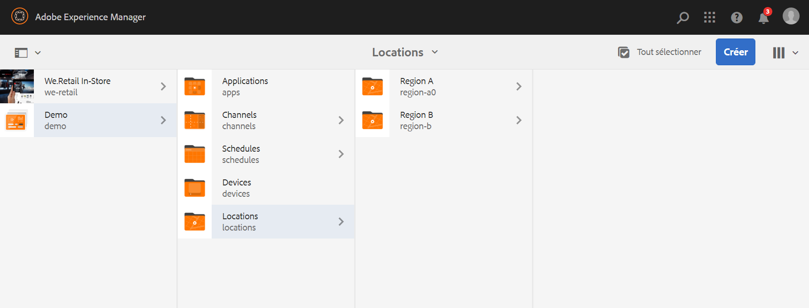

   >[!NOTE]
   >Pour savoir comment créer un emplacement, reportez-vous à **[Création et gestion des emplacements](managing-locations.md)**.

1. **Créez deux emplacements et un canal sous chaque dossier d’emplacement.**

   1. Accédez à **Demo** —> **Emplacements** —> **Région A**.
   1. Sélectionnez **Région A**, puis cliquez sur **+ Créer** dans la barre d’actions.
   1. Sélectionnez **Emplacement** dans l’assistant avec le **Titre** **Magasin 1**. De même, créez un autre emplacement dans l’assistant intitulé **Magasin 2** pour **Titre** **Magasin 2**. Vous pouvez laisser le champ **Nom** vide lors de la création de **Magasin 1** et **Magasin 2**.
   1. Répétez l’étape (b) et sélectionnez maintenant **Canal de séquence** dans l’assistant. Saisissez le **Titre** **Région A** et le **Nom** **région** pour ce canal.

   >[!CAUTION]
   >
   >Lors de la création du canal **Région A**, veillez à saisir le **Titre** **Région A** et le **Nom** **région**.

   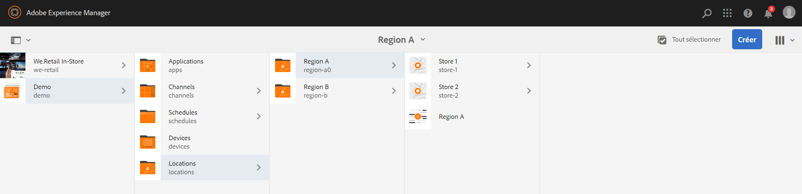

   De même, créez deux emplacements dans la **Région B**, intitulés **Magasin 3** et **Magasin 4**. Créez également un **Canal de séquence** avec pour **Titre** **Région B** et pour **Nom** **région**.

   >[!CAUTION]
   >
   >Veillez à utiliser le même nom pour les canaux créés dans **Région A** et **Région B**, à savoir **région**.

   

1. **Créez Affichage et Canal sous chaque emplacement.**

   1. Accédez à **Démo** —> **Emplacements** —> **Région A** —> **Magasin 1**.
   1. Sélectionnez **Région 1** puis cliquez sur **+Créer** dans la barre d’actions.
   1. Sélectionnez **Affichage** dans l’assistant et créez l’affichage **AffichageMagasin1.**
   1. Répétez l’étape (b) et sélectionnez cette fois **Canal de séquence** dans l’assistant. Saisissez le **Titre** **CanalMagasin1** et le **Nom** **magasin.**

   >[!CAUTION]
   >
   >Lorsque vous créez un canal de séquence, vous pouvez choisir librement le **titre** du canal, mais le **Nom** doit être identique dans tous les canaux locaux.
   >Dans cet exemple, les canaux de la **Région A** et de la **Région B** partagent le même **Nom** que la **région** et les canaux du **Magasin 1**, **Magasin 2**, **Magasin 3** et **Magasin 4** partagent le même **Nom**, à savoir **magasin**.

   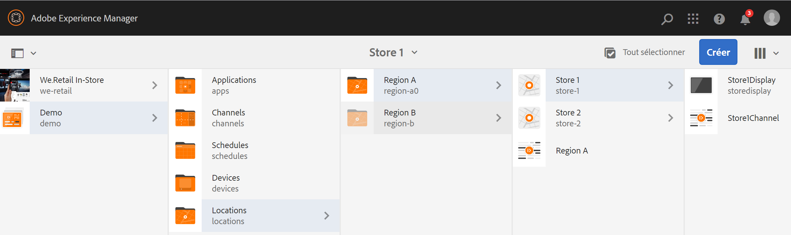

   De même, créez un affichage **AffichageMagasin2** et un canal **CanalMagasin2** sous **Magasin 2** (avec le nom **magasin**).

   >[!NOTE]
   >Veillez à utiliser le même nom pour les canaux créés dans **Magasin 1** et **Magasin 2**, à savoir **magasin**.

   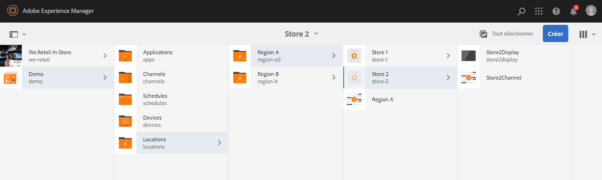

   Suivez les étapes ci-dessus pour créer un canal et l’afficher dans **Magasin 3** et la **Magasin 4** sous la **Région B**. Encore une fois, veillez à utiliser le même **Nom**, à savoir **magasin** lors de la création des canaux **CanalMagasin3** et **CanalMagasin4** respectivement.

   L’image suivante présente l’affichage et le canal dans **Magasin 3**.

   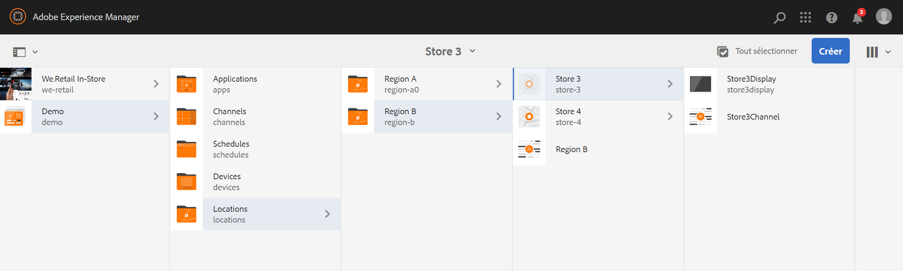

   L’image suivante présente l’affichage et le canal dans **Magasin 4**.

   

1. **Ajoutez du contenu aux canaux dans leurs emplacements respectifs.**

   Accédez à **Démo** -> **Emplacements** -> **Région A** -> **Région A** et cliquez sur **Modifier** dans la barre d’actions. Faites glisser-déposer les ressources à ajouter au canal.

   >[!NOTE]
   >Vous pouvez utiliser le fichier ***Resources.zip*** de la section **Ressources** ci-dessus pour utiliser les images comme ressources pour le contenu de votre canal.

   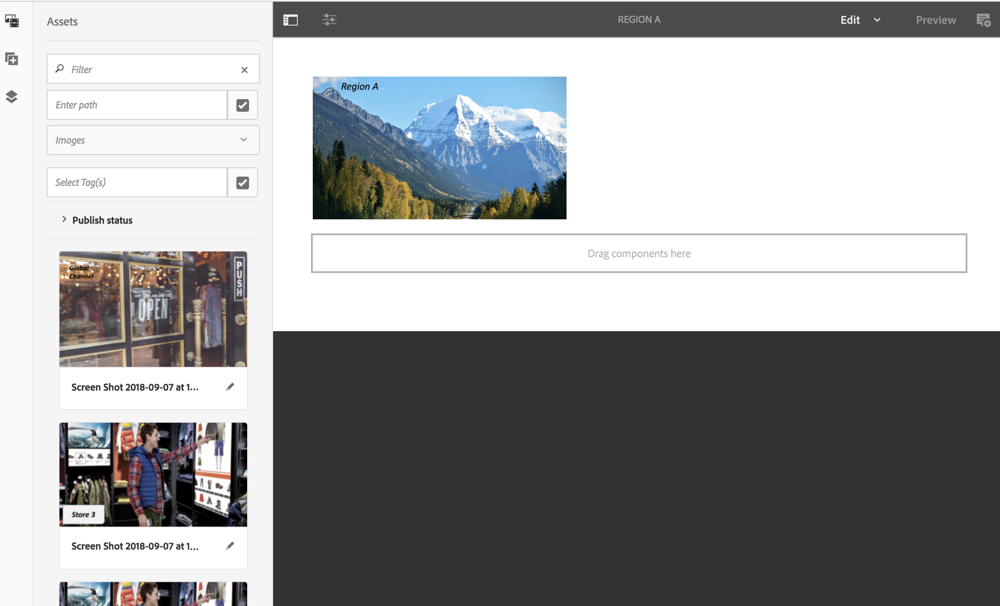

   De même, accédez à la **Démo** -> **Emplacements** -> **Région B** -> **Région B** et cliquez sur **Modifier** de la barre d’actions pour faire glisser les ressources vers votre canal, comme illustré ci-dessous :

   

   Suivez les étapes précédentes et les ressources pour ajouter du contenu aux canaux suivants :

   * **CanalMagasin1**
   * **CanalMagasin2**
   * **CanalMagasin3**
   * **CanalMagasin4**

1. **Créer un calendrier**

   Accédez au dossier **Planifications** et sélectionnez-le dans votre projet AEM Screens, puis cliquez sur **Créer** dans la barre d’actions pour créer une planification.

   L’image suivante montre le **AdSchedule** créé dans le projet **Demo**.

   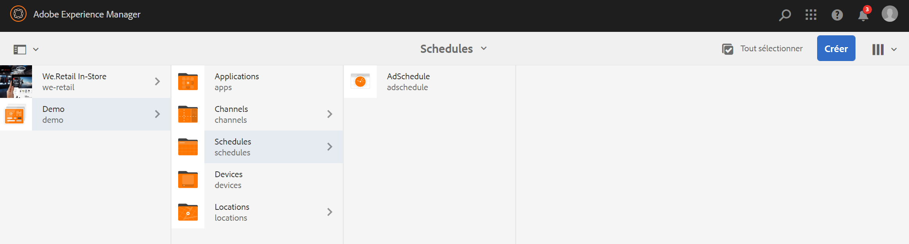

1. **Attribuer des canaux à une planification**

   1. Accédez à **Demo** —> **Planifications** —> **AdSchedule** et cliquez sur **Tableau de bord** dans la barre d’actions.
   1. Cliquez sur **+ Attribuer le canal** depuis le panneau **CANAUX ATTRIBUÉS** pour ouvrir la boîte de dialogue **Attribution de canaux**.
   1. Sélectionnez **Canal de référence**. par chemin.
   1. Sélectionnez le **Chemin du canal** **Démo** --> ***Canaux*** --> ***Global***.
   1. Définissez le **rôle du canal** sur **GlobalAdSegment**.
   1. Sélectionnez les **Événements pris en charge** **Chargement initial**, **écran d’inactivité** et **Interaction utilisateur**.
   1. Cliquez sur **Enregistrer**.

   **Attribution d’un canal par rôle pour la région :**

   1. Cliquez sur **+ Attribuer le canal** depuis le panneau **CANAUX ATTRIBUÉS** pour ouvrir la boîte de dialogue **Attribution de canaux**.
   1. Sélectionnez **Canal de référence**. par nom.
   1. Saisissez comme **Nom du canal** **région***.
   1. Définissez le **rôle du canal** sur **RegionAdSegment**.
   1. Cliquez sur **Enregistrer**.

   **Attribution d’un canal par rôle pour le magasin :**

   1. Cliquez sur **+ Attribuer le canal** depuis le panneau **CANAUX ATTRIBUÉS** pour ouvrir la boîte de dialogue **Attribution de canaux**.
   1. Sélectionnez **Canal de référence**. par nom.
   1. Saisissez le **Nom du canal** **magasin**.
   1. Définissez le **Rôle du canal** sur **StoreAdSegment**.
   1. Cliquez sur **Enregistrer**.

   L’image suivante montre les canaux attribués par chemin et par rôle.

   

1. **Configuration d’une séquence incorporée dynamique sur le canal global.**

   Accédez au canal **Global**, que vous avez initialement créé dans le projet **Demo**.

   Cliquez sur **Modifier** dans la barre d’actions pour ouvrir l’éditeur

   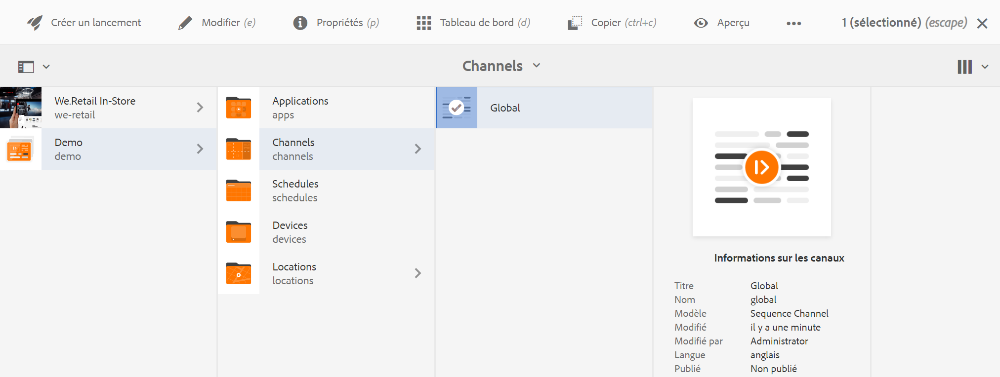

   Faites glisser et déposez deux composants de **séquence incorporée dynamique** dans l’éditeur de canaux.

   Ouvrez les propriétés de l’un des composants et saisissez le rôle **d’attribution de canaux** sous la forme **RegionAdSegment**.

   De même, sélectionnez l’autre composant et ouvrez les propriétés pour saisir le rôle **d’attribution de canaux** **StoreAdSegment**.

   

1. **Attribution d’une planification à chaque affichage**

   1. Accédez à chaque affichage, par exemple **Demo** —> **Emplacements** —> **Région A** —> **Magasin 1** —> **AffichageMagasin1**.
   1. Pour ouvrir le tableau de bord des affichages, cliquez sur **Tableau de bord** dans la barre d’actions.
   1. Cliquez sur **...** dans le panneau **CANAUX ET PLANIFICATIONS AFFECTÉS**, puis sur **+Attribuer une planification**.
   1. Sélectionnez le chemin d’accès au calendrier (par exemple, ici, **Démo** —> **Planifications** —>**AdSchedule**).
   1. Cliquez sur **Enregistrer**.

## Affichage des résultats {#viewing-the-results}

Une fois que vous aurez configuré les canaux et l’affichage, veuillez lancer le lecteur AEM Screens pour afficher le contenu.

>[!NOTE]
>
>Pour en savoir plus sur le lecteur AEM Screens, consultez les ressources suivantes :
>
>* [Téléchargements du lecteur AEM Screens](https://download.macromedia.com/screens/)
>* [Utilisation du lecteur AEM Screens](working-with-screens-player.md)

La sortie suivante confirme le contenu de votre canal dans le lecteur AEM Screens, selon le chemin d’affichage.

**Scénario 1**:

Si vous attribuez le chemin d’affichage **Démo** --> **Emplacements** --> **Région A** --> **Magasin 1** --> **AffichageMagasin1**, le contenu suivant s’affichera sur votre lecteur AEM Screens.

**Scénario 1**:

Si vous attribuez le chemin d’affichage comme **Démo** --> **Emplacements** --> **Région B** --> **Magasin 3** --> **AffichageMagasin3**, le contenu suivant s’affiche sur votre lecteur AEM Screens.

## Restriction des utilisateurs et modification des listes de contrôle d’accès {#restricting-users-and-modifying-the-acls}

Vous pouvez créer des auteurs globaux, régionaux ou locaux afin de pouvoir modifier le contenu qui les concerne sans possibilité de modifier des canaux situés à un niveau supérieur de la hiérarchie.

Vous devez modifier les listes de contrôle d’accès pour limiter l’accès des utilisateurs aux contenus en fonction de leur emplacement.

### Exemple de cas d’utilisation {#example-use-case}

L’exemple suivant vous permet de créer trois utilisateurs pour le projet de démonstration ci-dessus.

Les privilèges sont attribués à chaque groupe comme suit :

**Groupes** :

* **Global-Auteur** : comprend les utilisateurs qui ont accès à tous les emplacements et canaux du projet **Demo** et disposent de toutes les autorisations de lecture, d’écriture et de modification.

* **Région-Auteur** : comprend les utilisateurs qui disposent d’autorisations de lecture, d’écriture et de modification pour la **région A** et la **région B**.

* **Magasin-Auteur** : comprend les utilisateurs qui disposent d’autorisations de lecture, d’écriture et de modification uniquement pour le **Magasin 1**, le **Magasin 2**, le **Magasin 3** et le **Magasin 4.**

#### Procédure de création de groupes d’utilisateurs, d’utilisateurs et de configuration des listes de contrôle d’accès {#steps-for-creating-user-groups-users-and-setting-up-acls}

>[!NOTE]
Pour savoir comment séparer les projets à l’aide de listes de contrôle d’accès afin que chaque personne ou équipe gère son propre projet, reportez-vous à la section **Configuration des listes de contrôle d’accès**.

Suivez la procédure ci-dessous pour créer des groupes, des utilisateurs et modifier les listes de contrôle d’accès en fonction des autorisations :

1. **Création de groupes**

   1. Accédez à **Adobe Experience Manager**.
   1. Cliquez sur **Outils** --> **Sécurité** --> **Groupes**.
   1. Cliquez sur **Créer un groupe** et saisissez **Global-Auteur** dans **ID**.
   1. Cliquez sur **Enregistrer et fermer**.

   De même, créez deux autres groupes comme **Région-Auteur** et **Magasin-Auteur**.

   

1. **Création d’utilisateurs et ajout d’utilisateurs à des groupes**

   1. Accédez à **Adobe Experience Manager**.
   1. Cliquez sur **Outils** --> **Sécurité** --> **Utilisateurs**.
   1. Cliquez sur **Créer un utilisateur** et saisissez **Global-Utilisateur** dans **ID**.
   1. Saisissez le **mot de passe** et confirmez le mot de passe de cet utilisateur.
   1. Cliquez sur l’onglet **Groupes** et saisissez le nom du groupe dans **Sélectionner un groupe**, par exemple, saisissez **Global-Auteur** pour ajouter **Global-Utilisateur** à ce groupe spécifique.
   1. Cliquez sur **Enregistrer et fermer**.

   De même, créez deux autres utilisateurs, comme **Région-Utilisateur** et **Magasin-Utilisateur**, puis ajoutez-les à **Région-Auteur** et à **Magasin-Auteur** respectivement.

   >[!NOTE]
Il est recommandé de commencer par ajouter des utilisateurs à un groupe, puis d’attribuer des autorisations à chaque groupe d’utilisateurs.

   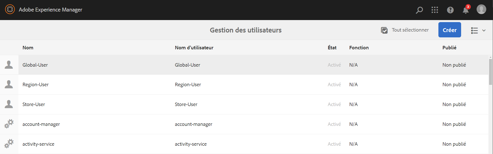

1. **Ajouter tous les groupes aux contributeurs**

   1. Accédez à **Adobe Experience Manager**.
   1. Cliquez sur **Outils** --> **Sécurité** --> **Groupes**.
   1. Sélectionnez **Contributeurs** dans la liste et sélectionnez l’onglet **Membres**.
   1. Sélectionnez le **Groupe**, comme **Global-Auteur**, **Région-Auteur,** et **Magasin-Auteur** pour les contributeurs.
   1. Cliquez sur **Enregistrer et fermer**.

1. **Accès aux autorisations pour chaque groupe**

   1. Accédez à l’*utilisateur admin* et utilisez cette interface utilisateur pour modifier les autorisations de différents groupes.
   1. Recherchez **Global-Auteur** et cliquez sur l’onglet **Autorisations**, comme illustré dans la figure ci-dessous.
   1. De même, vous pouvez accéder aux autorisations pour **Région-Auteur** et **Magasin-Auteur**.

   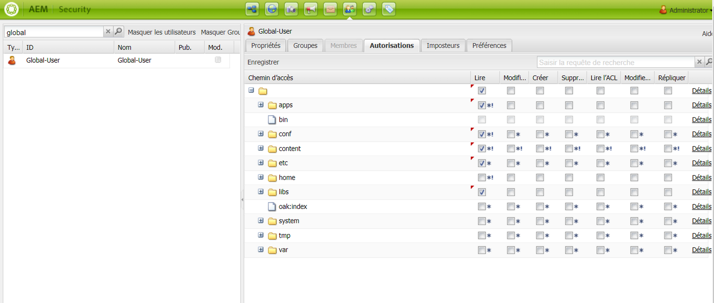

1. **Modification des autorisations pour chaque groupe**

   **Pour Global-Auteur :**

   1. Accédez à l’onglet **Autorisations**
   1. Accédez à ***/content/screens/demo*** et cochez toutes les autorisations
   1. Accédez à ***/content/screens/demo/locations*** et cochez toutes les autorisations
   1. Accédez à ***/content/screens/demo/locations/région-a*** et cochez toutes les autorisations. De même, vérifiez les autorisations pour **région-b**.

   Veuillez consulter la figure ci-dessous pour comprendre les étapes :
   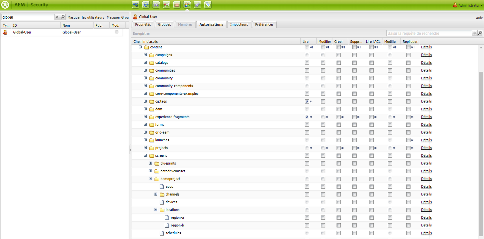

   L’illustration suivante montre que le **Global-Utilisateur** a désormais accès au **Canal Global** et à la **Région A** et à la **Région B** avec les quatre magasins, à savoir **Magasin 1**, **Magasin 2**, **Magasin 3** et **Magasin 4**.

   

   **Pour Region-Auteur :**

   1. Accédez à l’onglet **Autorisations**
   1. Accédez à ***/content/screens/demo*** et cochez uniquement les autorisations de **lecture**.
   1. Accédez à ***/content/screens/demo/locations*** et cochez uniquement les autorisations de **Lecture**.
   1. Accédez à ***/content/screens/demo/channels*** et désélectionnez les autorisations pour le canal **Global**.
   1. Accédez à ***/content/screens/demo/locations***/***région-a*** et cochez toutes les autorisations. De même, vérifiez les autorisations pour **région-b**.

   Veuillez consulter la figure ci-dessous pour comprendre les étapes :

   

   L’illustration suivante montre que l’utilisateur de la région a désormais accès à la **Région A** et à la **Région B** avec les quatre magasins, à savoir **Magasin 1**, **Magasin 2**, **Magasin 3** et **Magasin 4**, mais n’a pas accès au canal **Global**.

   

   **Pour Magasin-Auteur :**

   1. Accédez à l’onglet **Autorisations**
   1. Accédez à ***/content/screens/demo*** et cochez uniquement les autorisations de **lecture**.
   1. Accédez à ***/content/screens/demo/locations*** et cochez uniquement les autorisations de **Lecture**.
   1. Accédez à ***/content/screens/demo/channels*** et désélectionnez les autorisations pour le canal **Global**.
   1. Accédez à ***/content/screens/demo/locations/région-a*** et cochez uniquement les autorisations de **Lecture**. De même, cochez uniquement les autorisations de **Lecture** pour la **région-b**.
   1. Accédez à ***/content/screens/demo/locations***/***région-a /magasin-1*** et cochez toutes les autorisations. De même, vérifiez les autorisations pour **magasin-2,** magasin-3 et **magasin-4**.

   Veuillez consulter la figure ci-dessous pour comprendre les étapes :

   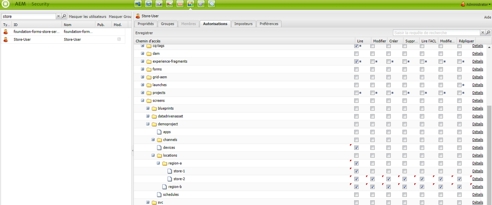

   L’illustration suivante montre que désormais, le **Magasin-Utilisateur** n’a accès qu’aux quatre magasins, à savoir **Magasin 1**, **Magasin 2**, **Magasin 3** et **Magasin 4**, mais qu’il n’est pas autorisé à accéder au canal **Global** ni aux canaux de région (**Région A** et **Région B**).

   

>[!NOTE]
Pour plus d’informations sur la configuration des autorisations, reportez-vous à [Configuration des listes de contrôle d’accès](setting-up-acls.md).
