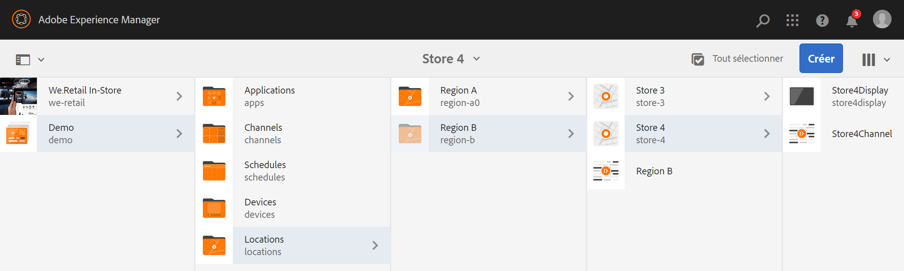

# Utilisation d’une séquence incorporée dynamique {#using-dynamic-embedded-sequence}

L’utilisation de séquences intégrées dynamiques couvre les rubriques suivantes :

* **Présentation**
* **Utilisation de l’expérience intégrée dynamique dans les écrans AEM**
* **Affichage des résultats**
* **Restriction des utilisateurs et modification des listes de contrôle d’accès**

## Présentation {#overview}

***Les séquences*** intégrées dynamiques sont créées pour les grands projets qui suivent la hiérarchie enfant parente, où l’enfant est référencé dans un dossier d’emplacement et non dans un dossier de canal. It allows the user to embed a sequence inside a channel by ***Channel Role***. Il permet à l’utilisateur de définir des espaces réservés spécifiques à un emplacement pour différents bureaux à l’aide d’une séquence incorporée dans un canal principal.

Lors de l’affectation d’un canal à un affichage, vous avez la possibilité de spécifier le chemin d’accès de l’affichage ou le rôle du canal qui sera résolu sur un canal réel par contexte.

Pour utiliser la séquence incorporée dynamique, vous affectez un canal par rôle ***de*** canal. Rôle de canal définit le contexte de l’affichage. Le rôle est ciblé par diverses actions et est indépendant du canal qui le remplit. Cette section décrit un cas d’utilisation qui définit les canaux par rôle et comment vous pouvez exploiter ce contenu dans un canal global. Vous pouvez également considérer le rôle comme un identifiant pour l’affectation ou comme un alias pour le canal dans le contexte de.

### Avantages de l’utilisation de séquences intégrées dynamiques {#benefits-of-using-dynamic-embedded-sequences}

L’avantage principal du placement d’un canal de séquence à l’intérieur d’un emplacement au lieu du dossier de canaux est de permettre aux auteurs locaux ou régionaux de modifier le contenu qui les intéresse tout en étant limité à l’édition de canaux plus haut dans la hiérarchie.

Referencing a *Channel By Role*, allows you to create local version of a channel, in order to dynamically resolve location-specific content and also allows you to create a global channel that leverages the content for the location-specific channels.

>[!NOTE]
>
>**Séquences intégrées ou Séquences intégrées dynamiques**
>
>Une séquence incorporée dynamique est similaire à une séquence incorporée, mais permet à l’utilisateur de suivre une hiérarchie dans laquelle les modifications/mises à jour apportées à un canal sont propagées à un autre en relation avec celui-ci. Il suit la hiérarchie parent-enfant et inclut également des fichiers tels que des images ou des vidéos.
>
>***Les séquences*** intégrées dynamiques vous permettent d’afficher du contenu spécifique à l’emplacement, tandis que les séquences ***incorporées*** affichent uniquement un diaporama général du contenu. De plus, lors de la configuration des séquences intégrées dynamiques, vous devez configurer le canal à l’aide du rôle et du nom du canal. Veuillez consulter les étapes ci-dessous pour une mise en oeuvre pratique.
>
>Pour en savoir plus sur l’implémentation de séquences intégrées, reportez-vous à la section Séquences [intégrées](embedded-sequences.md) dans les écrans AEM.

L’exemple suivant fournit une solution en se concentrant sur les termes clés suivants :

* un canal ***de séquence*** principal pour la séquence globale
* ***composants de séquence*** incorporée dynamique pour chaque partie localement personnalisable de la séquence
* ***canaux*** de séquence individuels dans les emplacements respectifs avec un *rôle* dans l’affichage correspondant au **rôle *du composant de séquence incorporée*dynamique.**

>[!NOTE]
>
>To learn more about channel assignment, see **[Channel Assignment](channel-assignment.md)** under Authoring section in AEM Screens documentation.

## Utilisation d’une séquence incorporée dynamique {#using-dynamic-embedded-sequence-2}

La section suivante explique la création d’une séquence intégrée dynamique dans un canal AEM Screens.

### Conditions préalables {#prerequisites}

Avant de commencer à implémenter cette fonctionnalité, assurez-vous que les conditions préalables suivantes sont prêtes à commencer à implémenter des séquences intégrées dynamiques :

* Création d’un projet AEM Screens (dans cet exemple, **Démo**)

* Créer un canal comme **global** sous le dossier **Canaux**

* Ajouter du contenu à votre canal **global** (*Veuillez vérifier **Resources.zip**pour connaître les ressources* appropriées)

L’image suivante montre le projet de **démonstration** avec canal **global** dans le dossier **Canaux** .

### Ressources {#resources}

Vous pouvez télécharger les ressources suivantes (images et les ajouter aux ressources) et les utiliser comme contenu de canal à des fins de démonstration.

[Obtenir un fichier](assets/resources.zip)

>[!NOTE]
>
>Pour plus d'informations sur la création d'un projet et la création d'un canal de séquence, reportez-vous aux ressources ci-dessous :
>
>* **[Création et gestion de projets](creating-a-screens-project.md)**
>* **[Gestion d’un canal](managing-channels.md)**
>

La mise en oeuvre d’une séquence intégrée dynamique dans un projet AEM Screens implique trois tâches principales :

1. **Configuration de la taxonomie du projet, y compris les canaux, emplacements et écrans**
1. **Création d’une planification**
1. **Affectation d’une planification à chaque affichage**

Suivez les étapes ci-dessous pour mettre en oeuvre la fonctionnalité :

>[!CAUTION]
>
>Lors de l’implémentation des séquences intégrées dynamiques, veillez à bien connaître les champs **Nom** et **Titre** lors de la création de canaux sous chaque emplacement. Veuillez suivre attentivement les instructions relatives à la nomenclature.

1. **Créez deux dossiers Emplacements.**

   Accédez au dossier **Emplacements** dans votre projet AEM Screens et créez deux dossiers d’emplacement : **Région A** et **Région B**.

   >[!NOTE]
   >
   >Lors de la création du dossier d’emplacement **Région A** , assurez-vous d’entrer le **Titre** en tant que **Région A** et vous pouvez laisser le champ **Nom vide. Par conséquent, région-a nom est automatiquement sélectionné.******
   >
   >Il en va de même pour la création du dossier d’emplacement **Région B**, comme illustré ci-dessous :

   

   >[!NOTE]
   >
   >Pour savoir comment créer un emplacement, reportez-vous à **[Création et gestion des emplacements](managing-locations.md)**.

1. **Créez deux emplacements et un canal sous chaque dossier d’emplacement.**

   1. Accédez à **Démo** —&gt; **Emplacements** —&gt; **Région A**.
   1. Select **Region A** and click **+ Create** from the action bar.
   1. Sélectionnez **Emplacement** dans l’assistant avec le **Titre** comme **Magasin 1**. De même, créez un autre emplacement dans l’assistant intitulé **Magasin 2** avec **Titre** comme **Magasin 2**. Vous pouvez laisser le champ **Nom** vide lors de la création de **Magasin 1** et **Magasin 2**.
   1. Répétez l’étape b) et sélectionnez maintenant Canal **de** séquence dans l’assistant. Entrez le **Titre** comme **Région A** et **Nom** comme **région **pour ce canal.
   >[!CAUTION]
   >
   >Assurez-vous que lors de la création de la **région de canal A**, entrez le **titre** comme **région A **et le **nom** comme **région.**

   

   De même, créez deux emplacements dans la **région B** , intitulés **Magasin 3** et **Magasin 4**. Créez également un canal **de** séquence avec **Titre** comme **Région B** et **Nom comme région.******

   >[!CAUTION]
   >
   >Veillez à utiliser le même nom pour les canaux créés dans les **régions A** et B **en tant que** région ****.

   

1. **Créez Display et Channel sous chaque emplacement.**

   1. Accédez à **Démo** —&gt; **Emplacements** —&gt; **Région A** —&gt; **Magasin 1.**
   1. Select **Store 1** and click **+ Create** from the action bar.
   1. Sélectionnez **Afficher** dans l’assistant et créez l’affichage **Store1.**
   1. Répétez l’étape b) et sélectionnez cette fois **Sequence Channel** dans l’assistant. Saisissez le **Titre** comme **Magasin1 Canal** et le **Nom** comme **Magasin.**
   >[!CAUTION]
   >
   >Il est important que lorsque vous créez un canal de séquence, le **titre** du canal peut correspondre à vos besoins, mais le **nom** doit être le même dans tous les canaux locaux.
   >
   >Dans cet exemple, les canaux sous **Région A** et **Région B** partagent le même **nom** que la région et les canaux sous Magasin 1, **Magasin 2, Magasin3 etMagasin4 partagent le mêmeNomque leMagasin.**************************

   

   De même, créez un affichage sous **Store2Display** et un canal **Store2Channel** sous** Store 2** (avec le nom de **magasin**).

   >[!NOTE]
   >
   >Assurez-vous de pouvoir utiliser le même nom pour les canaux créés dans le **magasin 1** et le **magasin 2** en tant que **magasin**.

   

   Suivez les étapes ci-dessus pour créer un canal et l’afficher dans la **boutique 3** et la **boutique 4** sous la **région B**. Encore une fois, veillez à utiliser le même **nom** que **le magasin** lors de la création des canaux **Store3Channel** et **Store4Channel respectivement.**

   L’image suivante présente l’affichage et le canal dans **le magasin 3**.

   

   L’image suivante présente l’affichage et le canal dans **le magasin 4**.

   

1. **Ajoutez du contenu aux canaux dans leurs emplacements respectifs.**

   Accédez à **Démo** -&gt; **Emplacements** -&gt; **Région A** -&gt; **Région A et cliquez sur Modifier dans la barre d’actions.****** Faites glisser et déposez les fichiers que vous souhaitez ajouter à votre canal.

   >[!NOTE]
   >
   >Vous pouvez utiliser le fichier ***Resources.zip*** de la section **Resources** ci-dessus pour utiliser les images comme ressources pour le contenu de votre canal.

   

   De même, accédez à la **Démo** -&gt; **Emplacements** -&gt; **Région B** -&gt; **Région B et cliquez sur Modifier de la barre d’actions pour faire glisser les ressources vers votre canal, comme illustré ci-dessous :******

   

   Suivez les étapes précédentes et les ressources pour ajouter du contenu aux canaux suivants :

   * **Store1Channel**
   * **Store2Channel**
   * **Store3Channel**
   * **Store4Channel**

1. **Créer un calendrier**

   Accédez au dossier **Planifications** et sélectionnez-le dans votre projet AEM Screens, puis cliquez sur **Créer** dans la barre d’actions pour créer une planification.

   L’image suivante montre la **AdSchedule** créée dans le projet **de démonstration** .

   

1. **Affecter des canaux à une planification**

   1. Accédez à **Démo** —&gt; **Planifications** —&gt; Calendrier des **publicités** et cliquez sur **Tableau de bord dans la barre d’actions.**
   1. Cliquez sur **+ Attribuer le canal** depuis le panneau CANAUX **** AFFECTÉS pour ouvrir la boîte de dialogue Affectation **** de canal.
   1. Select **Reference Channel**.. by path.
   1. Sélectionnez le chemin **du canal** comme **Démo*** —&gt; ***Canaux*** —&gt; ***Global.***
   1. Enter the **Channel Role** as **GlobalAdSegment**.
   1. Sélectionnez les événements **** pris en charge comme Chargement **** initial, **Ecran d’inactivité** et Interaction **utilisateur.**
   1. Cliquez sur **Enregistrer**.
   **Affecter un canal par rôle pour la région :**

   1. Cliquez sur **+ Attribuer le canal** depuis le panneau CANAUX **** AFFECTÉS pour ouvrir la boîte de dialogue Affectation **** de canal.
   1. Sélectionnez Canal **** de référence. par nom.
   1. Entrez le nom **du** canal comme **région***.*
   1. Enter the **Channel Role** as **RegionAdSegment**.
   1. Cliquez sur **Enregistrer**.
   **Affecter un canal par rôle pour le magasin :**

   1. Cliquez sur **+ Attribuer le canal** depuis le panneau CANAUX **** AFFECTÉS pour ouvrir la boîte de dialogue Affectation **** de canal.
   1. Sélectionnez Canal **** de référence. par nom.
   1. Saisissez le nom **du** canal comme **magasin**.
   1. Enter the **Channel Role** as **StoreAdSegment**.
   1. Cliquez sur **Enregistrer**.
   L’image suivante montre les canaux affectés par chemin et par rôle.

   

1. **Configuration d’une séquence intégrée dynamique sur le canal global.**

   Accédez au canal **global** , que vous avez initialement créé dans le projet **de démonstration** .

   Click **Edit** from the action to open the editor.

   

   Faites glisser et déposez deux composants de séquence **incorporée** dynamique dans l’éditeur de canaux.

   Ouvrez les propriétés de l’un des composants et saisissez le rôle **d’affectation de** canal sous la forme **RegionAdSegment**.

   De même, sélectionnez l’autre composant et ouvrez les propriétés pour entrer le rôle **d’affectation de** canal en tant que **StoreAdSegment**.

   

1. **Affecter un calendrier à chaque affichage**

   1. Accédez à chaque affichage, par exemple **Démo** —&gt; **Emplacements** —&gt; **Région A** —&gt;**Magasin 1 —&gt;Magasin1Affichage.******
   1. Click **Dashboard** from the action to open the display dashboard.
   1. **Cliquez sur**... dans le panneau CANAUX ET PLANIFICATIONS **AFFECTÉS** , puis cliquez **+Affecter un calendrier**.
   1. Sélectionnez le chemin d'accès au calendrier (par exemple, ici, **Démo** —&gt; **Planifications** —&gt;**AdSchedule**).
   1. Cliquez sur **Enregistrer**.

## Affichage des résultats {#viewing-the-results}

Une fois que vous avez configuré les canaux et que l’affichage est terminé, lancez le lecteur AEM Screens pour afficher le contenu.

>[!NOTE]
>
>Pour en savoir plus sur le lecteur d’écran AEM, consultez les ressources suivantes :
>
>* [Téléchargements du lecteur AEM Screens](https://download.macromedia.com/screens/)
>* [Utilisation d’AEM Screens Player](working-with-screens-player.md)

La sortie suivante confirme le contenu de votre canal dans le lecteur AEM Screens, selon le chemin d’affichage.

**Scénario 1**:

Si vous attribuez le chemin d’affichage comme **Démo** —&gt; **Emplacements** —&gt; **Région A** —&gt;** Magasin 1** —&gt; **Magasin1Affichage, le contenu suivant s’affichera sur votre lecteur AEM Screens.**

**Scénario 1**:

Si vous attribuez le chemin d’affichage comme **Démo** —&gt; **Emplacements** —&gt; **Région B** —&gt;** Magasin 3** —&gt; **Magasin3Affichage, le contenu suivant s’affiche sur votre lecteur AEM Screens.**

## Restriction des utilisateurs et modification des listes de contrôle d’accès {#restricting-users-and-modifying-the-acls}

Vous pouvez créer des auteurs globaux, régionaux ou locaux pour modifier le contenu qui les concerne tout en étant limité à l’édition de canaux situés plus haut dans la hiérarchie.

Vous devez modifier les listes de contrôle d’accès pour restreindre l’accès des utilisateurs au contenu en fonction de leur emplacement.

### Exemple de cas d'utilisation {#example-use-case}

L’exemple suivant vous permet de créer trois utilisateurs pour le projet de démonstration ci-dessus.

Les privilèges sont attribués à chaque groupe comme suit :

**Groupes**:

* **Global-Author**: Se compose d’utilisateurs qui ont accès à tous les emplacements et canaux du projet **de démonstration** et disposent de toutes les autorisations de lecture, d’écriture et de modification.

* **Région-Auteur**: Se compose d’utilisateurs disposant d’autorisations de lecture, d’écriture et de modification pour la **région A** et la **région B**.

* **Store-Author**: Se compose d’utilisateurs disposant d’autorisations de lecture, d’écriture et de modification uniquement pour **le magasin 1**, le **magasin 2**, le **magasin 3** et le **magasin 4.**

#### Procédure de création de groupes d’utilisateurs, d’utilisateurs et de configuration des listes de contrôle d’accès {#steps-for-creating-user-groups-users-and-setting-up-acls}

>[!NOTE]
>
>Pour savoir comment séparer les projets à l’aide des listes de contrôle d’accès afin que chaque personne ou équipe gère son propre projet, reportez-vous à la section **Configuration des listes de contrôle d’accès**.

Suivez les étapes ci-dessous pour créer des groupes, des utilisateurs et modifier les listes de contrôle d’accès en fonction des autorisations :

1. **Créer des groupes**

   1. Navigate to **Adobe Experience Manager**.
   1. Click **Tools** --&gt; **Security** --&gt; **Groups**.
   1. Cliquez sur **Créer un groupe** et saisissez **Global-Author** dans **ID**.
   1. Cliquez sur **Enregistrer et fermer**.
   De même, créez deux autres groupes tels que **Région-Auteur** et **Magasin-Auteur**.

   

1. **Création d’utilisateurs et ajout d’utilisateurs à des groupes**

   1. Navigate to **Adobe Experience Manager**.
   1. Click **Tools** --&gt; **Security** --&gt; **Users**.
   1. Cliquez sur **Créer un utilisateur** et saisissez **Global-User** dans **ID**.
   1. Saisissez **Password** et confirmez le mot de passe de cet utilisateur.
   1. Cliquez sur l’onglet **Groupes** et saisissez le nom du groupe dans **Sélectionner un groupe**, par exemple, saisissez Auteur **** global pour ajouter **Global-User à ce groupe spécifique.**
   1. Cliquez sur **Enregistrer et fermer**.
   De même, créez deux autres utilisateurs, tels que **Region-User** et **Store-User** , puis ajoutez-les à **Region-Author** et **Store-Author respectivement.**

   >[!NOTE]
   >
   >Il est recommandé d’ajouter des utilisateurs à un groupe, puis d’attribuer des autorisations à chaque groupe d’utilisateurs.

   

1. **Ajouter tous les groupes aux contributeurs**

   1. Navigate to **Adobe Experience Manager**.
   1. Click **Tools** --&gt; **Security** --&gt; **Groups**.
   1. Sélectionnez **Contributeurs** dans la liste et sélectionnez l’onglet **Membres** .
   1. Sélectionnez le **groupe** tel que **Global-Author**, **Region-Author,** et **Store-Author aux contributeurs.**
   1. Cliquez sur **Enregistrer et fermer**.

1. **Accès aux autorisations pour chaque groupe**

   1. Accédez à l’ *administrateur* utilisateur et utilisez cette interface utilisateur pour modifier les autorisations de différents groupes.
   1. Recherchez **Global-Author** et cliquez sur l’onglet **Permissions** , comme illustré dans la figure ci-dessous.
   1. De même, vous pouvez accéder aux autorisations pour **Region-Author** et **Store-Author**.
   

1. **Modification des autorisations pour chaque groupe**

   **Pour Global-Author :**

   1. Navigate to the **Permissions** tab
   1. Accédez à ***/content/screens/demo*** et vérifiez toutes les autorisations
   1. Accédez à ***/content/screens/demo/locations*** et vérifiez toutes les autorisations
   1. Accédez à ***/content/screens/demo/locations***/***region-a*** et vérifiez toutes les autorisations. De même, vérifiez les autorisations pour **region-b**.
   Veuillez consulter la figure ci-dessous pour comprendre les étapes :
   

   L’illustration suivante montre que l’utilisateur **** global a désormais accès au canal **** global et à la **région A** et à la **région B avec les quatre magasins, à savoir Store 1, le magasin 2, le magasin 3et le magasin 4.******************

   

   **Pour Region-Author :**

   1. Navigate to the **Permissions** tab.
   1. Accédez à ***/content/screens/demo*** et vérifiez uniquement les autorisations de lecture****.
   1. Accédez à ***/content/screens/demo/locations*** et vérifiez uniquement les autorisations de **lecture** .
   1. Accédez à ***/content/screens/demo/channel ***et désélectionnez les autorisations pour le canal**global **.***
   1. Accédez à ***/content/screens/demo/locations***/***region-a*** et vérifiez toutes les autorisations. De même, vérifiez les autorisations pour **region-b**.
   Veuillez consulter la figure ci-dessous pour comprendre les étapes :

   

   L’illustration suivante montre que l’utilisateur de la région a désormais accès à la **région A** et à la **région B** avec les quatre magasins, à savoir la **boutique 1**, la **boutique 2, la boutique  3 et la boutique de 4, mais n’a pas accès au canalGlobal.**************

   

   **Pour Store-Author :**

   1. Navigate to the **Permissions** tab.
   1. Accédez à ***/content/screens/demo*** et vérifiez uniquement les autorisations de **lecture** .
   1. Accédez à ***/content/screens/demo/locations*** et vérifiez uniquement les autorisations de **lecture** .
   1. Accédez à ***/content/screens/demo/channel*** et désélectionnez les autorisations pour le canal **global** .
   1. Accédez à ***/content/screens/demo/locations/region-a*** et vérifiez uniquement les autorisations de **lecture** . De même, vérifiez uniquement les autorisations **Lecture** pour **region-b**.
   1. Accédez à ***/content/screens/demo/locations***/***region-a /store-1*** et vérifiez toutes les autorisations. De même, vérifiez les autorisations pour **store-2,** store-3 et **store-4**.
   Veuillez consulter la figure ci-dessous pour comprendre les étapes :

   

   L’illustration suivante montre que désormais, le **Store-User** n’a accès qu’aux quatre magasins, à savoir **Store 1**, **Store 2**, **Store 3 et Store 4, mais qu’il n’est pas autorisé à accéder aux canaux de la région ou duGlobal(**Région A **et de la région B).**************

   

>[!NOTE]
>
>Pour plus d'informations sur la configuration des autorisations, reportez-vous à [Configuration des listes de contrôle d'accès](setting-up-acls.md).

