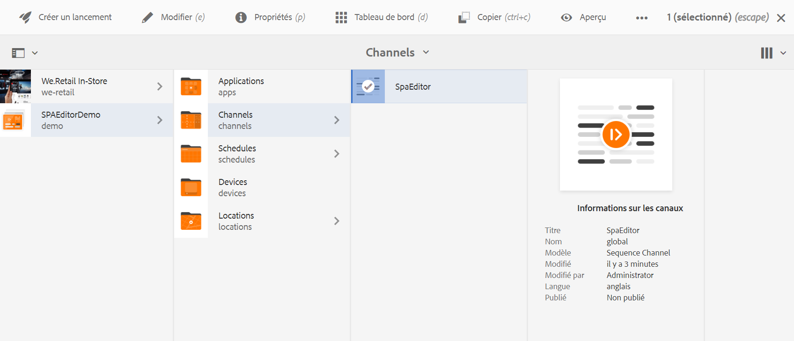
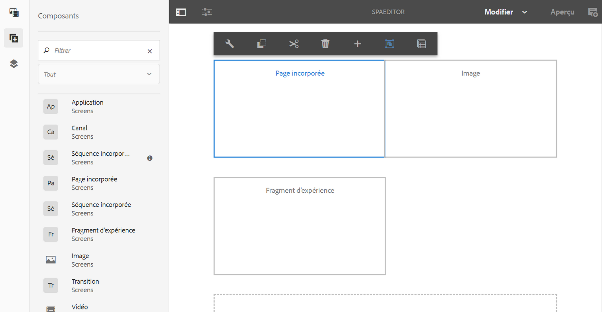

# Incorporation d’une application REACT à l’aide de l’éditeur d’applications monopages AEM et intégration à AEM Screens Analytics {#embedding-a-react-application-using-the-aem-spa-editor-and-integrating-with-aem-screens-analytics}

Cette section décrit comment incorporer une application interactive d’une seule page à l’aide de REACT (ou Angular) à l’aide de l’éditeur d’applications monopages AEM qui peut être configuré par des professionnels dans AEM et comment intégrer votre application interactive à Adobe Analytics hors ligne.

## Utilisation de l’éditeur d’applications monopages AEM {#using-the-aem-spa-editor}

Suivez les étapes ci-dessous pour utiliser l’éditeur d’applications monopages AEM :

1. Cliquez sur le rapport de l’éditeur d’applications monopages AEM à l’adresse [https://github.com/adobe/aem-spa-project-archetype.](https://github.com/adobe/aem-spa-project-archetype)

   >[!NOTE]
   >
   >Cet archétype crée un projet Adobe Experience Manager minimal comme point de départ pour vos propres projets SPA. Les propriétés qui doivent être fournies lors de l'utilisation de cet archétype permettent de nommer comme vous le souhaitez toutes les parties de ce projet.

1. Suivez les instructions Lisez-moi pour créer un projet d’archétype d’éditeur SPA AEM :

   ```
   mvn clean install archetype:update-local-catalog
   mvn archetype:crawl
   
   mvn archetype:generate \
   -DarchetypeCatalog=internal \
   -DarchetypeGroupId=com.adobe.cq.spa.archetypes \
   -DarchetypeArtifactId=aem-spa-project-archetype \
   -DarchetypeVersion=1.0.3-SNAPSHOT \
   ```

   >[!NOTE]
   >
   >Nous utilisons le **GroupId** comme ***com.adobe.aem.screens*** et le **ArtifactId** comme ***Mon exemple d’API (valeur par défaut).*** Vous pouvez choisir les vôtres selon vos besoins.

1. Une fois le projet créé, utilisez un IDE ou un éditeur de votre choix et importez le projet expert généré.
1. Déployez sur votre instance AEM locale à l’aide de la commande ***mvn clean install -PautoInstallPackage***.

### Modification de contenu dans l’application REACT {#editing-content-in-the-react-app}

Pour modifier le contenu dans l’application REACT :

1. Accédez à `https://localhost:4502/editor.html/content/mysamplespa/en/home.html` (remplacez le nom d’hôte, le port et le nom du projet, selon le cas).
1. Vous devez pouvoir modifier le texte affiché dans l’application Hello world.

### Ajout de l’application interactive REACT aux écrans AEM {#adding-the-interactive-react-app-to-aem-screens}

Suivez les étapes ci-dessous pour ajouter l’application interactive REACT à AEM Screens :

1. Créez un projet AEM Screens. Voir [Création et gestion de projets](creating-a-screens-project.md) pour en savoir plus.

   >[!NOTE]
   >
   >Créez un canal **de** séquence lors de la création d’un canal dans le dossier **Canaux** de votre projet d’écrans.
   >
   >
   >Voir [Création et gestion des canaux](managing-channels.md) pour plus d’informations.

   

1. Modifiez un canal de séquence et faites glisser et déposez un composant de page incorporé.

   Voir [Ajout de composants à un canal](adding-components-to-a-channel.md) pour en savoir plus.

   >[!NOTE]
   >
   >Veillez à ajouter l’événement d’interaction utilisateur lors de l’affectation du canal à l’affichage.

1. Cliquez sur **Modifier** dans la barre d’actions pour modifier les propriétés du canal de séquence.

   

1. Faites glisser et déposez le composant Page **** incorporée et sélectionnez la page d’accueil sous l’application mysamplespa, par exemple ***/content/mysamplespa/fr/home***.

   

1. Enregistrez un lecteur sur ce projet et vous devriez maintenant pouvoir voir votre application interactive s’exécuter sur les écrans AEM.

   Reportez-vous à la section Enregistrement [du](device-registration.md) périphérique pour en savoir plus sur l’enregistrement d’un périphérique.

## Intégration de l’application d’une seule page avec Adobe Analytics avec la fonctionnalité hors ligne via les écrans AEM {#integrating-the-spa-with-adobe-analytics-with-offline-capability-through-aem-screens}

Suivez les étapes ci-dessous pour intégrer l’application d’une seule page à Adobe Analytics avec la fonctionnalité hors ligne via AEM Screens :

1. Configuration d’Adobe Analytics dans AEM Screens.

   Reportez-vous à la section [Configuration d’Adobe Analytics avec AEM Screens (configuring-adobe-analytics-aem-screens.md)] pour savoir comment effectuer le séquencement dans Adobe Analytics avec AEM Screens et envoyer des événements personnalisés à l’aide d’Adobe Analytics hors ligne.

1. Modifiez votre application de réaction dans l’IDE/l’éditeur de votre choix (en particulier le composant de texte ou tout autre composant que vous souhaitez commencer à émettre des événements).
1. Sur l’événement click ou tout autre événement que vous souhaitez capturer pour votre composant, ajoutez les informations d’analyse à l’aide du modèle de données standard.

   Consultez [Configuration d’Adobe Analytics avec AEM](configuring-adobe-analytics-aem-screens.md)Screens pour plus d’informations.

1. Appelez l’API Analytics d’AEM Screens pour enregistrer l’événement hors ligne et l’envoyer en rafales à Adobe Analytics.

   Par exemple :

   ```
   handleClick() {
       if ((window.parent) && (window.parent.CQ) && (window.parent.CQ.screens) && (window.parent.CQ.screens.analytics))
       {
           var analyticsEvent = {};
           analyticsEvent['event.type'] = 'play'; // Type of event
    analyticsEvent['event.coll_dts'] = new Date().toISOString(); // Start of collecting the event
    analyticsEvent['event.dts_start'] = new Date().toISOString(); // Event start
    analyticsEvent['content.type'] = 'Washing machine'; // Mime Type or product category
    analyticsEvent['content.action'] = 'Path to the washing machine asset in AEM'; // Path in AEM to relevant asset
    analyticsEvent['trn.product'] = 'Washing machine Model number'; // Product being explored
    analyticsEvent['trn.amount'] = 1000; // Product pricing or other numeric value or weight
    analyticsEvent['event.dts_end'] = new Date().toISOString(); // Event end
    analyticsEvent['event.count'] = 100; // Numeric value that may count a number of clicks or keystrokes or wait time in seconds for example
    analyticsEvent['event.value'] = 'My favorite analytics event';
           analyticsEvent['trn.quantity'] = 10; // Quantity of product selection
    analyticsEvent['event.subtype'] = 'end'; // Event subtype if applicable
    window.parent.CQ.screens.analytics.sendTrackingEvent(analyticsEvent);
       }
   }
   ```

   >[!NOTE]
   >
   >Le microprogramme du lecteur ajoute automatiquement plus de détails sur le lecteur et son environnement d’exécution aux données d’analyse personnalisées que vous envoyez. Il se peut donc que vous n’ayez pas à capturer les détails du système d’exploitation/du périphérique de bas niveau, sauf si cela est absolument nécessaire. Vous devez simplement vous concentrer sur les données d’analyse de l’entreprise.

