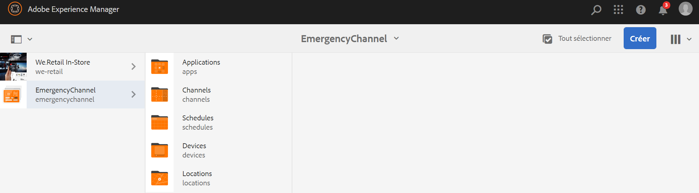
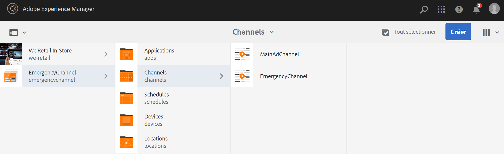
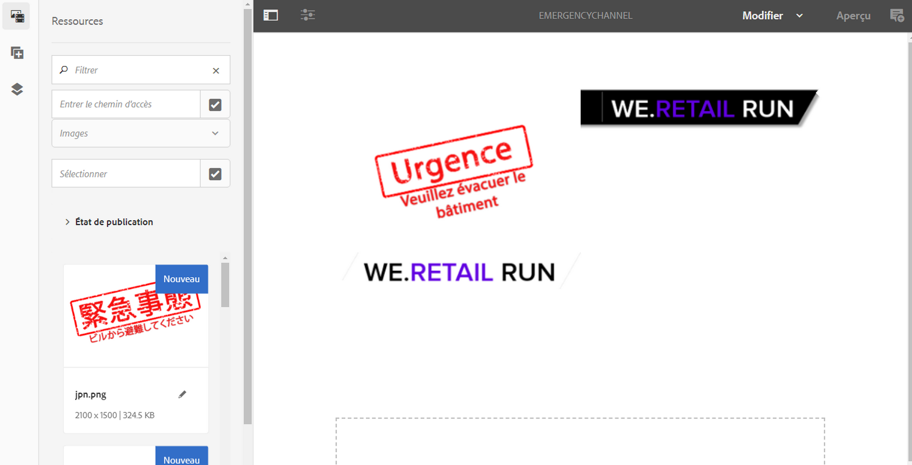
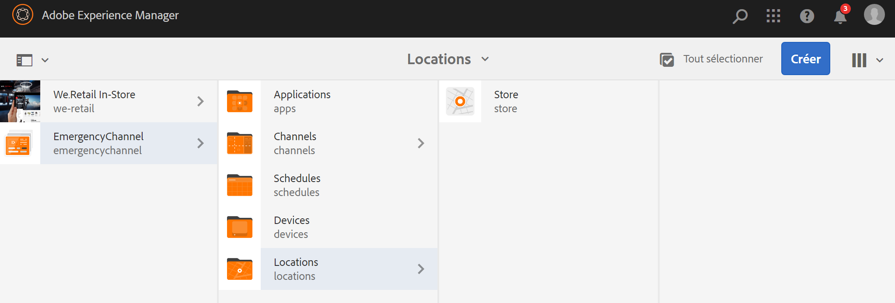
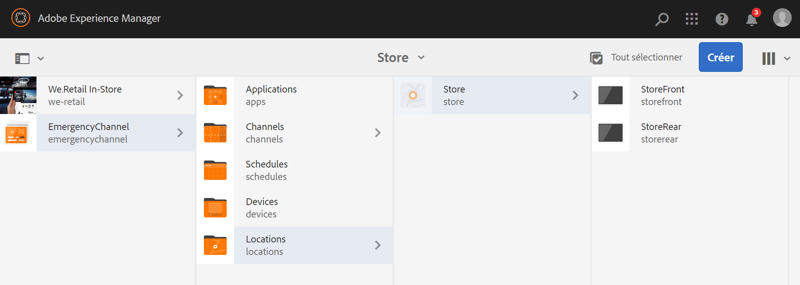
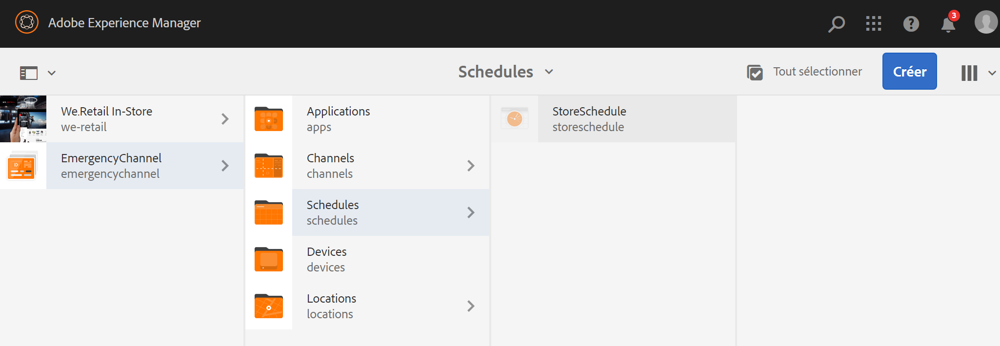
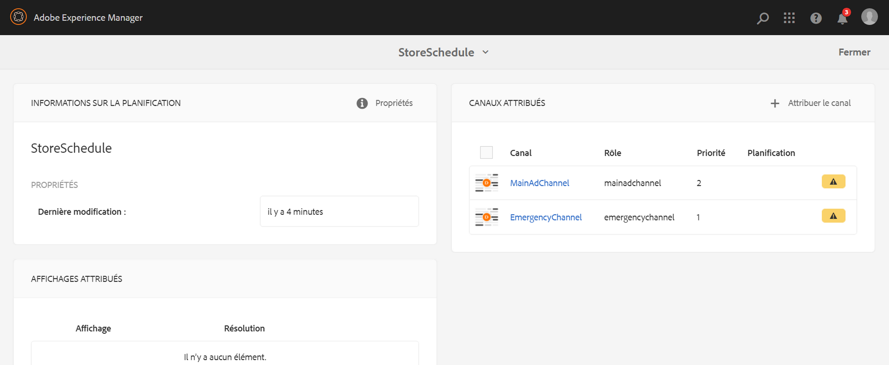
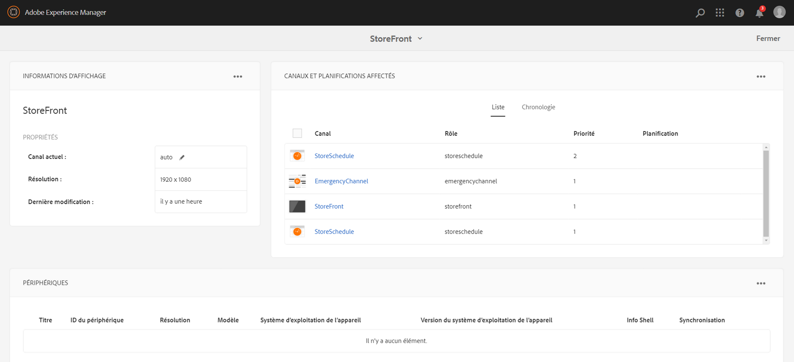
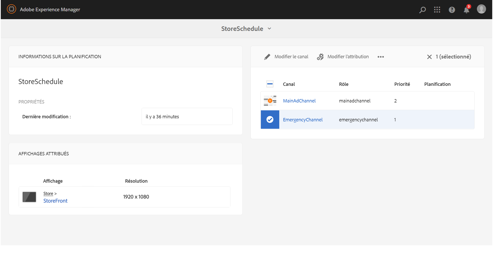
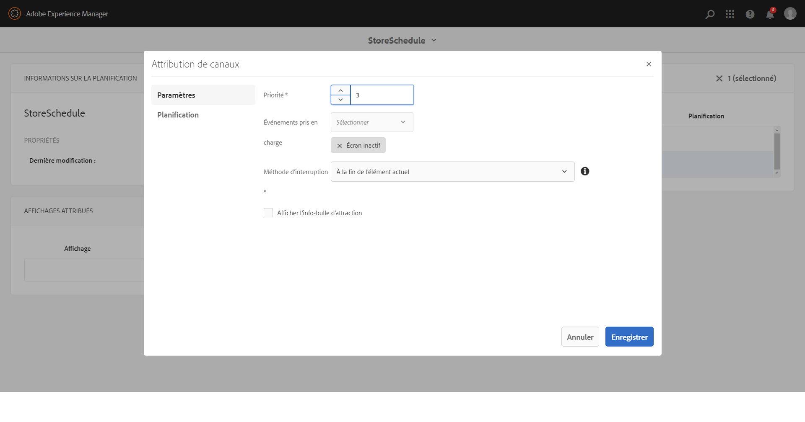

# Canal d'urgence {#emergency-channel}

## Description du cas d’utilisation {#use-case-description}

Cette section décrit un exemple de cas d’utilisation qui met l’accent sur la création et la gestion d’un canal d’urgence que l’auteur du contenu peut changer d’un canal de séquence en cas de précondition.

### Conditions préalables {#preconditions}

Avant de commencer cette utilisation, assurez-vous de comprendre comment :

* **[Création et gestion des canaux](managing-channels.md)**
* **[Création et gestion des emplacements](managing-locations.md)**
* **[Création et gestion de calendriers](managing-schedules.md)**
* **[Enregistrement de périphérique](device-registration.md)**

### Acteurs principaux {#primary-actors}

Auteurs de contenu

## Flux de base : Configuration du projet {#basic-flow-setting-up-the-project}

Pour configurer un canal d’urgence, procédez comme suit :

1. Créez un projet AEM Screens nommé **EmergencyChannel**, comme illustré ci-dessous.

   >[!NOTE]
   >
   >Pour en savoir plus sur la création et la gestion de projets dans AEM Screens, voir Création d’un projet.

   

1. **Création d’un canal de séquence**

   1. Sélectionnez le dossier **Canaux** , puis cliquez sur **Créer** pour ouvrir l’assistant de création d’un canal.

   1. Sélectionnez Canal **** de séquence dans l’assistant et créez le canal intitulé **CanalAdChannel** principal.
   

1. **Ajout de contenu au canal de séquence**

   1. Sélectionnez le canal (**MainAdChannel**).
   1. Cliquez sur **Modifier** dans la barre d’actions pour ouvrir l’éditeur. Faites glisser quelques fichiers vers votre canal.
   

1. **Création d'un canal d'urgence**

   1. Sélectionnez le dossier **Canaux** .
   1. Cliquez sur **Créer** pour ouvrir l'assistant et créer un canal.
   1. Sélectionnez Canal **de** séquence dans l’assistant et créez le canal intitulé **Canal** d’urgence.
   >[!NOTE]
   >
   >Normalement, votre canal d'urgence est ajouté à votre projet de production préexistant.

   

1. **Ajout de contenu au canal d’urgence**

   1. Sélectionnez le canal (canal **d’urgence)**.
   1. Cliquez sur **Modifier** dans la barre d’actions pour ouvrir l’éditeur. Faites glisser sur votre canal le fichier que vous souhaitez exécuter en cas d’urgence.
   

1. **Création d’un emplacement**

   1. Accédez au dossier **Emplacements** .
   1. Cliquez sur **Créer** à partir de la barre d’actions et créez un emplacement intitulé **Magasin** à partir de l’assistant.
   

1. **Création d’écrans à votre emplacement**

   Accédez à votre emplacement (**Magasin**) et cliquez sur **Créer** dans la barre d’actions. Suivez l’assistant pour créer deux **écrans** intitulés **StoreFront** et **StoreRear**.

   

1. **Création d’une planification**

   1. Accédez au dossier **Planifications** .
   1. Cliquez sur **Créer** dans la barre d’actions. Suivez l’assistant pour créer une planification intitulée **StoreSchedule**.
   

1. Affecter les affichages à votre planification et définir des priorités

   1. Sélectionnez la planification **(Planification de la boutique)** et cliquez sur **Tableau de bord** dans la barre d’actions.

   1. Cliquez sur **+ Attribuer un canal** dans le panneau CANAUX **** AFFECTÉS.

   1. Dans la boîte de dialogue Affectation **de** canal :

      1. Sélectionnez le chemin d'accès à **MainAdChannel.**
      1. Définir la **priorité** sur 2
      1. Set the Supported Events as **Initial Load** and **Idle Screen**.
      1. Cliquez sur **Enregistrer**
      De même, vous devrez recommencer à suivre les mêmes étapes pour affecter **EmergencyChannel** et définir sa **priorité**.
   >[!NOTE]
   >
   >La priorité est utilisée pour contrôler les attributions au cas où plusieurs d’entre elles correspondent aux critères de lecture. Celle présentant la valeur la plus élevée est toujours prioritaire par rapport aux valeurs plus faibles.

   

1. Cliquez sur **+ Attribuer un canal** dans le panneau CANAUX **** AFFECTÉS.

1. Dans la boîte de dialogue Affectation **de** canal :

   1. Sélectionnez le chemin vers **EmergencyChannel**
   1. Définir la **priorité** sur 1

   1. Définissez les événements pris en charge comme charge **** initiale, **écran d’inactivité** et interaction **utilisateur.**

   1. Cliquez sur **Enregistrer**
   

   Vous pouvez afficher les canaux affectés à partir du tableau de bord **StoreSchedule** .

   

1. **Affecter un calendrier à chaque affichage**

   1. Accédez à chaque affichage, par exemple **EmergencyChannel** —&gt; **Locations** —&gt; **Store** —&gt;**StoreFront.**

   1. Click **Dashboard** from the action to open the display dashboard.
   1. **Cliquez sur**... dans le panneau CANAUX ET PLANIFICATIONS **AFFECTÉS** , puis cliquez **+Affecter un calendrier**.

   1. Sélectionnez le chemin d'accès à la planification (par exemple, ici, **Canal** d'urgence —&gt; **Planifications** —&gt;Planification de la **boutique**).

   1. Cliquez sur **Enregistrer**.
   Vous pouvez afficher la planification affectée à l’affichage à partir du tableau de bord **StoreSchedule** .
   

1. **Enregistrement de périphérique**

   Terminez le processus d’enregistrement du périphérique et, une fois enregistré, vous afficherez la sortie suivante sur votre lecteur AEM Screens.

   

## Basculer vers le canal d'urgence {#switching-to-emergency-channel}

En cas d'urgence, effectuez les opérations suivantes:

1. Accédez à **EmergencyChannel** —&gt; **Schedules** —&gt; **StoreSchedule** **et sélectionnez Tableau de bord dans la barre d'actions.**

   

1. Sélectionnez **EmergencyChannel** dans le tableau de bord **StoreSchedule** et cliquez sur **Modifier l’affectation**.

   

1. Mettez à jour la **priorité** du canal **d’urgence** vers **3** depuis la boîte de dialogue Affectation de **canal et cliquez sur Enregistrer.******

   

1. Dès que la priorité du canal est mise à jour, tous les écrans AEM affichent le contenu **EmergencyChannel** , comme illustré ci-dessous.

   

### Conclusion {#conclusion}

Le **canalUrgence** continuera à afficher son contenu jusqu’à ce que l’auteur du contenu réinitialise la valeur de priorité sur 1.

Une fois que l’auteur du contenu a reçu les instructions indiquant que l’urgence a été résolue, il doit mettre à jour la priorité de **MainAdChannel** , ce qui entraîne la reprise de la lecture normale.
