# Canal d’urgence {#emergency-channel}

## Description du cas d’utilisation {#use-case-description}

>[!IMPORTANT]
>Ce contenu est valide pour AEM on-premise/AMS (AEM 6.5LTS et AEM 6.5). Pour le contenu AEM as a Cloud Service Screens, reportez-vous au guide [AEM as a Cloud Service](https://experienceleague.adobe.com/en/docs/experience-manager-cloud-service/content/screens-as-cloud-service/overview/introduction).

Cette section décrit un exemple de cas d’utilisation. Elle met l’accent sur la création et la gestion d’un canal d’urgence vers lequel peut basculer l’auteur ou l’autrice du contenu à partir d’un canal de séquence en cas de condition préalable.

### Prérequis {#preconditions}

Avant de commencer ce cas d’utilisation, vous devez comprendre comment :

* **[Création et gestion des canaux](managing-channels.md)**
* **[Création et gestion des emplacements](managing-locations.md)**
* **[Création et gestion des planifications](managing-schedules.md)**
* **[Enregistrement d’appareils](device-registration.md)**

### Acteurs principaux {#primary-actors}

Auteurs de contenu

## Flux de base : configuration du projet {#basic-flow-setting-up-the-project}

Pour configurer un canal d’urgence, procédez comme suit :

1. Créez un projet AEM Screens appelé **EmergencyChannel**, comme illustré ci-dessous.

   >[!NOTE]
   >Pour en savoir plus sur la création et la gestion de projets dans AEM Screens, voir Création d’un projet.

   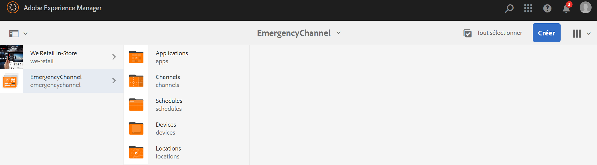

1. **Création d’un canal de séquence**

   1. Cliquez sur le dossier **Canaux** et cliquez sur **Créer**.

   1. Cliquez sur **Canal de séquence** dans l’assistant et créez un canal appelé **MainAdChannel**.

   

1. **Ajout de contenu à un canal de séquence**

   1. Cliquez sur le canal (**MainAdChannel**).
   1. Cliquez sur **Modifier** dans la barre d’actions.
   1. Faites un glisser-déposer de quelques ressources sur votre canal.

   

1. **Création d’un canal d’urgence**

   1. Cliquez sur le dossier **Canaux**.
   1. Cliquez sur **Créer**.
   1. Cliquez sur **Canal de séquence** dans l’assistant et créez un canal appelé **EmergencyChannel**.

   >[!NOTE]
   >
   >Normalement, votre canal d’urgence est ajouté à votre projet de production préexistant.

   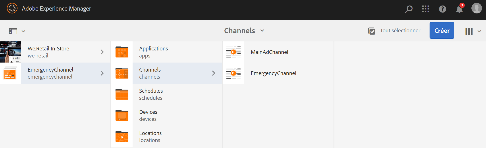

1. **Ajout de contenu à un canal d’urgence**

   1. Cliquez sur le canal (**Canal d’urgence**).
   1. Cliquez sur **Modifier** dans la barre d’actions.
   1. Faites glisser vers votre canal la ressource que vous souhaitez exécuter en cas d’urgence.

   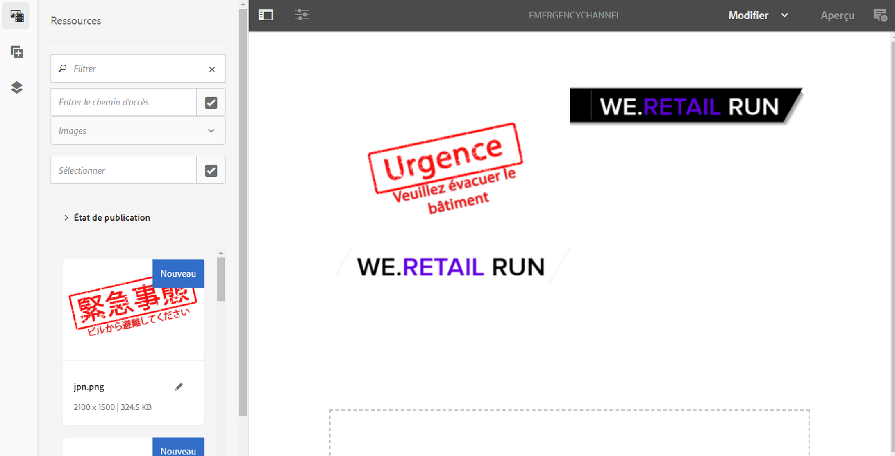

1. **Création d’un emplacement**

   1. Accédez au dossier **Emplacements**.
   1. Cliquez sur **Créer** à partir de la barre d’actions, puis créez un emplacement appelé **Boutique** à partir de l’assistant.

   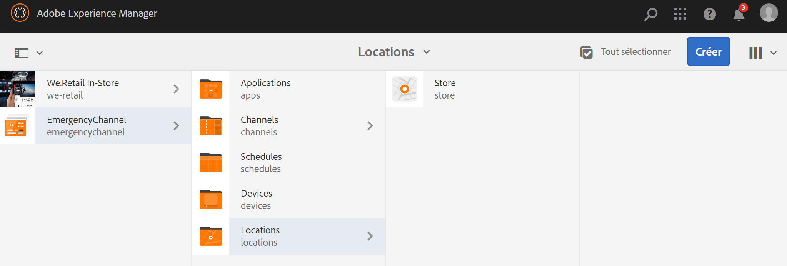

1. **Création d’affichages dans votre emplacement**

   Accédez à votre emplacement (**Boutique**) et cliquez sur **Créer** dans la barre d’actions. Suivez l’assistant, et créez deux **Affichages** appelés **StoreFront** et **StoreRear**.

   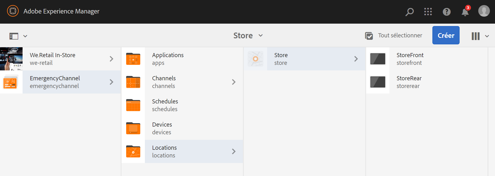

1. **Création d’une planification**

   1. Accédez au dossier **Schedules** (Planifications).
   1. Cliquez sur **Créer** dans la barre d’actions.
   1. Suivez l’assistant, et créez un planning appelé **StoreSchedule**.

   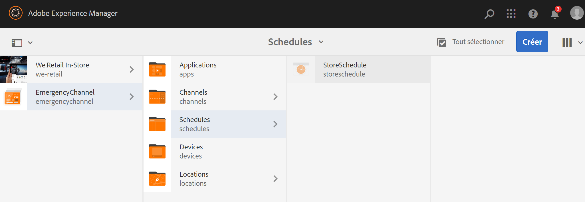

1. Affectation des deux affichages à votre planification et définition de priorités

   1. Cliquez sur le planning **(StoreSchedule)**, puis sur **Tableau de bord** dans la barre d’actions.

   1. Cliquez sur **+ Attribuer le canal** dans le panneau **CANAUX ATTRIBUÉS**.

   1. À partir de la boîte de dialogue **Attribution de canaux**, procédez comme suit :

      1. Cliquez sur le chemin d’accès à **MainAdChannel**.
      1. Définissez la **priorité** sur 2.
      1. Définissez les événements pris en charge **Chargement initial** et **Écran inactif**.
      1. Cliquez sur **Enregistrer**

      Suivez les mêmes étapes pour affecter **EmergencyChannel** et définir sa **Priorité**.

   >[!NOTE]
   >
   >La priorité est utilisée pour contrôler les attributions au cas où plusieurs d’entre elles correspondent aux critères de lecture. Celle présentant la valeur la plus élevée est toujours prioritaire par rapport aux valeurs plus faibles.

   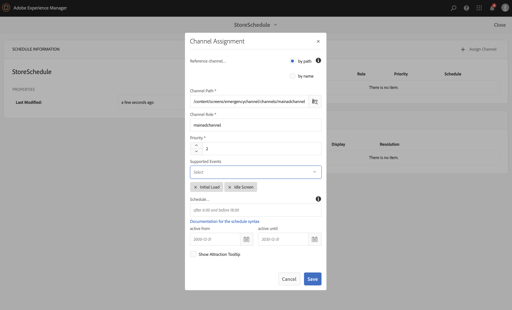

1. Cliquez sur **+ Attribuer le canal** dans le panneau **CANAUX ATTRIBUÉS**.

1. À partir de la boîte de dialogue **Attribution de canaux**, procédez comme suit :

   1. Cliquez sur le chemin d’accès à **EmergencyChannel**.
   1. Définissez la **priorité** sur 1.

   1. Définissez les Événements pris en charge **Charge initiale**, **Écran inactif** et **Interaction utilisateur**

   1. Cliquez sur **Enregistrer**

   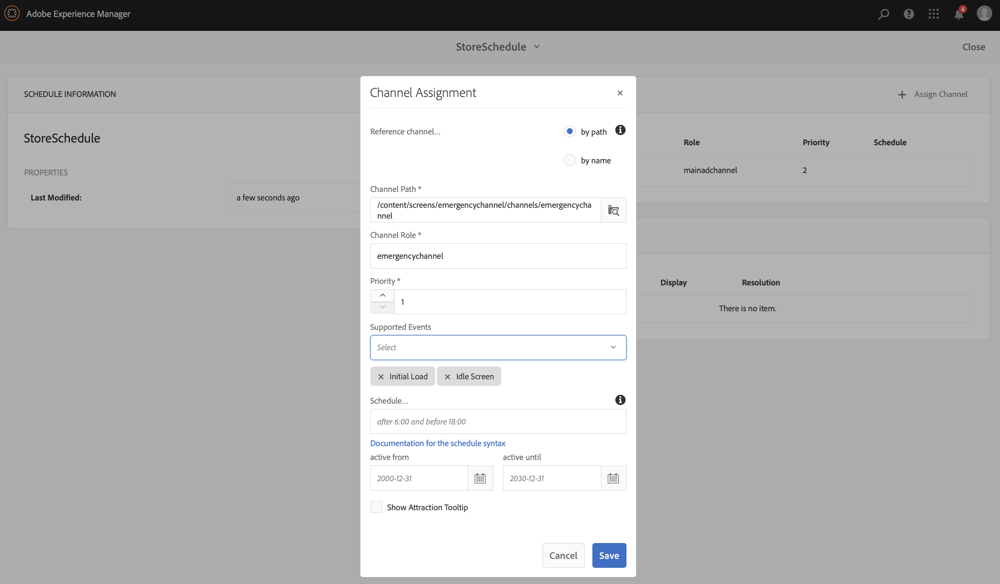

   Vous pouvez afficher les canaux affectés à partir du tableau de bord **StoreSchedule**.

   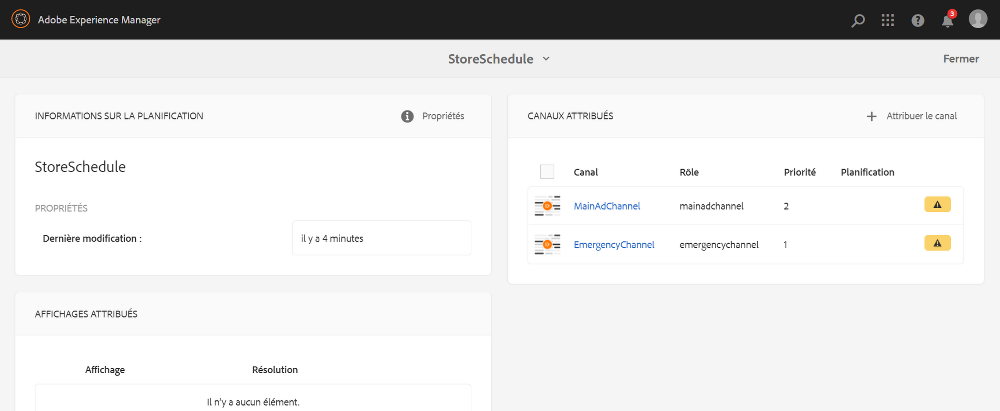

1. **Attribution d’une planification à chaque affichage**

   1. Accédez à chaque affichage, par exemple **EmergencyChannel** > **Emplacements** > **Magasin** > **StoreFront**.

   1. Cliquez sur **Tableau de bord** dans la barre d’actions.
   1. Cliquez sur **...** dans le panneau **CANAUX ET PLANIFICATIONS AFFECTÉS**, puis sur **+Attribuer une planification**.

   1. Cliquez sur le chemin d’accès au planning (par exemple, ici, **EmergencyChannel** > **Plannings** > **StoreSchedule**).

   1. Cliquez sur **Enregistrer**.

   Vous pouvez afficher la planification affectée à l’affichage à partir du tableau de bord **StoreSchedule**.
   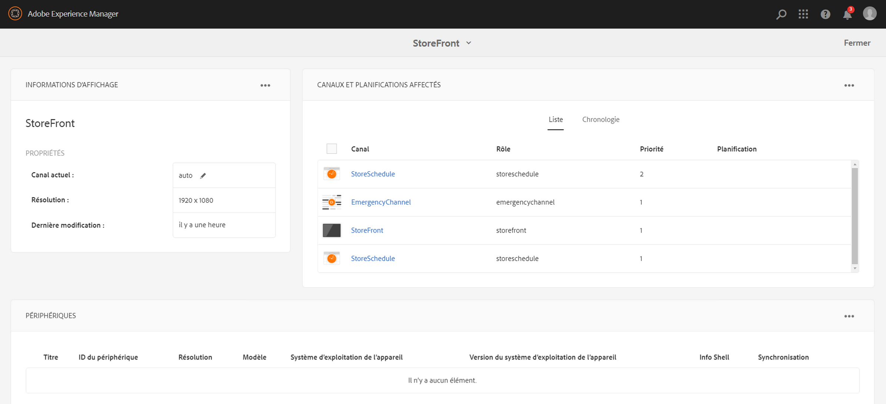

1. **Enregistrement d’appareils**

   Procédez à l’enregistrement du périphérique. Une fois enregistré, vous pouvez afficher la sortie suivante sur votre lecteur AEM Screens.

   

## Basculer vers le canal d’urgence {#switching-to-emergency-channel}

En cas d’urgence, procédez comme suit :

1. Accédez à **EmergencyChannel** > **Plannings** > **StoreSchedule** et cliquez sur **Tableau de bord** dans la barre d’actions.

   

1. Cliquez sur **EmergencyChannel** dans le tableau de bord **StoreSchedule**, puis sur **Modifier l’attribution**.

   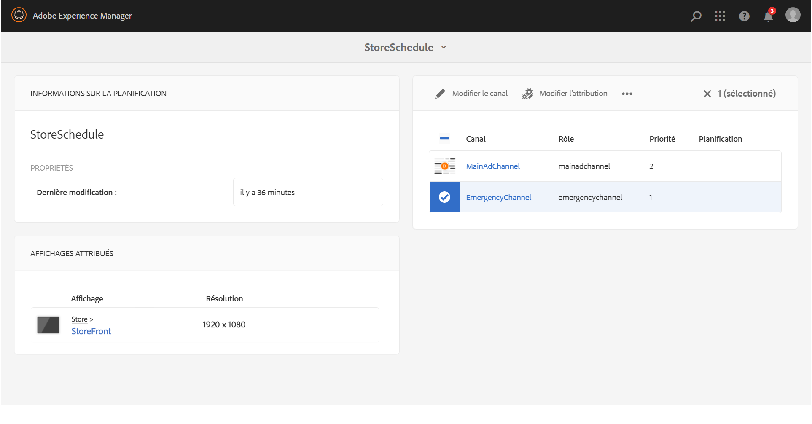

1. Définissez la **Priorité** de **EmergencyChannel** sur **3** depuis la boîte de dialogue **Attribution de canaux** et cliquez sur **Enregistrer**.

   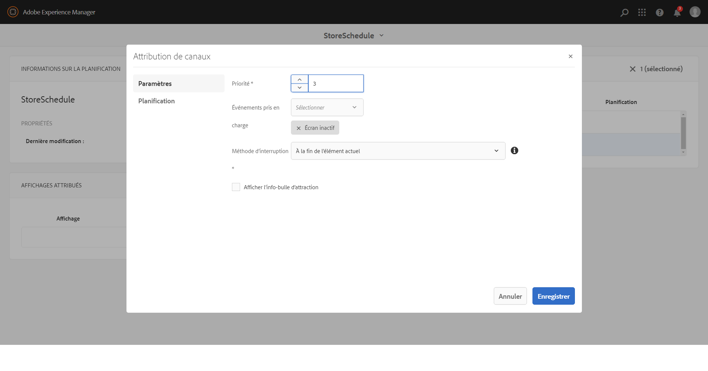

1. Lorsque la priorité du canal est mise à jour, tous les lecteurs AEM Screens affichent le contenu **EmergencyChannel**.

   

### Conclusion {#conclusion}

**EmergencyChannel** continue d’afficher son contenu jusqu’à ce que l’auteur ou l’autrice du contenu réinitialise la Valeur de priorité sur 1.

Lorsque l’auteur ou l’autrice du contenu a reçu une notification indiquant que l’urgence est terminée, la priorité de **MainAdChannel** doit être mise à jour. Cela entraîne la reprise de la lecture normale.

