# Utilisation de fragments d’expérience {#using-experience-fragments}

Cette page aborde les sujets suivants :

* **Présentation**
* **Utilisation de fragments d’expérience dans AEM Screens**
* **Propagation des modifications apportées à la page**

## Présentation {#overview}

Un ***fragment d’expérience*** est un groupe d’un ou plusieurs composants comprenant un contenu et une disposition pouvant être référencés dans les pages. Les fragments d’expérience peuvent contenir n’importe quel composant, par exemple, un ou plusieurs composants pouvant contenir un élément dans un système de paragraphes, qui sera référencé dans l’expérience complète ou demandé par un point de terminaison tiers.

## Utilisation de fragments d’expérience dans AEM Screens {#using-experience-fragments-in-aem-screens}

>[!NOTE]
>L’exemple ci-dessous utilise **We.Retail** comme projet de démonstration : le fragment d’expérience issu d’une page **Sites** est appliqué à un projet AEM Screens.

Par exemple, le workflow ci-après illustre l’utilisation de fragments d’expérience de We.Retail dans Sites. Vous pouvez choisir une page web et utiliser son contenu dans votre canal AEM Screens dans l’un de vos projets.

### Conditions préalables {#pre-requisites}

**Création d’un projet de démonstration avec un canal**

***Création d’un projet***

1. Cliquez sur **Créer un projet Screens** pour créer un projet.
1. Saisissez le titre **DemoProject**.
1. Cliquez sur **Enregistrer**.

Un **DemoProject** sera ajouté à AEM Screens.

***Création d’un canal***

1. Accédez au projet **DemoProject** que vous avez créé et sélectionnez le dossier **Channels** (Canaux).

1. Cliquez sur **Créer** dans la barre d’actions pour ouvrir l’assistant.
1. Sélectionnez le modèle **Canal de séquence** dans l’assistant et cliquez sur **Suivant**.

1. Saisissez le **titre** **TestChannel** et cliquez sur **Créer**.

Un **TestChannel** sera ajouté à votre **DemoProject**.\

### Création d’un fragment d’expérience {#creating-an-experience-fragment}

Suivez les étapes ci-dessous pour réutiliser le contenu de **We.Retail** dans votre canal **TestChannel** de **DemoProject**.

1. **Accédez à une page Sites dans We.Retail**

   1. Accédez à Sites et sélectionnez **We.Retail** -> **États-Unis** -> **Anglais** -> **Équipement** et sélectionnez cette page pour l’utiliser comme fragment d’expérience pour votre canal d’écrans.

   1. Cliquez sur **Modifier** dans la barre d’actions pour ouvrir la page que vous souhaitez utiliser comme fragment d’expérience pour votre canal Screens.

1. **Réutilisation du contenu**

   1. Sélectionnez le fragment à inclure dans votre canal.
   1. Cliquez sur la dernière icône à droite pour ouvrir la boîte de dialogue **Convertir en fragment d’expérience**.

   

1. **Création d’un fragment d’expérience**

   1. Choisissez l’**action** **Créer un fragment d’expérience**.

   1. Sélectionnez le **Chemin d’accès parent**.
   1. Sélectionnez le **Modèle**. Sélectionnez le modèle **Fragment d’expérience - Variation d’écran** ici (valeur dans le champ `/libs/settings/screens/experience-fragments/templates/experience-fragment-template-screens`).

   1. Saisissez le **Titre du fragment** **ScreensFragment**.

   1. Cliquez sur la coche pour terminer la création d’un fragment d’expérience.

   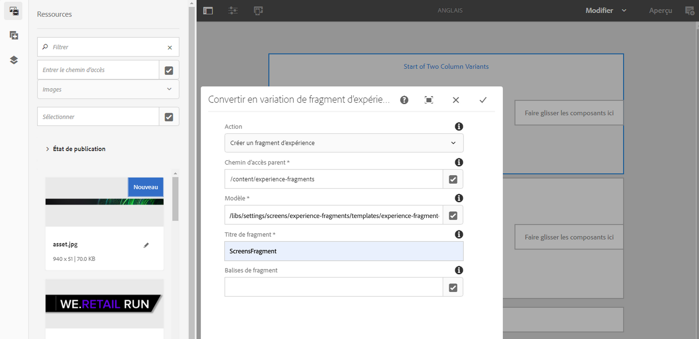

   Remarque : Pour sélectionner plus facilement une option, cliquez sur la coche située à droite des champs pour ouvrir la boîte de dialogue de sélection.

1. **Création d’une Live Copy du fragment d’expérience**

   1. Accédez à la page d’accueil d’AEM.
   1. Sélectionnez **Fragments d’expérience** et mettez en surbrillance **ScreensFragment**. Cliquez ensuite sur **Variation comme Live Copy**, comme illustré ci-dessous :

   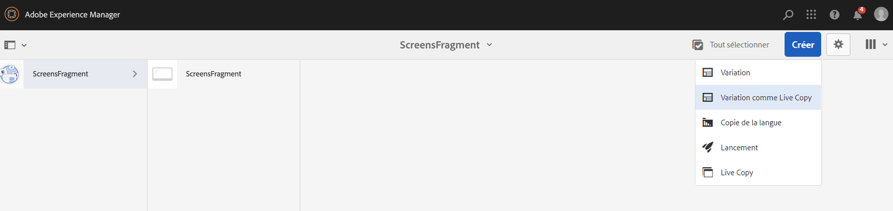

   c. Sélectionnez le fragment **ScreensFragment** depuis l’assistant **Créer une Live Copy**, puis cliquez sur **Suivant**.

   
d. Saisissez le **Titre** et le **Nom** **Screens**.

   e. Cliquez sur **Créer** pour créer la Live Copy.

   f. Cliquez sur **Terminé** pour revenir à la page **ScreensFragment**.

   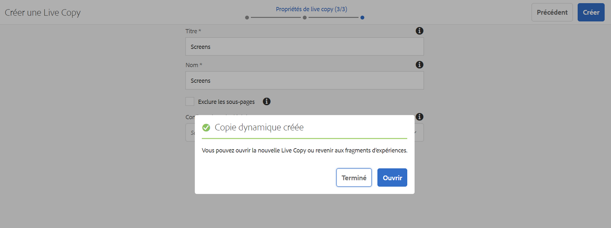

   >[!NOTE]
   >
   >Après avoir créé le fragment Screens, vous pouvez en modifier les propriétés. Sélectionnez le fragment et cliquez sur **Propriétés** dans la barre d’actions.

   **Modification des propriétés d’un fragment Screens**

   1. Accédez au fragment **ScreensFragment** (que vous avez créé lors des étapes précédentes) et cliquez sur **Propriétés** dans la barre d’actions.

   1. Sélectionnez l’onglet **Configuration hors ligne**, comme illustré ci-dessous.

   Vous pouvez ajouter les **bibliothèques côté client** (java et css) et les **fichiers statiques** à votre fragment d’expérience.

   L’exemple ci-dessous illustre l’ajout de bibliothèques côté client et de polices en tant que fichiers statiques au fragment d’expérience. 

1. **Utilisation du fragment d’expérience comme composant dans un canal Screens**

   1. Accédez au canal Screens où vous souhaitez utiliser le fragment **Screens**.
   1. Sélectionnez le canal **TestChannel** et cliquez sur **Modifier** dans la barre d’actions.

   1. Cliquez sur l’icône des composants dans l’onglet latéral.
   1. Faites glisser le **fragment d’expérience** et déposez-le dans votre canal.

   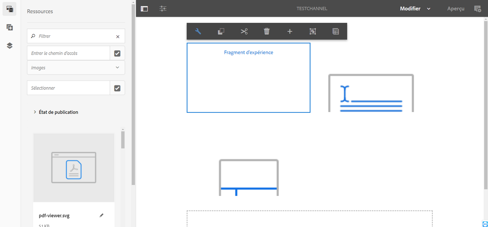

   e. Sélectionnez le composant **Fragment d’expérience**, puis l’icône en haut à gauche (clé) pour ouvrir la boîte de dialogue **Fragment d’expérience**.

   f. Sélectionnez la Live Copy **Screens** du fragment que vous avez créé à l’*étape 3* dans le champ **Chemin d’accès**.

   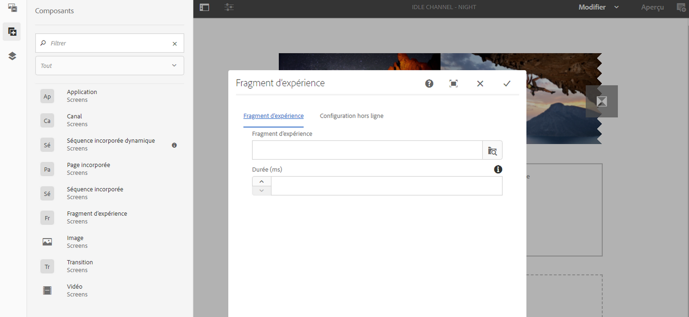

   f. Sélectionnez la Live Copy **Screens** du fragment que vous avez créé à l’*étape 3* dans le champ **Fragment d’expérience**.

   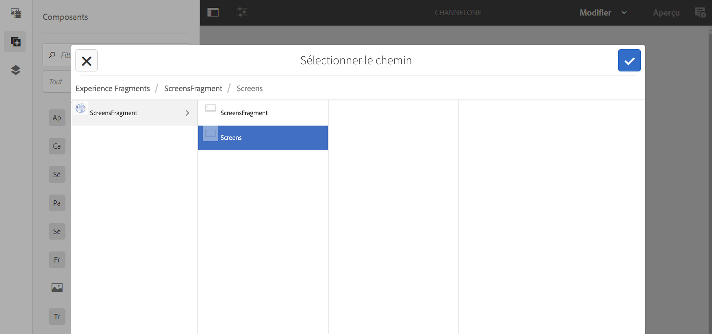

   h. Saisissez la valeur en millisecondes dans **Durée**.

   
i. Sélectionnez la **Configuration hors ligne** dans la boîte de dialogue **Fragments d’expérience** pour définir les bibliothèques côté client et les fichiers statiques.

   >[!NOTE]
   >
   >Si vous souhaitez ajouter des bibliothèques côté client ou des fichiers statiques à ce que vous avez configuré à l’étape (4), vous pouvez les ajouter à partir de l’onglet **Configuration hors ligne** de la boîte de dialogue **Fragment d’expérience**.

   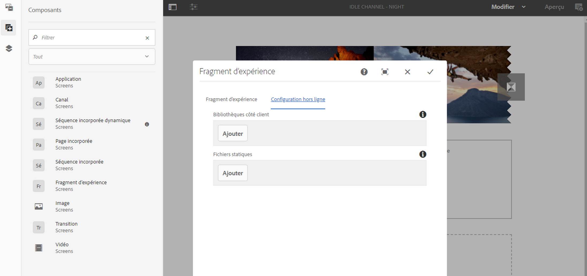

   j. Cliquez sur la coche pour terminer le processus.

### Validation du résultat {#validating-the-result}

Une fois les étapes précédentes terminées, vous pouvez valider le fragment d’expérience dans **ChannelOne** en :

1. accédant à **TestChannel** ;
1. sélectionnant l’**Aperçu** dans la barre d’actions.

Vous verrez le contenu de la page **Sites** (Live Copy du fragment d’expérience) dans votre canal, comme illustré ci-dessous :\
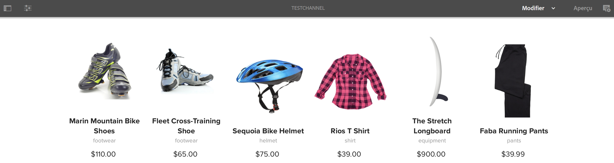

## Propagation des modifications apportées à la page {#propagating-changes-from-the-master-page}

Une ***Live Copy*** désigne la copie (de la source), gérée par des actions de synchronisation telles que définies par les configurations de déploiement.

Comme le fragment d’expérience que nous avons créé est une Live Copy de pages **Sites**, si vous apportez des modifications à ce fragment depuis le gabarit, vous verrez les modifications sur votre canal ou la destination où vous avez utilisé le fragment d’expérience.

>[!NOTE]
>
>Pour plus d’informations sur les Live Copy, voir Réutilisation de contenu : Multi Site Manager et Live Copy.

Pour propager les modifications du canal principal vers votre canal de destination :

1. Sélectionnez le fragment d’expérience sur la page **Sites** (gabarit) et cliquez sur l’icône en forme de crayon pour modifier les éléments du fragment d’expérience.

   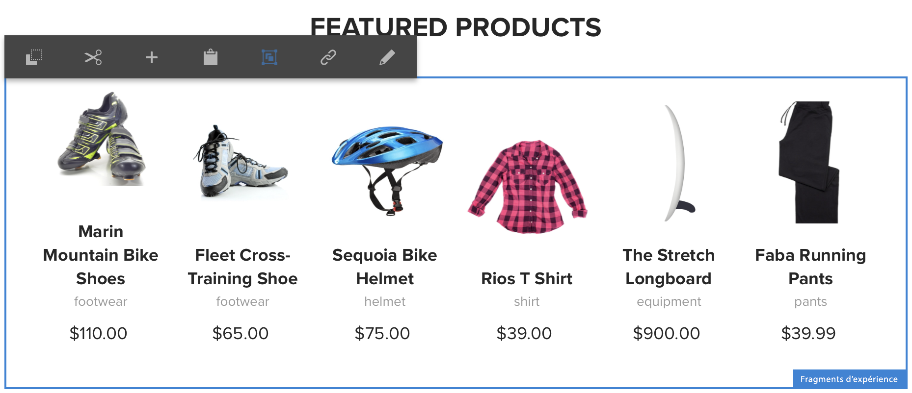

1. Sélectionnez le fragment d’expérience et cliquez sur l’icône en forme de clé pour ouvrir la boîte de dialogue permettant de modifier les images.

   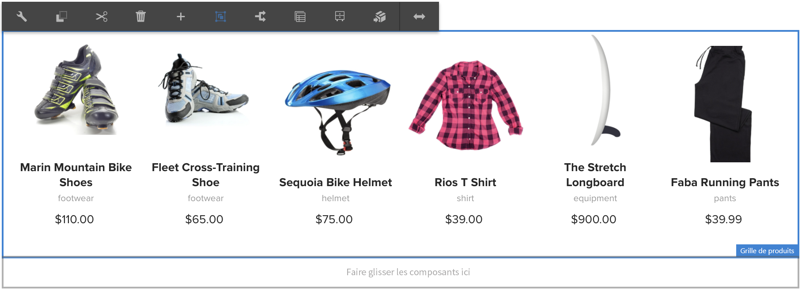

1. La boîte de dialogue **Grille de produits** apparaît.

   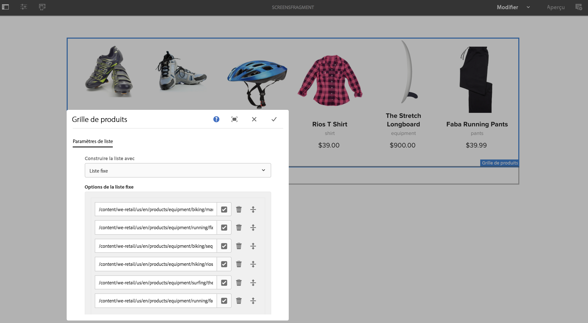

1. Vous pouvez modifier n’importe quelle image. Par exemple, ici, la première image est remplacée dans ce fragment.

   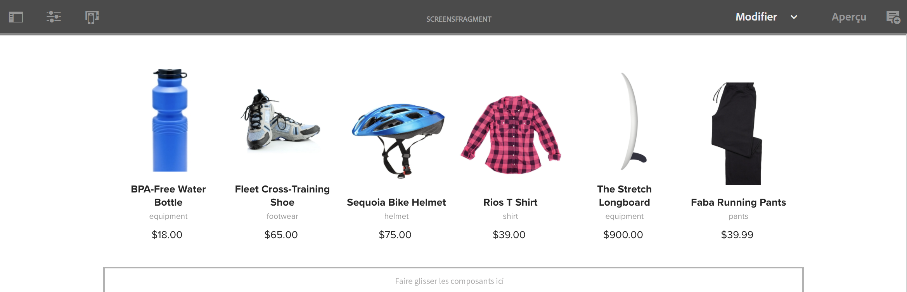

1. Sélectionnez le fragment d’expérience et cliquez sur l’icône Déploiement pour propager les modifications sur le fragment utilisé dans votre canal.

   

1. Cliquez sur Déployer pour confirmer les modifications.

   Vous verrez que les modifications sont appliquées.

   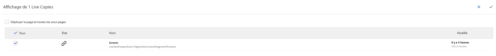

### Validation des modifications {#validating-the-changes}

Pour confirmer les modifications dans votre canal, procédez comme suit :

1. Accédez à **Screens** -> **Channels (Canaux)** -> **TestChannel**.

1. Cliquez sur **Aperçu** dans la barre d’actions pour confirmer les modifications.

L’image suivante illustre les modifications apportées à votre canal **TestChannel**:\

