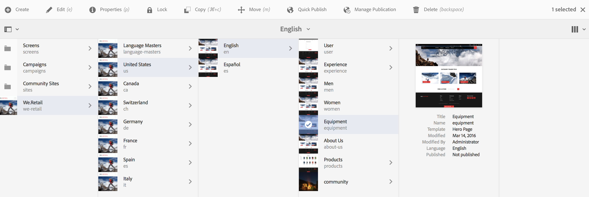
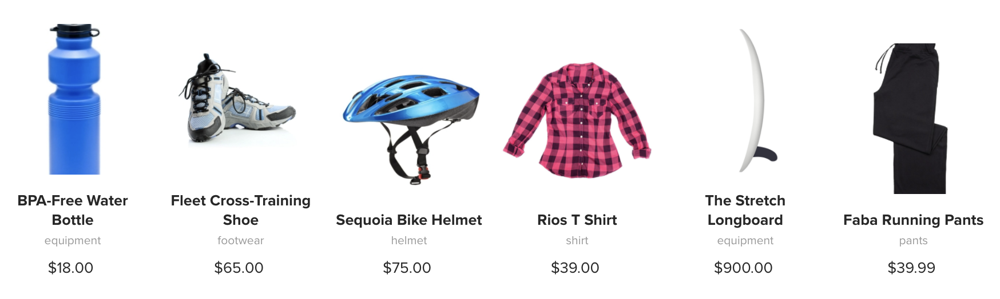

# Utilisation des fragments d’expérience {#using-experience-fragments}

Cette page traite des sujets suivants :

* **Présentation**
* **Utilisation des fragments d’expérience dans AEM Screens**
* **Propagation des modifications à partir du gabarit**

## Présentation {#overview}

Un ***fragment d’expérience**est un groupe d’un ou plusieurs composants comprenant un contenu et une mise en page pouvant être référencés dans les pages.* Les fragments d’expérience peuvent contenir n’importe quel composant, par exemple, un ou plusieurs composants pouvant contenir n’importe quel élément dans un système de paragraphes, qui sera référencé dans l’expérience complète ou demandé par un point de terminaison tiers.

## Utilisation des fragments d’expérience dans AEM Screens {#using-experience-fragments-in-aem-screens}

>[!NOTE]
>
>L’exemple suivant utilise **We.Retail** comme projet de démonstration depuis lequel le fragment d’expérience est exploité d’une page **Sites** à un projet AEM Screens.

Par exemple, le flux de travail suivant illustre l’utilisation de fragments d’expérience de We.Retail dans Sites. Vous pouvez choisir une page Web et exploiter ce contenu dans votre canal AEM Screens dans l’un de vos projets.

### Conditions préalables {#pre-requisites}

**Création d’un projet de démonstration avec un canal**

***Création d’un projet***

1. Click Screens and select **Create** --&gt; **Create Project **to create a new project.

1. Sélectionnez **Screens **dans l’assistant **Create Screens Project **assistant.

1. Saisissez le titre **DemoProject**.
1. Cliquez sur **Créer**.

Un **DemoProject** sera ajouté à vos écrans AEM.  ***Création d’un canal***

1. Navigate to the **DemoProject** you created and select the **Channels** folder.

1. Click **Create** from the action bar (see the figure below). Un assistant s’ouvre.
1. Sélectionnez le modèle Canal **de** séquence dans l’assistant et cliquez sur **Suivant**.

1. Enter the **Title** as **TestChannel** and click **Create**.

Un **TestChannel** sera ajouté à votre **DemoProject**.\

### Création d’un fragment d’expérience {#creating-an-experience-fragment}

Suivez les étapes ci-dessous pour tirer parti du contenu de **We.Retail** vers votre canal **TestChannel** dans **DemoProject**.

1. **Accédez à une page Sites dans We.Retail**

   1. Accédez à Sites et sélectionnez **We.Retail **-&gt;** États-Unis **-&gt;**Anglais **et sélectionnez **Matériel** pour utiliser cette page comme fragment d’expérience pour votre canal d’écrans.

   1. Cliquez sur **Modifier** dans la barre d’actions pour ouvrir la page que vous souhaitez utiliser comme fragment d’expérience pour votre canal d’écrans.
   

1. **Réutilisation du contenu**

   1. Sélectionnez le fragment à inclure dans votre canal.
   1. Cliquez sur la dernière icône à droite pour ouvrir la boîte de dialogue **Convertir en fragment** d’expérience.
   

1. **Création d’un fragment d’expérience**

   1. Sélectionnez l’ **action** comme **Créer un fragment** d’expérience.

   1. Sélectionnez le chemin **parent**.
   1. Select the **Template**. Sélectionnez le **fragment d’expérience - Variation d’écran **modèle ici.

   1. Enter the **Fragment Title **as **ScreensFragment**.

   1. Cliquez sur la coche pour terminer la création d’un fragment d’expérience.
   

1. **Création d’une copie dynamique du fragment d’expérience**

   1. Accédez à la page d’accueil d’AEM.
   1. Sélectionnez Fragments **d’** expérience, mettez en surbrillance le **fragment d’écran** et cliquez sur **Variation comme copie** en direct, comme illustré dans la figure ci-dessous :
   

   c. Sélectionnez le** Fragment d’écrans **depuis** l’assistant Créer une Live Copy**, puis cliquez sur **Suivant**.

   d. Saisissez le **Titre** et le **Nom** comme **Ecrans**.

   e. Cliquez sur **Créer** pour créer la Live Copy.

   f. Cliquez sur **Terminé** pour revenir à la page **EcransFragment** .

   

   >[!NOTE]
   >
   >Une fois que vous avez créé le fragment Ecrans, vous pouvez modifier les propriétés de votre fragment. Sélectionnez le fragment et cliquez sur **Propriétés** dans la barre d’actions.

   **Modification des propriétés d’un fragment d’écran**

   1. Accédez à **ScreensFragment** (que vous avez créé lors des étapes précédentes) et cliquez sur **Properties** dans la barre d’actions.

   1. Sélectionnez l’onglet Configuration **hors ligne** , comme illustré dans la figure ci-dessous.
   Vous pouvez ajouter les bibliothèques **côté** client (java et css) et les fichiers **** statiques à votre fragment d’expérience.

   L’exemple suivant montre l’ajout de bibliothèques côté client et de polices dans le cadre de fichiers statiques au fragment d’expérience.  

1. **Utilisation du fragment d’expérience comme composant dans le canal des écrans**

   1. Accédez au canal Ecrans où vous souhaitez utiliser le fragment **Ecrans** .
   1. Sélectionnez **TestChannel** et cliquez sur **Modifier** dans la barre d'actions.

   1. Cliquez sur l’icône des composants dans l’onglet latéral.
   1. Faites glisser le fragment **d’expérience** sur votre canal.
   

   e. Sélectionnez le composant Fragment **d’expérience** et sélectionnez l’icône en haut à gauche (clé à molette) pour ouvrir la boîte de dialogue Fragment **d’** expérience.

   f. Sélectionnez la copie en direct **Screens** du fragment que vous avez créé à l’ *étape 3* dans le champ **Path **field.

   

   f. Sélectionnez la copie en direct **Screens** du fragment que vous avez créé à l’ *étape 3* dans le champ **Expérience du fragment **champ.

   

   h. Entrez les secondes dans le champ** Durée**.

   i. Sélectionnez la configuration **hors ligne** dans la boîte de dialogue Fragments **d’** expérience pour définir les bibliothèques côté client et les fichiers statiques.

   >[!NOTE]
   >
   >Si vous souhaitez ajouter des bibliothèques côté client ou des fichiers statiques en plus de ce que vous avez configuré à l’étape (4), vous pouvez les ajouter à partir de l’onglet Configuration **** hors ligne de la boîte de dialogue Fragment **d’** expérience.

   

   j. Cliquez sur la coche pour terminer le processus.

### Validation du résultat {#validating-the-result}

Une fois les étapes précédentes terminées, vous pouvez valider le fragment d’expérience dans **ChannelOne** en procédant comme suit :

1. Accès à **TestChannel**.
1. Sélection de l’ **aperçu** dans la barre d’actions.

Vous verrez le contenu de la page **Sites** (copie en direct du fragment d’expérience) dans votre canal, comme illustré dans la figure ci-dessous :\

## Propagation des modifications à partir du gabarit {#propagating-changes-from-the-master-page}

***Live Copy*** fait référence à la copie (de la source), conservée par les actions de synchronisation définies par les configurations de déploiement.

Depuis le fragment d’expérience, nous avons créé une copie dynamique des pages **Sites** . Ainsi, si vous apportez des modifications à ce fragment particulier à partir du gabarit, vous verrez les modifications apportées à votre canal ou à la destination où vous avez utilisé le fragment d’expérience.

>[!NOTE]
>
>Pour plus d’informations sur la Live Copy, voir Réutilisation du contenu : Gestionnaire de plusieurs sites et Live Copy.

Pour propager les modifications du canal principal vers votre canal de destination, procédez comme suit :

1. Sélectionnez le fragment d’expérience dans la page **Sites** (gabarit) et cliquez sur l’icône représentant un crayon pour modifier les éléments du fragment d’expérience.

   

1. Sélectionnez le fragment d’expérience et cliquez sur l’icône en forme de clé à molette pour ouvrir la boîte de dialogue permettant de modifier les images.

   

1. La boîte de dialogue Grille **du** produit s’ouvre.

   

1. Vous pouvez modifier n’importe laquelle des images. Par exemple, ici, la première image est remplacée dans ce fragment.

   

1. Sélectionnez le fragment d’expérience et cliquez sur l’icône Déploiement pour propager les modifications au fragment utilisé dans votre canal.

   

1. Cliquez sur Déploiement pour confirmer les modifications.

   Vous verrez que les modifications sont appliquées.

   

### Validation des modifications {#validating-the-changes}

Suivez les étapes ci-dessous pour confirmer les modifications apportées à votre canal :

1. Accédez aux **écrans** -&gt; **Canaux** -&gt; **TestChannel**.

1. Cliquez sur **Aperçu** dans la barre d’actions pour confirmer les modifications.

L'image suivante illustre les modifications apportées à votre **TestChannel**:\

