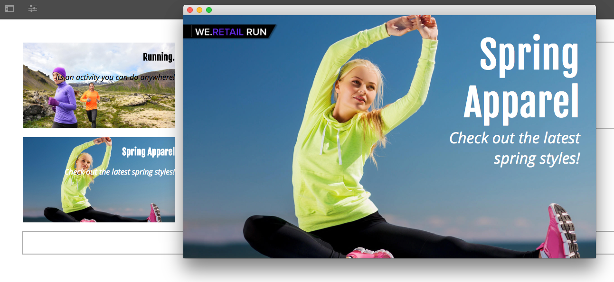
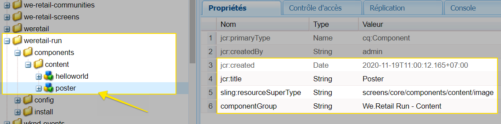
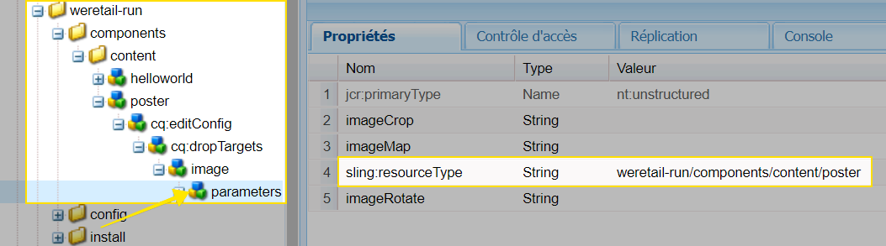
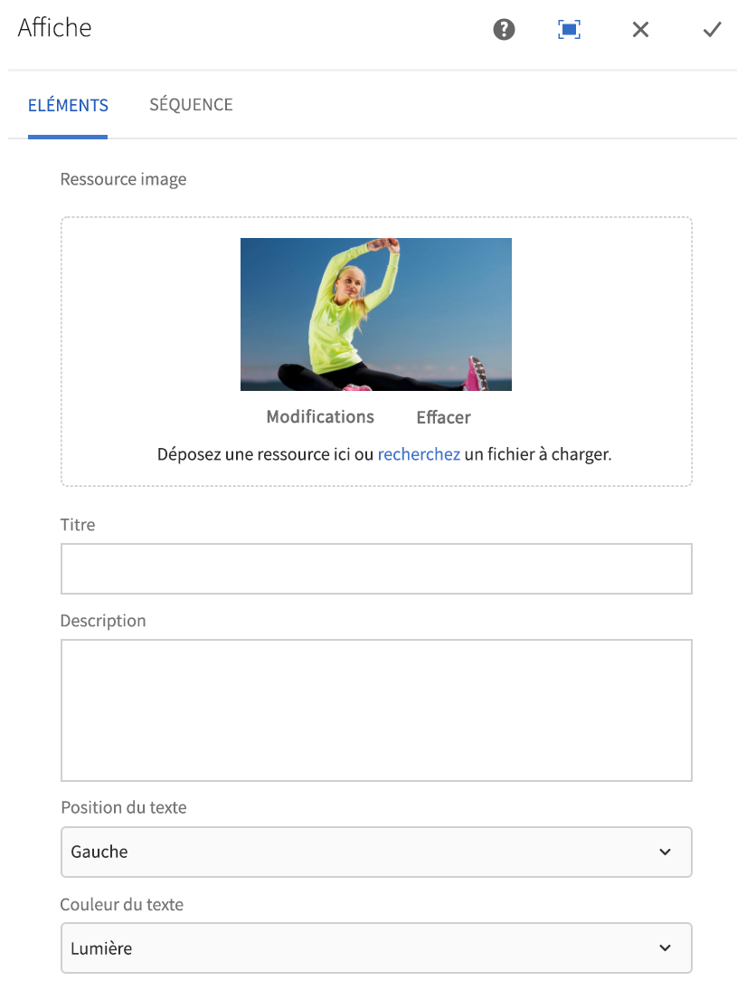
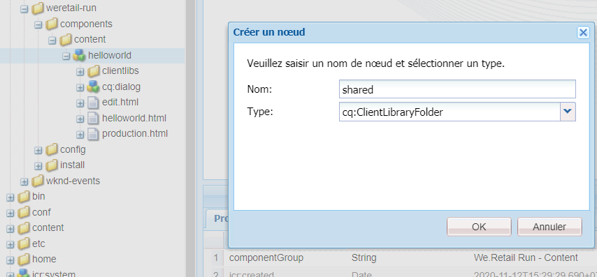
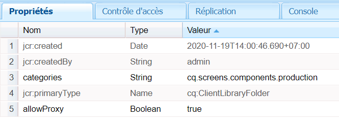
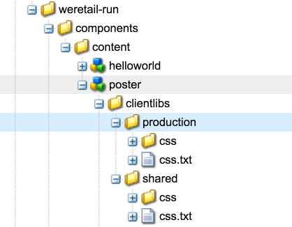
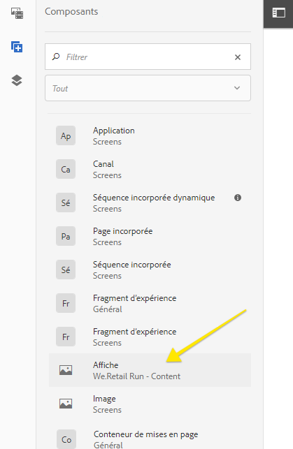
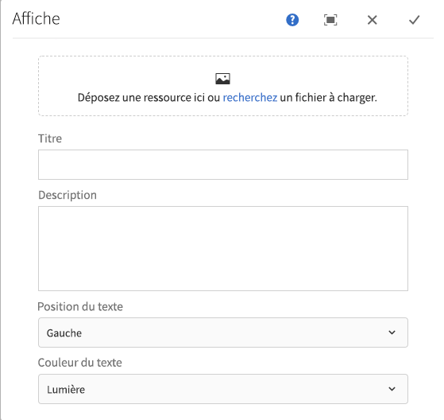
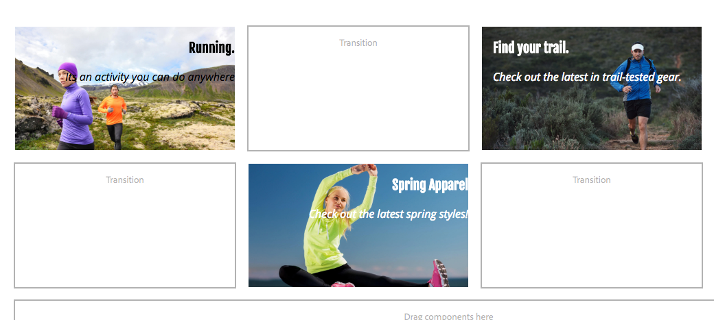

# Extension d’un composant AEM Screens {#extending-an-aem-screens-component}

Le tutoriel ci-après décrit les étapes et les bonnes pratiques pour étendre les composants prêts à l’emploi d’AEM Screens. Le composant Image est étendu pour ajouter une superposition de texte modifiable.

## Présentation {#overview}

Ce tutoriel est destiné aux développeurs qui découvrent AEM Screens. Dans ce tutoriel, le composant Image de Screens est étendu pour créer un composant Poster. Un titre, une description et un logo sont superposés sur une image pour créer une expérience attrayante dans un canal de séquence.

>[!NOTE]
>
>Il est conseillé de suivre le tutoriel [Développement d’un composant personnalisé pour AEM Screens](developing-custom-component-tutorial-develop.md) avant de commencer celui-ci.



Le composant Poster personnalisé est créé en étendant le composant Image.

## Conditions préalables {#prerequisites}

## Configuration du projet {#project-setup}

1. Téléchargez et installez les packages suivants à l’aide de la **gestion des packages CRX** `http://localhost:4502/crx/packmgr/index.jsp)r:`

   [Obtenir le fichier](assets/start-poster-screens-weretail-runuiapps-001-snapshot.zip)

   [Obtenir le fichier](assets/start-poster-screens-weretail-runuicontent-001-snapshot.zip)
   **Éventuellement,** si vous utilisez Eclipse ou un autre IDE, téléchargez le package source ci-dessous. Déployez le projet sur une instance AEM locale à l’aide de la commande Maven :

   **`mvn -PautoInstallPackage clean install`**

   SRC Start Screens We.Retail Run Project

   [Obtenir le fichier](assets/start-poster-screens-weretail-run.zip)

1. Dans **CRX Package Manager** `http://localhost:4502/crx/packmgr/index.jsp`, les deux packages suivants sont installés :

   1. **screens-weretail-run.ui.content-0.0.1-SNAPSHOT.zip**
   1. **screens-weretail-run.ui.apps-0.0.1-SNAPSHOT.zip**
   

   Packages Ui.Apps et Ui.Content Screens We.Retail Run installés via CRX Package Manager

## Création du composant Poster {#poster-cmp}

Le composant Poster étend le composant Image prêt à l’emploi. Un mécanisme de Sling, `sling:resourceSuperType`, est utilisé pour hériter des fonctionnalités de base du composant Image sans avoir à utiliser la fonction Copier/Coller. Vous trouverez plus d’informations sur les notions de base du [traitement des requêtes Sling ici.](https://helpx.adobe.com/experience-manager/6-5/sites/developing/using/the-basics.html#SlingRequestProcessing)

Le composant Poster s’affiche en plein écran en mode d’aperçu/de production. En mode d’édition, il est important d’effectuer le rendu du composant différemment afin de faciliter la création du canal de séquence.

1. Dans **CRXDE-Lite** `http://localhost:4502/crx/de/index.jsp` (ou un IDE de votre choix), sous `/apps/weretail-run/components/content`, créez un composant `cq:Component` intitulé `poster`.

   Ajoutez les propriétés suivantes au composant `poster` :

   ```xml
   <?xml version="1.0" encoding="UTF-8"?>
   <jcr:root xmlns:sling="https://sling.apache.org/jcr/sling/1.0" xmlns:cq="https://www.day.com/jcr/cq/1.0" xmlns:jcr="https://www.jcp.org/jcr/1.0"
       jcr:primaryType="cq:Component"
       jcr:title="Poster"
       sling:resourceSuperType="screens/core/components/content/image"
       componentGroup="We.Retail Run - Content"/>
   ```

   

   Propriétés pour /apps/weretail-run/components/content/poster

   Lorsque la propriété `sling:resourceSuperType` est égale à `screens/core/components/content/image`, le composant Poster hérite de toutes les fonctionnalités du composant Image. Il est possible d’ajouter sous le composant `poster` des nœuds et des fichiers équivalents présents sous `screens/core/components/content/image` afin de remplacer et d’étendre les fonctionnalités.

1. Copiez le nœud `cq:editConfig` sous `/libs/screens/core/components/content/image.`Collez le nœud `cq:editConfig` sous le composant `/apps/weretail-run/components/content/poster`.

   Sur le nœud `cq:editConfig/cq:dropTargets/image/parameters`, mettez la propriété `sling:resourceType` à jour afin qu’elle soit égale à `weretail-run/components/content/poster`.

   

   Vous trouverez ci-dessous une représentation XML du nœud cq:editConfig :

   ```xml
   <?xml version="1.0" encoding="UTF-8"?>
   <jcr:root xmlns:sling="https://sling.apache.org/jcr/sling/1.0" xmlns:cq="https://www.day.com/jcr/cq/1.0" xmlns:jcr="https://www.jcp.org/jcr/1.0" xmlns:nt="https://www.jcp.org/jcr/nt/1.0"
       jcr:primaryType="cq:EditConfig">
       <cq:dropTargets jcr:primaryType="nt:unstructured">
           <image
               jcr:primaryType="cq:DropTargetConfig"
               accept="[image/.*]"
               groups="[media]"
               propertyName="./fileReference">
               <parameters
                   jcr:primaryType="nt:unstructured"
                   sling:resourceType="weretail-run/components/content/poster"
                   imageCrop=""
                   imageMap=""
                   imageRotate=""/>
           </image>
       </cq:dropTargets>
   </jcr:root>
   ```

1. Copiez la boîte de dialogue `image` WCM Foundation à utiliser pour le composant `poster`.

   Il est plus facile de commencer à partir d’une boîte de dialogue existante, puis d’apporter des modifications.

   1. Copiez la boîte de dialogue depuis : `/libs/wcm/foundation/components/image/cq:dialog`
   1. Collez la boîte de dialogue sous `/apps/weretail-run/components/content/poster`
   

   Boîte de dialogue copiée depuis /libs/wcm/foundation/components/image/cq:dialog vers /apps/weretail-run/components/content/poster

   Le composant `image` Screens est un supertype du composant `image` WCM Foundation. Le composant `poster` hérite donc des fonctionnalités des deux. La boîte de dialogue du composant Poster est composée d’une combinaison des boîtes de dialogue Screens et Foundation. Les fonctionnalités de la **fusion de ressources Sling** permettent de masquer les champs et les onglets inutiles de boîte de dialogue hérités des composants de supertype.

1. Mettez à jour cq:dialog sous `/apps/weretail-run/components/content/poster` avec les modifications suivantes représentées en XML :

   ```xml
   <?xml version="1.0" encoding="UTF-8"?>
   <jcr:root xmlns:sling="https://sling.apache.org/jcr/sling/1.0" xmlns:cq="https://www.day.com/jcr/cq/1.0" xmlns:jcr="https://www.jcp.org/jcr/1.0" xmlns:nt="https://www.jcp.org/jcr/nt/1.0"
       jcr:primaryType="nt:unstructured"
       jcr:title="Poster"
       sling:resourceType="cq/gui/components/authoring/dialog">
       <content
           jcr:primaryType="nt:unstructured"
           sling:resourceType="granite/ui/components/foundation/container">
           <layout
               jcr:primaryType="nt:unstructured"
               sling:resourceType="granite/ui/components/foundation/layouts/tabs"
               type="nav"/>
           <items jcr:primaryType="nt:unstructured">
               <image
                   jcr:primaryType="nt:unstructured"
                   jcr:title="Elements"
                   sling:resourceType="granite/ui/components/foundation/section">
                   <layout
                       jcr:primaryType="nt:unstructured"
                       sling:resourceType="granite/ui/components/foundation/layouts/fixedcolumns"
                       margin="{Boolean}false"/>
                   <items jcr:primaryType="nt:unstructured">
                       <column
                           jcr:primaryType="nt:unstructured"
                           sling:resourceType="granite/ui/components/foundation/container">
                           <items
                               jcr:primaryType="nt:unstructured"
                               sling:hideChildren="[linkURL,size]">
                               <file
                                   jcr:primaryType="nt:unstructured"
                                   sling:resourceType="cq/gui/components/authoring/dialog/fileupload"
                                   autoStart="{Boolean}false"
                                   class="cq-droptarget"
                                   fieldLabel="Image asset"
                                   fileNameParameter="./fileName"
                                   fileReferenceParameter="./fileReference"
                                   mimeTypes="[image]"
                                   multiple="{Boolean}false"
                                   name="./file"
                                   title="Upload Image Asset"
                                   uploadUrl="${suffix.path}"
                                   useHTML5="{Boolean}true"/>
                               <title
                                   jcr:primaryType="nt:unstructured"
                                   sling:resourceType="granite/ui/components/foundation/form/textfield"
                                   fieldLabel="Title"
                                   name="./jcr:title"/>
                               <description
                                   jcr:primaryType="nt:unstructured"
                                   sling:resourceType="granite/ui/components/foundation/form/textarea"
                                   fieldLabel="Description"
                                   name="./jcr:description"/>
                               <position
                                   jcr:primaryType="nt:unstructured"
                                   sling:resourceType="granite/ui/components/coral/foundation/form/select"
                                   fieldLabel="Text Position"
                                   name="./textPosition">
                                   <items jcr:primaryType="nt:unstructured">
                                       <left
                                           jcr:primaryType="nt:unstructured"
                                           text="Left"
                                           value="left"/>
                                       <center
                                           jcr:primaryType="nt:unstructured"
                                           text="Center"
                                           value="center"/>
                                       <right
                                           jcr:primaryType="nt:unstructured"
                                           text="Right"
                                           value="right"/>
                                   </items>
                               </position>
                               <color
                                   jcr:primaryType="nt:unstructured"
                                   sling:resourceType="granite/ui/components/coral/foundation/form/select"
                                   fieldLabel="Text Color"
                                   name="./textColor">
                                   <items jcr:primaryType="nt:unstructured">
                                       <light
                                           jcr:primaryType="nt:unstructured"
                                           text="Light"
                                           value="light"/>
                                       <dark
                                           jcr:primaryType="nt:unstructured"
                                           text="Dark"
                                           value="dark"/>
                                   </items>
                               </color>
                           </items>
                       </column>
                   </items>
               </image>
               <accessibility
                   jcr:primaryType="nt:unstructured"
                   sling:hideResource="{Boolean}true"/>
           </items>
       </content>
   </jcr:root>
   ```

   La propriété `sling:hideChildren`= `"[linkURL,size]`" est utilisée sur le nœud `items` pour veiller à ce que les champs **linkURL** et **size** soient masqués dans la boîte de dialogue. Supprimer ces nœuds de la boîte de dialogue Poster n’est pas suffisant. La propriété `sling:hideResource="{Boolean}true"` de l’onglet d’accessibilité sert à masquer l’ensemble de l’onglet.

   Deux champs de sélection sont ajoutés à la boîte de dialogue pour permettre aux auteurs de contrôler la position et la couleur du texte du titre et de la description.

   

   Poster : structure finale de la boîte de dialogue

   À ce stade, vous pouvez ajouter une instance du composant `poster` à la page de **canal inactif** dans le projet We.Retail Run : `http://localhost:4502/editor.html/content/screens/we-retail-run/channels/idle-channel.edit.html`.

   

   Champs de la boîte de dialogue Poster

1. Sous `/apps/weretail-run/components/content/poster`, créez un fichier appelé `production.html.`

   Remplissez le fichier avec les éléments suivants :

   ```xml
   <!--/*
   
       /apps/weretail-run/components/content/poster/production.html
   
   */-->
   <div data-sly-use.image="image.js"
        data-duration="${properties.duration}"
        class="cmp-poster"
        style="background-image: url(${request.contextPath @ context='uri'}${image.src @ context='uri'});">
       <div class="cmp-poster__text
                   cmp-poster__text--${properties.textPosition @ context='attribute'}
                   cmp-poster__text--${properties.textColor @ context='attribute'}">
           <h1 class="cmp-poster__title">${properties.jcr:title}</h1>
            <h2 class="cmp-poster__description">${properties.jcr:description}</h2>
       </div>
    
   </div>
   ```

   L’illustration ci-dessus représente les balises de production pour le composant Poster. Le script HTL remplace `screens/core/components/content/image/production.html`. Le script `image.js` est un script côté serveur qui crée un objet Image de type POJO. Vous pouvez alors appeler l’objet Image pour effectuer le rendu de `src` comme image d’arrière-plan de style intraligne.

   Les balises `The h1` et h2 affichent le titre et la description en fonction des propriétés du composant : `${properties.jcr:title}` et `${properties.jcr:description}`.

   Les balises `h1` et `h2` sont entourées par un wrapper div comportant trois classes CSS avec des variantes de "`cmp-poster__text`". La valeur des propriétés `textPosition` et `textColor` est utilisée pour modifier la classe CSS rendue en fonction des sélections de l’auteur concernant la boîte de dialogue. Dans la section suivante, les CSS des bibliothèques clientes sont écrites pour permettre l’affichage de ces modifications.

   Un logo est également inclus comme superposition dans le composant. Dans cet exemple, le chemin d’accès au logo We.Retail est codé en dur dans DAM. Selon le cas d’utilisation, il peut être plus judicieux de créer un champ de boîte de dialogue pour faire du chemin d’accès au logo une valeur renseignée de manière dynamique.

   Notez également que la notation BEM (Block Element Modifier) est utilisée avec le composant. BEM est une convention de codage CSS qui facilite la création de composants réutilisables. Il s’agit de la notation utilisée par les [composants de base d’AEM](https://github.com/Adobe-Marketing-Cloud/aem-core-wcm-components/wiki/CSS-coding-conventions). Vous trouverez plus d’informations à l’adresse : [https://getbem.com/](https://getbem.com/)

1. Sous `/apps/weretail-run/components/content/poster`, créez un fichier appelé `edit.html.`

   Remplissez le fichier avec les éléments suivants :

   ```xml
   <!--/*
   
       /apps/weretail-run/components/content/poster/edit.html
   
   */-->
   
   <div class="aem-Screens-editWrapper ${image.cssClass} cmp-poster" data-sly-use.image="image.js" data-emptytext="${'Poster' @ i18n, locale=request.locale}">
       
       <div class="cmp-poster__text
              cmp-poster__text--${properties.textPosition @ context='attribute'}
          cmp-poster__text--${properties.textColor @ context='attribute'}">
         <p class="cmp-poster__title">${properties.jcr:title}</p>
         <p class="cmp-poster__description">${properties.jcr:description}</p>
       </div>
   </div>
   ```

   L’illustration ci-dessus représente les balises d’**édition** pour le composant Poster. Le script HTL remplace `/libs/screens/core/components/content/image/edit.html`. Les balises sont similaires à celles de `production.html`. Elles affichent le titre et la description au-dessus de l’image.

   L’élément `aem-Screens-editWrapper` est ajouté de sorte que le composant ne soit pas affiché en plein écran dans l’éditeur. L’attribut `data-emptytext` garantit l’affichage d’un espace réservé en l’absence de contenu ou d’image.

## Création de bibliothèques côté client {#clientlibs}

Les bibliothèques côté client offrent un mécanisme d’organisation et de gestion des fichiers CSS et JavaScript nécessaires à une mise en œuvre d’AEM. Vous trouverez plus d’informations sur l’utilisation des [bibliothèques côté client ici.](https://helpx.adobe.com/fr/experience-manager/6-5/sites/developing/using/clientlibs.html)

Les composants d’AEM Screens s’affichent différemment en mode d’édition et en mode d’aperçu/de production. Deux ensembles de bibliothèques clientes sont créés, l’un pour le mode d’édition et l’autre pour le mode d’aperçu/de production.

1. Créez un dossier pour les bibliothèques côté client du composant Poster.

   Sous `/apps/weretail-run/components/content/poster,`, créez un dossier appelé `clientlibs`.

   

1. Sous le dossier `clientlibs`, créez un nœud appelé `shared` de type `cq:ClientLibraryFolder.`

   

1. Ajoutez les propriétés suivantes à la bibliothèque cliente partagée :

   * `allowProxy` | Booléen | `true`
   * `categories` | Chaîne[] | `cq.screens.components`
   

   Propriétés pour /apps/weretail-run/components/content/poster/clientlibs/shared

   La propriété `categories` est une chaîne qui identifie la bibliothèque cliente. La catégorie `cq.screens.components` est utilisée en mode d’édition et en mode d’aperçu/de production. Ainsi, tout CSS/JS défini dans la clientlib `shared` est chargé dans tous les modes.

   Il est recommandé de ne jamais exposer directement les chemins d’accès à /apps dans un environnement de production. La propriété `allowProxy` garantit le référencement de CSS et JS de la bibliothèque cliente par le biais d’un préfixe `/etc.clientlibs`. Vous trouverez [ici](https://helpx.adobe.com/experience-manager/6-5/sites/developing/using/clientlibs.html#main-pars_title_8ced) plus d’informations sur la propriété allowProxy.

1. Créez un fichier appelé `css.txt` sous le dossier partagé.

   Remplissez le fichier avec les éléments suivants :

   ```
   #base=css
   
   styles.less
   ```

1. Créez un dossier appelé `css` sous le dossier `shared`. Ajoutez un fichier appelé `style.less` sous le dossier `css`. La structure des bibliothèques clientes doit maintenant ressembler à celle-ci :

   

   Dans ce tutoriel, au lieu d’écrire des CSS directement, on utilise LESS. [LESS](https://lesscss.org/) est un précompilateur CSS répandu prenant en charge les mixins, fonctions et variables CSS. Les bibliothèques clientes AEM prennent en charge la compilation LESS de manière native. Il est possible d’utiliser Sass ou d’autres précompilateurs, mais la compilation doit être réalisée en dehors d’AEM.

1. Remplissez `/apps/weretail-run/components/content/poster/clientlibs/shared/css/styles.less` avec les éléments suivants :

   ```css
   /*
    /apps/weretail-run/components/content/poster/clientlibs/shared/css/styles.less
    Poster Component - Shared Style
   */
   
   @import url('https://fonts.googleapis.com/css?family=Fjalla+One|Open+Sans:400i');
   
   @text-light-color: #fff;
   @text-dark-color: #000;
   @title-font-family: 'Fjalla One', sans-serif;
   @description-font-family: 'Open Sans', sans-serif;
   
   .cmp-poster {
   
         &__text {
         position: absolute;
         color: @text-light-color;
         top: 0;
         text-align:center;
         width: 100%;
   
         &--left {
          text-align: left;
                margin-left: 1em;
         }
   
         &--right {
          text-align: right;
                margin-right: 1em;
         }
   
         &--dark {
          color: @text-dark-color;
         }
       }
   
       &__title {
         font-weight: bold;
            font-family: @title-font-family;
            font-size: 1.2em;
       }
   
       &__description {
     font-style: italic;
           font-family: @description-font-family;
    }
   
   }
   ```

   >[!NOTE]
   >
   >Les polices web Google sont utilisées pour les familles de polices. Les polices web nécessitent une connexion à Internet, et certaines mises en œuvre de Screens ne disposent pas d’une connexion fiable. Il est important d’effectuer une planification pour le mode hors ligne pour les déploiements de Screens.

1. Copiez le dossier de bibliothèque cliente `shared`. Collez-le en tant que frère et renommez-le `production`.

   

1. Mettez à jour la propriété `categories` de la bibliothèque cliente de production pour la définir comme `cq.screens.components.production.`

   La catégorie `cq.screens.components.production` veille à ce que les styles ne soient chargés qu’en mode d’aperçu/de production.

   

   Propriétés pour /apps/weretail-run/components/content/poster/clientlibs/production

1. Remplissez `/apps/weretail-run/components/content/poster/clientlibs/production/css/styles.less` avec les éléments suivants :

   ```css
   /*
    /apps/weretail-run/components/content/poster/clientlibs/production/css/styles.less
    Poster Component - Production Style
   */
   
   .cmp-poster {
   
       background-size: cover;
    height: 100%;
    width: 100%;
    position:absolute;
   
        &__text {
   
           top: 2em;
   
           &--left {
               width: 40%;
               top: 5em;
           }
   
           &--right {
               width: 40%;
               right: 1em;
           }
       }
   
       &__title {
     font-size: 5rem;
     font-weight: 900;
     margin: 0.1rem;
    }
   
    &__description {
     font-size: 2rem;
     margin: 0.1rem;
     font-weight: 400;
   
    }
   
       &__logo {
     position: absolute;
     max-width: 200px;
     top: 1em;
     left: 0;
    }
   
   }
   ```

   Les styles ci-dessus affichent le titre et la description dans une position absolue à l’écran. Le titre apparaît nettement plus gros que la description. La notation BEM du composant permet de délimiter soigneusement et très facilement les styles dans la classe cmp-poster.

Il serait possible d’utiliser une troisième catégorie de bibliothèque cliente pour ajouter uniquement des styles spécifiques au composant : `cq.screens.components.edit`.

| Catégorie de bibliothèque cliente | Utilisation |
|---|---|
| `cq.screens.components` | Styles et scripts partagés entre les modes d’édition et de production |
| `cq.screens.components.edit` | Styles et scripts utilisés uniquement en mode d’édition |
| `cq.screens.components.production` | Styles et scripts utilisés uniquement en mode de production |

## Ajout d’un composant Poster à un canal de séquence {#add-sequence-channel}

Le composant Poster est destiné à être utilisé sur un canal de séquence. Le package de démarrage de ce tutoriel comportait un canal inactif. Le canal inactif est préconfiguré pour autoriser les composants du groupe **We.Retail Run - Content**. Le groupe du composant Poster est défini sur `We.Retail Run - Content` et peut être ajouté au canal.

1. Ouvrez le canal inactif à partir du projet We.Retail Run : **`http://localhost:4502/editor.html/content/screens/we-retail-run/channels/idle-channel.edit.html`**
1. Faites glisser une nouvelle instance du composant **Poster** depuis la barre latérale et déposez-la sur la page.

   

1. Modifiez la boîte de dialogue du composant Poster pour ajouter une image, un titre et une description. Utilisez les options de position du texte et de couleur du texte pour vous assurer que le titre/la description soit lisible sur l’image.

   

1. Répétez les étapes ci-dessus pour ajouter quelques composants Poster. Ajoutez des transitions entre les composants.

   

## Assemblage {#putting-it-all-together}

La vidéo ci-dessous montre le composant terminé et comment l’ajouter à un canal de séquence. Le canal est ensuite ajouté à un emplacement, puis affecté à un lecteur Screens.

>[!VIDEO](https://video.tv.adobe.com/v/22414?quaity=9&captions=fre_fr)

## Code terminé {#finished-code}

Vous trouverez ci-dessous le code final du tutoriel. **screens-weretail-run.ui.apps-0.0.1-SNAPSHOT.zip** et **screens-weretail-run.ui.content-0.0.1-SNAPSHOT.zip** sont les packages AEM compilés. Le fichier **SRC-screens-weretail-run-0.0.1.zip **est le code source non compilé qui peut être déployé à l’aide de Maven.

[Obtenir le fichier](assets/final-poster-screens-weretail-runuiapps-001-snapshot.zip)

[Obtenir le fichier](assets/final-poster-screens-weretail-runuicontent-001-snapshot.zip)

Projet SRC Final Screens We.Retail Run

[Obtenir le fichier](assets/src-screens-weretail-run-001.zip)
