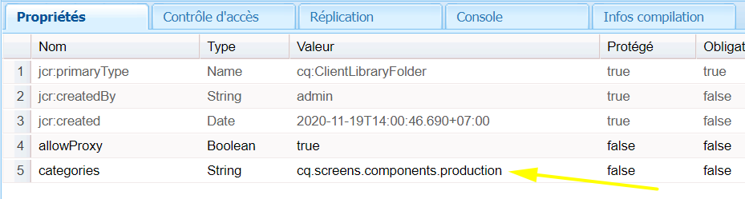

# Extension d’un composant d’écrans AEM {#extending-an-aem-screens-component}

Le didacticiel suivant décrit les étapes et les bonnes pratiques pour étendre les composants d’AEM Screens prêts à l’emploi. Le composant Image est étendu pour ajouter une incrustation de texte autorisée.

## Présentation {#overview}

Ce didacticiel est destiné aux développeurs qui découvrent AEM Screens. Dans ce didacticiel, le composant Image d’écran est étendu pour créer un composant d’affiche. Un titre, une description et un logo sont superposés au-dessus d’une image pour créer une expérience fascinante dans un canal de séquence.

>[!NOTE]
>
>Avant de commencer ce didacticiel, il est recommandé de terminer le didacticiel : [Développement d’un composant personnalisé pour les écrans](developing-custom-component-tutorial-develop.md)AEM.


Le composant Affiche personnalisée est créé en étendant le composant Image.

## Conditions préalables {#prerequisites}

## Project Setup {#project-setup}

1. Téléchargez et installez les packages suivants à l’aide de la gestion **des packages** CRX `http://localhost:4502/crx/packmgr/index.jsp)r:`

   [Obtenir un fichier](assets/start-poster-screens-weretail-runuiapps-001-snapshot.zip)

   [Obtenir un fichier](assets/start-poster-screens-weretail-runuicontent-001-snapshot.zip)
   **Si vous le souhaitez,** si vous utilisez Eclipse ou un autre IDE, téléchargez le package source ci-dessous. Déployez le projet sur une instance AEM locale à l’aide de la commande expert :

   **`mvn -PautoInstallPackage clean install`**

   SRC Start Screens We.Retail Run Project

   [Obtenir un fichier](assets/start-poster-screens-weretail-run.zip)

1. Dans **CRX Package Manager** `http://localhost:4502/crx/packmgr/index.jsp` , les deux packages suivants sont installés :

   1. **screens-weretail-run.ui.content-0.0.1-SNAPSHOT.zip**
   1. **screens-weretail-run.ui.apps-0.0.1-SNAPSHOT.zip**
   

   Screens We.Retail Run Ui.Apps et Ui.Content packages installés via CRX Package Manager

## Création du composant d’affiche {#poster-cmp}

Le composant Affiche étend le composant Image des écrans prêts à l’emploi. Un mécanisme de Sling, `sling:resourceSuperType`, est utilisé pour hériter des fonctionnalités de base du composant Image sans avoir à copier/coller. Vous trouverez plus d’informations sur les bases du traitement des demandes [Sling ici.](https://helpx.adobe.com/experience-manager/6-5/sites/developing/using/the-basics.html#SlingRequestProcessing)

Le composant d’affiche est rendu en plein écran en mode d’aperçu/de production. En mode d’édition, il est important de rendre le composant différemment afin de faciliter la création du canal de séquence.

1. Dans **CRXDE-Lite** (ou IDE de choix) sous pour `http://localhost:4502/crx/de/index.jsp` créer un nouveau `/apps/weretail-run/components/content`nom `cq:Component` `poster`.

   Add the following properties to the `poster` component:

   ```xml
   <?xml version="1.0" encoding="UTF-8"?>
   <jcr:root xmlns:sling="https://sling.apache.org/jcr/sling/1.0" xmlns:cq="https://www.day.com/jcr/cq/1.0" xmlns:jcr="https://www.jcp.org/jcr/1.0"
       jcr:primaryType="cq:Component"
       jcr:title="Poster"
       sling:resourceSuperType="screens/core/components/content/image"
       componentGroup="We.Retail Run - Content"/>
   ```

   

   Propriétés de /apps/weretail-run/components/content/poster

   En définissant la `sling:resourceSuperType`propriété sur `screens/core/components/content/image` le composant Affiche, vous héritez efficacement de toutes les fonctionnalités du composant Image. Des noeuds et des fichiers équivalents trouvés en dessous `screens/core/components/content/image` peuvent être ajoutés sous le `poster` composant afin de remplacer et d’étendre la fonctionnalité.

1. Copiez le `cq:editConfig` noeud sous `/libs/screens/core/components/content/image.`Coller le `cq:editConfig` sous le `/apps/weretail-run/components/content/poster` composant.

   Sur le `cq:editConfig/cq:dropTargets/image/parameters` noeud, mettez à jour la `sling:resourceType` propriété sur égal `weretail-run/components/content/poster`.

   

   Représentation XML de cq:editConfig représentée ci-dessous :

   ```xml
   <?xml version="1.0" encoding="UTF-8"?>
   <jcr:root xmlns:sling="https://sling.apache.org/jcr/sling/1.0" xmlns:cq="https://www.day.com/jcr/cq/1.0" xmlns:jcr="https://www.jcp.org/jcr/1.0" xmlns:nt="https://www.jcp.org/jcr/nt/1.0"
       jcr:primaryType="cq:EditConfig">
       <cq:dropTargets jcr:primaryType="nt:unstructured">
           <image
               jcr:primaryType="cq:DropTargetConfig"
               accept="[image/.*]"
               groups="[media]"
               propertyName="./fileReference">
               <parameters
                   jcr:primaryType="nt:unstructured"
                   sling:resourceType="weretail-run/components/content/poster"
                   imageCrop=""
                   imageMap=""
                   imageRotate=""/>
           </image>
       </cq:dropTargets>
   </jcr:root>
   ```

1. Copiez la boîte de dialogue Fondation WCM `image` à utiliser pour le `poster` composant.

   Il est plus facile de commencer à partir d’une boîte de dialogue existante, puis d’effectuer des modifications.

   1. Copiez la boîte de dialogue depuis : `/libs/wcm/foundation/components/image/cq:dialog`
   1. Collez la boîte de dialogue sous `/apps/weretail-run/components/content/poster`
   

   Boîte de dialogue copiée de /libs/wcm/foundation/components/image/cq:dialog vers /apps/weretail-run/components/content/poster

   Le `image` composant Screens est supertapé au composant WCM Foundation `image` . Par conséquent, le `poster` composant hérite des fonctionnalités des deux. La boîte de dialogue du composant d’affiche est composée d’une combinaison des boîtes de dialogue Ecrans et Fondation. Les fonctionnalités de la fusion **de ressources** Sling sont utilisées pour masquer les champs de dialogue et les onglets non pertinents hérités des composants surtypés.

1. Mettez à jour la boîte de dialogue cq:dialog `/apps/weretail-run/components/content/poster` avec les modifications suivantes représentées dans XML :

   ```xml
   <?xml version="1.0" encoding="UTF-8"?>
   <jcr:root xmlns:sling="https://sling.apache.org/jcr/sling/1.0" xmlns:cq="https://www.day.com/jcr/cq/1.0" xmlns:jcr="https://www.jcp.org/jcr/1.0" xmlns:nt="https://www.jcp.org/jcr/nt/1.0"
       jcr:primaryType="nt:unstructured"
       jcr:title="Poster"
       sling:resourceType="cq/gui/components/authoring/dialog">
       <content
           jcr:primaryType="nt:unstructured"
           sling:resourceType="granite/ui/components/foundation/container">
           <layout
               jcr:primaryType="nt:unstructured"
               sling:resourceType="granite/ui/components/foundation/layouts/tabs"
               type="nav"/>
           <items jcr:primaryType="nt:unstructured">
               <image
                   jcr:primaryType="nt:unstructured"
                   jcr:title="Elements"
                   sling:resourceType="granite/ui/components/foundation/section">
                   <layout
                       jcr:primaryType="nt:unstructured"
                       sling:resourceType="granite/ui/components/foundation/layouts/fixedcolumns"
                       margin="{Boolean}false"/>
                   <items jcr:primaryType="nt:unstructured">
                       <column
                           jcr:primaryType="nt:unstructured"
                           sling:resourceType="granite/ui/components/foundation/container">
                           <items
                               jcr:primaryType="nt:unstructured"
                               sling:hideChildren="[linkURL,size]">
                               <file
                                   jcr:primaryType="nt:unstructured"
                                   sling:resourceType="cq/gui/components/authoring/dialog/fileupload"
                                   autoStart="{Boolean}false"
                                   class="cq-droptarget"
                                   fieldLabel="Image asset"
                                   fileNameParameter="./fileName"
                                   fileReferenceParameter="./fileReference"
                                   mimeTypes="[image]"
                                   multiple="{Boolean}false"
                                   name="./file"
                                   title="Upload Image Asset"
                                   uploadUrl="${suffix.path}"
                                   useHTML5="{Boolean}true"/>
                               <title
                                   jcr:primaryType="nt:unstructured"
                                   sling:resourceType="granite/ui/components/foundation/form/textfield"
                                   fieldLabel="Title"
                                   name="./jcr:title"/>
                               <description
                                   jcr:primaryType="nt:unstructured"
                                   sling:resourceType="granite/ui/components/foundation/form/textarea"
                                   fieldLabel="Description"
                                   name="./jcr:description"/>
                               <position
                                   jcr:primaryType="nt:unstructured"
                                   sling:resourceType="granite/ui/components/coral/foundation/form/select"
                                   fieldLabel="Text Position"
                                   name="./textPosition">
                                   <items jcr:primaryType="nt:unstructured">
                                       <left
                                           jcr:primaryType="nt:unstructured"
                                           text="Left"
                                           value="left"/>
                                       <center
                                           jcr:primaryType="nt:unstructured"
                                           text="Center"
                                           value="center"/>
                                       <right
                                           jcr:primaryType="nt:unstructured"
                                           text="Right"
                                           value="right"/>
                                   </items>
                               </position>
                               <color
                                   jcr:primaryType="nt:unstructured"
                                   sling:resourceType="granite/ui/components/coral/foundation/form/select"
                                   fieldLabel="Text Color"
                                   name="./textColor">
                                   <items jcr:primaryType="nt:unstructured">
                                       <light
                                           jcr:primaryType="nt:unstructured"
                                           text="Light"
                                           value="light"/>
                                       <dark
                                           jcr:primaryType="nt:unstructured"
                                           text="Dark"
                                           value="dark"/>
                                   </items>
                               </color>
                           </items>
                       </column>
                   </items>
               </image>
               <accessibility
                   jcr:primaryType="nt:unstructured"
                   sling:hideResource="{Boolean}true"/>
           </items>
       </content>
   </jcr:root>
   ```

   La propriété `sling:hideChildren`= `"[linkURL,size]`" est utilisée sur le `items` noeud pour s’assurer que les champs **linkURL** et **taille** sont masqués dans la boîte de dialogue. La suppression de ces noeuds de la boîte de dialogue d’affiche ne suffit pas. La propriété `sling:hideResource="{Boolean}true"` de l’onglet Accessibilité sert à masquer l’ensemble de l’onglet.

   Deux champs de sélection sont ajoutés à la boîte de dialogue pour permettre aux auteurs de contrôler la position et la couleur du texte du titre et de la description.

   

   Affiche - Structure finale de la boîte de dialogue

   A ce stade, une instance du `poster` composant peut être ajoutée à la page Canal **** inactif dans le projet Exécuter We.Retail : `http://localhost:4502/editor.html/content/screens/we-retail-run/channels/idle-channel.edit.html`.

   

   Champs de la boîte de dialogue Affiche

1. Créez un fichier sous le `/apps/weretail-run/components/content/poster` nom `production.html.`

   Renseignez le fichier avec ce qui suit :

   ```xml
   <!--/*
   
       /apps/weretail-run/components/content/poster/production.html
   
   */-->
   <div data-sly-use.image="image.js"
        data-duration="${properties.duration}"
        class="cmp-poster"
        style="background-image: url(${request.contextPath @ context='uri'}${image.src @ context='uri'});">
       <div class="cmp-poster__text
                   cmp-poster__text--${properties.textPosition @ context='attribute'}
                   cmp-poster__text--${properties.textColor @ context='attribute'}">
           <h1 class="cmp-poster__title">${properties.jcr:title}</h1>
            <h2 class="cmp-poster__description">${properties.jcr:description}</h2>
       </div>
    
   </div>
   ```

   Ci-dessus se trouve l’annotation de production pour le composant d’affiche. Le script HTL remplace `screens/core/components/content/image/production.html`. Il `image.js` s’agit d’un script côté serveur qui crée un objet Image de type POJO. L’objet Image peut ensuite être appelé pour effectuer le rendu `src` en tant qu’image d’arrière-plan de style intégré.

   `The h1` et les balises h2 affichent le titre et la description en fonction des propriétés du composant : `${properties.jcr:title}` et `${properties.jcr:description}`.

   Autour des `h1` balises et `h2` , se trouve un wrapper div avec trois classes CSS avec des variantes de " `cmp-poster__text`". La valeur des propriétés `textPosition` et `textColor` est utilisée pour modifier la classe CSS générée en fonction de la sélection de la boîte de dialogue de l’auteur. Dans la section suivante, les CSS des bibliothèques clientes sont écrites pour activer ces modifications dans l’affichage.

   Un logo est également inclus comme recouvrement dans le composant. Dans cet exemple, le chemin d’accès au logo We.Retail est codé en dur dans la gestion des actifs numériques. Selon le cas d’utilisation, il peut être plus judicieux de créer un nouveau champ de boîte de dialogue pour faire du chemin d’accès au logo une valeur renseignée de manière dynamique.

   Notez également que la notation BEM (Modificateur d’élément de bloc) est utilisée avec le composant. BEM est une convention de codage CSS qui facilite la création de composants réutilisables. BEM est la notation utilisée par les composants [principaux d’](https://github.com/Adobe-Marketing-Cloud/aem-core-wcm-components/wiki/CSS-coding-conventions)AEM. Pour plus d'informations, consultez : [https://getbem.com/](https://getbem.com/)

1. Créez un fichier sous le `/apps/weretail-run/components/content/poster` nom `edit.html.`

   Renseignez le fichier avec ce qui suit :

   ```xml
   <!--/*
   
       /apps/weretail-run/components/content/poster/edit.html
   
   */-->
   
   <div class="aem-Screens-editWrapper ${image.cssClass} cmp-poster" data-sly-use.image="image.js" data-emptytext="${'Poster' @ i18n, locale=request.locale}">
       
       <div class="cmp-poster__text
              cmp-poster__text--${properties.textPosition @ context='attribute'}
          cmp-poster__text--${properties.textColor @ context='attribute'}">
         <p class="cmp-poster__title">${properties.jcr:title}</p>
         <p class="cmp-poster__description">${properties.jcr:description}</p>
       </div>
   </div>
   ```

   Ci-dessus se trouve l’annotation de **modification** du composant d’affiche. Le script HTL remplace `/libs/screens/core/components/content/image/edit.html`. L’annotation est similaire à l’ `production.html` annotation et affiche le titre et la description au-dessus de l’image.

   L’élément `aem-Screens-editWrapper`est ajouté de sorte que le composant ne s’affiche pas en plein écran dans l’éditeur. L’ `data-emptytext` attribut garantit que l’espace réservé est affiché lorsqu’aucune image ou contenu n’a été renseigné.

## Création de bibliothèques côté client {#clientlibs}

Les bibliothèques côté client offrent un mécanisme d’organisation et de gestion des fichiers CSS et JavaScript nécessaires à une implémentation d’AEM. Vous trouverez plus d'informations sur l'utilisation des bibliothèques côté [client ici.](https://helpx.adobe.com/experience-manager/6-5/sites/developing/using/clientlibs.html)

Les composants d’AEM Screens sont rendus différemment en mode Edition et en mode Aperçu/Production. Deux jeux de bibliothèques clientes sont créés, l’une pour le mode Edition et l’autre pour l’aperçu/production.

1. Créez un dossier pour les bibliothèques côté client pour le composant Affiche.

   Sous- `/apps/weretail-run/components/content/poster,`créer un nouveau dossier nommé `clientlibs`.

   

1. Sous le `clientlibs` dossier, créez un noeud nommé `shared` de type `cq:ClientLibraryFolder.`

   

1. Ajoutez les propriétés suivantes à la bibliothèque cliente partagée :

   * `allowProxy` | Booléen | `true`
   * `categories` | Chaîne[] | `cq.screens.components`
   

   Propriétés de /apps/weretail-run/components/content/poster/clientlibs/shared

   La `categories` propriété est une chaîne qui identifie la bibliothèque cliente. La `cq.screens.components` catégorie est utilisée en mode Edition et Aperçu/Production. Par conséquent, tout fichier CSS/JS défini dans `shared` clientlib est chargé dans tous les modes.

   Il est recommandé de ne jamais exposer directement les chemins d’accès à /apps dans un environnement de production. La `allowProxy` propriété garantit que la bibliothèque cliente CSS et JS sont référencés par le biais d’un préfixe de `/etc.clientlibs`. More information about the [allowProxy property can be found here.](https://helpx.adobe.com/experience-manager/6-5/sites/developing/using/clientlibs.html#main-pars_title_8ced)

1. Créez un fichier nommé `css.txt` sous le dossier partagé.

   Renseignez le fichier avec ce qui suit :

   ```
   #base=css
   
   styles.less
   ```

1. Créez un dossier nommé `css` sous le `shared` dossier. Ajoutez un fichier nommé `style.less` sous le `css` dossier. La structure des bibliothèques clientes doit maintenant ressembler à ceci :

   

   Au lieu d’écrire des CSS directement, ce didacticiel utilise LESS. [LESS](https://lesscss.org/) est un précompilateur CSS populaire qui prend en charge les variables, mixins et fonctions CSS. Les bibliothèques clientes AEM prennent en charge la compilation LESS de manière native. Sass ou d’autres précompilateurs peuvent être utilisés mais doivent être compilés en dehors d’AEM.

1. Populate `/apps/weretail-run/components/content/poster/clientlibs/shared/css/styles.less` with the following:

   ```css
   /*
    /apps/weretail-run/components/content/poster/clientlibs/shared/css/styles.less
    Poster Component - Shared Style
   */
   
   @import url('https://fonts.googleapis.com/css?family=Fjalla+One|Open+Sans:400i');
   
   @text-light-color: #fff;
   @text-dark-color: #000;
   @title-font-family: 'Fjalla One', sans-serif;
   @description-font-family: 'Open Sans', sans-serif;
   
   .cmp-poster {
   
         &__text {
         position: absolute;
         color: @text-light-color;
         top: 0;
         text-align:center;
         width: 100%;
   
         &--left {
          text-align: left;
                margin-left: 1em;
         }
   
         &--right {
          text-align: right;
                margin-right: 1em;
         }
   
         &--dark {
          color: @text-dark-color;
         }
       }
   
       &__title {
         font-weight: bold;
            font-family: @title-font-family;
            font-size: 1.2em;
       }
   
       &__description {
     font-style: italic;
           font-family: @description-font-family;
    }
   
   }
   ```

   >[!NOTE]
   >
   >Les polices Web Google sont utilisées pour les familles de polices. Les polices Web nécessitent une connectivité Internet et toutes les mises en oeuvre d'écrans ne sont pas une connexion fiable. La planification du mode hors ligne est une considération importante pour les déploiements d’écrans.

1. Copiez le dossier de bibliothèque `shared` client. Collez-le en tant que frère et renommez-le `production`.

   

1. Mettez à jour la `categories` propriété de la bibliothèque cliente de production pour qu’elle soit `cq.screens.components.production.`

   La `cq.screens.components.production` catégorie garantit que les styles sont chargés uniquement en mode Aperçu/Production.

   

   Propriétés de /apps/weretail-run/components/content/poster/clientlibs/production

1. Populate `/apps/weretail-run/components/content/poster/clientlibs/production/css/styles.less` with the following:

   ```css
   /*
    /apps/weretail-run/components/content/poster/clientlibs/production/css/styles.less
    Poster Component - Production Style
   */
   
   .cmp-poster {
   
       background-size: cover;
    height: 100%;
    width: 100%;
    position:absolute;
   
        &__text {
   
           top: 2em;
   
           &--left {
               width: 40%;
               top: 5em;
           }
   
           &--right {
               width: 40%;
               right: 1em;
           }
       }
   
       &__title {
     font-size: 5rem;
     font-weight: 900;
     margin: 0.1rem;
    }
   
    &__description {
     font-size: 2rem;
     margin: 0.1rem;
     font-weight: 400;
   
    }
   
       &__logo {
     position: absolute;
     max-width: 200px;
     top: 1em;
     left: 0;
    }
   
   }
   ```

   Les styles ci-dessus affichent le titre et la description dans une position absolue à l’écran. Le titre s’affichera nettement plus grand que la description. La notation BEM du composant facilite la mise en forme des styles dans la classe cmp-poster.

Troisième catégorie de bibliothèque cliente : `cq.screens.components.edit` peut être utilisé pour ajouter uniquement des styles spécifiques au composant.

| Catégorie Clientlib | Utilisation |
|---|---|
| `cq.screens.components` | Styles et scripts partagés entre les modes de modification et de production |
| `cq.screens.components.edit` | Styles et scripts utilisés uniquement en mode d’édition |
| `cq.screens.components.production` | Styles et scripts utilisés uniquement en mode de production |

## Ajouter un composant d’affiche à un canal de séquence {#add-sequence-channel}

Le composant Affiche est destiné à être utilisé sur un canal de séquence. Le module de démarrage de ce didacticiel incluait un canal inactif. Le canal inactif est préconfiguré pour autoriser les composants du groupe **We.Retail Run - Content**. Le groupe du composant d’affiche est défini sur `We.Retail Run - Content` et peut être ajouté au canal.

1. Ouvrez le canal inactif à partir du projet Exécuter We.Retail : **`http://localhost:4502/editor.html/content/screens/we-retail-run/channels/idle-channel.edit.html`**
1. Faites glisser et déposez une nouvelle instance du composant **Affiche** de la barre latérale sur la page.

   

1. Modifiez la boîte de dialogue du composant Affiche pour ajouter une image, un titre, une description. Utilisez les options Position du texte et Couleur du texte pour vous assurer que le titre/la description est lisible sur l’image.

   

1. Répétez les étapes ci-dessus pour ajouter quelques composants d’affiche. Ajoutez des transitions entre les composants.

   

## Assemblage {#putting-it-all-together}

La vidéo ci-dessous montre le composant terminé et comment il peut être ajouté à un canal de séquence. Le canal est ensuite ajouté à un affichage Emplacement et finalement affecté à un lecteur d’écran.

>[!VIDEO](https://video.tv.adobe.com/v/22414?quaity=9&captions=fre_fr)

## Code terminé {#finished-code}

Vous trouverez ci-dessous le code final du didacticiel. Les **screens-weretail-run.ui.apps-0.0.1-SNAPSHOT.zip** et **screens-weretail-run.ui.content-0.0.1-SNAPSHOT.zip** sont les packages AEM compilés. **SRC-screens-weretail-run-0.0.1.zip **est le code source non compilé qui peut être déployé à l’aide de Maven.

[Obtenir un fichier](assets/final-poster-screens-weretail-runuiapps-001-snapshot.zip)

[Obtenir un fichier](assets/final-poster-screens-weretail-runuicontent-001-snapshot.zip)

SRC Final Screens We.Retail Run Project

[Obtenir un fichier](assets/src-screens-weretail-run-001.zip)
