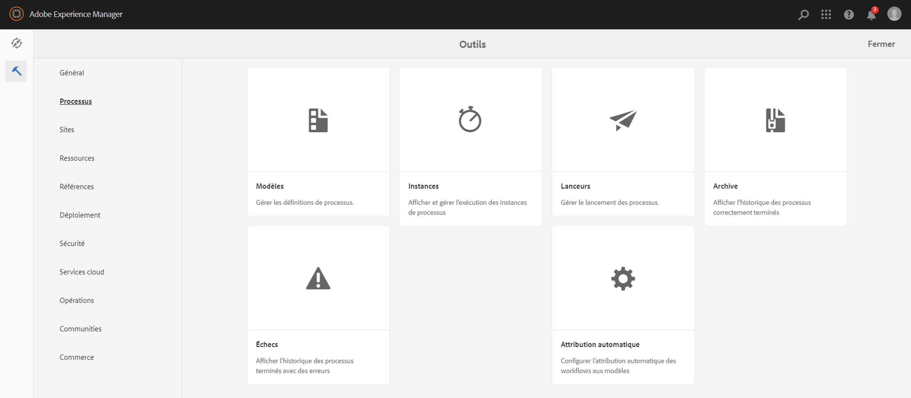
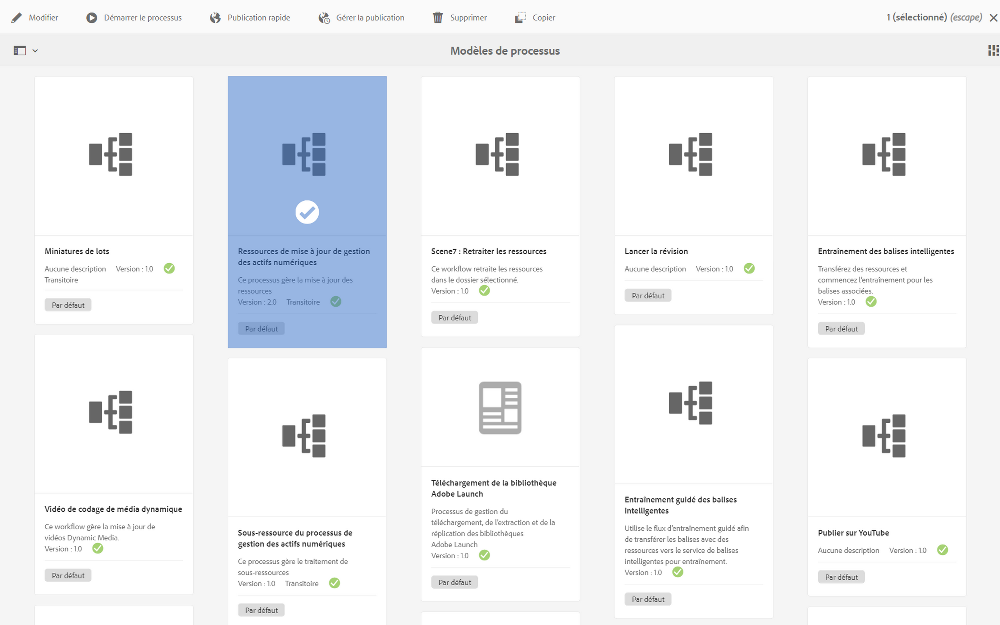
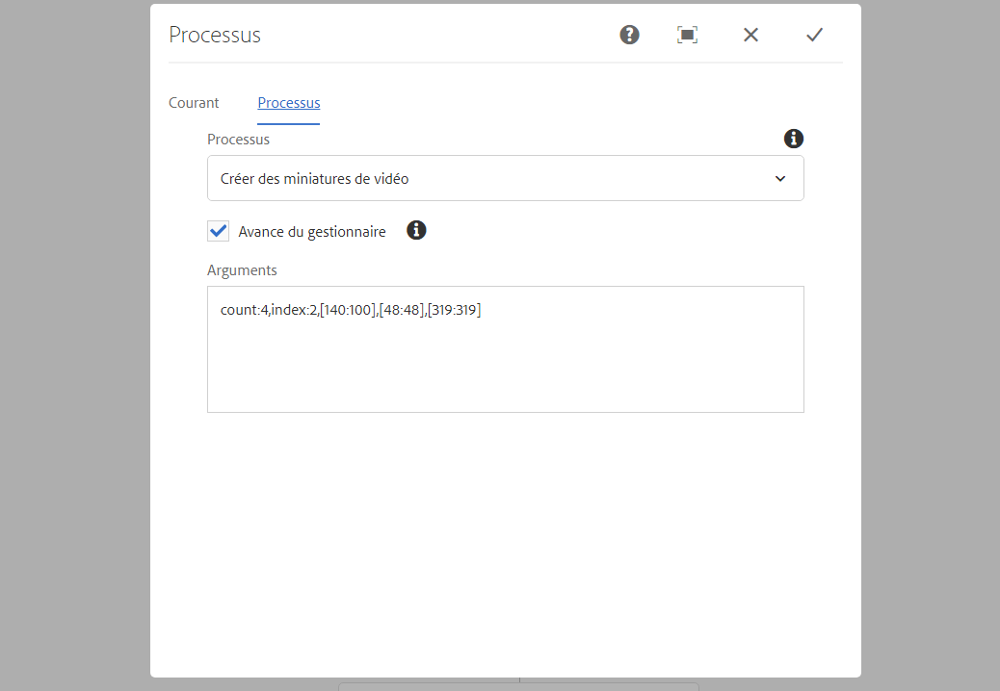
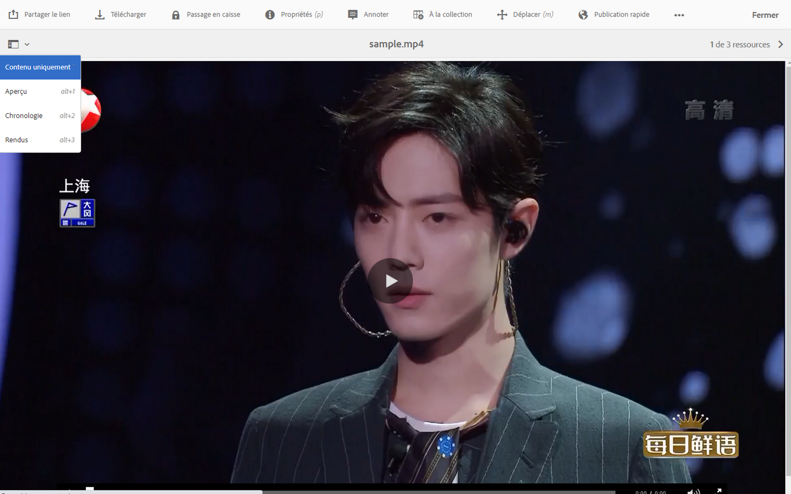
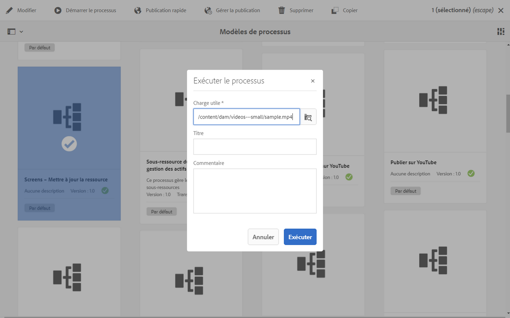
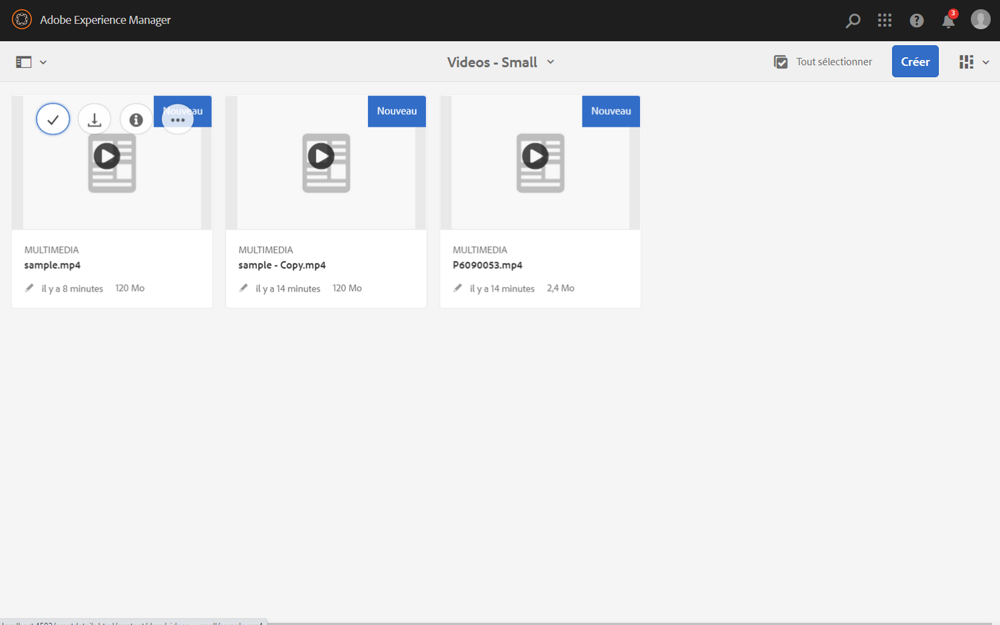

# Rendus vidéo {#video-renditions}

Vous pouvez générer des rendus Full HD automatiques et manuels. La section suivante décrit le workflow à suivre pour ajouter des rendus à vos ressources.

## Génération automatique de rendus Full HD {#automatically-generating-full-hd-renditions}

>[!NOTE]
>
>Au cas où les rendus vidéo d’AEM Screens ne sont pas lus de façon optimale sur votre périphérique, contactez le fournisseur de votre matériel pour obtenir les caractéristiques de la vidéo. Cela vous aidera à obtenir de meilleures performances sur le périphérique et par conséquent à créer votre propre profil vidéo personnalisé où vous fournissez les paramètres appropriés pour que FFmpeg génère le rendu. Ultérieurement, suivez les étapes ci-dessous pour ajouter votre profil vidéo personnalisé à la liste des profils.
>
>En outre, voir [Dépannage des vidéos](troubleshoot-videos.md) pour déboguer et dépanner les problèmes de lecture de vidéos dans votre canal.

Suivez les étapes ci-dessous pour générer automatiquement des rendus Full HD :

1. Sélectionnez le lien Adobe Experience Manager (en haut à gauche), puis cliquez sur l’icône en forme de marteau et sélectionnez **Workflow**.

   Cliquez sur **Modèles** pour accéder à la gestion des modèles de workflow.

   

1. Sélectionnez le modèle **Ressources de mise à jour de gestion des actifs numériques (DAM)**, puis cliquez sur Modifier dans la barre d’actions pour ouvrir la fenêtre **Ressources de mise à jour de gestion des actifs numériques**.

   

1. Double-cliquez sur l’étape **Transcodage FFmpeg**.

   

1. Sélectionnez l’onglet **Processus** pour modifier les arguments du processus. Saisissez les profils Full HD pour la liste dans **Arguments** comme suit : ***,profile:fullhd-bp,profile:fullhd-hp*** et cliquez sur **OK**.

   

1. Cliquez sur **Enregistrer** en haut à gauche de l’écran **Ressources de mise à jour de gestion des actifs numériques (DAM)**.

   

1. Accédez à **Actifs** et téléchargez une nouvelle vidéo. Cliquez sur la vidéo, puis ouvrez le rail latéral Rendus où vous verrez les deux vidéos Full HD.

   

1. Ouvrez **Rendus** dans le rail latéral.

   

1. Vous verrez deux nouveaux rendus Full HD.

   

## Génération manuelle de rendus Full HD {#manually-generating-full-hd-renditions}

Suivez les étapes ci-dessous pour générer manuellement des rendus Full HD :

1. Sélectionnez le lien Adobe Experience Manager (en haut à gauche), puis cliquez sur l’icône en forme de marteau et sélectionnez **Workflow**.

   Cliquez sur **Modèles** pour accéder à la gestion des modèles de workflow.

   

1. Sélectionnez le modèle **Ressources de mise à jour de gestion des actifs numériques**, puis cliquez sur **Démarrer le processus** pour ouvrir la boîte de dialogue **Exécuter le processus**.

   

1. Sélectionnez la vidéo souhaitée dans la **charge utile** et cliquez sur **Exécuter**.

   

1. Accédez à **Actifs**, recherchez votre ressource en descendant dans la hiérarchie, puis cliquez dessus.

   

1. Ouvrez le rail latéral **Rendus** ; vous remarquerez les nouveaux rendus Full HD.

   

