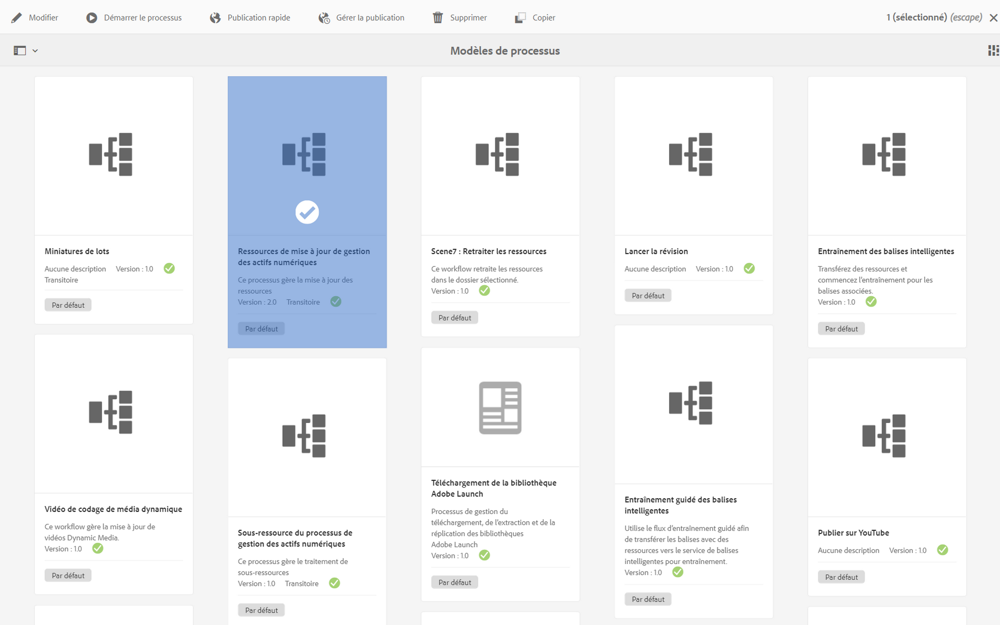
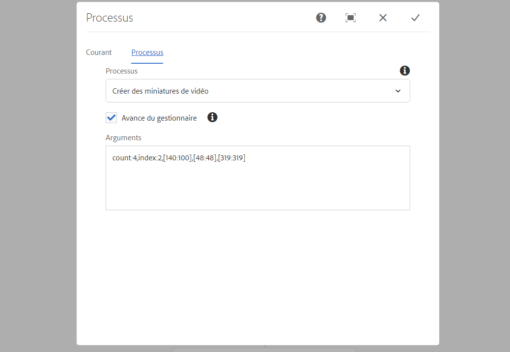
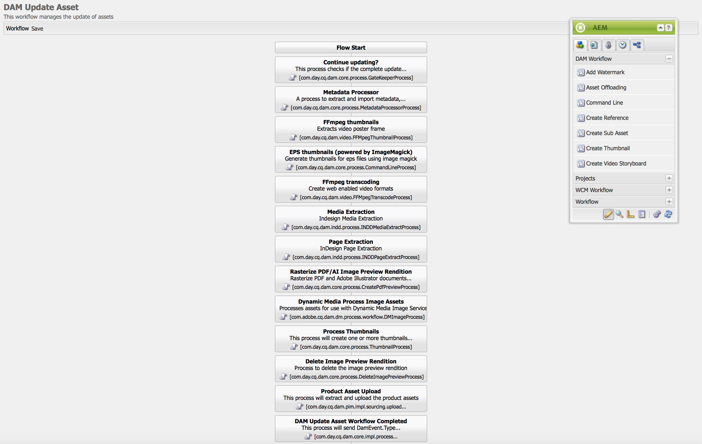
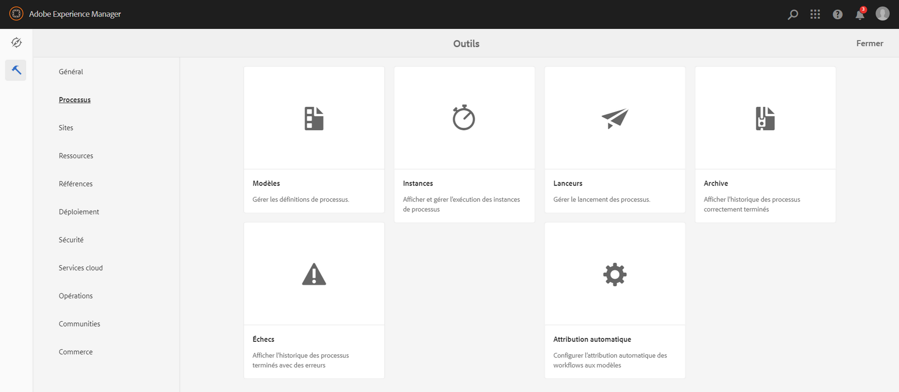
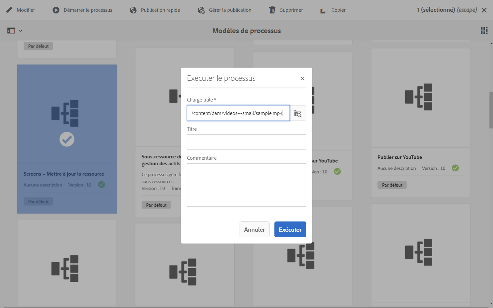
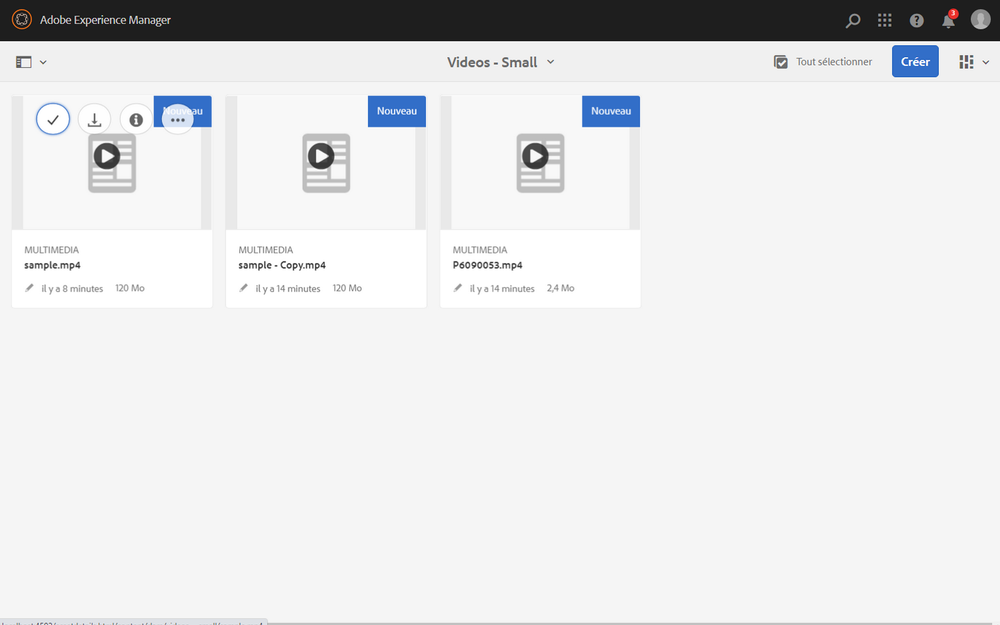
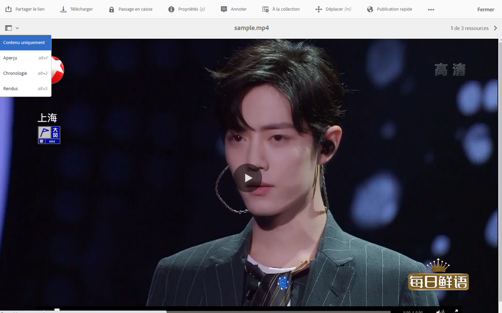

# Rendus vidéo {#video-renditions}

>[!IMPORTANT]
>Ce contenu est valide pour AEM on-premise/AMS (AEM 6.5LTS et AEM 6.5). Pour le contenu AEM as a Cloud Service Screens, reportez-vous au guide [AEM as a Cloud Service](https://experienceleague.adobe.com/en/docs/experience-manager-cloud-service/content/screens-as-cloud-service/overview/introduction).

Vous pouvez générer des rendus Full HD manuels et automatiques. La section suivante décrit le processus à suivre pour ajouter des rendus à vos ressources.

## Génération automatique de rendus Full HD {#automatically-generating-full-hd-renditions}

>[!NOTE]
>
>Si les rendus vidéo AEM Screens ne sont pas lus de manière optimale sur votre appareil, contactez le fournisseur du matériel pour connaître les spécifications de la vidéo. Cela vous permet de bénéficier de performances optimales sur l’appareil. Vous pouvez ainsi créer votre propre profil vidéo personnalisé dans lequel vous fournissez les paramètres appropriés pour FFMPEG afin de générer votre rendu. Suivez ensuite les étapes ci-dessous pour ajouter votre profil vidéo personnalisé à la liste des profils.
>
>Consultez également [Résolution des problèmes liés aux vidéos](troubleshoot-videos.md) pour déboguer et résoudre les problèmes liés à la lecture de vidéos dans votre canal.

Suivez les étapes ci-dessous pour générer manuellement des rendus Full HD :

1. Cliquez sur le lien Adobe Experience Manager (en haut à gauche), puis sur l’icône en forme de marteau pour sélectionner **Workflow**.

   Cliquez sur **Modèles**.

   

1. Dans la gestion des modèles de workflow, cliquez sur le modèle **Ressources de mise à jour de gestion des actifs**, puis cliquez sur **Modifier** dans la barre d’actions.

   

1. Dans la fenêtre **Ressources de mise à jour de gestion des actifs**, double-cliquez sur l’étape **Transcodage FFmpeg**.

   

1. Cliquez sur l’onglet **Traitement**.
1. Saisissez les profils Full HD dans la liste des **Arguments** comme suit :
   ***`,profile:fullhd-bp,profile:fullhd-hp`***
1. Cliquez sur **OK**.

   

1. Cliquez sur **Enregistrer** en haut à gauche de l’écran **Ressources de mise à jour de gestion des actifs**.

   

1. Accédez à **Actifs** et téléchargez une nouvelle vidéo. Cliquez sur la vidéo et ouvrez le rail latéral Rendus. Vous pouvez observer les deux vidéos Full HD.

   

1. Ouvrez **Rendus** dans le rail latéral.

   

1. Vous pouvez observer les deux nouveaux rendus Full HD.

   

## Génération manuelle de rendus Full HD {#manually-generating-full-hd-renditions}

Suivez les étapes ci-dessous pour générer manuellement des rendus Full HD :

1. Cliquez sur le lien Adobe Experience Manager (en haut à gauche), puis sur l’icône en forme de marteau, et sélectionnez **Workflow**.

   Cliquez sur **Modèles**.

   

1. Dans le gestionnaire de modèles de workflow, sélectionnez le modèle **Ressources de mise à jour de Screens**, puis cliquez sur le **workflow de démarrage** pour ouvrir la boîte de dialogue du **workflow d’exécution**.

   

1. Sélectionnez la vidéo souhaitée dans la **payload** et cliquez sur **Exécuter**.

   

1. Accédez à **Actifs**, recherchez votre ressource en descendant dans la hiérarchie, puis cliquez dessus.

   

1. Ouvrez le rail latéral **Rendus**. Vous pouvez observer les nouveaux rendus Full HD.

   

