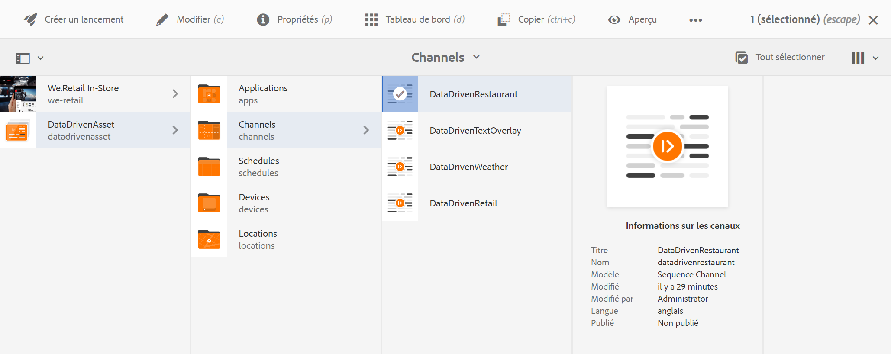

# Activation de la réservation d’hébergements {#hospitality-reservation-activation}

Le cas d’utilisation ci-dessous montre comment utiliser l’activation des réservations d’hébergements en fonction des valeurs renseignées dans Google Sheets.

## Description {#description}

Pour ce cas d’utilisation, la feuille de calcul Google est renseignée avec le pourcentage de réservation de deux restaurants : **Restaurant1** et **Restaurant2**. Une formule est appliquée en fonction des valeurs de Restaurant1 et Restaurant2 et selon la formule, la valeur 1 ou 2 est affectée à la colonne **AdTarget**.

Si **Restaurant1** > **Restaurant2**, la valeur affectée à **AdTarget** est de **1**, sinon une valeur de **2** est affectée à **AdTarget**. La valeur 1 génère l’option *Steak food* et la valeur 2 fait apparaître l’option *Thai food* sur votre écran.

## Prérequis {#preconditions}

Avant de commencer à mettre en œuvre l’activation de la réservation, vous devez apprendre à configurer le ***magasin de données***, la ***segmentation d’audience*** et l’***activation du ciblage pour les canaux*** dans un projet AEM Screens.

Consultez [Configuration de ContextHub dans AEM Screens](configuring-context-hub.md) pour plus d’informations.

## Flux de base {#basic-flow}

Pour mettre en œuvre le cas d’utilisation de l’activation des réservations d’hébergements pour votre projet AEM Screens, procédez comme suit :

1. **Remplissage des feuilles de calcul Google Sheets et ajout de la formule**

   Par exemple, appliquez la formule à la troisième colonne **AdTarget**, comme illustré ci-dessous.

   

1. **Configuration des segments dans les audiences selon les besoins**

   1. Accédez aux segments de votre audience (reportez-vous à l’***Étape 2 : configuration de la segmentation de l’audience*** dans la page **[Configuration de ContextHub dans la AEM Screens](configuring-context-hub.md)** pour plus d’informations).

   1. Sélectionnez **Sheets A1 1** et cliquez sur **Modifier**.

   1. Sélectionnez la propriété de comparaison et cliquez sur l’icône de configuration pour modifier les propriétés.
   1. Sélectionnez **googlesheets/value/1/2** dans la liste déroulante de **Nom de la propriété**

   1. Sélectionnez l’**Opérateur** **égal** dans le menu déroulant

   1. Saisissez la **valeur** **1**

   1. De même, sélectionnez les feuilles **Sheets A1 2** et cliquez sur **Modifier**.

   1. Sélectionnez la propriété de comparaison et cliquez sur l’icône de configuration pour modifier les propriétés.
   1. Sélectionnez **googlesheets/value/1/2** dans la liste déroulante de **Nom de la propriété**

   1. Sélectionnez l’**opérateur** **2**

1. Naviguez et sélectionnez votre canal (), puis cliquez sur **Modifier** dans la barre d’actions. Dans l’exemple suivant, **DataDrivenRestaurant**, la fonctionnalité est illustrée au moyen d’un canal de séquence.

   >[!NOTE]
   >
   >Votre canal doit déjà comporter une image par défaut et les audiences doivent être préconfigurées comme décrit dans [Configuration de ContextHub dans AEM Screens](configuring-context-hub.md).

   

   >[!CAUTION]
   >
   >Vous devez avoir défini vos **configurations** **ContextHub** à l’aide de l’onglet **Propriétés** --> **Personnalisation**.

   

1. Sélectionnez **Ciblage** dans l’éditeur. Sélectionnez ensuite **Marque** et l’**Activité** dans le menu déroulant, puis cliquez sur **Commencer le ciblage**.
1. **Vérification de l’aperçu**

   1. Cliquez sur **Aperçu.** Ouvrez également votre feuille de calcul Google et mettez à jour sa valeur.
   1. Mettez à jour la valeur dans les colonnes **Restaurant1** et **Restaurant2**. Si **Restaurant1** > **Restaurant2,** vous devriez voir une image de cuisine de type *Steak*, autrement, l’image de la nourriture *Thaï* apparaît à l’écran.
   
