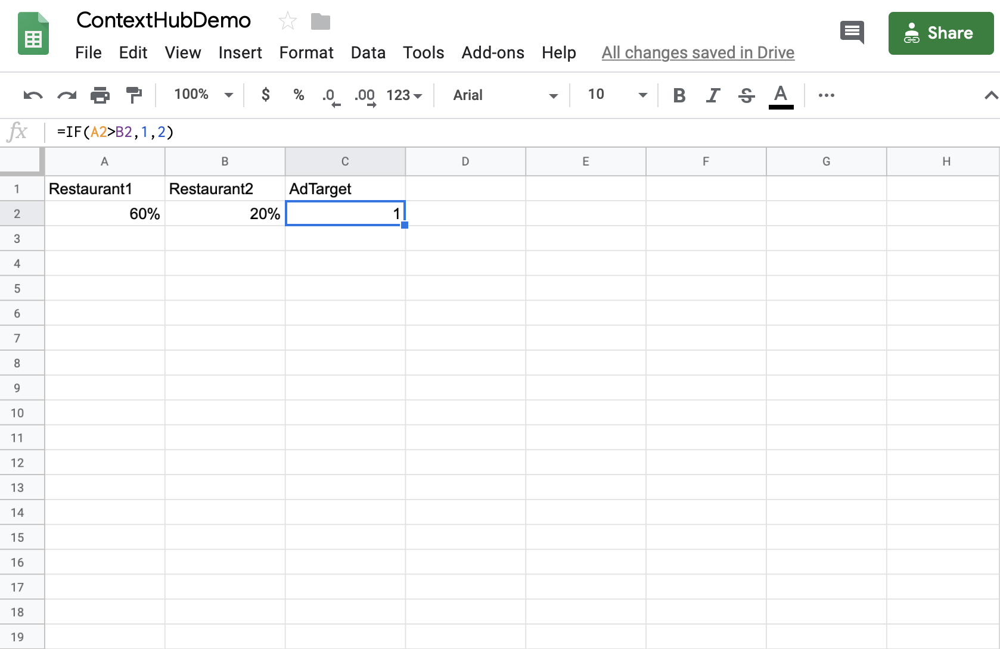

# Activation de réservation d'hébergement {#hospitality-reservation-activation}

Le cas d’utilisation suivant illustre l’utilisation de l’activation des réservations d’hôpital en fonction des valeurs renseignées dans les feuilles Google.

## Description {#description}

Dans ce cas d’utilisation, la feuille Google est renseignée avec le pourcentage de réservation sur deux restaurants **Restaurant1** et **Restaurant2**. Une formule est appliquée sur la base des valeurs de Restaurant1 et Restaurant2 et sur la base de la formule, la valeur 1 ou 2 est affectée à la colonne **AdTarget** .

Si la valeur de **Restaurant1** &gt; **Restaurant2** est affectée à **AdTarget** la valeur** 1 **sinon, **AdTarget est affecté la valeur 2.****** La valeur 1 génère l’option *Steak food* et la valeur 2 affiche l’option *Thai food* sur votre écran.

## Conditions préalables {#preconditions}

Avant de commencer à mettre en oeuvre l’activation de la réservation, vous devez apprendre à configurer le stockage ***de*** données, la segmentation ***de l’*** audience et l’ ***activation du ciblage des canaux*** dans un projet AEM Screens.

Consultez [Configuration de ContextHub dans les écrans](configuring-context-hub.md) AEM pour plus d’informations.

## Flux de base {#basic-flow}

Suivez les étapes ci-dessous pour implémenter le cas d’utilisation d’activation des réservations d’hébergement pour votre projet AEM Screens :

1. **Renseigner les feuilles de Google et ajouter la formule.**

   Par exemple, appliquez la formule à la troisième colonne **AdTarget**, comme illustré dans la figure ci-dessous.

   

1. **Configuration des segments dans Audiences conformément aux exigences**

   1. Accédez aux segments de votre audience (Reportez-vous à l’ ***étape 2 : Configuration de la segmentation*** de l’audience dans ** [Configuration de ContextHub dans la page AEM Screens](configuring-context-hub.md)** pour plus d’informations).

   1. Sélectionnez les **feuilles A1 1** et cliquez sur **Modifier**.

   1. Sélectionnez la propriété de comparaison et cliquez sur l’icône Configurer pour modifier les propriétés.
   1. Sélectionnez **googlesheets/value/1/2** dans la liste déroulante du nom de la **propriété.**

   1. Sélectionnez l’ **opérateur** **égal **dans le menu déroulant.

   1. Saisissez la **valeur** comme **1**

   1. De même, sélectionnez les feuilles A1 2 *** et cliquez sur **Modifier**.

   1. Sélectionnez la propriété de comparaison et cliquez sur l’icône Configurer pour modifier les propriétés.
   1. Sélectionnez **googlesheets/value/1/2** dans la liste déroulante du nom de la **propriété.**

   1. Sélectionnez **Opérateur** comme **2**

1. Naviguez et sélectionnez votre canal (), puis cliquez sur **Modifier** dans la barre d’actions. Dans l’exemple suivant, **DataDrivenRestaurant**, un canal séquentiel est utilisé pour présenter la fonctionnalité.

   >[!NOTE]
   >
   >Votre canal doit déjà avoir une image par défaut et les audiences doivent être préconfigurées comme décrit dans [Configuration de ContextHub dans les écrans](configuring-context-hub.md)AEM.

   

   >[!CAUTION]
   >
   >Vous auriez dû configurer vos **configurations** ContextHub **à l’aide de l’onglet** Propriétés **du canal —&gt;** **Personnalisation.**

   

1. Sélectionnez **Ciblage** dans l’éditeur, sélectionnez **Marque** et **Activité** dans le menu déroulant, puis cliquez sur **Démarrer le ciblage.**
1. **Vérification de l’aperçu**

   1. Click **Preview.** Ouvrez également vos feuilles Google et mettez à jour sa valeur.
   1. Mettez à jour la valeur dans les colonnes **Restaurant1** et **Restaurant2** . Si **Restaurant1** &gt; **Restaurant2,** vous devriez voir une image de cuisine *Steak* autrement, l'image de la nourriture *Thai s'affiche sur votre écran.*
   

