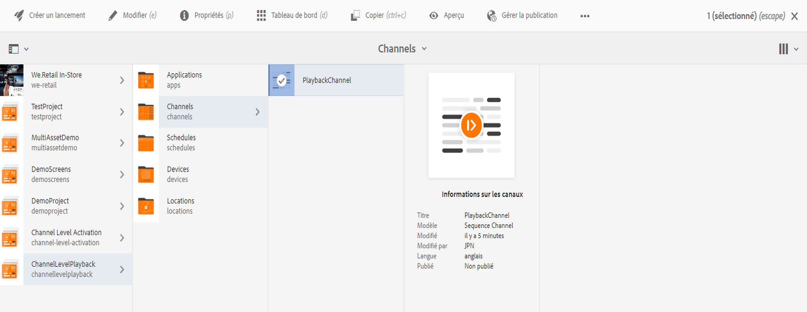

# Durée de lecture des images {#image-playback-duration}

## Vue d’ensemble {#overview}

Après avoir créé un canal de séquence et y avoir ajouté des images, toutes les images supposent par défaut la durée de lecture définie dans la configuration du canal. Toute image individuelle peut toujours remplacer la valeur par défaut et avoir une durée de lecture différente. Pour ce faire, modifiez la durée de lecture du composant d’image spécifique.

### Conditions préalables {#prerequisites}

Avant d’implémenter cette fonctionnalité, veillez à configurer un projet comme condition préalable du lancement de sa mise en œuvre. Par exemple :

1. Créer un projet AEM Screens (en l’occurrence, **ChannelLevelPlayback**)
1. Créer un canal de séquence **PlaybackChannel** dans le dossier **Canaux**
1. Ajouter un contenu à **PlaybackChannel**

## Modification de l’attribution d’une durée de lecture des images d’un canal {#editing-channel-level-image-playback-duration-assignment}

La section suivante explique comment modifier la durée de lecture d’un contenu d’un canal AEM Screens.

### Mise à jour de la durée de lecture des images d’un canal {#updating-the-playback-duration-for-images-in-a-channel}

Suivez les étapes ci-dessous pour savoir comment mettre à jour l’attribution d’une durée de lecture des images d’un canal :

1. Accédez au canal de séquence **PlaybackChannel**.

   

1. Cliquez sur **Modifier** dans la barre d’actions.

   

1. Ajoutez plusieurs images à l’éditeur de canal, comme l’illustre la figure ci-dessous.

   

1. Sélectionnez toutes les images du canal et cliquez sur l’icône en forme de clé à molette en haut à gauche (comme illustré dans la figure ci-dessous). La boîte de dialogue Configuration au niveau du canal s’ouvre.

   

1. La boîte de dialogue **Page** s’ouvre.

   >[!NOTE]
   >
   >Par défaut, les images d’un canal sont définies sur une durée de lecture de 8 secondes.

   

   Remplacez la **durée** 8 000 (millisecondes) par 3 000 (millisecondes), c’est-à-dire 3 secondes. Cochez la case en haut à droite de la boîte de dialogue **Page** pour pouvoir enregistrer les modifications que vous avez apportées.

   

### Afficher le résultat {#viewing-the-result}

Lorsque vous avez mis à jour la durée de lecture du canal (dans cet exemple, pour les trois images), vous pouvez constater que la durée de lecture de ces images est désormais de 3 secondes au lieu de 8 secondes (valeur par défaut).

