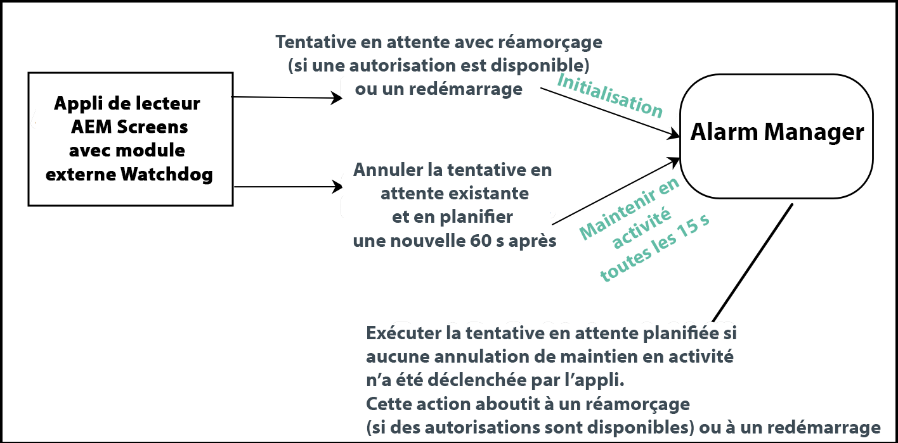

# Mise en œuvre d’Android Player {#implementing-android-player}

Cette section décrit la configuration du lecteur Android. Elle fournit des informations sur le fichier de configuration, les options disponibles, ainsi que des recommandations indiquant quels paramètres utiliser pour le développement et le test.

Par ailleurs, **Watchdog** est une solution permettant de restaurer le lecteur suite à une panne. Les applications doivent s’inscrire auprès du service watchdog, puis envoyer régulièrement des messages au service lui indiquant qu’elles sont actives. Au cas où le service watchdog ne reçoit pas de message de maintien en activité dans le délai imparti, le service tente de redémarrer l’appareil pour une restauration propre (s’il dispose des droits suffisants) ou de redémarrer l’application.

## Installation d’Android Player {#installing-android-player}

Pour mettre en œuvre Android Player pour AEM Screens, installez Android Player pour AEM Screens.

Consultez la page [**Téléchargements du lecteur AEM 6.5**](https://download.macromedia.com/screens/).

### Configuration de l’Environnement pour AEM Screens 6.5.5 Service Pack {#fp-environment-setup}

>[!NOTE]
>Vous devez configurer un environnement pour le lecteur Android si vous utilisez AEM Screens 6.5.5 Service Pack.

Définissez l’attribut **MêmeSite pour les cookies** de jeton de connexion de **Lax** sur **Aucun** à partir de la Console Web de **Adobe Experience ManagerConfiguration sur toutes les instances d’auteur et de publication AEM.**

Suivez les étapes ci-dessous :

1. Accédez à **Configuration de la console Web Adobe
Experience Manager**.en utilisant `http://localhost:4502/system/console/configMgr`.

1. Recherchez le *gestionnaire d’authentification de jeton Adobe Granite*.

1. Définissez **l’attribut SameSite des cookies de jeton de connexion** de **Relâché** à **Aucun**.
   

1. Cliquez sur **Enregistrer**.

### Méthode ad hoc {#ad-hoc-method}

La méthode ad hoc vous permet d’installer le dernier lecteur Android (*.exe*). Visitez la page [**Téléchargements du lecteur AEM 6.5**](https://download.macromedia.com/screens/).

Une fois l’application téléchargée, suivez les étapes du lecteur pour terminer l’installation ad hoc :

1. Appuyez longuement dans l’angle supérieur gauche pour ouvrir le panneau d’administration.
1. Accédez à **Configuration** depuis le menu d’actions de gauche et saisissez l’emplacement (adresse) de l’instance AEM à laquelle vous souhaitez vous connecter, puis cliquez sur **Enregistrer**.

1. Accédez au lien **Device** **Registration** (Enregistrement de l’appareil) depuis le menu d’actions de gauche pour vérifier le statut du processus d’enregistrement de l’appareil.

>[!NOTE]
>
>Si le **Statut** est **ENREGISTRÉ**, vous remarquerez que le champ **ID de périphérique** est renseigné.
>
>Si le **Statut** est **NON ENREGISTRÉ**, vous pouvez utiliser le **Jeton** pour enregistrer le périphérique.

## Mise en œuvre d’Android Watchdog {#implementing-android-watchdog}

En raison de l’architecture d’Android, le redémarrage de l’appareil requiert que l’application dispose d’autorisations système. Pour ce faire, vous devez signer le fichier apk à l’aide des clés de signature du fabricant, faute de quoi le service watchdog redémarre l’application du lecteur, mais pas l’appareil.

### Signature de fichiers apk Android à l’aide des clés du fabricant        {#signage-of-android-apks-using-manufacturer-keys}

To access some of the privileged APIs of Android such as *PowerManager* or *HDMIControlServices*, you need to sign the android apk using the manufacturer&#39;s keys.

>[!CAUTION]
>
>Conditions préalables :
>
>Le kit SDK Android doit être installé avant que vous n’exécutiez les étapes suivantes.

Suivez les étapes ci-dessous pour signer le fichier apk Android à l’aide des clés du fabricant :

1. Téléchargez le fichier apk à partir de Google Play ou de la page [Téléchargements du lecteur AEM Screens](https://download.macromedia.com/screens/)
1. Procurez-vous les clés de plateforme du fabricant pour obtenir un fichier *pk8* et *pem*

1. Localisez l’outil apksigner dans le kit SDK Android à l’aide de la commande find ~/Library/Android/sdk/build-tools -name &quot;apksigner&quot;
1. &lt;pathto> /apksigner sign --key platform.pk8 --cert platform.x509.pem aemscreensplayer.apk
1. Recherchez le chemin d’accès à l’outil d’alignement zip dans le SDK Android.
1. &lt;pathto> /zipalign -fv 4 aemscreensplayer.apk aemscreensaligned.apk
1. Installez ***aemscreensaligned.apk*** via adb install sur l’appareil.

## Mise en œuvre du watchdog Android {#android-watchdog-implementation}

Le service watchdog Android est mis en œuvre en tant que module externe cordova via *AlarmManager*.

Le diagramme suivant illustre la mise en œuvre du service watchdog :

**1. Initialisation** Au moment de l’initialisation du module externe cordova, les autorisations sont vérifiées pour voir si nous disposons des autorisations système et donc de l’autorisation Redémarrer. Si ces deux critères sont satisfaits, une tentative en attente d’exécution de Redémarrer est créée. Dans le cas contraire, une tentative en attente de redémarrage de l’application (en fonction de son activité de lancement) est créée.

**2. Minuteur de maintien en activité** Un minuteur de maintien en activité est utilisé pour déclencher un événement toutes les 15 secondes. Dans cet événement, vous devez annuler la tentative en attente existante (pour redémarrer l’application) et enregistrer une nouvelle tentative en attente pour les mêmes 60 secondes à l’avenir (en remettant à plus tard le redémarrage).

>[!NOTE]
>
>Sous Android, *AlarmManager* est utilisé pour enregistrer les *pendingIntents* qui peuvent s’exécuter même si l’application est en panne et que sa distribution d’alarme est incorrecte à partir d’API 19 (Kitkat). Conservez un certain espace entre l’intervalle du minuteur et l’alarme *pendingIntent* de *AlarmManager*.

**3. Panne d’application** En cas de panne, le pendingIntent pour la commande Redémarrer enregistré avec AlarmManager n’est plus réinitialisé et donc exécute un redémarrage de l’application (en fonction des autorisations disponibles lors de l’initialisation du module externe cordova).
