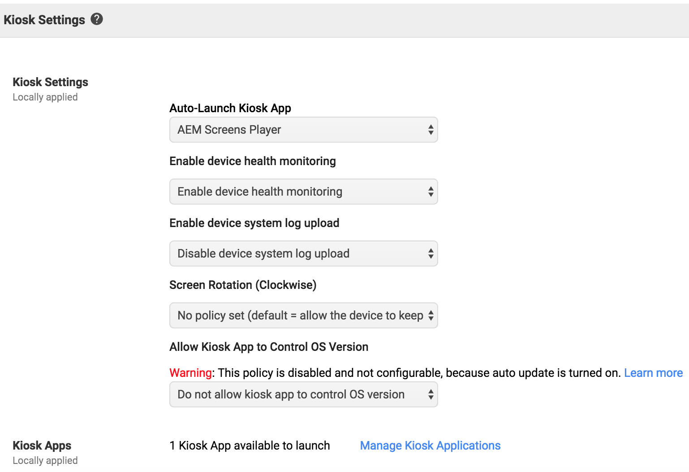

# Mise en œuvre du lecteur Chrome OS {#implementing-chrome-os-player}

Cette section décrit comment mettre en œuvre le lecteur Chrome OS Player à l’aide de la console de gestion de Chrome.

## Utilisation de la console de gestion de Chrome {#using-chrome-management-console}

Pour configurer la console de gestion de Chrome, procédez comme suit :

1. Enregistrez-vous pour obtenir la console de gestion de Chrome. Vous devez obtenir une licence pour la console de gestion de Chrome. Pour plus d’informations sur la gestion des paramètres des appareils Chrome, contactez le [Support Google](https://support.google.com/chrome/a/answer/1375678?hl=fr&amp;ref_topic=2935995).
1. Enregistrez votre appareil Chrome OS dans le domaine et attendez 15 minutes que l’appareil se synchronise avec la console de gestion Chrome. Pour en savoir plus sur l’enregistrement d’un appareil Chrome, cliquez [ici](https://support.google.com/chrome/a/answer/1360534?hl=fr).
1. Le lecteur Chrome est disponible dans le Chrome Web Store.

>[!NOTE]
>
>Une solution de gestion des appareils, comme la console de gestion de Chrome, est recommandée pour le déploiement et la gestion des appareils Chrome OS. Même si ce document contient la mise en œuvre de la console de gestion de Chrome, d’autres fournisseurs proposent des fonctionnalités similaires. Veuillez contacter le fournisseur de votre logiciel de gestion des appareils.

## Attribution d’un nom au lecteur Chrome OS {#name-chrome}

Vous pouvez attribuer un nom d’appareil convivial à votre lecteur Chrome, envoyant ainsi le nom d’appareil attribué à Adobe Experience Manager (AEM). Cette fonctionnalité vous permet non seulement d’attribuer un nom à votre lecteur Chrome, mais également d’attribuer facilement un contenu approprié.

>[!NOTE]
>Vous ne pouvez choisir le nom du lecteur qu’avant l’enregistrement. Une fois le lecteur enregistré, le nom du lecteur ne peut plus être modifié.

Suivez les étapes ci-dessous pour configurer le nom dans le lecteur Chrome :

1. Vous pouvez éventuellement autoriser les intégrateurs audio/vidéo ou les administrateurs informatiques à définir l’ID de ressource et l’emplacement dans le cadre de l’inscription à l’entreprise.

   

1. Les options s’affichent lorsque vous pouvez inscrire l’appareil.

   

1. Vous pouvez définir l’ID de ressource dans le cadre de l’inscription à l’entreprise et dans la console de gestion de Chrome.

   

   >[!NOTE]
   >Les lecteurs Chrome doivent être inscrits dans l’inscription d’entreprise et le lecteur Chrome doit être déployé via la console de gestion de Chrome. Sinon, l’ID de ressource renvoie vide (par exemple, Chrome en tant qu’extension). Le nom de l’appareil n’est enregistré qu’au moment de l’inscription. Les modifications ultérieures ne seront pas prises en compte par Adobe Experience Manager (AEM).

### Activation du mode kiosque {#enabling-kiosk-mode}

Pour activer le mode de kiosque, procédez comme suit :

1. Connectez-vous à la console de développement de Chrome.

   

1. Accédez à **Gestion des périphériques** > **Gestion de Chrome** > **Paramètres du périphérique**.
1. Faites défiler l’écran jusqu’à **Paramètres du kiosque** et cliquez sur **Gérer les applications du kiosque**.

   

1. Cliquez sur le lecteur AEM Screens dans Chrome Web Store.

   >[!NOTE]
   >
   >Une application publiée récemment peut mettre 15 minutes environ à s’afficher dans cette liste.

1. Cliquez sur **Lecteur AEM Screens** de la **Lancement automatique de l’application kiosque** menu déroulant.

   L’opération peut prendre quelques minutes en fonction du réseau pour que les modifications soient appliquées. Il est recommandé de démarrer.

#### Vérification du statut des appareils distants {#checking-remote-device-status}

1. Connectez-vous à la console de développement de Chrome.
1. Accédez à **Gestion des périphériques** > **Appareils Chrome** et cliquez sur le périphérique que vous souhaitez contrôler.
1. Cliquez sur **Activité du système et dépannage**.
1. Vérifiez les propriétés **Redémarrer l’appareil** et **Copie d’écran** de l’appareil. Vous pouvez également vérifier l’état du périphérique et les informations relatives à son intégrité.

>[!NOTE]
>
>Ces paramètres peuvent être activés plusieurs minutes après l’inscription de l’appareil. Chaque option peut être activée au fil du temps.

### Configuration de la configuration à distance des lecteurs Chrome OS {#configuring-remote-configuration-of-chrome-os-players}

Le lecteur AEM Screens est une application du kiosque, qui permet également de configurer des politiques à distance pour les lecteurs Chrome OS.

Suivez les étapes ci-dessous pour configurer les différentes options du lecteur :

1. Connectez-vous à la console de gestion de Chrome.
1. Cliquez sur **Gestion des périphériques** > **Gestion de Chrome** > **Gestion des applications**. Le lecteur AEM Screens s’affiche dans la liste.
1. Cliquez sur l’application **Lecteur AEM Screens**.
1. Cliquez sur **Paramètres du kiosque** et cliquez sur votre organisation (*si vous utilisez un environnement de test*).
1. Cliquez sur **Charger un fichier de configuration** et chargez la politique de configuration (*fichier JSON*).
1. Cliquez sur **Enregistrer**. Redémarrez l’appareil afin de pouvoir synchroniser la politique.

>[!NOTE]
>
>Redémarrez l’appareil afin de pouvoir synchroniser les modifications de politique.

#### Exemple de fichier JSON de politique {#example-policy-json-file}

```java
{
  "server": {
    "Value": "https://aemscreensdemo.adobeitc.com"
  },
  "resolution": {
    "Value": "auto"
  },
  "rebootSchedule": {
    "Value": "at 4:00am"
  },
  "enableAdminUI": {
    "Value": true
  },
  "enableOSD": {
    "Value": true
  },
  "enableActivityUI": {
    "Value": true
  }
}
```

### Attributs et objectif des politiques {#policy-attributes-and-purpose}

Le tableau ci-dessous récapitule les politiques avec leurs fonctions.

| **Nom de la politique** | **Objectif** |
|---|---|
| serveur | L’URL du serveur Adobe Experience Manager (AEM). |
| registrationKey | Utilisé pour l’enregistrement en masse des appareils à l’aide d’une clé pré-partagée. |
| resolution | Résolution de l’appareil. |
| rebootSchedule | Planification du redémarrage du lecteur. |
| enableAdminUI | Activez l’interface utilisateur d’administration pour configurer l’appareil sur site. Définissez la valeur sur false une fois qu’elle est entièrement configurée et en production. |
| enableOSD | Activez l’interface utilisateur du sélecteur de canal pour que les utilisateurs puissent changer de canal sur l’appareil. Pensez à la définir sur false une fois qu’elle est entièrement configurée et en production. |
| enableActivityUI | Activez cette option pour afficher la progression des activités, telles que le téléchargement et la synchronisation. Activez cette règle pour le dépannage et désactivez-la une fois qu’elle est entièrement configurée et en production. |
| cloudMode | Définissez cette variable sur true si vous souhaitez que le lecteur Chrome se connecte à Screens as a Cloud Service. Définissez cette variable sur false pour vous connecter à AMS ou à AEM On-Premise. |
| cloudToken | Jeton d’enregistrement à enregistrer dans Screens as a Cloud Service. |

>[!NOTE]
>
>Les configurations de stratégie sont strictement appliquées et l’interface utilisateur d’administration du lecteur ne remplace pas manuellement. Pour permettre la configuration manuelle du lecteur pour une politique spécifique, ne spécifiez pas la politique dans la ***configuration de politique***. Par exemple, si vous souhaitez autoriser une configuration manuelle pour le planning du redémarrage, ne spécifiez pas la clé ***rebootSchedule*** dans la configuration de politique.

### Utiliser la commande à distance Screens {#using-remote-control}

AEM Screens offre une fonctionnalité de commande à distance. Pour en savoir plus sur cette fonctionnalité, cliquez ici : [Commande à distance Screens](implementing-remote-control.md)
