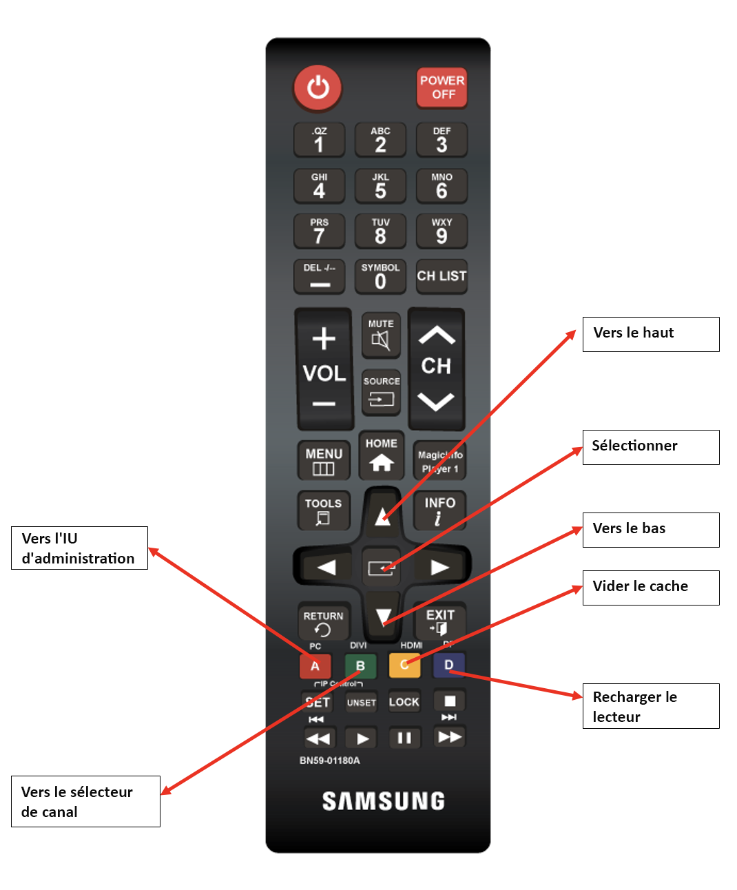

# Utiliser la commande à distance Screens {#implementing-remote-control}

La fonction de commande à distance facilite l’accès à l’interface utilisateur d’administration, au sélecteur de canaux ou à des fonctionnalités telles que Effacer le cache et recharger. En outre, elle vous permet de voir la version locale du micrologiciel et les informations système du lecteur. Cette fonctionnalité est particulièrement utile, car il peut être difficile de connecter une souris. Ou d’utiliser sur des appareils de production hors de portée, et encore plus si le lecteur a perdu toute connexion avec AEM. Cela est également utile lorsque vous utilisez Samsung RMS, car la différence de résolution peut rendre difficiles la localisation et l’ouverture de l’interface d’utilisation de l’administration à l’aide d’une souris.

## Combinaisons de touches courantes de commande à distance {#using-common-remote-control}

Sur tous les lecteurs, vous pouvez utiliser les combinaisons de touches suivantes dans la commande à distance Screens :

1. Activer/désactiver l’interface utilisateur d’administration : Ctrl + 1
1. Activer/désactiver le sélecteur de canaux : Ctrl + 2
1. Vider le cache : Ctrl + Alt + 3
1. Recharger le lecteur : Ctrl + 4

## Combinaisons de touches de commande à distance spécifiques à Tizen {#using-tizen-remote-control}

Pour le lecteur Tizen, vous pouvez utiliser soit la télécommande matérielle, soit la télécommande logicielle disponible dans Samsung RMS pour accéder à ces fonctionnalités :

1. A : activer/désactiver l’interface utilisateur d’administration
1. B : activer/désactiver le sélecteur de canaux
1. C : vider le cache
1. D : recharger le lecteur

## Remarques supplémentaires sur l’utilisation {#using-additional-remote-control}

1. Lorsque l’interface utilisateur d’administration est ouverte, vous pouvez utiliser les flèches vers le haut et vers le bas pour naviguer entre les onglets et afficher les informations.
1. Une fois le sélecteur de canal ouvert, vous pouvez utiliser les touches fléchées Haut et Bas pour parcourir les canaux. Vous pouvez également appuyer sur la touche `Enter` (ou le bouton au centre des flèches sur la télécommande) pour changer de canal.

La figure suivante illustre l’utilisation des touches sur une télécommande Samsung :


>[!NOTE]
>Si vous définissez les valeurs de configuration de l’appareil enableAdminUI et/ou enableOSD sur false, la télécommande ne pourra pas basculer entre l’interface d’utilisation de l’administration et le sélecteur de canal. Vous ne pouvez pas utiliser les touches fléchées pour naviguer dans l’interface d’utilisation de l’administration ou les canaux. Cependant, vous pouvez toujours vider le cache et recharger le lecteur. Vous pouvez désactiver la fonctionnalité de commande à distance si l’une des combinaisons de clavier est en conflit avec votre contenu interactif en utilisant ce code :

```
require(['util/ScreensDisplay'], function() {window.ScreensDisplay.ignoreRemoteControl = true;}); 
```
