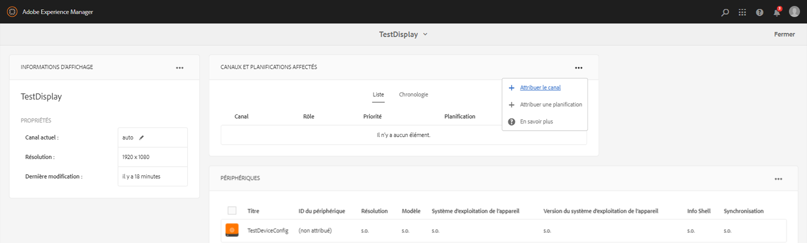
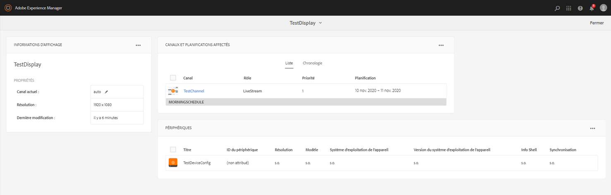
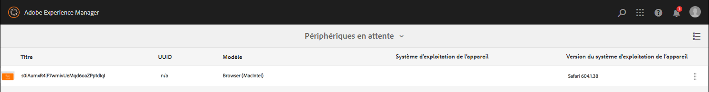

# Guide de démarrage rapide {#kickstart-guide}

Cette section vous donne un premier aperçu d’AEM Screens et montre comment réaliser des actions de base. Elle vous guide à travers la configuration d’une expérience numérique de signature de base avec des ressources ou du contenu et la publication dans le lecteur Screens. Pour une compréhension approfondie de tous les composants pour le développement d’écrans, voir les ressources à la fin de la page.

## Création d’une expérience de signalisation numérique en 5 minutes {#creating-a-digital-signage-experience-in-minutes}

Les étapes suivantes vous permettent de créer un exemple de projet pour Screens et de publier du contenu sur le lecteur Screens.

1. To download **AEM Screens Player**, click [here](https://download.macromedia.com/screens/).

   AEM Screens is also available in **Google Play**.

   Pour plus d’informations sur la mise en œuvre de Chrome OS Player, reportez-vous à la section [Console de gestion Chrome](implementing-chrome-os-player.md).

   Pour plus d’informations, voir [Installation et configuration de Screens](configuring-screens-introduction.md).

   >[!NOTE]
   >
   >**Paramètres OSGI**
   >
   >
   >Vous devez activer le référent vide pour autoriser le périphérique à publier des données sur le serveur. Par exemple, si la propriété de référent vide est désactivée, le périphérique ne pourra pas publier de capture d’écran. Actuellement, certaines de ces fonctions ne sont disponibles que si Apache Sling Referrer Filter Allow Empty est activé dans la configuration OSGi. Le tableau de bord peut afficher un message d’avertissement indiquant que les paramètres de sécurité peuvent empêcher le fonctionnement de certaines de ces fonctionnalités.
   >
   >
   >Follow the steps below to enable the ***Apache Sling Referrer Filter Allow Empty***:
   >
   >
   >
   >    1. Navigate to **Adobe Experience Manager Web Console Configuration**, that is `https://localhost:4502/system/console/configMgr/org.apache.sling.security.impl.ReferrerFilter`.
   >    1. Check the **allow.empty** option.
   >    1. Cliquez sur **Enregistrer**.

1. **Création d’un projet**

   1. Sélectionnez le lien Adobe Experience Manager (en haut à gauche), puis **Screens**. Vous pouvez également accéder directement à `https://localhost:4502/screens.html/content/screens](https://localhost:4502/screens.html/content/screens`.

   1. Cliquez sur **Créer** pour créer un projet Screens (voir la figure ci-dessous).
   1. Sélectionnez **Screens** à partir de l’assistant **Créer un projet Screens**, puis cliquez sur **Suivant**.

   1. Enter the title as *Test_Project *and click **Create**.
   

   Une fois le projet créé, vous êtes redirigé vers la console du projet Screens. Vous pouvez sélectionner votre projet. In a project, there are five kind of folders namely **Applications**, **Channels**, **Devices**, **Locations**, and **Schedules**, as shown in the figure below.

   >[!NOTE]
   >
   >« Planifications » n’est disponible que si vous avez installé le Feature Pack 1 d’AEM 6.3 Sites. Pour accéder à ce Feature Pack, vous devez contacter l’assistance d’Adobe et demander à y accéder. Une fois que vous disposez des autorisations, vous pouvez le télécharger à partir de Package Share.

   

   Voir [Créer et gérer un projet](creating-a-screens-project.md) d’écrans pour en savoir plus.

1. **Création d’un canal** 

   Une fois que vous avez votre projet, vous devez créer une nouveau canal où vous pouvez gérer le contenu.

   Suivez les étapes ci-dessous pour créer un nouveau canal pour votre projet :

   1. Accédez au projet *Test_Project* que vous avez créé et sélectionnez ensuite le fichier **Canaux**.

   1. Cliquez sur** Créer** à partir de la barre d’actions (voir la figure ci-dessous). Un assistant s’ouvre.
   1. Choose the **Sequence Channel **and click **Next**.

   1. Enter the **Name** and **Title** as *TestChannel* and click **Create**.
   

   The *TestChannel* is created and added to your channels folder, as shown in the figure below.

   

   See [Channel Management](managing-channels.md) for more details on creating and managing channels.

1. **Ajout de contenu à un canal**

   Une fois que vous avez votre canal, vous devez y ajouter le contenu que le lecteur Screens va afficher.

   Suivez les étapes ci-dessous pour ajouter du contenu au canal (*TestChannel*) dans votre projet : 

   1. Navigate to the *Test_Project* you created and select the **Channels **folder.

   1. Click **Edit** from the action bar (see the figure below). L'éditeur du* TestChannel* s'ouvre.

   1. Cliquez sur l’icône qui fait passer le panneau latéral du côté gauche de la barre d’actions pour ouvrir les ressources et les composants. 
   1. Faites glisser et déposez les composants que vous souhaitez ajouter à votre canal. 
   

   Dans cet exemple, l’éditeur affiche une image supplémentaire au canal. 

   

1. **Création d’un emplacement**

   Une fois que vous avez le canal, vous devez créer votre emplacement. 

   ***Les emplacements*** compartimentent vos différentes expériences de signalisation numérique et contiennent la configuration des écrans selon l’emplacement des différents écrans.

   Suivez les étapes ci-dessous pour créer un nouvel emplacement pour votre projet : 

   1. Navigate to the *Test_Project* you created and select the **Locations **folder.

   1. Click **Create** next to the plus icon in the action bar (see the figure below). Un assistant s’ouvre.
   1. Select **Location** from the wizard and click **Next**.

   1. Enter the **Name** and **Title** for your location (enter the title as *TestLocation*) and click **Create**.
   

   The *TestLocation* is created and added to your **Locations** folder.

   

1. **Création d’un affichage pour *TestLocation***

   Une fois que vous avez créé un emplacement, vous devez créer un nouvel affichage pour cet emplacement. 

   ***Affichages*** représente l’expérience numérique qui s’exécute sur un ou plusieurs écrans.

   1. Navigate to the location where you want to create your display (*Test_Projec* t --&gt; **Locations** --&gt; *TestLocation)* as shown in the figure above and selct *TestLocation*.

   1. Cliquez sur** Créer **à partir de la barre d’actions.
   1. Select **Display **from the **Create** wizard and click **Next**.

   1. Saisissez le **nom** et le **titre** de votre emplacement d’affichage (saisissez le titre *TestDisplay*).

   1. Dans l’onglet **Affichage**, sélectionnez les détails de la mise en page.

      1. Choose the **Resolution** as **Full HD**.

      1. Choose the **Number of Devices Horizontally** as 1.
      1. Choose the **Number of Devices Vertically** as 1.
   1. Cliquez sur **Créer**.
   Un nouvel affichage (*TestDisplay*) est ajouté à votre emplacement (*TestLocation)*, comme le montre la figure ci-dessous. 

   

1. **Ajout d’une planification**

   Dans AEM Screens, les *planifications* vous permettent d’organiser les canaux en groupes réutilisables. Ainsi, vous n’avez pas à répéter leur attribution individuellement pour chaque affichage sur lequel vous souhaitez afficher votre contenu.

   >[!NOTE]
   >
   >Cette fonctionnalité d’AEM Screens n’est disponible que si vous avez installé AEM 6.3 Sites Feature Pack 1. Pour accéder à ce Feature Pack, vous devez contacter l’assistance d’Adobe et demander à y accéder. Une fois que vous disposez des autorisations, vous pouvez le télécharger à partir de Package Share.

   1. Navigate to the **Schedules** folder from Test_Project --&gt; **Schedules**.

   1. Cliquez sur** Créer **à partir de la barre d’actions. Un assistant s’ouvre.
   1. Sélectionnez **Planification** depuis la page de l’assistant **Créer**. 

   1. Saisissez le **nom** et le **titre** *MorningSchedule* dans la page des propriétés.

   1. Cliquez sur **Créer** pour ajouter une planification au dossier **Planifications**, comme illustré dans la figure ci-dessous. 
   

   En outre, sélectionnez la planification (*MorningSchedule*) et cliquez sur **Tableau de bord** dans la barre d’actions pour afficher le tableau de bord des planifications. Vous pouvez afficher/modifier les propriétés de la planification, attribuer des canaux et voir les affichages attribués à l’aide du tableau de bord. 

   

   Voir [Créer et gérer des planifications](managing-schedules.md) pour obtenir des informations détaillées sur les planifications.

1. **Attribution d’un canal**

   1. Navigate to the display from *Test_Project* --&gt; **Locations** --&gt; *TestLocation* --&gt; *TestDisplay*.

   1. Select *TestDisplay* and tap/click **Assign Channel **from the action bar, *Or*,

   1. Click **Dashboard** and select **+Assign Channel** at the top right from **ASSIGNED CHANNELS &amp; SCHEDULES** panel, as shown in the figure below. La boîte de dialogue **Attribution de canaux** s’ouvre.

   1. Sélectionnez **Canal de référence** en fonction du **chemin d’accès**

   1. Définissez le **rôle du canal** sur *LiveStream*.

   1. Select the** Channel Path** (*Test_Project* --&gt; *Channels* --&gt; *TestChannel* ) in the **Channel**.

   1. Définissez la **priorité** de ce canal sur *1*.

   1. Choose the **Supported Events** as **Initial Load **and **Idle Screen**.

   1. Enter **Schedule **and select the dates in **active from** and **active until**.

   1. Cliquez sur **Enregistrer**.
   Le canal est créé et ajouté au panneau.

   

   To learn more about **Channel Assignment** dialog box and the properties associated with it, see [Assign Channels](channel-assignment.md).

1. **Ajout de la planification à un canal**

   1. Navigate to the display from *Test_Project* --&gt; **Locations** --&gt; *TestLocation* --&gt; *TestDisplay*.

   1. Click **Dashboard** and select **+Assign Schedule** at the top right from **ASSIGNED CHANNELS &amp; SCHEDULES** panel, as shown in the figure above. **La boîte de dialogue Planifier l’affectation** s’ouvre.

   1. Choose the path where you created your schedule (here, *Test_Project* --&gt; **Schedules** --&gt; *MorningSchedule*).

   1. Cliquez sur **Enregistrer** pour ajouter la planification à votre canal. 
   

1. **Enregistement d’un périphérique**

   Vous devez enregistrer votre périphérique à l’aide du tableau de bord AEM. 

   >[!NOTE]
   >
   >Vous pouvez ouvrir le lecteur Screens à l’aide de l’application AEM’Screens que vous avez téléchargée ou à l’aide du navigateur web.

   Pour afficher le périphérique en attente :

   1. Lancez une fenêtre du navigateur distincte.
   1. Go to Screens player using the *web browser* `https://localhost:4502/content/mobileapps/cq-screens-player/firmware.html` or launch the AEM Screens app. Lorsque vous ouvrez le périphérique, vous remarquez que son état est non enregistré. 
   1. From the AEM dashboard, navigate to *Test_Project* --&gt; **Devices**

   1. Cliquez sur **Gestionnaire de périphériques** dans la barre d’actions.
   1. Click **Device Registration** and you will see the pending devices, as shown in the figure below.
   

   Sélectionnez le périphérique que vous voulez enregistrer et cliquez ensuite sur **Enregistrer le périphérique**.

   

   Vous devez valider le code en le vérifiant à partir du navigateur web ou du lecteur AEM Screens.

   Click **Validate** to navigate to **Device Registration** screen.

   

   Enter **Title** and click **Register **and** **the device will be registered.

   Click **Finish** to complete the device registration step.

   

   Clicking **Finish** returns you to the device page that displays unassigned and assigned devices.

   

   >[!NOTE]
   >
   >Le périphérique que vous avez ajouté s’affiche comme **Non attribué** sous l’état **Attribué**.

1. **Attribution du périphérique à afficher**

   Une fois que vous avez enregistré le périphérique, vous devez attribuer le périphérique à un affichage.

   Suivez les étapes ci-dessous pour effectuer l’attribution d’un périphérique :

   1. Sélectionnez le périphérique que vous souhaitez attribuer.
   1. Click **Assign Device** from the action bar.
   1. Select the display path for your channel as `/content/screens/Test_Project/***Locations***/TestLocation/TestDisplay.`

   1. Cliquez sur **Attribuer**.
   1. Click **Finish** to complete the process, and now the device is assigned.
   

   Le tableau de bord s’ouvre et affiche toutes les informations relatives aux planifications et aux canaux attribués, ainsi que les informations de configuration du périphérique.

   

### Affichage du contenu dans le lecteur Screens {#viewing-the-content-in-screens-player}

Une fois que vous avez ajouté les configurations ci-dessus, le lecteur doit automatiquement afficher le canal par défaut pour l’affichage sur votre périphérique, par exemple une image (dans ce scénario, un canal de séquence et le contenu est visible dans le lecteur d’écran du navigateur Web).

See [AEM Screens Player](working-with-screens-player.md) to get more detailed information on AEM Screens player.
