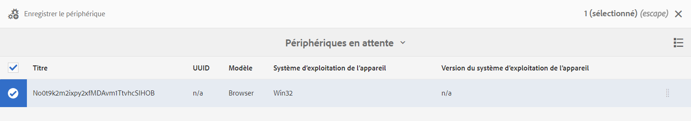
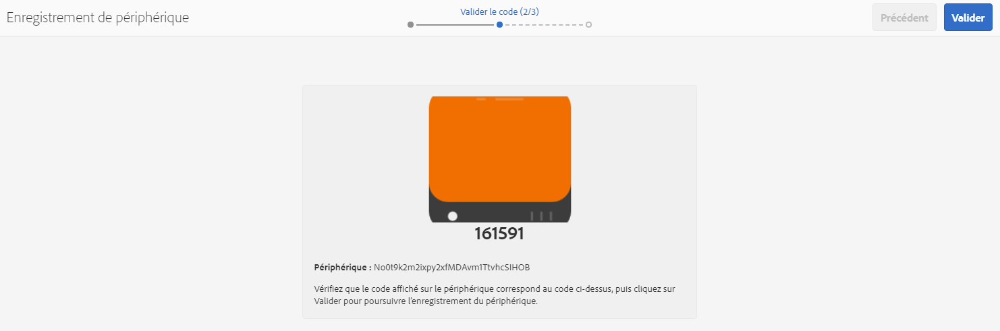
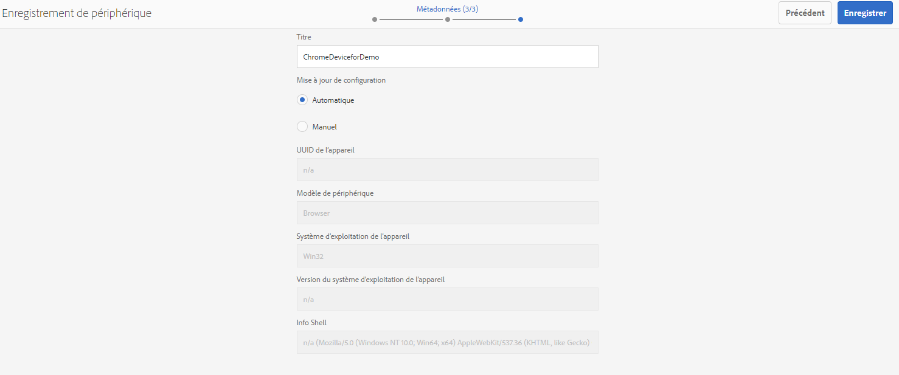
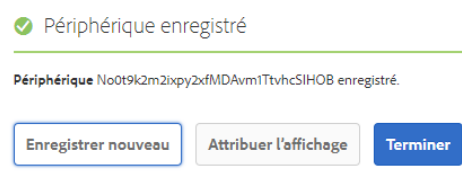
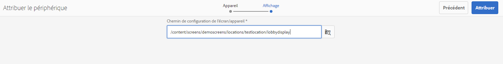

# Guide de démarrage rapide {#kickstart-guide}

Cette section de démarrage rapide d’AEM Screens explique comment configurer et exécuter un projet AEM Screens. Elle vous guide tout au long des étapes nécessaires pour configurer une expérience de signalétique numérique de base et ajouter du contenu, tel que des ressources et/ou des vidéos, à chaque canal, puis publier le contenu sur un lecteur AEM Screens.

>[!NOTE]
>Avant de travailler sur les détails du projet, assurez-vous d’avoir installé le dernier Feature Pack pour AEM Screens. Vous pouvez télécharger le dernier Feature Pack à partir du [Portail de distribution de logiciels](https://experience.adobe.com/#/downloads/content/software-distribution/en/aem.html) en utilisant votre Adobe ID.

## Prérequis {#prerequisites}

Suivez les étapes ci-dessous afin de créer un exemple de projet pour AEM Screens et de publier du contenu sur le lecteur Screens.

>[!NOTE]
>Le tutoriel suivant présente la lecture du contenu de votre canal dans le lecteur Chrome OS.

>[!IMPORTANT]
>**Paramètres de configuration OSGi**
>Vous devez activer le référent vide pour autoriser l’appareil à publier des données sur le serveur. Par exemple, si la propriété de référent vide est désactivée, l’appareil ne pourra pas publier de capture d’écran. Actuellement, certaines de ces fonctions ne sont disponibles que si l’option Allow Empty d’Apache Sling Referrer Filter est activée dans la configuration OSGi. Le tableau de bord peut afficher un avertissement indiquant que les paramètres de sécurité peuvent empêcher l’utilisation de certaines de ces fonctions.
>Pour activer l’option ***Allow Empty d’Apache Sling Referrer Filter***, procédez comme suit :

## Autorisation des requêtes de référents vides {#allow-empty-referrer-requests}

1. Accédez à **Configuration de la console web Adobe Experience Manager** via l’instance AEM > icône marteau > **Opérations** > **Console web**.

   

1. **Configuration de la console web d’Adobe Experience Manager** s’ouvre. Recherche de référent Sling.

   Pour rechercher la propriété référent Sling, appuyez sur **Command+F** pour **Mac** et **Ctrl+F** pour **Windows**.

1. Cochez l’option **Allow Empty** comme illustré dans la figure ci-dessous.

   

1. Sélectionner **Enregistrer** pour activer l’option Allow Empty d’Apache Sling Referrer Filter.

## Création d’une expérience de signalétique numérique en 5 minutes {#creating-a-digital-signage-experience-in-minutes}

### Création d’un projet AEM Screens {#creating-project}

La première étape consiste à créer un projet AEM Screens.

1. Accédez à votre instance Adobe Experience Manager (AEM) et sélectionnez **Screens**. Vous pouvez également y accéder directement depuis `https://localhost:4502/screens.html/content/screens](https://localhost:4502/screens.html/content/screens`.

1. Sélectionner **Créer un projet Screens** vous pouvez ainsi créer un projet Screens.
1. Saisissez le titre comme **DemoScreens**, puis sélectionnez **Enregistrer**.

   

   >[!NOTE]
   >Une fois le projet créé, il vous ramène à la page d’accueil du projet AEM Screens. Vous pouvez sélectionner votre projet. Un projet comporte cinq dossiers différents intitulés **Applications**, **Canaux**, **Appareils**, **Emplacements** et **Planifications**.

### Création d’un canal {#creating-channel}

Après avoir créé votre projet AEM Screens, créez un canal où vous gérez le contenu.

Pour créer un canal pour votre projet, procédez comme suit :

1. Après avoir créé un projet, sélectionnez l’option **DemoScreens** et sélectionnez le projet **Canaux** , comme illustré dans la figure ci-dessous. Sélectionner **+ Créer** dans la barre d’actions.

   

1. Choisissez la **Canal de séquence** dans l’assistant, puis sélectionnez **Suivant**.
   

1. Saisissez le **Titre** as **TestChannel** et sélectionnez **Créer**.

   

   Le canal **TestChannel** est alors ajouté au dossier de canaux, comme illustré dans la figure ci-dessous.

   

### Ajout de contenu à un canal {#adding-content}

Une fois votre canal en place, ajoutez du contenu à votre canal que le lecteur AEM Screens peut afficher.

Suivez les étapes ci-dessous pour ajouter du contenu au canal (**TestChannel**) dans votre projet :

1. Accédez au projet **DemoProject** que vous avez créé et sélectionnez le canal **TestChannel** dans le **dossier de canaux**.

1. Sélectionner **Modifier** dans la barre d’actions (voir la figure ci-dessous). L’éditeur de **TestChannel** s’ouvre.

   

1. Sélectionnez l’icône qui fait basculer le panneau latéral sur le côté gauche de la barre d’actions pour ouvrir les ressources et les composants.

1. Faites glisser et déposez les composants que vous souhaitez ajouter à votre canal.

   

### Création d’un emplacement {#creating-location}

Lorsque votre canal est en place, créez un emplacement.

>[!NOTE]
>***Emplacements*** compartimentez vos diverses expériences de signalétique digitale et contient les configurations de leurs affichages en fonction de l’endroit où se trouvent les différents écrans.

Pour créer un emplacement pour votre projet, procédez comme suit :

1. Accédez au projet **DemoProject** que vous avez créé et sélectionnez le dossier **Emplacements**.
1. Sélectionner **+ Créer** dans la barre d’actions.
1. Sélectionner **Emplacement** dans l’assistant, puis sélectionnez **Suivant**.
1. Saisissez le **Nom** pour votre emplacement (saisissez le titre **TestLocation**) et sélectionnez **Créer**.

L’emplacement **TestLocation** est créé et ajouté à votre dossier **Locations** (Emplacements).

### Création d’un affichage pour un emplacement {#creating-display}

Une fois que vous avez créé un emplacement, créez un affichage pour celui-ci.

>[!NOTE]
>***Affichage*** représente l’expérience numérique qui s’exécute sur un ou plusieurs écrans.

1. Accédez à l’emplacement **TestLocation** et sélectionnez-le.
1. Sélectionner **Créer** dans la barre d’actions.

   

1. Sélectionner **Affichage** de la **Créer** assistant et sélectionnez **Suivant**.

   

1. Saisissez le **Titre** as **LobbyDisplay** et sélectionnez **Créer**.

   

   Un nouvel affichage intitulé **TestDisplay** est ajouté à votre emplacement **TestLocation**, comme le montre la figure ci-dessous.

   

### Attribution d’un canal {#assigning-channel}

Une fois la configuration du projet terminée, affectez le canal à un affichage pour afficher le contenu.

1. Accédez à l’affichage requis à partir de **DemoScreens** > **Emplacements** > **TestLocation** > **LobbyDisplay**.

1. Sélectionner **Attribuer le canal** dans la barre d’actions.

   

   Ou,

   Sélectionner **Tableau de bord** dans la barre d’actions, puis sélectionnez **+Attribuer le canal** de la **CANAUX ET PLANIFICATIONS AFFECTÉS** du panneau.

   

1. La boîte de dialogue **Attribution de canaux** s’ouvre.

1. À partir de l’option **Paramètres**, choisissez le canal **par chemin** et les **Événements pris en charge** **Chargement initial** et **Écran inactif**.

   >[!NOTE]
   >
   >Les champs **Rôle du canal**, **Priorité** et **Méthodes d’interruption** sont tous renseignés par défaut. Voir [Propriétés du canal](/help/user-guide/channel-assignment-latest-fp.md#channel-properties) pour plus d’informations sur les propriétés d’attribution de canaux.

   

   Vous pouvez également sélectionner la variable **Fenêtre d’activation** et **Planning de périodicité**.

   >[!NOTE]
   >La variable *Planning de périodicité* permet de définir une planification récurrente pour votre canal. Vous configurez plusieurs plannings de périodicité pour un canal.
   >Pour plus d’informations, voir [Planning de périodicité](/help/user-guide/channel-assignment-latest-fp.md#recurrence-schedule).

1. Sélectionner **Enregistrer** une fois que vous avez configuré vos préférences.

### Enregistrement d’un appareil et attribution d’un appareil à un affichage {#registering-device}

Enregistrez votre appareil à l’aide du tableau de bord AEM.

>[!IMPORTANT]
>Le lecteur Chrome OS peut être installé en tant que module du navigateur Chrome en mode Développeur sans que vous ayez à utiliser de lecteur Chrome. Pour l’installer, procédez comme suit :
>
>1. Sélectionner [here](https://download.macromedia.com/screens/) pour télécharger le dernier lecteur Chrome.
>1. Décompressez et enregistrez le fichier d’installation sur le disque.
>1. Ouvrez le navigateur Chrome et sélectionnez **Extensions** dans le menu ou accédez directement à ***chrome://extensions***.
>1. Activez l’option **Mode Développeur** dans le coin supérieur droit.
>1. Sélectionner **Chargement décompressé** dans le coin supérieur gauche et chargez le lecteur Chrome décompressé.
>1. Vérifier **Lecteur AEM Screens Chrome** s’il est disponible dans la liste des extensions.
>1. Ouvrez un nouvel onglet et sélectionnez **Applications** dans le coin supérieur gauche ou accédez directement à ***chrome://apps***.
>1. Sélectionner **AEM Screens** Module externe permettant de lancer le lecteur Chrome. Par défaut, le lecteur est lancé en mode plein écran. Presse **Échap** pour quitter le mode plein écran.

Une fois que votre lecteur Chrome OS est activé, suivez les étapes ci-dessous pour enregistrer un appareil Chrome.

1. Accédez au dossier **Appareils** de votre projet à partir de votre instance AEM.

1. Sélectionnez la variable **Gestionnaire de périphériques** dans la barre d’actions.

   

1. Sélectionnez la variable **Enregistrement de périphérique** en haut à droite.

1. Sélectionnez l’appareil requis et sélectionnez **Enregistrer le périphérique**.

   

1. Attendez que l’appareil envoie son code d’enregistrement et, simultanément, vérifiez le **Code d’enregistrement** depuis votre appareil Chrome.
   

1. Si la variable **Code d’enregistrement** est identique sur les deux machines, sélectionnez **Valider** dans AEM.

1. Définissez le nom souhaité sur **ChromeDeviceforDemo** pour le périphérique, puis sélectionnez **Enregistrer**.

   

1. Sélectionner **Attribuer l’affichage** de la **Enregistrement de périphérique réussi** de la boîte de dialogue

   

1. Sélectionnez le chemin d’accès à votre affichage comme **DemoScreens** > **Emplacements** > **TestLocation** > **LobbyDisplay** et sélectionnez **Attribuer**.

   

1. Une fois l’appareil attribué, la confirmation suivante s’affiche.

   

1. Sélectionner **Terminer** pour terminer le processus d’enregistrement. Vous pouvez désormais afficher votre appareil enregistré dans le tableau de bord de l’affichage.

   

### Affichage du contenu dans le lecteur Chrome {#viewing-content-output}

Toutes les ressources de votre canal sont à présent en cours de lecture sur votre lecteur Chrome OS.

Félicitations, vous lisez maintenant du contenu dans un canal AEM Screens !

