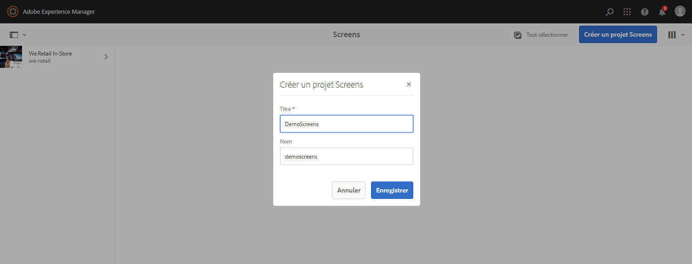
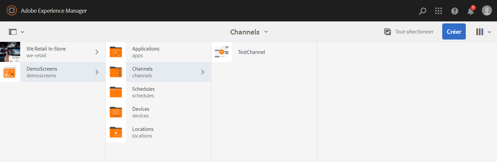
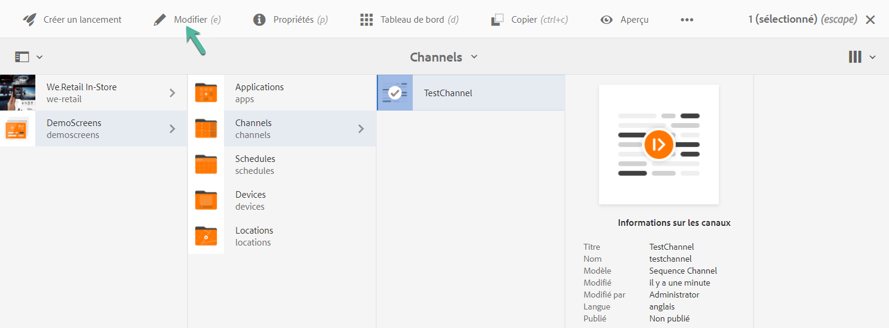
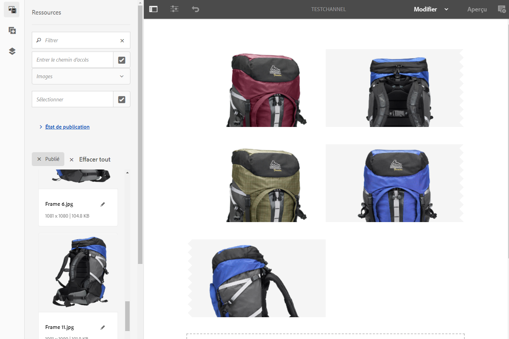
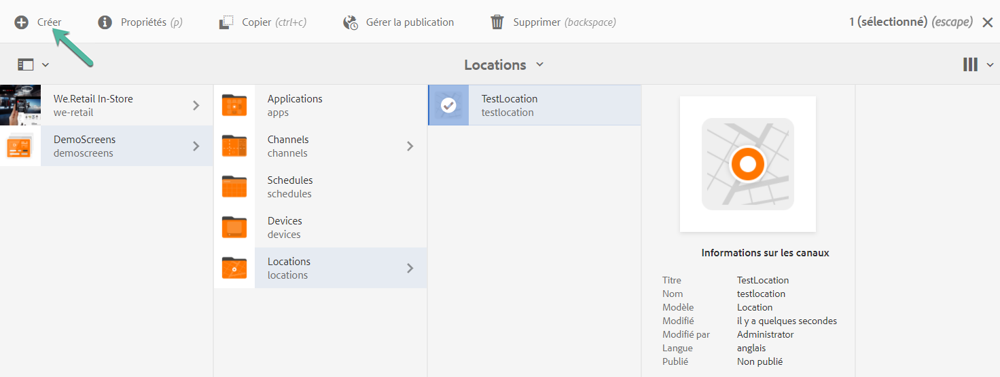
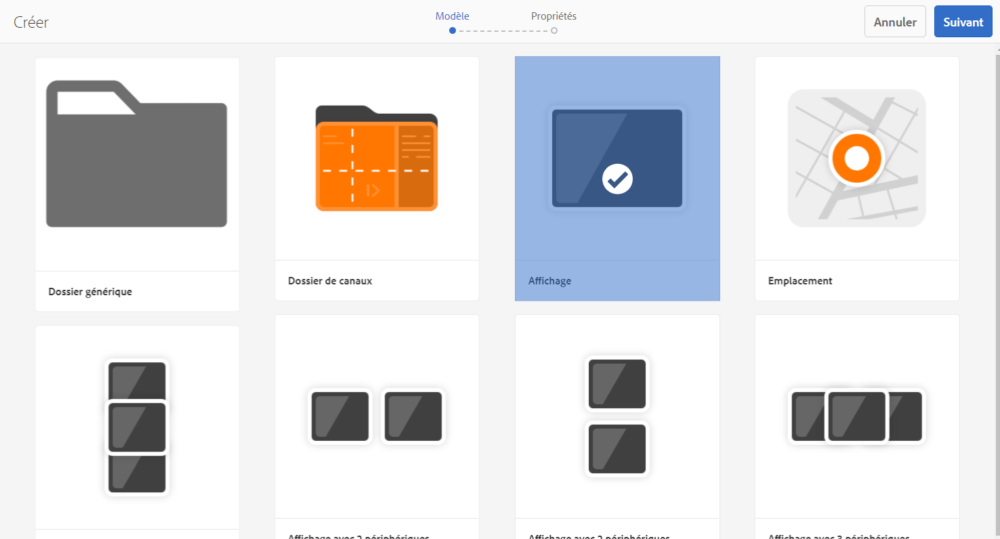
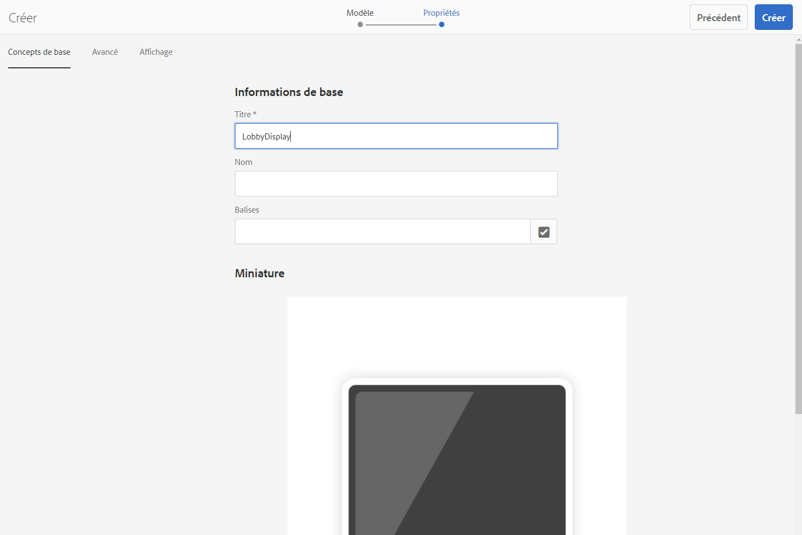
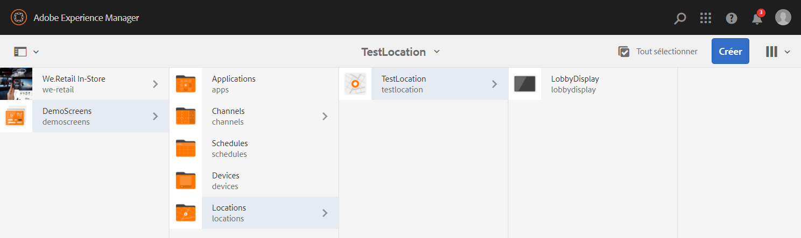
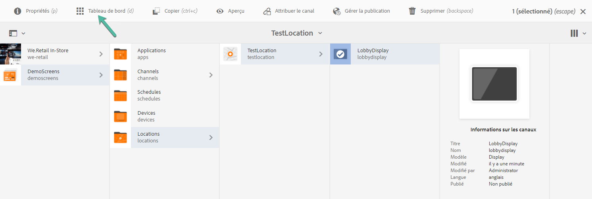
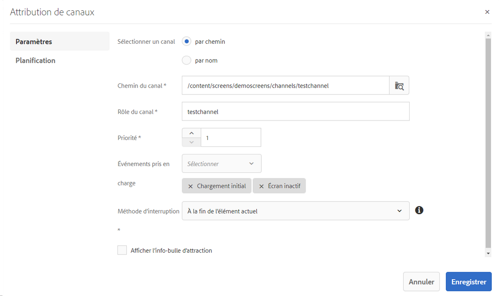

# Guide de démarrage rapide  {#kickstart-guide}

Cette section est un démarrage rapide de AEM Screens et explique comment configurer et exécuter un projet AEM Screens. Il vous guide tout au long des étapes nécessaires pour configurer une expérience de signature numérique de base et ajouter du contenu, tel que des ressources et/ou des vidéos, à chaque canal, puis publier le contenu sur un lecteur AEM Screens.

>[!NOTE]
>Avant de début à travailler sur les détails du projet, assurez-vous d’avoir installé le dernier Feature Pack. Vous pouvez télécharger le dernier Feature Pack pour AEM Screens 6.5.5 à partir du [Portail de distribution de logiciels](https://experience.adobe.com/#/downloads/content/software-distribution/en/aem.html) en utilisant votre Adobe ID.

## Conditions préalables {#prerequisites}

Suivez les étapes ci-dessous pour créer un exemple de projet pour AEM Screens et publier du contenu sur le lecteur d’écran.

>[!NOTE]
>Le didacticiel suivant présente la lecture du contenu de votre canal dans le lecteur Chrome OS.

>[!IMPORTANT]
>**Paramètres de configuration OSGi**
>Vous devez activer le référent vide pour autoriser le périphérique à publier des données sur le serveur. Par exemple, si la propriété de référent vide est désactivée, le périphérique ne pourra pas publier de capture d’écran. Actuellement, certaines de ces fonctionnalités ne sont disponibles que si le filtre de Parrain Apache Sling Allow Empty est activé dans la configuration OSGi. Le tableau de bord peut afficher un avertissement indiquant que les paramètres de sécurité peuvent empêcher l’utilisation de certaines de ces fonctions.
>Pour activer l’option ***Allow Empty d’Apache Sling Referrer Filter***, procédez comme suit :

## Autorisation des requêtes de référents vides {#allow-empty-referrer-requests}

1. Accédez au gestionnaire de **Configuration de la console Web Adobe Experience Manager** via l’instance AEM —> icône en forme de marteau —> **Opérations** —> **Console Web**.

   

1. La **configuration de la console web d’Adobe Experience Manager** s’ouvre. Recherche de référent Sling.

   Pour rechercher la propriété référent Sling, appuyez sur **Command+F** pour **Mac** et **Ctrl+F** pour **Windows**.

1. Cochez l’option **Allow Empty** comme illustré dans la figure ci-dessous.

   

1. Cliquez sur **Enregistrer** pour activer l’option Allow Empty d’Apache Sling Referrer Filter.

## Création d’une expérience de signalisation numérique en 5 minutes {#creating-a-digital-signage-experience-in-minutes}

### Création d’un projet AEM Screens {#creating-project}

La première étape consiste à créer un nouveau projet AEM Screens.

1. Accédez à votre instance Adobe Experience Manager (AEM) et cliquez sur **Ecrans**. Alternatively, you can navigate directly from `https://localhost:4502/screens.html/content/screens](https://localhost:4502/screens.html/content/screens`.

1. Click **Create Screens Project** to create a new Screens project. Enter the title as **DemoScreens** and click **Save**.

   

   >[!NOTE]
   >Une fois le projet créé, il vous ramène à la page d&#39;accueil de projet Ecrans. Vous pouvez sélectionner votre projet. Dans un projet, il y a cinq dossiers différents intitulés **Applications**, **Canaux**, **Périphériques**, **Emplacements et Planifications.******

### Création d’un canal {#creating-channel}

Une fois que vous avez votre projet, vous devez créer une nouveau canal où vous pouvez gérer le contenu.

Pour créer un canal pour votre projet, procédez comme suit :

1. Une fois que vous avez créé un projet, sélectionnez le projet **DemoScreens** et sélectionnez le dossier **** Canaux, comme illustré dans la figure ci-dessous. Click **+ Create** from the action bar.

   

1. Choose the **Sequence Channel** from the wizard and click **Next**.
   

1. Saisissez le **titre** *TestChannel* et cliquez sur **Créer**.

   

Le canal *TestChannel* est créé et ajouté au dossier de canaux, comme illustré dans la figure ci-dessous.

### Ajout de contenu à un canal {#adding-content}

Une fois que vous avez votre canal, vous devez y ajouter le contenu que le lecteur Screens va afficher.

Suivez les étapes ci-dessous pour ajouter du contenu au canal (*TestChannel*) dans votre projet : 

1. Accédez au projet **DemoProject** que vous avez créé et sélectionnez le dossier **Channels** (Canaux).

1. Cliquez sur **Modifier** dans la barre d’actions (voir la figure ci-dessous). L’éditeur de **TestChannel** s’ouvre.

   

1. Cliquez sur l’icône qui fait passer le panneau latéral du côté gauche de la barre d’actions pour ouvrir les ressources et les composants. 

1. Faites glisser et déposez les composants que vous souhaitez ajouter à votre canal. 

   

### Création d’un emplacement {#creating-location}

Une fois votre canal en place, vous devez créer un emplacement.

>[!NOTE]
>***Locations*** compartmentalize your various digital signage experiences and contains the configurations of the displays according to where the various screens are.

Pour créer un emplacement pour votre projet, procédez comme suit :

1. Navigate to the **DemoProject** you created and select the **Locations** folder.

1. Click **+ Create** from the action bar.

1. Sélectionnez **Emplacement** dans l’assistant, puis cliquez sur **Suivant**.

1. Enter the **Name** for your location (enter the title as *TestLocation*) and click **Create**.

L’emplacement **TestLocation** est créé et ajouté à votre dossier **Locations** (Emplacements).

### Création d’un affichage pour un emplacement {#creating-display}

Une fois que vous avez créé un emplacement, vous devez créer un affichage pour celui-ci.

>[!NOTE]
>***Les affichages*** représentent l’expérience numérique qui s’exécute sur un ou plusieurs écrans.

1. Navigate to the **TestLocation** and select it.

1. Cliquez sur **Créer** dans la barre d’actions.

   

1. Sélectionnez **Affichage** à partir de l’assistant **Créer** et cliquez sur **Suivant**.

   

1. Enter the **Title** as **LobbyDisplay** and click **Create**.

   

A new display titled as **TestDisplay** is now added to your location **TestLocation**, as shown in the figure below.

### Attribution d’un canal {#assigning-channel}

Une fois le projet configuré, vous devez attribuer le canal à un affichage pour afficher le contenu.

1. Accédez à l&#39;affichage requis à partir de **DemoScreens** —> **Locations** —> **TestLocation** —> **LobbyDisplay.**

1. Appuyez/cliquez sur **Attribuer le canal** dans la barre d’actions.

   

   Ou,

   Appuyez/cliquez sur **Tableau de bord** dans la barre d’actions et cliquez sur **+Attribuer le canal** dans le panneau **CANAUX ET PLANIFICATIONS AFFECTÉS**.

   

1. La boîte de dialogue **Attribution de canaux** s’ouvre.

1. Dans l’option **Paramètres** , choisissez le canal **par chemin d’accès** et les Événements **** pris en charge comme charge **initial et Ecran d’inactivité.******

   >[REMARQUE]
   >Les méthodes **Rôle** de Canal **,** Priorité **et** Interruption sont toutes renseignées par défaut. See [Channel Properties](/help/user-guide/channel-assignment-latest-fp.md#channel-properties) section to learn more about channel assignment properties.

   

   De plus, vous pouvez également sélectionner la fenêtre **** Activation et le calendrier **de** répétition.

   >[!NOTE]
   >The *Recurrence Schedule* allows you to set a recurring schedule for your channel. Vous configurez plusieurs plannings de périodicité pour un canal.
   >Pour plus d’informations, voir la section [Planning de périodicité](/help/user-guide/channel-assignment-latest-fp.md#recurrence-schedule).

1. Cliquez sur **Enregistrer** une fois vos préférences configurées.

### Enregistrement d&#39;un périphérique et affectation d&#39;un périphérique à un affichage{#registering-device}

Vous devez enregistrer votre périphérique à l’aide du tableau de bord AEM. 

>[!IMPORTANT]
>Le lecteur Chrome OS peut être installé en tant que module du navigateur Chrome en mode Développeur sans que vous ayez à utiliser de lecteur Chrome réel. Pour l’installer, procédez comme suit :
>
>1. Cliquez [ici](https://download.macromedia.com/screens/) pour télécharger la dernière version du lecteur Chrome.
>1. Décompressez et enregistrez le fichier d’installation sur le disque.
>1. Ouvrez le navigateur Chrome et sélectionnez **Extensions** dans le menu ou accédez directement à ***chrome://extensions***.
>1. Activez le **mode Développeur** dans l’angle supérieur droit de l’écran.
>1. Cliquez sur **Charger les fichiers décompressés** dans l’angle supérieur gauche et chargez le lecteur Chrome décompressé.
>1. Vérifiez si le module **Lecteur Chrome AEM Screens** est disponible dans la liste des extensions.
>1. Ouvrez un nouvel onglet et cliquez sur l’icône **Applications** dans l’angle supérieur gauche de l’écran ou accédez directement à ***chrome://applications***.
>1. Cliquez sur le module **AEM Screens** pour lancer le lecteur Chrome. Par défaut, le lecteur est lancé en mode plein écran. Appuyez sur **Échap** pour quitter le mode plein écran.

Une fois que votre lecteur ChromeOS est activé, suivez les étapes ci-dessous pour enregistrer un périphérique Chrome.

1. Accédez au dossier **Devices** de votre projet à partir de votre instance AEM.

1. Tap/click the **Device Manager** from the action bar.

1. Tap/click the **Device Registration** from the top right.

1. Select the required device and tap/click **Register Device**.

1. Attendez que le périphérique envoie son code d’enregistrement et, simultanément, vérifiez le code **d’** enregistrement depuis votre périphérique Chrome.

1. If the **Registration Code** is the same on both machines, tap/click **Validate** in AEM.

1. Saisissez le nom souhaité pour le périphérique, puis cliquez sur **Enregistrer**.

1. Appuyez/cliquez sur **Terminer** pour terminer le processus d’enregistrement.

### Affichage du contenu dans le lecteur Chrome {#viewing-content-output}

Cet exemple présente une sortie sur un lecteur Chrome. Une fois le canal attribué à votre écran, vous devez enregistrer l’appareil sur un lecteur.

